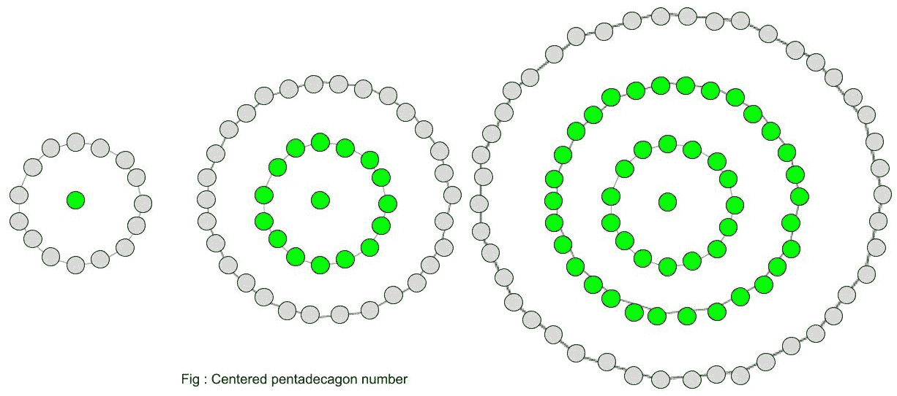

# 居中的五边形数字

> 原文:[https://www . geeksforgeeks . org/centered-pentaco gonal-number/](https://www.geeksforgeeks.org/centered-pentadecagonal-number/)

给定一个数 n，求第 n 个居中的五边形数。
一个以五边形数字为中心的**在连续的五边形(15 边多边形)图层中代表一个位于中心的点和围绕它的其他点。** 



**例:**

```
Input :  2
Output : 16

Input : 8
Output : 421
```

**第 n 个**中心五边形数项:-

下面是上述思想的基本实现。

## C++

```
// C++ Program to find
// nth centered
// pentadecagonal  number
#include <bits/stdc++.h>
using namespace std;

// centered pentadecagonal function
int center_pentadecagonal_num(long int n)
{
    // Formula to calculate nth
    // centered pentadecagonal number
    return (15 * n * n - 15 * n + 2) / 2;
}

// Driver Code
int main()
{
    long int n = 3;
    cout << n << "th number : "
             << center_pentadecagonal_num(n);
    cout << endl;
    n = 10;
    cout << n << "th number : "
             << center_pentadecagonal_num(n);

    return 0;
}
```

## Java 语言(一种计算机语言，尤用于创建网站)

```
// Java Program to find nth centered
// pentadecagonal number

import java.io.*;

class GFG {

    // centered pentadecagonal function
    static long center_pentadecagonal_num(long n)
    {

        // Formula to calculate nth
        // centered pentadecagonal number
        return (15 * n * n - 15 * n + 2) / 2;
    }

    // Driver Code
    public static void main (String[] args)
    {

        long n = 3;
        System.out.print(n + "th number : ");
        System.out.println(
                  center_pentadecagonal_num(n));

        n = 10;
        System.out.print( n + "th number : ");
        System.out.println(
                 center_pentadecagonal_num(n));
    }
}

// This code is contributed by ajit.
```

## 蟒蛇 3

```
# Program to find nth
#centered pentadecagonal number

def center_pentadecagonal_num(n) :

    # Formula to calculate nth
    # centered pentadecagonal number
    return (15 * n * n - 15 * n + 2) // 2

# Driver Code
if __name__ == '__main__' :

    n = 3
    print(n,"rd number : ",
                center_pentadecagonal_num(n))
    n = 10
    print(n,"th number : ",
                 center_pentadecagonal_num(n))

# This code is contributed  by m_kit
```

## C#

```
// C# Program to find
// nth centered
// pentadecagonal number
using System;

class GFG
{

    // centered
    // pentadecagonal function
    static long center_pentadecagonal_num(long n)
    {

        // Formula to calculate
        // nth centered
        // pentadecagonal number
        return (15 * n * n -
                15 * n + 2) / 2;
    }

    // Driver Code
    static public void Main ()
    {
        long n = 3;
        Console.Write(n + "th number : ");
        Console.WriteLine(
                center_pentadecagonal_num(n));

        n = 10;
        Console.Write( n + "th number : ");
        Console.WriteLine(
                center_pentadecagonal_num(n));
    }
}

// This code is contributed by ajit.
```

## 服务器端编程语言（Professional Hypertext Preprocessor 的缩写）

```
<?php
// PHP Program to find
// nth centered
// pentadecagonal number

// centered pentadecagonal function
function center_pentadecagonal_num($n)
{
    // Formula to calculate nth
    // centered pentadecagonal number
    return (15 * $n * $n -
            15 * $n + 2) / 2;
}

// Driver Code
$n = 3;
echo $n , "th number : ",
        center_pentadecagonal_num($n);
echo "\n";
$n = 10;
echo $n , "th number : ",
        center_pentadecagonal_num($n);

// This code is contributed by m_kit
?>
```

## java 描述语言

```
<script>

// Javascript program to find nth centered
// pentadecagonal number

// centered pentadecagonal function
function center_pentadecagonal_num(n)
{

    // Formula to calculate nth
    // centered pentadecagonal number
    return (15 * n * n - 15 * n + 2) / 2;
}

// Driver Code
var n = 3;
document.write(n + "th number : ");
document.write(center_pentadecagonal_num(n) + "<br>");

n = 10;
document.write( n + "th number : ");
document.write(center_pentadecagonal_num(n));

// This code is contributed by Kirti

</script>
```

**输出:**

```
3th number : 46
10th number : 676
```

**时间复杂度:**O(1)
T3】辅助空间: O(1)