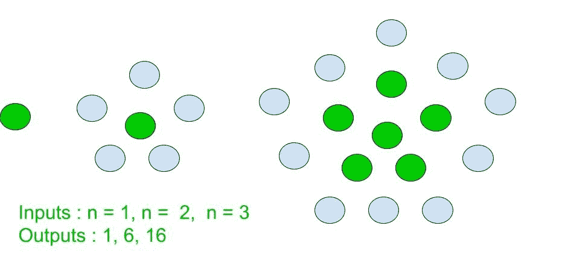

# 中心五边形数字

> 原文:[https://www.geeksforgeeks.org/centered-pentagonal-number/](https://www.geeksforgeeks.org/centered-pentagonal-number/)

给定一个整数 n，求第 n 个居中的五边形数。

A **居中五边形数字**是一个居中的图形数字，表示一个五边形，中心有一个点，其他点依次围绕在五边形层中【来源:[维基](https://en.wikipedia.org/wiki/Centered_pentagonal_number)



少数中心五边形数是:
1，6，16，31，51，76，106，141，181，226，276，331，391……..

**示例:**

```
Input : 3
Output : 16

Input : 9
Output : 181
```

**方法:**
中心五边形为**第 n 个**术语由下式给出:

上述方法的基本实现:

## C++

```
// Program to find nth
// Centered pentagonal number.
#include <bits/stdc++.h>
using namespace std;

// centered pentagonal number function

int centered_pentagonal_Num(int n)
{
    // Formula to calculate nth
    // Centered pentagonal number
    // and return it into main function.

    return (5 * n * n - 5 * n + 2) / 2;
}

// Driver Code
int main()
{
    int n = 7;
    cout << n << "th Centered pentagonal number: ";
    cout << centered_pentagonal_Num(n);
    return 0;
}
```

## Java 语言(一种计算机语言，尤用于创建网站)

```
// Program to find nth
// Centered pentagonal number
import java.io.*;

class GFG
{

// centered pentagonal
// number function
static int centered_pentagonal_Num(int n)
{
    // Formula to calculate
    // nth Centered pentagonal
    // number and return it
    // into main function.

    return (5 * n * n - 5 * n + 2) / 2;
}

// Driver Code
public static void main (String[] args)
{
int n = 7;
System.out.print(n + "th Centered " +
              "pentagonal number: ");
System.out.println(centered_pentagonal_Num(n));
}
}

// This code is contributed by anuj_67.
```

## 蟒蛇 3

```
# Python program to find Nth
# Centered pentagonal number.

# Function to calculate
# Centered pentagonal number.

def centered_pentagonal_Num(n):

    # Formula to calculate nth
    # Centered pentagonal number.

    return (5 * n * n - 5 * n + 2) // 2

# Driver Code
n = 7
print("%sth Centered pentagonal number : " %n,
                    centered_pentagonal_Num(n))

# This code is contributed by ajit                
```

## C#

```
// C# Program to find nth
// Centered pentagonal number
using System;

class GFG
{

// centered pentagonal
// number function
static int centered_pentagonal_Num(int n)
{
    // Formula to calculate
    // nth Centered pentagonal
    // number and return it
    // into main function.

    return (5 * n * n - 5 * n + 2) / 2;
}

// Driver Code
public static void Main ()
{
int n = 7;
Console.Write(n + "th Centered " +
           "pentagonal number: ");
Console.WriteLine(centered_pentagonal_Num(n));
}
}

// This code is contributed by anuj_67.
```

## 服务器端编程语言（Professional Hypertext Preprocessor 的缩写）

```
<?php
// PHP Program to find nth
// Centered pentagonal number.

// Centered pentagonal number function

function centered_pentagonal_Num($n)
{
    // Formula to calculate nth
    // Centered pentagonal number
    // and return it into main function.

    return (5 * $n * $n - 5 * $n + 2) / 2;
}

// Driver Code
$n = 7;
echo $n , "th Centered pentagonal number: ";
echo centered_pentagonal_Num($n);

// This code is contributed by aj_36
?>
```

## java 描述语言

```
<script>
// Program to find nth
// Centered pentagonal number

// centered pentagonal
// number function
function centered_pentagonal_Num(n)
{

    // Formula to calculate
    // nth Centered pentagonal
    // number and return it
    // into main function.
    return (5 * n * n - 5 * n + 2) / 2;
}

// Driver Code
var n = 7;
document.write(n + "th Centered " +
              "pentagonal number: ");
document.write(centered_pentagonal_Num(n));

// This code is contributed by Amit Katiyar
</script>
```

**输出:**

```
7th Centered pentagonal number: 106
```

**时间复杂度:**O(1)
T3】辅助空间: O(1)