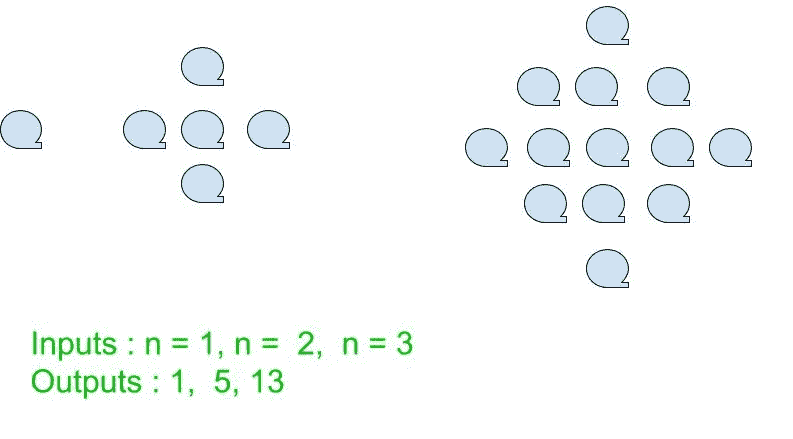

# 中心正方形编号

> 原文:[https://www.geeksforgeeks.org/centered-square-number/](https://www.geeksforgeeks.org/centered-square-number/)

给定一个数字 **n** ，任务是找到第 n <sup>个</sup>中心方块数。

中心正方形数字是一个中心图形数字，它给出了一个正方形中的点的数量，一个点在中心，所有其他点围绕着连续正方形层中的中心点。N <sup>第</sup>个中心方块数可以用公式**n<sup>2</sup>+(n-1)<sup>2</sup>**计算。



**示例:**

```
Input : n = 2
Output : 5

Input : n = 9
Output : 145

```

1.  **Finding n-th Centered Square Number**
    If we take a closer look, we can notice that the n-th Centered Square Number can be seen as the sum of two consecutive square numbers (1 dot, 4 dots, 9 dots, 16 dots, etc).

    我们可以用下面的公式找到第 n 个中心平方数。

    > 第 n 个中心方块数= n <sup>2</sup> + (n-1) <sup>2</sup>

    下面是实现:

    ## C++

    ```
    // C++ program to find nth
    // Centered square number.
    #include <bits/stdc++.h>

    using namespace std;

    // Function to calculate Centered
    // square number function
    int centered_square_num(int n)
    {
        // Formula to calculate nth
        // Centered square number
        return n * n + ((n - 1) * (n - 1));
    }

    // Driver Code
    int main()
    {
        int n = 7;
        cout << n << "th Centered square number: ";
        cout << centered_square_num(n);
        return 0;
    }
    ```

    ## Java 语言(一种计算机语言，尤用于创建网站)

    ```
    // Java program to find nth Centered square
    // number
    import java.io.*;

    class GFG {

        // Function to calculate Centered
        // square number function
        static int centered_square_num(int n)
        {
            // Formula to calculate nth
            // Centered square number
            return n * n + ((n - 1) * (n - 1));
        }

        // Driver Code
        public static void main (String[] args) 
        {
            int n = 7;
            System.out.print( n + "th Centered"
                           + " square number: "
                     + centered_square_num(n));
        }
    }

    // This code is contributed by anuj_67.
    ```

    ## 蟒蛇 3

    ```
    # Python program to find nth
    # Centered square number.

    # Function to calculate Centered
    # square number function
    def centered_square_num(n):

        # Formula to calculate nth
        # Centered square number
        return n * n + ((n - 1) * (n - 1))

    # Driver Code
    n = 7
    print("%sth Centered square number: " %n,
                      centered_square_num(n))

    ```

    ## C#

    ```
    // C# program to find nth
    // Centered square number.
    using System;

    public class GFG {

        // Function to calculate Centered
        // square number function
        static int centered_square_num(int n)
        {
            // Formula to calculate nth
            // Centered square number
            return n * n + ((n - 1) * (n - 1));
        }

        // Driver Code

        static public void Main (){
        int n = 7;
        Console.WriteLine( n + "th Centered"
                        + " square number: "
                   + centered_square_num(n));
        }
    }

    // This code is contributed by anuj_67.
    ```

    ## 服务器端编程语言（Professional Hypertext Preprocessor 的缩写）

    ```
    <?php
    // PHP program to find nth
    // Centered square number

    // Function to calculate Centered
    // square number function
    function centered_square_num( $n)
    {
        // Formula to calculate nth
        // Centered square number
        return $n * $n + (($n - 1) * 
                          ($n - 1));
    }

    // Driver Code
    $n = 7;
    echo $n , "th Centered square number: ";
    echo centered_square_num($n);

    // This code is contributed by anuj_67.
    ?>
    ```

    **Output :**

    ```
    7th Centered square number: 85

    ```

2.  **Check if N is centred-square-number or not:**
    *   前几个居中的方形数字是:

        > 1，5，13，25，41，61，85，113，145，181、………………

    *   由于第 n 个中心平方数由

        ```
        H(n) = n * n + ((n - 1) * (n - 1))
        ```

        给出
    *   该公式表明第 N 个中心平方数二次依赖于 N，因此，试求 N = H(n)方程的正整数根。

        ```
        H(n) = nth centered-square-number number
        N = Given Number

        Solve for n:
        H(n) = N
        n * n + ((n - 1) * (n - 1)) = N

        Applying Shridharacharya Formula
        The positive root of equation (i)
        n = (9 + sqrt(36*N+45))/18; 

        ```

    *   获取 n 后，检查是否为整数。如果 n–floor(n)为 0，则 n 为整数。

    下面是上述方法的实现:

    ## 卡片打印处理机（Card Print Processor 的缩写）

    ```
    #include <bits/stdc++.h>
    using namespace std;

    bool centeredSquare_number(int N) 
    {     
        float n = (9 + sqrt(36*N+45))/18;  
        return (n - (int) n) == 0; 
    } 

    int main() 
    { 
        int i = 13;
        cout<<centeredSquare_number(i);
        return 0; 
    } 
    ```

    ## Java 语言(一种计算机语言，尤用于创建网站)

    ```
    // Java Code implementation of the above approach
    class GFG {

        static int centeredSquare_number(int N) 
        {     
            float n = (9 + (float)Math.sqrt(36*N+45))/18;  
            if (n - (int) n == 0)
                return 1;
            else
                return 0;
        } 

        // Driver code
        public static void main (String[] args) 
        { 
            int i = 13;
            System.out.println(centeredSquare_number(i));
        } 

    }

    // This code is contributed by Yash_R
    ```

    ## 蟒蛇 3

    ```
    # Python3 implementation of the above approach
    from math import sqrt

    def centeredSquare_number(N) : 

        n = (9 + sqrt(36 * N + 45))/18; 
        if (n - int(n)) == 0 :
            return 1
        else :
            return 0

    # Driver Code
    if __name__ == "__main__" : 

        i = 13;
        print(centeredSquare_number(i));

    # This code is contributed by Yash_R
    ```

    ## C#

    ```
    // C# Code implementation of the above approach
    using System;

    class GFG {

        static int centeredSquare_number(int N) 
        {     
            float n = (9 + (float)Math.Sqrt(36 * N + 45))/18;  
            if (n - (int) n == 0)
                return 1;
            else
                return 0;
        } 

        // Driver code
        public static void Main (String[] args) 
        { 
            int i = 13;
            Console.WriteLine(centeredSquare_number(i));
        } 

    }

    // This code is contributed by Yash_R
    ```

    **Output:**

    ```
    0

    ```

**参考:**T2】https://en.wikipedia.org/wiki/Centered_square_number