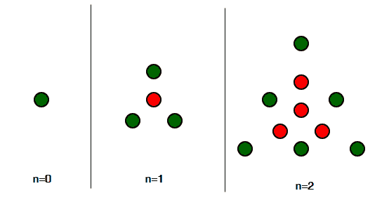

# 居中的三角形数字

> 原文:[https://www.geeksforgeeks.org/centered-triangular-number/](https://www.geeksforgeeks.org/centered-triangular-number/)

给定一个整数 n，求第 n 个居中的三角数。
**居中三角形数**是一个居中的多边形数，表示一个三角形，在连续的三角形层中，一个点位于中心，所有其他点围绕中心【来源: [Wiki](https://en.wikipedia.org/wiki/Centered_triangular_number)

**绘画作品:**



**前几个居中的三角数列是:**
1、4、10、19、31、46、64、85、109、136、166、199、235、274、316、361、409、460……..

**示例:**

```
Input : n = 1
Output : 4
Explanation :
A dot in the centre and 3 dots forming the
triangle outside it, thus 4.

Input : n = 6 
Output : 64

Input : n = 10
Output : 166
```

**逼近**
第 n 项中心三角数由下式给出:

上述方法的基本实施:

## C++

```
// C++ Program to find the
// nth Centered Triangular number
#include <iostream>
using namespace std;

// function for Centered
// Triangular number
int Centered_Triangular_num(int n)
{
    // formula for find Centered
    // Triangular number nth term
    return (3 * n * n + 3 * n + 2) / 2;
}

// Driver Code
int main()
{
    // For 3rd Centered Triangular number
    int n = 3;
    cout << Centered_Triangular_num(n) << endl;

    // For 12th Centered Triangular number
    n = 12;
    cout << Centered_Triangular_num(n) << endl;

    return 0;
}
```

## Java 语言(一种计算机语言，尤用于创建网站)

```
// Java Program to find
// the nth Centered
// Triangular number
import java.io.*;

class GFG
{

// function for Centered
// Triangular number
static int Centered_Triangular_num(int n)
{
    // formula for find Centered
    // Triangular number nth term
    return (3 * n * n +
            3 * n + 2) / 2;
}

// Driver Code
public static void main (String[] args)
{

// For 3rd Centered
// Triangular number
int n = 3;
System.out.println(Centered_Triangular_num(n));

// For 12th Centered
// Triangular number
n = 12;
System.out.println(Centered_Triangular_num(n));
}
}

// This code is contributed by ajit
```

## 蟒蛇 3

```
# Program to find nth
# Centered Triangular number

def Centered_Triangular_num(n) :

    # Formula to calculate nth
    # Centered Triangular number
    return (3 * n * n +
            3 * n + 2) // 2

# Driver Code
if __name__ == '__main__' :

    # For 3rd Centered
    # Triangular number    
    n = 3
    print(Centered_Triangular_num(n))

    # For 12th Centered
    # Triangular number
    n = 12
    print(Centered_Triangular_num(n))

# This code is contributed
# by akt_mit
```

## C#

```
// C# Program to find
// the nth Centered
// Triangular number
using System;

class GFG
{

// function for Centered
// Triangular number
static int Centered_Triangular_num(int n)
{
    // formula for find Centered
    // Triangular number nth term
    return (3 * n * n +
            3 * n + 2) / 2;
}

// Driver Code
static public void Main ()
{

// For 3rd Centered
// Triangular number
int n = 3;
Console.WriteLine(Centered_Triangular_num(n));

// For 12th Centered
// Triangular number
n = 12;
Console.WriteLine(Centered_Triangular_num(n));
}
}

// This code is contributed by akt_mit
```

## 服务器端编程语言（Professional Hypertext Preprocessor 的缩写）

```
<?php
// PHP Program to find the
//nth Centered Triangular number

// function for Centered
// Triangular number
function Centered_Triangular_num($n)
{
    // formula for find Centered
    // Triangular number nth term
    return (3 * $n * $n + 3 * $n + 2) / 2;
}

// Driver Code
    // For 3rd Centered Triangular number
    $n = 3;
    echo Centered_Triangular_num($n), "\n" ;

    // For 12th Centered Triangular number
    $n = 12;
    echo Centered_Triangular_num($n), "\n";

// This code is contributed by aj_36
?>
```

## java 描述语言

```
<script>
// javascript Program to find
// the nth Centered
// Triangular number

    // function for Centered
    // Triangular number
    function Centered_Triangular_num(n)
    {

        // formula for find Centered
        // Triangular number nth term
        return (3 * n * n + 3 * n + 2) / 2;
    }

    // Driver Code

        // For 3rd Centered
        // Triangular number
        var n = 3;
        document.write(Centered_Triangular_num(n)+"<br/>");

        // For 12th Centered
        // Triangular number
        n = 12;
        document.write(Centered_Triangular_num(n)+"<br/>");

// This code is contributed by Rajput-Ji
</script>
```

**输出:**

```
19
235
```

**时间复杂度:**O(1)
T3】辅助空间: O(1)