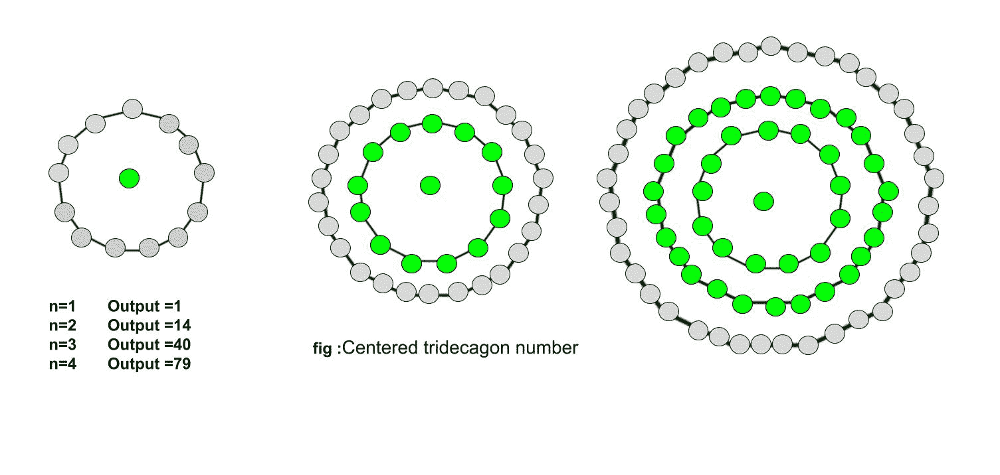

# 居中的三叉戟数字

> 原文:[https://www.geeksforgeeks.org/centered-tridecagonal-number/](https://www.geeksforgeeks.org/centered-tridecagonal-number/)

给定一个数字 n，任务是找到第**n**个居中的三叉戟数字。
一个**居中的三叉戟编号**表示在连续的三叉戟(13 边多边形)图层中位于中心的一个点和围绕中心点
的其他点。

**示例:**

> 输入:2
> 输出:14
> 
> 输入:9
> 输出:469



第 n 个中心三叉数的公式:

## C++

```
// C++ Program to find nth
// centered tridecagonal number
#include <bits/stdc++.h>
using namespace std;

// Function to find nth centered
// tridecagonal number
int centeredTridecagonalNum(long int n)
{
    // Formula to calculate nth
    // centered tridecagonal number
    return (13 * n * (n - 1) + 2) / 2;
}

// Drivers code
int main()
{
    long int n = 3;
    cout << centeredTridecagonalNum(n);
    cout << endl;
    n = 10;
    cout << centeredTridecagonalNum(n);

    return 0;
}
```

## Java 语言(一种计算机语言，尤用于创建网站)

```
// Java Program to find nth
// centered tridecagonal number
import java.io.*;

class GFG
{

// Function to find nth centered
// tridecagonal number
static long centeredTridecagonalNum(long n)
{
    // Formula to calculate nth
    // centered tridecagonal number
    return (13 * n * (n - 1) + 2) / 2;
}

// Driver Code
public static void main (String[] args)
{
    long n = 3;
    System.out.println(centeredTridecagonalNum(n));
    n = 10;
    System.out.println(centeredTridecagonalNum(n));
}
}

// This code is contributed by anuj_67.
```

## 蟒蛇 3

```
# Program to find nth centered
# tridecagonal number

# Function to find centered
# tridecagonal number
def centeredTridecagonalNum(n) :

    # Formula to calculate nth
    # centered tridecagonal number
    return (13 * n *
           (n - 1) + 2) // 2

# Driver Code
if __name__ == '__main__' :

    n = 3
    print(centeredTridecagonalNum(n))
    n = 10
    print(centeredTridecagonalNum(n))

# This code is contributed
# by akt_mit
```

## C#

```
// C# Program to find nth
// centered tridecagonal number
using System;

class GFG
{

// Function to find nth centered
// tridecagonal number
static long centeredTridecagonalNum(long n)
{
    // Formula to calculate nth
    // centered tridecagonal number
    return (13 * n * (n - 1) + 2) / 2;
}

// Driver Code
public static void Main ()
{
    long n = 3;
    Console.WriteLine(centeredTridecagonalNum(n));
    n = 10;
    Console.WriteLine(centeredTridecagonalNum(n));
}
}

// This code is contributed by anuj_67.
```

## 服务器端编程语言（Professional Hypertext Preprocessor 的缩写）

```
<?php
// PHP Program to find nth
// centered tridecagonal number

// Function to find nth centered
// tridecagonal number
function centeredTridecagonalNum( $n)
{
    // Formula to calculate nth
    // centered tridecagonal number
    return (13 * $n *
           ($n - 1) + 2) / 2;
}

// Driver Code
$n = 3;
echo centeredTridecagonalNum($n);
echo"\n";

$n = 10;
echo centeredTridecagonalNum($n);

// This code is contributed by anuj_67.
?>
```

## java 描述语言

```
<script>

// Javascript program to find nth
// centered tridecagonal number

// Function to find nth centered
// tridecagonal number
function centeredTridecagonalNum(n)
{

    // Formula to calculate nth
    // centered tridecagonal number
    return (13 * n * (n - 1) + 2) / 2;
}

// Driver code
var n = 3;
document.write(centeredTridecagonalNum(n) + "<br>");

n = 10;
document.write(centeredTridecagonalNum(n));

// This code is contributed by Ankita saini

</script>
```

**Output :** 

```
40
586
```

**时间复杂度:**O(1)
T3】辅助空间: O(1)

参考:[http://oeis.org/wiki/Figurate_numbers](http://oeis.org/wiki/Figurate_numbers)T2】