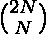
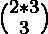
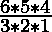

# 中心二项式系数

> 原文:[https://www.geeksforgeeks.org/central-binomial-coefficient/](https://www.geeksforgeeks.org/central-binomial-coefficient/)

给定一个整数 **N** ，任务是找到 [中心二项式系数](https://en.wikipedia.org/wiki/Central_binomial_coefficient)。
N = 0，1，2，3…的前几个中心二项式系数是

> 1, 2, 6, 20, 70, 252, 924, 3432… ..

**例:**

> **输入:** N = 3
> **输出:** 20
> **解释:**
> 中心二项式系数=  =  =  = 20
> **输入:** N = 2
> **输出:** 6

**方法:**中心二项式系数是形式为的二项式系数。对于给定值 **N** ，使用[动态编程](https://www.geeksforgeeks.org/dynamic-programming/)，可以使用此[方法](https://www.geeksforgeeks.org/binomial-coefficient-dp-9/)计算二项式系数。
**例如:**

> N = 3 的中心二项式系数由下式给出:
>  =  =  = 20

以下是上述方法的实现:

## C++

```
// C++ implementation to find the
// Nth Central Binomial Coefficient

#include<bits/stdc++.h>
using namespace std;

// Function to find the value of
// Nth Central Binomial Coefficient
int binomialCoeff(int n, int k)
{
    int C[n + 1][k + 1];
    int i, j;

    // Calculate value of Binomial
    // Coefficient in bottom up manner
    for (i = 0; i <= n; i++)
    {
        for (j = 0; j <= min(i, k); j++)
        {
            // Base Cases
            if (j == 0 || j == i)
                C[i][j] = 1;

            // Calculate value
            // using previously
            // stored values
            else
                C[i][j] = C[i - 1][j - 1] +
                        C[i - 1][j];
        }
    }

    return C[n][k];
}

// Driver Code
int main()
{
    int n = 3;
    int k = n;
    n = 2*n;
    cout << binomialCoeff(n, k);
}
```

## Java 语言(一种计算机语言，尤用于创建网站)

```
// Java implementation to find the
// Nth Central Binomial Coefficient
class GFG{

// Function to find the value of
// Nth Central Binomial Coefficient
static int binomialCoeff(int n, int k)
{
    int[][] C = new int[n + 1][k + 1];
    int i, j;

    // Calculate value of Binomial
    // Coefficient in bottom up manner
    for(i = 0; i <= n; i++)
    {
       for(j = 0; j <= Math.min(i, k); j++)
       {

          // Base Cases
          if (j == 0 || j == i)
              C[i][j] = 1;

          // Calculate value
          // using previously
          // stored values
          else
              C[i][j] = C[i - 1][j - 1] +
                        C[i - 1][j];
       }
    }
    return C[n][k];
}

// Driver Code
public static void main(String[] args)
{
    int n = 3;
    int k = n;
    n = 2 * n;

    System.out.println(binomialCoeff(n, k));
}
}

// This code is contributed by Ritik Bansal
```

## 蟒蛇 3

```
# C# implementation to find the
# Nth Central Binomial Coefficient

# Function to find the value of
# Nth Central Binomial Coefficient
def binomialCoeff(n, k):

    C = [[0 for j in range(k + 1)]
            for i in range(n + 1)]

    i = 0
    j = 0

    # Calculate value of Binomial
    # Coefficient in bottom up manner
    for i in range(n + 1):
        for j in range(min(i, k) + 1):

            # Base Cases
            if j == 0 or j == i:
                C[i][j] = 1

            # Calculate value
            # using previously
            # stored values
            else:
                C[i][j] = (C[i - 1][j - 1] +
                           C[i - 1][j])

    return C[n][k]

# Driver code
if __name__=='__main__':

    n = 3
    k = n
    n = 2 * n

    print(binomialCoeff(n, k))

# This code is contributed by rutvik_56
```

## C#

```
// C# implementation to find the
// Nth Central Binomial Coefficient
using System;
class GFG{

// Function to find the value of
// Nth Central Binomial Coefficient
static int binomialCoeff(int n, int k)
{
    int [,]C = new int[n + 1, k + 1];
    int i, j;

    // Calculate value of Binomial
    // Coefficient in bottom up manner
    for(i = 0; i <= n; i++)
    {
       for(j = 0; j <= Math.Min(i, k); j++)
       {

          // Base Cases
          if (j == 0 || j == i)
              C[i, j] = 1;

          // Calculate value
          // using previously
          // stored values
          else
              C[i, j] = C[i - 1, j - 1] +
                        C[i - 1, j];
       }
    }
    return C[n, k];
}

// Driver Code
public static void Main()
{
    int n = 3;
    int k = n;
    n = 2 * n;

    Console.Write(binomialCoeff(n, k));
}
}

// This code is contributed by Code_Mech
```

## java 描述语言

```
<script>

// Javascript implementation to find the
// Nth Central Binomial Coefficient

// Function to find the value of
// Nth Central Binomial Coefficient
function binomialCoeff(n, k)
{
    var C = Array.from(Array(n+1),()=> Array(k+1));
    var i, j;

    // Calculate value of Binomial
    // Coefficient in bottom up manner
    for (i = 0; i <= n; i++)
    {
        for (j = 0; j <= Math.min(i, k); j++)
        {
            // Base Cases
            if (j == 0 || j == i)
                C[i][j] = 1;

            // Calculate value
            // using previously
            // stored values
            else
                C[i][j] = C[i - 1][j - 1] +
                        C[i - 1][j];
        }
    }

    return C[n][k];
}

// Driver Code
var n = 3;
var k = n;
n = 2*n;
document.write( binomialCoeff(n, k));

</script>
```

**Output:** 

```
20
```

***时间复杂度:**O(N * K)*
T5**辅助空间:** O(N * K)