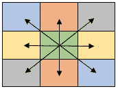

# 中心对称矩阵

> 原文:[https://www.geeksforgeeks.org/centrosymmetric-matrix/](https://www.geeksforgeeks.org/centrosymmetric-matrix/)

给定一个大小为**n×n**的矩阵。任务是检查给定的矩阵是否是中心对称矩阵。
在数学中，[中心对称矩阵](https://en.wikipedia.org/wiki/Centrosymmetric_matrix)是关于其中心对称的矩阵。



**例:**

```
Input : n = 3,
        m[][] = { { 1, 3, 5 },
                  { 6, 8, 6 },
                  { 5, 3, 1 } };
Output : Yes

Input : n = 3, 
        m[][] = { { 1, 3, 5 },
                  { 6, 8, 6 },
                  { 5, 3, 0 } };
Output : No
```

这个想法是检查每个元素的 m[i][j]是否等于 m[n–I–1][n–j–1]。如果有任何元素不满足上述条件，则打印“否”，否则打印“是”。
以下是上述方法的实现:

## C++

```
// CPP Program to check whether given
// matrix is centrosymmetric or not.
#include <bits/stdc++.h>
using namespace std;
#define N 3

bool checkCentrosymmetricted(int n, int m[N][N])
{
    int mid_row;

    // Finding the middle row of the matrix
    if (n & 1)
        mid_row = n / 2 + 1;
    else
        mid_row = n / 2;

    // for each row upto middle row.
    for (int i = 0; i < mid_row; i++) {

        // If each element and its corresponding
        // element is not equal then return false.
        for (int j = 0; j < n; j++) {
            if (m[i][j] != m[n - i - 1][n - j - 1])
                return false;
        }
    }

    return true;
}

// Driven Program
int main()
{
    int n = 3;
    int m[N][N] = { { 1, 3, 5 },
                    { 6, 8, 6 },
                    { 5, 3, 1 } };

    (checkCentrosymmetricted(n, m) ?
              (cout << "Yes") : (cout << "No"));

    return 0;
}
```

## Java 语言(一种计算机语言，尤用于创建网站)

```
// Java Program to check whether given
// matrix is centrosymmetric or not.
import java.io.*;

class GFG {

    static int N = 3;

    static boolean checkCentrosymmetricted(
                           int n, int m[][])
    {
        int mid_row;

        // Finding the middle row of the
        // matrix
        if ((n & 1)>0)
            mid_row = n / 2 + 1;
        else
            mid_row = n / 2;

        // for each row upto middle row.
        for (int i = 0; i < mid_row; i++)
        {

            // If each element and its
            // corresponding element is
            // not equal then return false.
            for (int j = 0; j < n; j++)
            {
                if (m[i][j] !=
                  m[n - i - 1][n - j - 1])
                    return false;
            }
        }

        return true;
    }

    // Driven Program
    public static void main (String[] args)
    {
        int n = 3;
        int m[][] = { { 1, 3, 5 },
                      { 6, 8, 6 },
                      { 5, 3, 1 } };

    if(checkCentrosymmetricted(n, m))
        System.out.println( "Yes");
    else
        System.out.println( "No");
    }
}

// This code is contributed by anuj_67.
```

## 蟒蛇 3

```
# Python3 Program to check whether given
# matrix is centrosymmetric or not.

def checkCentrosymmetricted( n, m):

    mid_row = 0;

    # Finding the middle row
    # of the matrix
    if ((n & 1) > 0):
        mid_row = n / 2 + 1;
    else:
        mid_row = n / 2;

    # for each row upto middle row.
    for i in range(int(mid_row)):

        # If each element and
        # its corresponding
        # element is not equal
        # then return false.
        for j in range(n):
            if (m[i][j] != m[n - i - 1][n - j - 1]):
                return False;

    return True;

# Driver Code
n = 3;
m = [[1, 3, 5 ],
     [ 6, 8, 6 ],
     [ 5, 3, 1 ]];

if(checkCentrosymmetricted(n, m)):
    print("Yes");
else:
    print("No");

# This code is contributed by mits
```

## C#

```
// C# Program to check whether given
// matrix is centrosymmetric or not.
using System;

class GFG {

    ///static int N = 3;

    static bool checkCentrosymmetricted(
                        int n, int [,]m)
    {
        int mid_row;

        // Finding the middle row of the
        // matrix
        if ((n & 1)>0)
            mid_row = n / 2 + 1;
        else
            mid_row = n / 2;

        // for each row upto middle row.
        for (int i = 0; i < mid_row; i++)
        {

            // If each element and its
            // corresponding element is
            // not equal then return false.
            for (int j = 0; j < n; j++)
            {
                if (m[i,j] !=
                m[n - i - 1,n - j - 1])
                    return false;
            }
        }

        return true;
    }

    // Driven Program
    public static void Main()
    {
        int n = 3;
        int [,]m = { { 1, 3, 5 },
                    { 6, 8, 6 },
                    { 5, 3, 1 } };

        if(checkCentrosymmetricted(n, m))
            Console.WriteLine( "Yes");
        else
            Console.WriteLine( "No");
    }
}

// This code is contributed by anuj_67.
```

## 服务器端编程语言（Professional Hypertext Preprocessor 的缩写）

```
<?php
// PHP Program to check whether given
// matrix is centrosymmetric or not.

//$N = 3;

function checkCentrosymmetricted( $n, $m)
{
    $mid_row;

    // Finding the middle row
    // of the matrix
    if ($n & 1)
        $mid_row = $n / 2 + 1;
    else
        $mid_row = $n / 2;

    // for each row upto middle row.
    for($i = 0; $i < $mid_row; $i++)
    {

        // If each element and
        // its corresponding
        // element is not equal
        // then return false.
        for($j = 0; $j < $n; $j++) {
            if ($m[$i][$j] != $m[$n - $i - 1]
                                [$n - $j - 1])
                return false;
        }
    }

    return true;
}

    // Driver Code
    $n = 3;
    $m = array(array(1, 3, 5 ),
                array( 6, 8, 6 ),
                array( 5, 3, 1 ));

    if(checkCentrosymmetricted($n, $m) )
        echo "Yes" ;
    else
        echo "No";

// This code is contributed by anuj_67.
?>
```

## java 描述语言

```
<script>

// Javascript Program to check whether given
// matrix is centrosymmetric or not.

let N = 3

function checkCentrosymmetricted( n,  m)
{
    let mid_row;

    // Finding the middle row of the matrix
    if (n & 1)
        mid_row = Math.floor(n / 2) + 1;
    else
        mid_row = n / 2;

    // for each row upto middle row.
    for (let i = 0; i < mid_row; i++) {

        // If each element and its corresponding
        // element is not equal then return false.
        for (let j = 0; j < n; j++) {
            if (m[i][j] != m[n - i - 1][n - j - 1])
                return false;
        }
    }

    return true;
}

// Driver Code

let n = 3;
let m = [ [ 1, 3, 5 ],
        [ 6, 8, 6 ],
        [ 5, 3, 1 ] ];

(checkCentrosymmetricted(n, m) ?
              (document.write("Yes")) : document.write("No"));

// This code is contributed by jana_sayanta.
</script>
```

**输出**T2】

```
Yes
```

**复杂度:** O(N <sup>2</sup> )