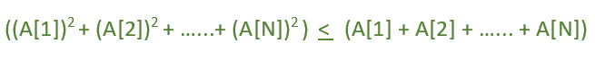

# 改变 k 个元素，使得(a1^2+a2^2+…+an^2)<=(a1+a2+…+an)变为真

> 原文:[https://www . geesforgeks . org/change-k-elements-so-so-a12-a22-an2/](https://www.geeksforgeeks.org/change-k-elements-so-that-a12-a22-an2/)

给定一个大小为 n 的数组 *Arr* ，任务是判断是否有可能将这个序列中最多 K 个元素改变为任意正整数，使得以下条件成立。



**示例:**

```
Input:N = 2, Arr[] = {1, 2}, K = 2
Output: Possible
(As A[2] can be change to 1)

Input: N = 2, Arr[] = {5, 6}, K = 1
Output: Not Possible
(As we can only change 1 element to any arbitrary number
and after changing it doesn't satisfy above condition) 
```

**方法:**当数组的所有元素都等于 1 时，那么只能满足给定的方程，否则不能满足。

1.  遍历数组并计算 1 的个数。
2.  如果 K >=(数组大小，即 N-计数)，则返回真，否则返回假。

下面是上述方法的实现:

## C++

```
// C++ implementation of above approach
#include <bits/stdc++.h>
using namespace std;

// Function that will tell
// whether it is possible or Not
int Series(int Arr[], int N, int K)
{
    int count = 0;
    for (int i = 0; i < N; i++)
        if (Arr[i] == 1)
            count++;

    if (K >= (N - count))
        return 1;
    else
        return 0;
}

// Driver code
int main()
{
    int Arr[] = { 5, 1, 2 };
    int N = sizeof(Arr) / sizeof(Arr[0]);
    int K = 2;

    // Calling function.
    int result = Series(Arr, N, K);

    if (result == 1)
        cout << "Possible";
    else
        cout << "Not Possible";
    return 0;
}
```

## Java 语言(一种计算机语言，尤用于创建网站)

```
//Java  implementation of above approach

import java.io.*;

class GFG {

// Function that will tell
// whether it is possible or Not
static int Series(int Arr[], int N, int K)
{
    int count = 0;
    for (int i = 0; i < N; i++)
        if (Arr[i] == 1)
            count++;

    if (K >= (N - count))
        return 1;
    else
        return 0;
}

// Driver code
    public static void main (String[] args) {
    int Arr[] = { 5, 1, 2 };
    int N = Arr.length;
    int K = 2;
    // Calling function.
    int result = Series(Arr, N, K);
    if (result == 1)
            System.out.println ("Possible");
    else
            System.out.println( "Not Possible");

    }
//This Code is Contributed by ajit   
}
```

## 蟒蛇 3

```
# Python implementation of
# above approach

# Function that will tell
# whether it is possible or Not
def Series(Arr, N, K):
    count = 0
    for i in range(N):
        if Arr[i] == 1:
            count += 1
    if K >= (N - count):
        return 1
    return 0

# Driver code
Arr = [5, 1, 2]
N = len(Arr)
K = 2

result = Series(Arr, N, K)
if result == 1:
    print("Possible")
else:
    print("Not Possible")

# This code is contributed
# by Shrikant13
```

## C#

```
//C# implementation of above approach

using System;

public class GFG{

// Function that will tell
// whether it is possible or Not
static int Series(int []Arr, int N, int K)
{
    int count = 0;
    for (int i = 0; i < N; i++)
        if (Arr[i] == 1)
            count++;

    if (K >= (N - count))
        return 1;
    else
        return 0;
}

// Driver code

    static public void Main (){
    int []Arr = { 5, 1, 2 };
    int N = Arr.Length;
    int K = 2;
    // Calling function.
    int result = Series(Arr, N, K);
    if (result == 1)
            Console.WriteLine ("Possible");
    else
            Console.WriteLine( "Not Possible");

    }
//This Code is Contributed by akt_mit
}
```

## 服务器端编程语言（Professional Hypertext Preprocessor 的缩写）

```
<?php
// PHP implementation of above approach

// Function that will tell
// whether it is possible or Not
function Series($Arr, $N, $K)
{
    $count = 0;
    for ($i = 0; $i < $N; $i++)
        if ($Arr[$i] == 1)
            $count++;

    if ($K >= ($N - $count))
        return 1;
    else
        return 0;
}

// Driver code
$Arr = array( 5, 1, 2 );
$N = sizeof($Arr);
$K = 2;

// Calling function.
$result = Series($Arr, $N, $K);

if ($result == 1)
    echo "Possible";
else
    echo "Not Possible";

// This code is contributed
// by Sach_Code
?>
```

## java 描述语言

```
<script>

// Javascript implementation of above approach

// Function that will tell
// whether it is possible or Not
function Series(Arr, N, K)
{
    var count = 0;
    for(var i = 0; i < N; i++)
        if (Arr[i] == 1)
            count++;

    if (K >= (N - count))
        return 1;
    else
        return 0;
}

// Driver code
var Arr = [ 5, 1, 2 ];
var N = Arr.length;
var K = 2;

// Calling function.
var result = Series(Arr, N, K);

if (result == 1)
    document.write("Possible");
else
    document.write("Not Possible");

// This code is contributed by rutvik_56

</script>
```

**Output:** 

```
Possible
```