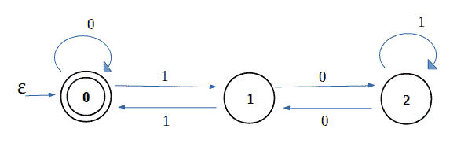

# 使用 DFA 检查二进制字符串是否为 3 的倍数

> 原文:[https://www . geesforgeks . org/check-binary-string-multi-3-using-DFA/](https://www.geeksforgeeks.org/check-binary-string-multiple-3-using-dfa/)

给定一串二进制字符，检查它是否是 3 的倍数。
**例:**

```
Input :  1 0 1 0
Output : NO
Explanation : (1 0 1 0) is 10 and hence
not a multiple of 3

Input :  1 1 0 0
Output : YES
Explanation : (1 1 0 0) is 12 and hence 
a multiple of 3
```

**方法 1 :** 一个简单的方法是将二进制数转换成它的十进制表示，然后检查它是否是 3 的倍数。现在说到 **DFA(确定性有限自动机)**，没有内存的概念，也就是提供字符串的时候不能存储，所以上面的方法就不适用了。简单来说，一个 DFA 接受一个字符串作为输入并处理它。如果达到最终状态，则接受，否则拒绝。由于不能存储字符串，所以输入是逐字符进行的。

给定问题的 DFA 是:



因为，当一个数被 3 除时，只有 3 种可能性。余数可以是 0、1 或 2。这里，状态 0 表示数除以 3 的余数为 0。状态 1 表示数被 3 除时的余数是 1，类似地，状态 2 表示数被 3 除时的余数是 2。因此，如果一个字符串最终达到状态 0，它将被接受，否则将被拒绝。

下面是上述方法的实现:

## C++

```
// C++ Program to illustrate
// DFA for multiple of 3
#include <bits/stdc++.h>
using namespace std;

// checks if binary characters
// are multiple of 3
bool isMultiple3(char c[], int size)
{
    // initial state is 0th
    char state = '0';

    for (int i = 0; i < size; i++) {

        // storing binary digit
        char digit = c[i];

        switch (state) {

        // when state is 0
        case '0':
            if (digit == '1')
                state = '1';
            break;

        // when state is 1
        case '1':
            if (digit == '0')
                state = '2';
            else
                state = '0';
            break;

        // when state is 2
        case '2':
            if (digit == '0')
                state = '1';
            break;
        }
    }

    // if final state is 0th state
    if (state == '0')
        return true;
    return false;
}

// Driver's Code
int main()
{
    // size of binary array
    int size = 5;

    // array of binary numbers
    // Here it is 21 in decimal
    char c[] = { '1', '0', '1', '0', '1' };

    // if binary numbers are a multiple of 3
    if (isMultiple3(c, size))
        cout << "YES\n";
    else
        cout << "NO\n";

    return 0;
}
```

## Java 语言(一种计算机语言，尤用于创建网站)

```
// Java Program to illustrate
// DFA for multiple of 3
import java.io.*;

class GFG
{
    // checks if binary characters
    // are multiple of 3
    static boolean isMultiple3(char c[], int size)
    {
        // initial state is 0th
        char state = '0';

        for (int i = 0; i < size; i++) {

            // storing binary digit
            char digit = c[i];

            switch (state) {

            // when state is 0
            case '0':
                if (digit == '1')
                    state = '1';
                break;

            // when state is 1
            case '1':
                if (digit == '0')
                    state = '2';
                else
                    state = '0';
                break;

            // when state is 2
            case '2':
                if (digit == '0')
                    state = '1';
                break;
            }
        }

        // if final state is 0th state
        if (state == '0')
            return true;
        return false;
    }

    // Driver Code
    public static void main (String[] args)
    {
        // size of binary array
        int size = 5;

        // array of binary numbers
        // Here it is 21 in decimal
        char c[] = { '1', '0', '1', '0', '1' };

        // if binary numbers are a multiple of 3
        if (isMultiple3(c, size))
            System.out.println ("YES");
        else
            System.out.println ("NO");

    }
}
// This code is contributed by vt_m
```

## 蟒蛇 3

```
# Python program to check if the binary String is divisible
# by 3.

# Function to check if the binary String is divisible by 3.
def CheckDivisibilty(A):
    oddbits = 0;
    evenbits = 0;
    for counter in range(len(A)):

        # checking if the bit is nonzero
        if (A[counter] == '1'):

            # checking if the nonzero bit is at even
            # position
            if (counter % 2 == 0):
                evenbits+=1;
            else:
                oddbits+=1;

    # Checking if the difference of non-zero oddbits and
    # evenbits is divisible by 3.
    if (abs(oddbits - evenbits) % 3 == 0):
        print("Yes" + "");
    else:
        print("No" + "");

# Driver Program
if __name__ == '__main__':
    A = "10101";
    CheckDivisibilty(A);

# This code contributed by umadevi9616 Added code in Python
```

## C#

```
// C# Program to illustrate
// DFA for multiple of 3
using System;

class GFG {

    // checks if binary characters
    // are multiple of 3
    static bool isMultiple3(char []c, int size)
    {
        // initial state is 0th
        char state = '0';

        for (int i = 0; i < size; i++)
        {

            // storing binary digit
            char digit = c[i];

            switch (state)
            {

                // when state is 0
                case '0':
                    if (digit == '1')
                        state = '1';
                    break;

                // when state is 1
                case '1':
                    if (digit == '0')
                        state = '2';
                    else
                        state = '0';
                    break;

                // when state is 2
                case '2':
                    if (digit == '0')
                        state = '1';
                    break;
            }
        }

        // if final state is 0th state
        if (state == '0')
            return true;

        return false;
    }

    // Driver Code
    public static void Main ()
    {

        // size of binary array
        int size = 5;

        // array of binary numbers
        // Here it is 21 in decimal
        char []c = { '1', '0', '1', '0', '1' };

        // if binary numbers are a multiple of 3
        if (isMultiple3(c, size))
            Console.WriteLine ("YES");
        else
            Console.WriteLine ("NO");
    }
}

// This code is contributed by vt_m.
```

## 服务器端编程语言（Professional Hypertext Preprocessor 的缩写）

```
<?php
// PHP Program to illustrate
// DFA for multiple of 3

// checks if binary characters
// are multiple of 3
function isMultiple3($c,$size)
{

    // initial state is 0th
    $state = '0';

    for ($i = 0; $i < $size; $i++)
    {

        // storing binary digit
        $digit = $c[$i];

        switch ($state)
        {

            // when state is 0
            case '0':
                if ($digit == '1')
                    $state = '1';
                break;

            // when state is 1
            case '1':
                if ($digit == '0')
                    $state = '2';
                else
                    $state = '0';
                break;

            // when state is 2
            case '2':
                if ($digit == '0')
                    $state = '1';
                break;
        }
    }

    // if final state is 0th state
    if ($state == '0')
        return true;
    return false;
}

    // Driver Code

    // size of binary array
    $size = 5;

    // array of binary numbers
    // Here it is 21 in decimal
    $c= array('1', '0', '1', '0', '1');

    // if binary numbers are
    // a multiple of 3
    if (isMultiple3($c, $size))
        echo "YES\n";
    else
        echo "NO\n";

//This code is contributed by mits
?>
```

## java 描述语言

```
<script>

// JavaScript Program to illustrate
// DFA for multiple of 3

    // checks if binary characters
    // are multiple of 3
    function isMultiple3(c, size)
    {
        // initial state is 0th
        let state = '0';

        for (let i = 0; i < size; i++) {

            // storing binary digit
            let digit = c[i];

            switch (state) {

            // when state is 0
            case '0':
                if (digit == '1')
                    state = '1';
                break;

            // when state is 1
            case '1':
                if (digit == '0')
                    state = '2';
                else
                    state = '0';
                break;

            // when state is 2
            case '2':
                if (digit == '0')
                    state = '1';
                break;
            }
        }

        // if final state is 0th state
        if (state == '0')
            return true;
        return false;
    }

// Driver code

        // size of binary array
        let size = 5;

        // array of binary numbers
        // Here it is 21 in decimal
        let c = [ '1', '0', '1', '0', '1' ];

        // if binary numbers are a multiple of 3
        if (isMultiple3(c, size))
            document.write ("YES");
        else
            document.write ("NO");

</script>
```

**Output**

```
YES
```

**方法 2:** 我们将检查非零奇数位位置和非零偶数位位置的数量之差是否能被 3 整除。

数学上-> |赔率-偶数|可被 3 整除。

### 代码:

## C++

```
// C++ program to check if the binary string is divisible
// by 3.
#include <bits/stdc++.h>
using namespace std;
// Function to check if the binary string is divisible by 3.
void CheckDivisibilty(string A)
{
    int oddbits = 0, evenbits = 0;
    for (int counter = 0; counter < A.length(); counter++) {
        // checking if the bit is nonzero
        if (A[counter] == '1') {
            // checking if the nonzero bit is at even
            // position
            if (counter % 2 == 0) {
                evenbits++;
            }
            else {
                oddbits++;
            }
        }
    }
    // Checking if the difference of non-zero oddbits and
    // evenbits is divisible by 3.
    if (abs(oddbits - evenbits) % 3 == 0) {
        cout << "Yes" << endl;
    }
    else {
        cout << "No" << endl;
    }
}
// Driver Program
int main()
{
    string A = "10101";
    CheckDivisibilty(A);
    return 0;
}
```

## Java 语言(一种计算机语言，尤用于创建网站)

```
// Java program to check if the binary String is divisible
// by 3.
import java.util.*;

class GFG
{

// Function to check if the binary String is divisible by 3.
static void CheckDivisibilty(String A)
{
    int oddbits = 0, evenbits = 0;
    for (int counter = 0; counter < A.length(); counter++)
    {

        // checking if the bit is nonzero
        if (A.charAt(counter) == '1')
        {

            // checking if the nonzero bit is at even
            // position
            if (counter % 2 == 0) {
                evenbits++;
            }
            else {
                oddbits++;
            }
        }
    }

    // Checking if the difference of non-zero oddbits and
    // evenbits is divisible by 3.
    if (Math.abs(oddbits - evenbits) % 3 == 0) {
        System.out.print("Yes" +"\n");
    }
    else {
        System.out.print("No" +"\n");
    }
}

// Driver Program
public static void main(String[] args)
{
    String A = "10101";
    CheckDivisibilty(A);
}
}

// This code is contributed by umadevi9616
```

## 蟒蛇 3

```
# Python program to check if the binary String is divisible
# by 3.

# Function to check if the binary String is divisible by 3.
def CheckDivisibilty(A):
    oddbits = 0;
    evenbits = 0;
    for counter in range(len(A)):

        # checking if the bit is nonzero
        if (A[counter] == '1'):

            # checking if the nonzero bit is at even
            # position
            if (counter % 2 == 0):
                evenbits += 1;
            else:
                oddbits += 1;

    # Checking if the difference of non-zero oddbits and
    # evenbits is divisible by 3.
    if (abs(oddbits - evenbits) % 3 == 0):
        print("Yes" + "");
    else:
        print("No" + "");

# Driver Program
if __name__ == '__main__':
    A = "10101";
    CheckDivisibilty(A);

# This code is contributed by umadevi9616.
```

## C#

```
// C# program to check if the binary String is divisible
// by 3.
using System;

public class GFG
{

// Function to check if the binary String is divisible by 3.
static void CheckDivisibilty(String A)
{
    int oddbits = 0, evenbits = 0;
    for (int counter = 0; counter < A.Length; counter++)
    {

        // checking if the bit is nonzero
        if (A[counter] == '1')
        {

            // checking if the nonzero bit is at even
            // position
            if (counter % 2 == 0) {
                evenbits++;
            }
            else {
                oddbits++;
            }
        }
    }

    // Checking if the difference of non-zero oddbits and
    // evenbits is divisible by 3.
    if (Math.Abs(oddbits - evenbits) % 3 == 0) {
        Console.Write("Yes" +"\n");
    }
    else {
        Console.Write("No" +"\n");
    }
}

// Driver Program
public static void Main(String[] args)
{
    String A = "10101";
    CheckDivisibilty(A);
}
}

// This code is contributed by umadevi9616
```

## java 描述语言

```
<script>
// javascript program to check if the binary String is divisible
// by 3.

    // Function to check if the binary String is divisible by 3.
    function CheckDivisibilty( A) {
        var oddbits = 0, evenbits = 0;
        for (var counter = 0; counter < A.length; counter++) {

            // checking if the bit is nonzero
            if (A[counter] == '1') {

                // checking if the nonzero bit is at even
                // position
                if (counter % 2 == 0) {
                    evenbits++;
                } else {
                    oddbits++;
                }
            }
        }

        // Checking if the difference of non-zero oddbits and
        // evenbits is divisible by 3.
        if (Math.abs(oddbits - evenbits) % 3 == 0) {
            document.write("Yes" + "\n");
        } else {
            document.write("No" + "\n");
        }
    }

    // Driver Program
        var A = "10101";
        CheckDivisibilty(A);

// This code is contributed by umadevi9616
</script>
```

**Output**

```
Yes
```

**时间复杂度:** 其中 N 为位数。