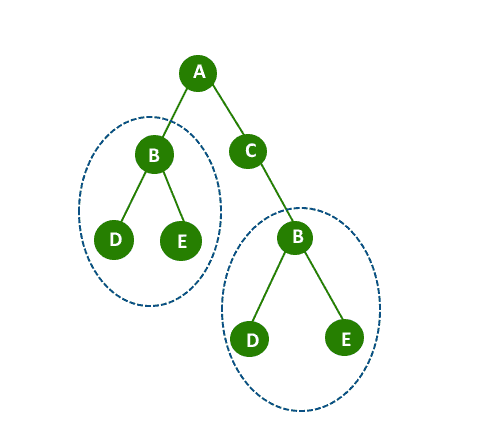

# 检查二叉树是否包含大小为 2 或更大的重复子树

> 原文:[https://www . geesforgeks . org/check-二叉树-包含-重复-子树-size-2/](https://www.geeksforgeeks.org/check-binary-tree-contains-duplicate-subtrees-size-2/)

给定二叉树，检查二叉树是否包含大小为 2 或更大的重复子树。
注意:两个相同的叶节点不考虑，因为一个叶节点的子树大小为一。

```
Input :  Binary Tree 
               A
             /    \ 
           B        C
         /   \       \    
        D     E       B     
                     /  \    
                    D    E
Output : Yes
```

问于:谷歌采访



**具有重复子树的树[用蓝色椭圆突出显示]**

**【方法 1】**
一个简单的解决方法是，我们挑选树的每个节点，并试图找到给定树的任何子树是否存在于与该子树相同的树中。在这里，我们可以使用下面的帖子来查找一个子树是否存在于树中的任何其他地方。
[检查一棵二叉树是否是另一棵二叉树的子树](https://www.geeksforgeeks.org/check-if-a-binary-tree-is-subtree-of-another-binary-tree/)

**【方法 2】(高效解决方案)**
基于[树序列化](https://www.geeksforgeeks.org/serialize-deserialize-binary-tree/)和[哈希](https://www.geeksforgeeks.org/hashing-set-1-introduction/)的高效解决方案。其思想是将子树序列化为字符串，并将字符串存储在哈希表中。一旦我们发现哈希表中已经存在一个序列化的树(它不是叶子)，我们就返回 true。

以上想法的实现。

## C++

```
// C++ program to find if there is a duplicate
// sub-tree of size 2 or more.
#include<bits/stdc++.h>
using namespace std;

// Separator node
const char MARKER = '{content}apos;;

// Structure for a binary tree node
struct Node
{
    char key;
    Node *left, *right;
};

// A utility function to create a new node
Node* newNode(char key)
{
    Node* node = new Node;
    node->key = key;
    node->left = node->right = NULL;
    return node;
}

unordered_set<string> subtrees;

// This function returns empty string if tree
// contains a duplicate subtree of size 2 or more.
string dupSubUtil(Node *root)
{
    string s = "";

    // If current node is NULL, return marker
    if (root == NULL)
        return s + MARKER;

    // If left subtree has a duplicate subtree.
    string lStr = dupSubUtil(root->left);
    if (lStr.compare(s) == 0)
    return s;

    // Do same for right subtree
    string rStr = dupSubUtil(root->right);
    if (rStr.compare(s) == 0)
    return s;

    // Serialize current subtree
    s = s + root->key + lStr + rStr;

    // If current subtree already exists in hash
    // table. [Note that size of a serialized tree
    // with single node is 3 as it has two marker
    // nodes.
    if (s.length() > 3 &&
        subtrees.find(s) != subtrees.end())
    return "";

    subtrees.insert(s);

    return s;
}

// Driver program to test above functions
int main()
{
    Node *root = newNode('A');
    root->left = newNode('B');
    root->right = newNode('C');
    root->left->left = newNode('D');
    root->left->right = newNode('E');
    root->right->right = newNode('B');
    root->right->right->right = newNode('E');
    root->right->right->left= newNode('D');

    string str = dupSubUtil(root);

    (str.compare("") == 0) ? cout << " Yes ":
                            cout << " No " ;
    return 0;
}
```

## Java 语言(一种计算机语言，尤用于创建网站)

```
// Java program to find if there is a duplicate
// sub-tree of size 2 or more.
import java.util.HashSet;
public class Main {

    static char MARKER = '{content}apos;;

    // This function returns empty string if tree
    // contains a duplicate subtree of size 2 or more.
    public static String dupSubUtil(Node root, HashSet<String> subtrees)
    {
        String s = "";

        // If current node is NULL, return marker
        if (root == null)
            return s + MARKER;

        // If left subtree has a duplicate subtree.
        String lStr = dupSubUtil(root.left,subtrees);
        if (lStr.equals(s))
            return s;

        // Do same for right subtree
        String rStr = dupSubUtil(root.right,subtrees);
        if (rStr.equals(s))
            return s;

        // Serialize current subtree
        s = s + root.data + lStr + rStr;

        // If current subtree already exists in hash
        // table. [Note that size of a serialized tree
        // with single node is 3 as it has two marker
        // nodes.
        if (s.length() > 3 && subtrees.contains(s))
            return "";

        subtrees.add(s);
        return s;
    }

    //Function to find if the Binary Tree contains duplicate
    //subtrees of size 2 or more
    public static String dupSub(Node root)
    {
        HashSet<String> subtrees=new HashSet<>();
        return dupSubUtil(root,subtrees);
    }

    public static void main(String args[])
    {
        Node root = new Node('A');
        root.left = new Node('B');
        root.right = new Node('C');
        root.left.left = new Node('D');
        root.left.right = new Node('E');
        root.right.right = new Node('B');
        root.right.right.right = new Node('E');
        root.right.right.left= new Node('D');
        String str = dupSub(root);
        if(str.equals(""))
            System.out.print(" Yes ");
        else   
            System.out.print(" No ");
    }
}

// A binary tree Node has data,
// pointer to left child
// and a pointer to right child
class Node {
    int data;
    Node left,right;
    Node(int data)
    {
        this.data=data;
    }
};
//This code is contributed by Gaurav Tiwari
```

## 蟒蛇 3

```
# Python3 program to find if there is
# a duplicate sub-tree of size 2 or more

# Separator node
MARKER = '{content}apos;

# Structure for a binary tree node
class Node:

    def __init__(self, x):

        self.key = x
        self.left = None
        self.right = None

subtrees = {}

# This function returns empty if tree
# contains a duplicate subtree of size
# 2 or more.
def dupSubUtil(root):

    global subtrees

    s = ""

    # If current node is None, return marker
    if (root == None):
        return s + MARKER

    # If left subtree has a duplicate subtree.
    lStr = dupSubUtil(root.left)

    if (s in lStr):
       return s

    # Do same for right subtree
    rStr = dupSubUtil(root.right)

    if (s in rStr):
       return s

    # Serialize current subtree
    s = s + root.key + lStr + rStr

    # If current subtree already exists in hash
    # table. [Note that size of a serialized tree
    # with single node is 3 as it has two marker
    # nodes.
    if (len(s) > 3 and s in subtrees):
       return ""

    subtrees[s] = 1

    return s

# Driver code
if __name__ == '__main__':

    root = Node('A')
    root.left = Node('B')
    root.right = Node('C')
    root.left.left = Node('D')
    root.left.right = Node('E')
    root.right.right = Node('B')
    root.right.right.right = Node('E')
    root.right.right.left= Node('D')

    str = dupSubUtil(root)

    if "" in str:
        print(" Yes ")
    else:
        print(" No ")

# This code is contributed by mohit kumar 29
```

## C#

```
// C# program to find if there is a duplicate
// sub-tree of size 2 or more.
using System;
using System.Collections.Generic;

class GFG
{

    static char MARKER = '{content}apos;;

    // This function returns empty string if tree
    // contains a duplicate subtree of size 2 or more.
    public static String dupSubUtil(Node root,
                    HashSet<String> subtrees)
    {
        String s = "";

        // If current node is NULL, return marker
        if (root == null)
            return s + MARKER;

        // If left subtree has a duplicate subtree.
        String lStr = dupSubUtil(root.left,subtrees);
        if (lStr.Equals(s))
            return s;

        // Do same for right subtree
        String rStr = dupSubUtil(root.right,subtrees);
        if (rStr.Equals(s))
            return s;

        // Serialize current subtree
        s = s + root.data + lStr + rStr;

        // If current subtree already exists in hash
        // table. [Note that size of a serialized tree
        // with single node is 3 as it has two marker
        // nodes.
        if (s.Length > 3 && subtrees.Contains(s))
            return "";

        subtrees.Add(s);
        return s;
    }

    // Function to find if the Binary Tree contains
    // duplicate subtrees of size 2 or more
    public static String dupSub(Node root)
    {
        HashSet<String> subtrees = new HashSet<String>();
        return dupSubUtil(root,subtrees);
    }

    // Driver code
    public static void Main(String []args)
    {
        Node root = new Node('A');
        root.left = new Node('B');
        root.right = new Node('C');
        root.left.left = new Node('D');
        root.left.right = new Node('E');
        root.right.right = new Node('B');
        root.right.right.right = new Node('E');
        root.right.right.left= new Node('D');
        String str = dupSub(root);
        if(str.Equals(""))
            Console.Write(" Yes ");
        else
            Console.Write(" No ");
    }
}

// A binary tree Node has data,
// pointer to left child
// and a pointer to right child
public class Node
{
    public int data;
    public Node left,right;
    public Node(int data)
    {
        this.data = data;
    }
};

// This code is contributed by 29AjayKumar
```

## java 描述语言

```
<script>
// Javascript program to find if there is a duplicate
// sub-tree of size 2 or more.

    let MARKER = '{content}apos;;

    // A binary tree Node has data,
// pointer to left child
// and a pointer to right child
    class Node {
        constructor(data)
        {
            this.data=data;
        }
    }

    // This function returns empty string if tree
    // contains a duplicate subtree of size 2 or more.
    function dupSubUtil(root,subtrees)
    {
        let s = "";

        // If current node is NULL, return marker
        if (root == null)
            return s + MARKER;

        // If left subtree has a duplicate subtree.
        let lStr = dupSubUtil(root.left,subtrees);
        if (lStr==(s))
            return s;

        // Do same for right subtree
        let rStr = dupSubUtil(root.right,subtrees);
        if (rStr==(s))
            return s;

        // Serialize current subtree
        s = s + root.data + lStr + rStr;

        // If current subtree already exists in hash
        // table. [Note that size of a serialized tree
        // with single node is 3 as it has two marker
        // nodes.
        if (s.length > 3 && subtrees.has(s))
            return "";

        subtrees.add(s);
        return s;
    }

    //Function to find if the Binary Tree contains duplicate
    //subtrees of size 2 or more
    function dupSub(root)
    {
            let subtrees=new Set();

            return dupSubUtil(root,subtrees);
    }

    let root = new Node('A');
    root.left = new Node('B');
    root.right = new Node('C');
    root.left.left = new Node('D');
    root.left.right = new Node('E');
    root.right.right = new Node('B');
    root.right.right.right = new Node('E');
    root.right.right.left= new Node('D');
    let str = dupSub(root);
    if(str==(""))
        document.write(" Yes ");
     else  
        document.write(" No ");

// This code is contributed by unknown2108
</script>
```

**输出:**

```
Yes
```

本文由 [**尼尚·辛格**](https://practice.geeksforgeeks.org/user-profile.php?user=_code) 供稿。如果你喜欢 GeeksforGeeks 并想投稿，你也可以使用[write.geeksforgeeks.org](https://write.geeksforgeeks.org)写一篇文章或者把你的文章邮寄到 review-team@geeksforgeeks.org。看到你的文章出现在极客博客主页上，帮助其他极客。
如果发现有不正确的地方，或者想分享更多关于上述话题的信息，请写评论。