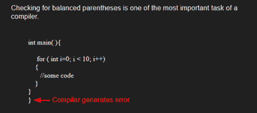

# 使用堆栈

检查表达式中的平衡括号(格式是否正确)

> 原文:[https://www . geesforgeks . org/check-for-balanced-in-in-a-expression/](https://www.geeksforgeeks.org/check-for-balanced-parentheses-in-an-expression/)

给定一个表达式字符串 exp，编写一个程序来检查“{”、“}”、“(”、“”、“[”、“]”的对和顺序在 exp 中是否正确。

**例**:

> **输入**:exp = "[()]{ } {[()]()} "
> T3】输出:平衡
> 
> **输入** : exp = "[(])"
> **输出**:不平衡



**算法:**

*   声明一个字符[栈](https://www.geeksforgeeks.org/stack-data-structure/) S。
*   现在遍历表达式字符串 exp。
    1.  如果当前字符是一个起始括号(**)(“或”“”或“[”**)，那么将其推入堆栈。
    2.  如果当前字符是结束括号(**')'或' } '或']'** )，则从堆栈中弹出，如果弹出的字符是匹配的开始括号，则精细否则括号不平衡。
*   完成遍历后，如果堆栈中还有一些起始括号，那么“不平衡”

下图是上述方法的模拟运行:


下面是上述方法的实现:

## C++

```
// CPP program to check for balanced brackets.
#include <bits/stdc++.h>
using namespace std;

// function to check if brackets are balanced
bool areBracketsBalanced(string expr)
{ 
    stack<char> s;
    char x;

    // Traversing the Expression
    for (int i = 0; i < expr.length(); i++)
    {
        if (expr[i] == '(' || expr[i] == '['
            || expr[i] == '{')
        {
            // Push the element in the stack
            s.push(expr[i]);
            continue;
        }

        // IF current current character is not opening
        // bracket, then it must be closing. So stack
        // cannot be empty at this point.
        if (s.empty())
            return false;

        switch (expr[i]) {
        case ')':

            // Store the top element in a
            x = s.top();
            s.pop();
            if (x == '{' || x == '[')
                return false;
            break;

        case '}':

            // Store the top element in b
            x = s.top();
            s.pop();
            if (x == '(' || x == '[')
                return false;
            break;

        case ']':

            // Store the top element in c
            x = s.top();
            s.pop();
            if (x == '(' || x == '{')
                return false;
            break;
        }
    }

    // Check Empty Stack
    return (s.empty());
}

// Driver code
int main()
{
    string expr = "{()}[]";

    // Function call
    if (areBracketsBalanced(expr))
        cout << "Balanced";
    else
        cout << "Not Balanced";
    return 0;
}
```

## C

```
#include <stdio.h>
#include <stdlib.h>
#define bool int

// structure of a stack node
struct sNode {
    char data;
    struct sNode* next;
};

// Function to push an item to stack
void push(struct sNode** top_ref, int new_data);

// Function to pop an item from stack
int pop(struct sNode** top_ref);

// Returns 1 if character1 and character2 are matching left
// and right Brackets
bool isMatchingPair(char character1, char character2)
{
    if (character1 == '(' && character2 == ')')
        return 1;
    else if (character1 == '{' && character2 == '}')
        return 1;
    else if (character1 == '[' && character2 == ']')
        return 1;
    else
        return 0;
}

// Return 1 if expression has balanced Brackets
bool areBracketsBalanced(char exp[])
{
    int i = 0;

    // Declare an empty character stack
    struct sNode* stack = NULL;

    // Traverse the given expression to check matching
    // brackets
    while (exp[i])
    {
        // If the exp[i] is a starting bracket then push
        // it
        if (exp[i] == '{' || exp[i] == '(' || exp[i] == '[')
            push(&stack, exp[i]);

        // If exp[i] is an ending bracket then pop from
        // stack and check if the popped bracket is a
        // matching pair*/
        if (exp[i] == '}' || exp[i] == ')'
            || exp[i] == ']') {

            // If we see an ending bracket without a pair
            // then return false
            if (stack == NULL)
                return 0;

            // Pop the top element from stack, if it is not
            // a pair bracket of character then there is a
            // mismatch.
            // his happens for expressions like {(})
            else if (!isMatchingPair(pop(&stack), exp[i]))
                return 0;
        }
        i++;
    }

    // If there is something left in expression then there
    // is a starting bracket without a closing
    // bracket
    if (stack == NULL)
        return 1; // balanced
    else
        return 0; // not balanced
}

// Driver code
int main()
{
    char exp[100] = "{()}[]";

    // Function call
    if (areBracketsBalanced(exp))
        printf("Balanced \n");
    else
        printf("Not Balanced \n");
    return 0;
}

// Function to push an item to stack
void push(struct sNode** top_ref, int new_data)
{
    // allocate node
    struct sNode* new_node
        = (struct sNode*)malloc(sizeof(struct sNode));

    if (new_node == NULL) {
        printf("Stack overflow n");
        getchar();
        exit(0);
    }

    // put in the data
    new_node->data = new_data;

    // link the old list off the new node
    new_node->next = (*top_ref);

    // move the head to point to the new node
    (*top_ref) = new_node;
}

// Function to pop an item from stack
int pop(struct sNode** top_ref)
{
    char res;
    struct sNode* top;

    // If stack is empty then error
    if (*top_ref == NULL) {
        printf("Stack overflow n");
        getchar();
        exit(0);
    }
    else {
        top = *top_ref;
        res = top->data;
        *top_ref = top->next;
        free(top);
        return res;
    }
}
```

## Java 语言(一种计算机语言，尤用于创建网站)

```
// Java program for checking
// balanced brackets
import java.util.*;

public class BalancedBrackets {

    // function to check if brackets are balanced
    static boolean areBracketsBalanced(String expr)
    {
        // Using ArrayDeque is faster than using Stack class
        Deque<Character> stack
            = new ArrayDeque<Character>();

        // Traversing the Expression
        for (int i = 0; i < expr.length(); i++)
        {
            char x = expr.charAt(i);

            if (x == '(' || x == '[' || x == '{')
            {
                // Push the element in the stack
                stack.push(x);
                continue;
            }

            // If current character is not opening
            // bracket, then it must be closing. So stack
            // cannot be empty at this point.
            if (stack.isEmpty())
                return false;
            char check;
            switch (x) {
            case ')':
                check = stack.pop();
                if (check == '{' || check == '[')
                    return false;
                break;

            case '}':
                check = stack.pop();
                if (check == '(' || check == '[')
                    return false;
                break;

            case ']':
                check = stack.pop();
                if (check == '(' || check == '{')
                    return false;
                break;
            }
        }

        // Check Empty Stack
        return (stack.isEmpty());
    }

    // Driver code
    public static void main(String[] args)
    {
        String expr = "([{}])";

        // Function call
        if (areBracketsBalanced(expr))
            System.out.println("Balanced ");
        else
            System.out.println("Not Balanced ");
    }
}
```

## 蟒蛇 3

```
# Python3 program to check for
# balanced brackets.

# function to check if
# brackets are balanced

def areBracketsBalanced(expr):
    stack = []

    # Traversing the Expression
    for char in expr:
        if char in ["(", "{", "["]:

            # Push the element in the stack
            stack.append(char)
        else:

            # IF current character is not opening
            # bracket, then it must be closing.
            # So stack cannot be empty at this point.
            if not stack:
                return False
            current_char = stack.pop()
            if current_char == '(':
                if char != ")":
                    return False
            if current_char == '{':
                if char != "}":
                    return False
            if current_char == '[':
                if char != "]":
                    return False

    # Check Empty Stack
    if stack:
        return False
    return True

# Driver Code
if __name__ == "__main__":
    expr = "{()}[]"

    # Function call
    if areBracketsBalanced(expr):
        print("Balanced")
    else:
        print("Not Balanced")

# This code is contributed by AnkitRai01 and improved
# by Raju Pitta
```

## C#

```
// C# program for checking
// balanced Brackets
using System;
using System.Collections.Generic;

public class BalancedBrackets {
    public class stack {
        public int top = -1;
        public char[] items = new char[100];

        public void push(char x)
        {
            if (top == 99)
            {
                Console.WriteLine("Stack full");
            }
            else {
                items[++top] = x;
            }
        }

        char pop()
        {
            if (top == -1)
            {
                Console.WriteLine("Underflow error");
                return '\0';
            }
            else
            {
                char element = items[top];
                top--;
                return element;
            }
        }

        Boolean isEmpty()
        {
            return (top == -1) ? true : false;
        }
    }

    // Returns true if character1 and character2
    // are matching left and right brackets */
    static Boolean isMatchingPair(char character1,
                                  char character2)
    {
        if (character1 == '(' && character2 == ')')
            return true;
        else if (character1 == '{' && character2 == '}')
            return true;
        else if (character1 == '[' && character2 == ']')
            return true;
        else
            return false;
    }

    // Return true if expression has balanced
    // Brackets
    static Boolean areBracketsBalanced(char[] exp)
    {
        // Declare an empty character stack */
        Stack<char> st = new Stack<char>();

        // Traverse the given expression to
        //   check matching brackets
        for (int i = 0; i < exp.Length; i++)
        {
            // If the exp[i] is a starting
            // bracket then push it
            if (exp[i] == '{' || exp[i] == '('
                || exp[i] == '[')
                st.Push(exp[i]);

            //  If exp[i] is an ending bracket
            //  then pop from stack and check if the
            //   popped bracket is a matching pair
            if (exp[i] == '}' || exp[i] == ')'
                || exp[i] == ']') {

                // If we see an ending bracket without
                //   a pair then return false
                if (st.Count == 0)
                {
                    return false;
                }

                // Pop the top element from stack, if
                // it is not a pair brackets of
                // character then there is a mismatch. This
                // happens for expressions like {(})
                else if (!isMatchingPair(st.Pop(),
                                         exp[i])) {
                    return false;
                }
            }
        }

        // If there is something left in expression
        // then there is a starting bracket without
        // a closing bracket

        if (st.Count == 0)
            return true; // balanced
        else
        {
            // not balanced
            return false;
        }
    }

    // Driver code
    public static void Main(String[] args)
    {
        char[] exp = { '{', '(', ')', '}', '[', ']' };

        // Function call
        if (areBracketsBalanced(exp))
            Console.WriteLine("Balanced ");
        else
            Console.WriteLine("Not Balanced ");
    }
}

// This code is contributed by 29AjayKumar
```

## java 描述语言

```
<script>

// Javascript program for checking
// balanced brackets

// Function to check if brackets are balanced
function areBracketsBalanced(expr)
{

    // Using ArrayDeque is faster
    // than using Stack class
    let stack = [];

    // Traversing the Expression
    for(let i = 0; i < expr.length; i++)
    {
        let x = expr[i];

        if (x == '(' || x == '[' || x == '{')
        {

            // Push the element in the stack
            stack.push(x);
            continue;
        }

        // If current character is not opening
        // bracket, then it must be closing.
        // So stack cannot be empty at this point.
        if (stack.length == 0)
            return false;

        let check;
        switch (x){
        case ')':
            check = stack.pop();
            if (check == '{' || check == '[')
                return false;
            break;

        case '}':
            check = stack.pop();
            if (check == '(' || check == '[')
                return false;
            break;

        case ']':
            check = stack.pop();
            if (check == '(' || check == '{')
                return false;
            break;
        }
    }

    // Check Empty Stack
    return (stack.length == 0);
}

// Driver code
let expr = "([{}])";

// Function call
if (areBracketsBalanced(expr))
    document.write("Balanced ");
else
    document.write("Not Balanced ");

// This code is contributed by rag2127

</script>
```

**Output**

```
Balanced
```

**时间复杂度:**O(n)
T3】辅助空间: O(n)为叠加。

如果您发现上述代码/算法中有任何错误，请写评论，或者找到其他方法来解决相同的问题