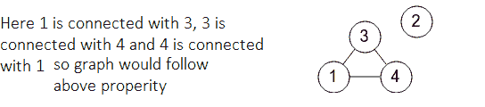

# 检查给定无向图中的传递属性

> 原文:[https://www . geesforgeks . org/检查给定无向图中的可传递属性/](https://www.geeksforgeeks.org/check-for-transitive-property-in-a-given-undirected-graph/)

给定一个顶点编号在范围**【1，N】**内的[无向图](https://www.geeksforgeeks.org/graph-data-structure-and-algorithms/) **G** 和一个由 **M** 条边组成的[数组](https://www.geeksforgeeks.org/array-data-structure/) **条边】【】【】**，任务是检查无向图的所有三元组是否满足传递性。如果发现为真，则打印**“是”**。否则，打印**“否”**。

> 无向图的传递性说明:
> 如果顶点 **X** 连接到顶点 **Y** ，顶点 **Y** 连接到顶点 **Z** ，那么顶点 **X** 必须连接到顶点 **Z** 。

**示例:**

> **输入:** N = 4，M = 3 边[] = {{1，3}，{3，4}，{1，4 } }
> T3】输出:是
> T6】解释:
> 
> [](https://media.geeksforgeeks.org/wp-content/cdn-uploads/20210119091255/TransitiveProperty.png)
> 
> **输入:** N = 4，M = 4，边[] = {{3，1}，{2，3}，{3，4}，{1，2}}
> **输出**:否
> **说明:**
> 
> [](https://media.geeksforgeeks.org/wp-content/cdn-uploads/20210119091401/TransitiveProperty2.png)

**天真法:**解决上述问题最简单的方法是遍历每一个**三元组**的顶点 **(i，j，k)** ，对于每一个这样的三元组，如果 **i** 和 **j** ，并且 **i** 和 **k** 通过一条边直接相连，则检查顶点 **j** 和 **k** 之间是否有边

***时间复杂度:**O(N<sup>3</sup>)*
***辅助空间:** O(N <sup>2</sup> )*

**有效方法:**想法是[找到图形](https://www.geeksforgeeks.org/connected-components-in-an-undirected-graph/)中存在的所有连接组件。最后，检查该图的所有连接组件是否是一个[完整的图](https://www.geeksforgeeks.org/mathematics-graph-theory-basics/)。如果发现是真的，则打印**“是”**。否则，打印**“否”**。按照以下步骤解决问题:

*   用[邻接表](https://www.geeksforgeeks.org/graph-and-its-representations/)的形式表示图形 **G** 。
*   通过执行以下操作，查找图形的所有连接组件，并检查连接组件是否是完整的图形:
    *   找出当前连通图中顶点的总数，比如说 **X** 。
    *   如果连接组件的所有顶点都没有连接到**X–1**顶点，则打印**“否”**。
*   最后，检查所有连接的组件是否是一个完整的图形。如果发现为真，则打印**“是”**。

下面是上述方法的实现:

## C++

```
// C++ program of the above approach
#include <bits/stdc++.h>
using namespace std;

// Stores undirected graph using
// adjacency list representation
class Graph {

    // Stores count of vertices
    int V;

    // adj[i]: Store all the nodes
    // connected to i
    list<int>* adj;

    // DFS function
    void DFSUtil(int v, bool visited[], int id[],
                 int id_number, int& c);

public:
    Graph(int V);
    ~Graph();

    // Connect two vertices v and w
    void addEdge(int v, int w);

    // Check if the connected component
    // is a complete graph or not
    bool connectedComponents();
};

Graph::Graph(int V)
{
    this->V = V;
    adj = new list<int>[V + 1];
}

// Destructor
Graph::~Graph() { delete[] adj; }

// Function to add an undirected
// edge between two vertices
void Graph::addEdge(int v, int w)
{
    adj[v].push_back(w);
    adj[w].push_back(v);
}

// Function to find all the connected
// components of a graph using DFS
void Graph::DFSUtil(int v, bool visited[], int id[],
                    int id_number, int& c)
{

    // Mark the vertex v as visited
    visited[v] = true;

    // Assign an id of current
    // connected component
    id[v] = id_number;

    // Increase the count of vertices in
    // current connected component
    c++;

    // Recursively call for all the
    // vertices adjacent to this vertex
    list<int>::iterator i;

    // Iterate over all the adjacent
    // vertices of the current vertex
    for (i = adj[v].begin(); i != adj[v].end();
         ++i) {

        // If current vertex is not visited
        if (!visited[*i])
            DFSUtil(*i, visited, id,
                    id_number, c);
    }
}

// Function to find connected
// components of the graph
bool Graph::connectedComponents()
{

    bool* visited = new bool[V + 1];

    // id[i]: Stores an unique id of connected
    // component in which vertex i exists
    int* id = new int[V + 1];

    // Store count of nodes in current
    // connected component
    int* component_size = new int[V + 1];

    // Mark all the vertices as not visited
    for (int v = 1; v <= V; v++)
        visited[v] = false;

    for (int v = 1; v <= V; v++) {

        // If vertex v is not marked
        if (visited[v] == false) {

            // Stores the size of a component
            // in which vertex v lies
            int c = 0;

            // Stores id of current
            // connected component
            int id_number = v;

            DFSUtil(v, visited, id,
                    id_number, c);

            // Stores count of vertices of
            // current component
            component_size[v] = c;
        }
        else {

            component_size[v]
                = component_size[id[v]];
        }
    }

    // Iterate over all the vertices
    for (int v = 1; v <= V; v++) {

        // IF connected component[v] is
        // not a complete graph
        if (component_size[v] - 1
            != (int)adj[v].size()) {

            delete[] visited;
            return false;
        }
    }

    delete[] visited;
    return true;
}

// Function to check if graph is
// Edge Transitive or not
void isTransitive(int N, int M,
                  vector<vector<int> > Edge)
{

    // Initialize a graph
    Graph G(N);

    // Traverse the array Edge[]
    for (int i = 0; i < M; i++) {
        G.addEdge(Edge[i][0], Edge[i][1]);
    }

    // If all the connected components
    // are a complete graph
    int f = G.connectedComponents();
    if (f == 0) {
        cout << "NO\n";
    }
    else {
        cout << "YES\n";
    }
}

// Driver Code
int main()
{
    // Input
    int N = 4, M = 3;
    vector<vector<int> > Edge{ { 1, 3 },
                               { 3, 4 },
                               { 1, 4 } };
    isTransitive(N, M, Edge);

    return 0;
}
```

## 蟒蛇 3

```
# Python3 program of the above approach

# Function to add an undirected
# edge between two vertices
def addEdge(v, w):
    global adj
    adj[v].append(w)
    adj[w].append(v)

# Function to find all the connected
# components of a graph using DFS
def DFSUtil(v, id, id_number):
    global visited, adj, c

    # Mark the vertex v as visited
    visited[v] = True

    # Assign an id of current
    # connected component
    id[v] = id_number

    # Increase the count of vertices in
    # current connected component
    c += 1

    # Iterate over all the adjacent
    # vertices of the current vertex
    for i in adj[v]:

        # If current vertex is not visited
        if (not visited[i]):
            DFSUtil(i, id, id_number)

# Function to find connected
# components of the graph
def connectedComponents():
    global V, adj, visited, c

    # id[i]: Stores an unique id of connected
    # component in which vertex i exists
    id = [0]*(V + 1)

    # Store count of nodes in current
    # connected component
    component_size = [0]*(V + 1)
    for v in range(1, V + 1):

        # If vertex v is not marked
        if (visited[v] == False):

            # Stores the size of a component
            # in which vertex v lies
            c = 0

            # Stores id of current
            # connected component
            id_number = v
            DFSUtil(v, id, id_number)

            # Stores count of vertices of
            # current component
            component_size[v] = c
        else:

            component_size[v] = component_size[id[v]]

    # Iterate over all the vertices
    for v in range(1, V + 1):

        # IF connected component[v] is
        # not a complete graph
        if (component_size[v] - 1 != len(adj[v])):
            return False
    return True

# Function to check if graph is
# Edge Transitive or not
def isTransitive(N, M, Edge):
    global adj, visited, c

    # Traverse the array Edge[]
    for i in range(M):
        addEdge(Edge[i][0], Edge[i][1])

    # If all the connected components
    # are a complete graph
    f = connectedComponents()
    if (f == 0):
        print("NO")
    else:
        print("YES")

# Driver Code
if __name__ == '__main__':

    # Input
    V, c = 5, 0
    adj = [[] for i in range(V + 1)]
    visited = [False] * (V + 1)

    N, M = 4, 3
    Edge = [ [ 1, 3 ],
           [ 3, 4 ],
           [ 1, 4 ] ]
    isTransitive(N, M, Edge)

    # This code is contributed by mohit kumar 29
```

**Output:** 

```
YES
```

***时间复杂度:** O(N + M)*
***辅助空间:** O(N <sup>2</sup> )*