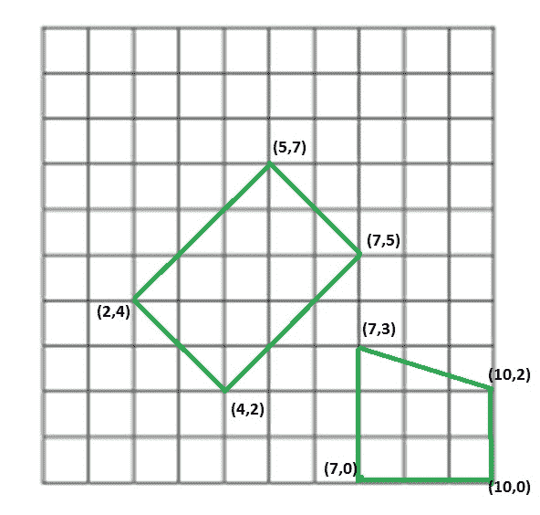

# 检查四段是否形成矩形

> 原文:[https://www . geesforgeks . org/check-四段-表单-矩形/](https://www.geeksforgeeks.org/check-four-segments-form-rectangle/)

给我们四个线段作为它们端点的一对坐标。我们需要知道这四条线段是否构成一个矩形。
示例:

```
Input : segments[] =  [(4, 2), (7, 5),
                       (2, 4), (4, 2),
                       (2, 4), (5, 7),
                       (5, 7), (7, 5)]
Output : Yes
Given these segment make a rectangle of length 3X2.

Input : segment[] = [(7, 0), (10, 0),
                     (7, 0), (7, 3),
                     (7, 3), (10, 2),
                     (10, 2), (10, 0)]
Output : Not
These segments do not make a rectangle.

Above examples are shown in below diagram.
 

```

这个问题主要是[如何检查给定的四个点是否构成正方形](https://www.geeksforgeeks.org/check-given-four-points-form-square/)的延伸

我们可以利用矩形的性质来解决这个问题。首先，我们检查线段的总唯一端点，如果这些点的计数不等于 4，那么线段就不能构成矩形。然后我们检查所有点对之间的距离，最多应该有 3 个不同的距离，一个用于对角线，两个用于边，最后我们将检查这三个距离之间的关系，对于组成矩形的线段，这些距离应该满足毕达哥拉斯关系，因为矩形的边和对角线组成直角三角形。如果它们满足上述条件，那么我们将把由线段构成的多边形标记为矩形，否则不标记。

```
// C++ program to check whether it is possible 
// to make a rectangle from 4 segments 
#include <bits/stdc++.h> 
using namespace std; 
#define N 4 

// structure to represent a segment 
struct Segment 
{ 
    int ax, ay; 
    int bx, by; 
}; 

// Utility method to return square of distance 
// between two points 
int getDis(pair<int, int> a, pair<int, int> b) 
{ 
    return (a.first - b.first)*(a.first - b.first) + 
        (a.second - b.second)*(a.second - b.second); 
} 

// method returns true if line Segments make 
// a rectangle 
bool isPossibleRectangle(Segment segments[]) 
{ 
    set< pair<int, int> > st; 

    // putiing all end points in a set to 
    // count total unique points 
    for (int i = 0; i < N; i++) 
    { 
        st.insert(make_pair(segments[i].ax, segments[i].ay)); 
        st.insert(make_pair(segments[i].bx, segments[i].by)); 
    } 

    // If total unique points are not 4, then 
    // they can't make a rectangle 
    if (st.size() != 4) 
        return false; 

    // dist will store unique 'square of distances' 
    set<int> dist; 

    // calculating distance between all pair of 
    // end points of line segments 
    for (auto it1=st.begin(); it1!=st.end(); it1++) 
        for (auto it2=st.begin(); it2!=st.end(); it2++) 
            if (*it1 != *it2) 
                dist.insert(getDis(*it1, *it2)); 

    // if total unique distance are more than 3, 
    // then line segment can't make a rectangle 
    if (dist.size() > 3) 
        return false; 

    // copying distance into array. Note that set maintains 
    // sorted order. 
    int distance[3]; 
    int i = 0; 
    for (auto it = dist.begin(); it != dist.end(); it++) 
        distance[i++] = *it; 

    // If line seqments form a square 
    if (dist.size() == 2) 
    return (2*distance[0] == distance[1]); 

    // distance of sides should satisfy pythagorean 
    // theorem 
    return (distance[0] + distance[1] == distance[2]); 
} 

// Driver code to test above methods 
int main() 
{ 
    Segment segments[] = 
    { 
        {4, 2, 7, 5}, 
        {2, 4, 4, 2}, 
        {2, 4, 5, 7}, 
        {5, 7, 7, 5} 
    }; 

    (isPossibleRectangle(segments))?cout << "Yes\n":cout << "No\n"; 
} 
```

输出:

```
Yes

```

本文由 **[乌卡什·特里维迪](https://in.linkedin.com/in/utkarsh-trivedi-253069a7)** 供稿。如果你喜欢 GeeksforGeeks 并想投稿，你也可以使用[write.geeksforgeeks.org](http://www.write.geeksforgeeks.org)写一篇文章或者把你的文章邮寄到 review-team@geeksforgeeks.org。看到你的文章出现在极客博客主页上，帮助其他极客。

如果你发现任何不正确的地方，或者你想分享更多关于上面讨论的话题的信息，请写评论。