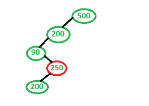
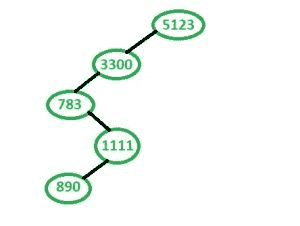

# 检查给定的数组大小 n 是否能代表 n 个级别的 BST

> 原文:[https://www . geeksforgeeks . org/check-given-size-n-can-present-BST-of-n-levels-or-not/](https://www.geeksforgeeks.org/check-given-array-of-size-n-can-represent-bst-of-n-levels-or-not/)

给定一个大小为 n 的数组，任务是找出数组是否可以表示一个有 n 个级别的 BST。
由于级别为 n，我们按照以下方式构建一棵树。
假设一个数字 X，

*   高于 X 的数字在右边
*   低于 X 的数字在左边。

***注意:在插入过程中，我们从不超出已经访问过的号码。***
**例:**

```
Input : 500, 200, 90, 250, 100
Output : No

Input : 5123, 3300, 783, 1111, 890
Output : Yes
```

**说明:**



对于序列 **500，200，90，250，100** 形成的树(上图)不能表示 BST。



序列 **5123，3300，783，1111，890** 形成一个二叉查找树，因此它是一个正确的序列。

**方法 1:通过构造 BST**
我们首先在一棵树中逐级插入所有数组值。为了插入，我们检查当前值是否小于前一值或大于前一值。在构建树之后，我们检查构建的[树是否是二叉查找树树。](https://www.geeksforgeeks.org/a-program-to-check-if-a-binary-tree-is-bst-or-not/)

## C++

```
// C++ program to Check given array
// can represent BST or not
#include <bits/stdc++.h>
using namespace std;

// structure for Binary Node
struct Node {
    int key;
    struct Node *right, *left;
};

Node* newNode(int num)
{
    Node* temp = new Node;
    temp->key = num;
    temp->left = NULL;
    temp->right = NULL;
    return temp;
}

// To create a Tree with n levels. We always
// insert new node to left if it is less than
// previous value.
Node* createNLevelTree(int arr[], int n)
{
    Node* root = newNode(arr[0]);
    Node* temp = root;
    for (int i = 1; i < n; i++) {
        if (temp->key > arr[i]) {
            temp->left = newNode(arr[i]);
            temp = temp->left;
        }
        else {
            temp->right = newNode(arr[i]);
            temp = temp->right;
        }
    }
    return root;
}

// Please refer below post for details of this
// function.
// https:// www.geeksforgeeks.org/a-program-to-check-if-a-binary-tree-is-bst-or-not/
bool isBST(Node* root, int min, int max)
{
    if (root == NULL)
        return true;

    if (root->key < min || root->key > max)
        return false;

    // Allow only distinct values
    return (isBST(root->left, min,
                  (root->key) - 1)
            && isBST(root->right,
                     (root->key) + 1, max));
}

// Returns tree if given array of size n can
// represent a BST of n levels.
bool canRepresentNLevelBST(int arr[], int n)
{
    Node* root = createNLevelTree(arr, n);
    return isBST(root, INT_MIN, INT_MAX);
}

// Driver code
int main()
{
    int arr[] = { 512, 330, 78, 11, 8 };
    int n = sizeof(arr) / sizeof(arr[0]);

    if (canRepresentNLevelBST(arr, n))
        cout << "Yes";
    else
        cout << "No";

    return 0;
}
```

## Java 语言(一种计算机语言，尤用于创建网站)

```
// Java program to Check given array
// can represent BST or not
class GFG
{

    // structure for Binary Node
    static class Node
    {
        int key;
        Node right, left;
    };

    static Node newNode(int num)
    {
        Node temp = new Node();
        temp.key = num;
        temp.left = null;
        temp.right = null;
        return temp;
    }

    // To create a Tree with n levels. We always
    // insert new node to left if it is less than
    // previous value.
    static Node createNLevelTree(int arr[], int n)
    {
        Node root = newNode(arr[0]);
        Node temp = root;
        for (int i = 1; i < n; i++)
        {
            if (temp.key > arr[i])
            {
                temp.left = newNode(arr[i]);
                temp = temp.left;
            }
            else
            {
                temp.right = newNode(arr[i]);
                temp = temp.right;
            }
        }
        return root;
    }

    // Please refer below post for details of this
    // function.
    // https:// www.geeksforgeeks.org/a-program-to-check-if-a-binary-tree-is-bst-or-not/
    static boolean isBST(Node root, int min, int max)
    {
        if (root == null)
        {
            return true;
        }

        if (root.key < min || root.key > max)
        {
            return false;
        }

        // Allow only distinct values
        return (isBST(root.left, min,
                (root.key) - 1)
                && isBST(root.right,
                        (root.key) + 1, max));
    }

    // Returns tree if given array of size n can
    // represent a BST of n levels.
    static boolean canRepresentNLevelBST(int arr[], int n)
    {
        Node root = createNLevelTree(arr, n);
        return isBST(root, Integer.MIN_VALUE, Integer.MAX_VALUE);
    }

    // Driver code
    public static void main(String[] args)
    {
        int arr[] = {512, 330, 78, 11, 8};
        int n = arr.length;

        if (canRepresentNLevelBST(arr, n))
        {
            System.out.println("Yes");
        }
        else
        {
            System.out.println("No");
        }
    }
}

/* This code contributed by PrinciRaj1992 */
```

## 计算机编程语言

```
# Python program to Check given array
# can represent BST or not

# A binary tree node has data,
# left child and right child
class newNode():

    def __init__(self, data):
        self.key = data
        self.left = None
        self.right = None

# To create a Tree with n levels. We always
# insert new node to left if it is less than
# previous value.
def createNLevelTree(arr, n):
    root = newNode(arr[0])
    temp = root
    for i in range(1, n):
        if (temp.key > arr[i]):
            temp.left = newNode(arr[i])
            temp = temp.left
        else:
            temp.right = newNode(arr[i])
            temp = temp.right

    return root

# Please refer below post for details of this
# function.
# https:# www.geeksforgeeks.org/a-program-to-check-if-a-binary-tree-is-bst-or-not/
def isBST(root, min, max):

    if (root == None):
        return True

    if (root.key < min or root.key > max):
        return False

    # Allow only distinct values
    return (isBST(root.left, min, (root.key) - 1) and
            isBST(root.right,(root.key) + 1, max))

# Returns tree if given array of size n can
# represent a BST of n levels.
def canRepresentNLevelBST(arr, n):

    root = createNLevelTree(arr, n)
    return isBST(root, 0, 2**32)

# Driver code
arr = [512, 330, 78, 11, 8]
n = len(arr)

if (canRepresentNLevelBST(arr, n)):
    print("Yes")
else:
    print("No")

# This code is contributed by SHUBHAMSINGH10
```

## C#

```
// C# program to Check given array
// can represent BST or not
using System;

class GFG
{

    // structure for Binary Node
    public class Node
    {
        public int key;
        public Node right, left;
    };

    static Node newNode(int num)
    {
        Node temp = new Node();
        temp.key = num;
        temp.left = null;
        temp.right = null;
        return temp;
    }

    // To create a Tree with n levels. We always
    // insert new node to left if it is less than
    // previous value.
    static Node createNLevelTree(int []arr, int n)
    {
        Node root = newNode(arr[0]);
        Node temp = root;
        for (int i = 1; i < n; i++)
        {
            if (temp.key > arr[i])
            {
                temp.left = newNode(arr[i]);
                temp = temp.left;
            }
            else
            {
                temp.right = newNode(arr[i]);
                temp = temp.right;
            }
        }
        return root;
    }

    // Please refer below post for details of this
    // function.
    // https:// www.geeksforgeeks.org/a-program-to-check-if-a-binary-tree-is-bst-or-not/
    static bool isBST(Node root, int min, int max)
    {
        if (root == null)
        {
            return true;
        }

        if (root.key < min || root.key > max)
        {
            return false;
        }

        // Allow only distinct values
        return (isBST(root.left, min,
                (root.key) - 1) &&
                isBST(root.right,
                (root.key) + 1, max));
    }

    // Returns tree if given array of size n can
    // represent a BST of n levels.
    static bool canRepresentNLevelBST(int []arr, int n)
    {
        Node root = createNLevelTree(arr, n);
        return isBST(root, int.MinValue, int.MaxValue);
    }

    // Driver code
    public static void Main(String[] args)
    {
        int []arr = {512, 330, 78, 11, 8};
        int n = arr.Length;

        if (canRepresentNLevelBST(arr, n))
        {
            Console.WriteLine("Yes");
        }
        else
        {
            Console.WriteLine("No");
        }
    }
}

// This code contributed by Rajput-Ji
```

## java 描述语言

```
<script>

// JavaScript program to Check given array
// can represent BST or not
// structure for Binary Node
class Node
{
  constructor()
  {
    this.key = 0;
    this.left = null;
    this.right = null;
  }
};

function newNode(num)
{
    var temp = new Node();
    temp.key = num;
    temp.left = null;
    temp.right = null;
    return temp;
}

// To create a Tree with n levels. We always
// insert new node to left if it is less than
// previous value.
function createNLevelTree(arr, n)
{
    var root = newNode(arr[0]);
    var temp = root;
    for(var i = 1; i < n; i++)
    {
        if (temp.key > arr[i])
        {
            temp.left = newNode(arr[i]);
            temp = temp.left;
        }
        else
        {
            temp.right = newNode(arr[i]);
            temp = temp.right;
        }
    }
    return root;
}
// Please refer below post for details of this
// function.

/*
https:// www.geeksforgeeks.org/a-program-to-
check-if-a-binary-tree-is-bst-or-not/
*/

function isBST(root, min, max)
{
    if (root == null)
    {
        return true;
    }
    if (root.key < min || root.key > max)
    {
        return false;
    }
    // Allow only distinct values
    return (isBST(root.left, min,
            (root.key) - 1) &&
            isBST(root.right,
            (root.key) + 1, max));
}
// Returns tree if given array of size n can
// represent a BST of n levels.
function canRepresentNLevelBST(arr, n)
{
    var root = createNLevelTree(arr, n);
    return isBST(root, -1000000000, 1000000000);
}
// Driver code
var arr = [512, 330, 78, 11, 8];
var n = arr.length;
if (canRepresentNLevelBST(arr, n))
{
    document.write("Yes");
}
else
{
    document.write("No");
}

</script>
```

**Output:** 

```
Yes
```

**方法 2(基于数组)**
1。取两个变量 max = INT_MAX 标记左子树的最大限制，min = INT_MIN 标记右子树的最小限制。
2。从 arr[1]循环到 arr[n-1]
3。对于每个元素，检查
a .如果(arr[I]>arr[I-1]&&arr[I]>min&&arr[I]<max)，更新 min = arr[i-1]
b .否则如果(arr[I]min&&arr[I]<max)，更新 max = arr[i]
c .如果以上两个条件都不成立，则元素不会插入 a

## C++

```
// C++ program to Check given array
// can represent BST or not
#include <bits/stdc++.h>
using namespace std;

// Driver code
int main()
{
    int arr[] = { 5123, 3300, 783, 1111, 890 };
    int n = sizeof(arr) / sizeof(arr[0]);
    int max = INT_MAX;
    int min = INT_MIN;
    bool flag = true;

    for (int i = 1; i < n; i++) {

        // This element can be inserted to the right
        // of the previous element, only if it is greater
        // than the previous element and in the range.
        if (arr[i] > arr[i - 1] && arr[i] > min && arr[i] < max) {
            // max remains same, update min
            min = arr[i - 1];
        }
        // This element can be inserted to the left
        // of the previous element, only if it is lesser
        // than the previous element and in the range.
        else if (arr[i] < arr[i - 1] && arr[i] > min && arr[i] < max) {
            // min remains same, update max
            max = arr[i - 1];
        }
        else {
            flag = false;
            break;
        }
    }

    if (flag) {
        cout << "Yes";
    }
    else {
        // if the loop completed successfully without encountering else condition
        cout << "No";
    }

    return 0;
}
```

## Java 语言(一种计算机语言，尤用于创建网站)

```
// Java program to Check given array
// can represent BST or not
class Solution
{

// Driver code
public static void main(String args[])
{
    int arr[] = { 5123, 3300, 783, 1111, 890 };
    int n = arr.length;
    int max = Integer.MAX_VALUE;
    int min = Integer.MIN_VALUE;
    boolean flag = true;

    for (int i = 1; i < n; i++) {

        // This element can be inserted to the right
        // of the previous element, only if it is greater
        // than the previous element and in the range.
        if (arr[i] > arr[i - 1] && arr[i] > min && arr[i] < max) {
            // max remains same, update min
            min = arr[i - 1];
        }
        // This element can be inserted to the left
        // of the previous element, only if it is lesser
        // than the previous element and in the range.
        else if (arr[i] < arr[i - 1] && arr[i] > min && arr[i] < max) {
            // min remains same, update max
            max = arr[i - 1];
        }
        else {
            flag = false;
            break;
        }
    }

    if (flag) {
        System.out.println("Yes");
    }
    else {
        // if the loop completed successfully without encountering else condition
        System.out.println("No");
    }

}
}
//contributed by Arnab Kundu
```

## 蟒蛇 3

```
# Python3 program to Check given array
# can represent BST or not

# Driver Code
if __name__ == '__main__':
    arr = [5123, 3300, 783, 1111, 890]
    n = len(arr)
    max = 2147483647 # INT_MAX
    min = -2147483648 # INT_MIN
    flag = True

    for i in range(1,n):

        # This element can be inserted to the
        # right of the previous element, only
        # if it is greater than the previous
        # element and in the range.
        if (arr[i] > arr[i - 1] and
            arr[i] > min and arr[i] < max):

            # max remains same, update min
            min = arr[i - 1]

        # This element can be inserted to the
        # left of the previous element, only
        # if it is lesser than the previous
        # element and in the range.
        elif (arr[i] < arr[i - 1] and
              arr[i] > min and arr[i] < max):

            # min remains same, update max
            max = arr[i - 1]

        else :
            flag = False
            break

    if (flag):
        print("Yes")

    else:

        # if the loop completed successfully
        # without encountering else condition
        print("No")

# This code is contributed
# by SHUBHAMSINGH10
```

## C#

```
using System;

// C#  program to Check given array 
// can represent BST or not 
public class Solution
{

// Driver code 
public static void Main(string[] args)
{
    int[] arr = new int[] {5123, 3300, 783, 1111, 890};
    int n = arr.Length;
    int max = int.MaxValue;
    int min = int.MinValue;
    bool flag = true;

    for (int i = 1; i < n; i++)
    {

        // This element can be inserted to the right 
        // of the previous element, only if it is greater 
        // than the previous element and in the range. 
        if (arr[i] > arr[i - 1] && arr[i] > min && arr[i] < max)
        {
            // max remains same, update min 
            min = arr[i - 1];
        }
        // This element can be inserted to the left 
        // of the previous element, only if it is lesser 
        // than the previous element and in the range. 
        else if (arr[i] < arr[i - 1] && arr[i] > min && arr[i] < max)
        {
            // min remains same, update max 
            max = arr[i - 1];
        }
        else
        {
            flag = false;
            break;
        }
    }

    if (flag)
    {
        Console.WriteLine("Yes");
    }
    else
    {
        // if the loop completed successfully without encountering else condition 
        Console.WriteLine("No");
    }

}
}

 //  This code is contributed by Shrikant13
```

## java 描述语言

```
<script>
    // Javascript program to Check given array
    // can represent BST or not
    let arr = [ 5123, 3300, 783, 1111, 890 ];
    let n = arr.length;
    let max = Number.MAX_VALUE;
    let min = Number.MIN_VALUE;
    let flag = true;

    for (let i = 1; i < n; i++)
    {

        // This element can be inserted to the right
        // of the previous element, only if it is greater
        // than the previous element and in the range.
        if (arr[i] > arr[i - 1] && arr[i] > min && arr[i] < max)
        {

            // max remains same, update min
            min = arr[i - 1];
        }

        // This element can be inserted to the left
        // of the previous element, only if it is lesser
        // than the previous element and in the range.
        else if (arr[i] < arr[i - 1] && arr[i] > min && arr[i] < max)
        {

            // min remains same, update max
            max = arr[i - 1];
        }
        else {
            flag = false;
            break;
        }
    }

    if (flag)
    {
        document.write("Yes");
    }
    else
    {

        // if the loop completed successfully without encountering else condition
        document.write("No");
    }

// This code is contributed by divyesh072019.
</script>
```

**Output:** 

```
Yes
```