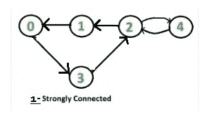
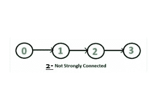

# 检查给定的有向图是否强连通|集合 2(使用 BFS 的 Kosaraju)

> 原文:[https://www . geesforgeks . org/check-给定-有向图-强连通-集-2-kosaraju-using-bfs/](https://www.geeksforgeeks.org/check-given-directed-graph-strongly-connected-set-2-kosaraju-using-bfs/)

给定一个有向图，找出该图是否强连通。如果任意两对顶点之间有一条路径，则有向图是强连通的。检查有向图连通性的方法有很多种，但优化方法之一是 [Kosaraju 的基于 DFS 的简单算法](https://www.geeksforgeeks.org/connectivity-in-a-directed-graph/)。

Kosaraju 的基于 BFS 的简单算法也和基于 DFS 的算法原理相同。

```
Following is Kosaraju’s BFS based simple algorithm
that does two BFS traversals of graph:
1) Initialize all vertices as not visited.

2) Do a BFS traversal of graph starting from 
   any arbitrary vertex v. If BFS traversal 
   doesn’t visit all vertices, then return false.

3) Reverse all edges (or find transpose or reverse 
   of graph)

4) Mark all vertices as not visited in reversed graph.

5) Again do a BFS traversal of reversed graph starting
   from same vertex v (Same as step 2). If BFS traversal
   doesn’t visit all vertices, then return false. 
   Otherwise, return true.
```

这个想法也很简单，如果每个节点都可以从一个顶点 v 到达，并且每个节点都可以到达同一个顶点 v，那么这个图就是强连通的。在第二步中，我们检查是否所有的顶点都可以从 v 到达。在第五步中，我们检查是否所有的顶点都可以到达 v(在反图中，如果所有的顶点都可以从 v 到达，那么在原始图中所有的顶点都可以到达 v)。

**举例说明:**

**例 1 :**
给出了一个有向图，检查它是否强连通。


第一步:从顶点 2 开始，BFS 得到的是 2 3 4 0 1
第二步:反转给定的图后，我们得到列出的图。



第三步:再次从顶点 2 开始，BFS 是 2 1 4 0 3
第四步:两种情况下都没有顶点(第一步&第三步)保持不可见。
第五步:那么，给定的图是强连通的。

**例 2 :**
给出一个有向图，检查它是否强连通。



第一步:从顶点 2 开始，BFS 得到的是 2 3 4
第二步:反转给定的图后，我们得到列出的图。


第三步:再次从顶点 2 开始，BFS 是 2 1 0
第四步:原始图中的顶点 0，1 和反向图中的 3，4 保持不可见。
第五步:所以，给定的图不是强连通的。

下面是上述算法的实现。

## C++

```
// C++ program to check if a given directed graph
// is strongly connected or not with BFS use
#include <bits/stdc++.h>
using namespace std;

class Graph
{
    int V;    // No. of vertices
    list<int> *adj;    // An array of adjacency lists

    // A recursive function to print DFS starting from v
    void BFSUtil(int v, bool visited[]);
public:

    // Constructor and Destructor
    Graph(int V) { this->V = V;  adj = new list<int>[V];}
    ~Graph() { delete [] adj; }

    // Method to add an edge
    void addEdge(int v, int w);

    // The main function that returns true if the
    // graph is strongly connected, otherwise false
    bool isSC();

    // Function that returns reverse (or transpose)
    // of this graph
    Graph getTranspose();
};

// A recursive function to print DFS starting from v
void Graph::BFSUtil(int v, bool visited[])
{
    // Create a queue for BFS
    list<int> queue;

    // Mark the current node as visited and enqueue it
    visited[v] = true;
    queue.push_back(v);

    // 'i' will be used to get all adjacent vertices
    // of a vertex
    list<int>::iterator i;

    while (!queue.empty())
    {
        // Dequeue a vertex from queue
        v = queue.front();
        queue.pop_front();

        // Get all adjacent vertices of the dequeued vertex s
        // If a adjacent has not been visited, then mark it
        // visited and enqueue it
        for (i = adj[v].begin(); i != adj[v].end(); ++i)
        {
            if (!visited[*i])
            {
                visited[*i] = true;
                queue.push_back(*i);
            }
        }
    }
}

// Function that returns reverse (or transpose) of this graph
Graph Graph::getTranspose()
{
    Graph g(V);
    for (int v = 0; v < V; v++)
    {
        // Recur for all the vertices adjacent to this vertex
        list<int>::iterator i;
        for (i = adj[v].begin(); i != adj[v].end(); ++i)
            g.adj[*i].push_back(v);
    }
    return g;
}

void Graph::addEdge(int v, int w)
{
    adj[v].push_back(w); // Add w to v’s list.
}

// The main function that returns true if graph
// is strongly connected
bool Graph::isSC()
{
    // St1p 1: Mark all the vertices as not
    // visited (For first BFS)
    bool visited[V];
    for (int i = 0; i < V; i++)
        visited[i] = false;

    // Step 2: Do BFS traversal starting
    // from first vertex.
    BFSUtil(0, visited);

    // If BFS traversal doesn’t visit all
    // vertices, then return false.
    for (int i = 0; i < V; i++)
        if (visited[i] == false)
             return false;

    // Step 3: Create a reversed graph
    Graph gr = getTranspose();

    // Step 4: Mark all the vertices as not
    // visited (For second BFS)
    for(int i = 0; i < V; i++)
        visited[i] = false;

    // Step 5: Do BFS for reversed graph
    // starting from first vertex.
    // Starting Vertex must be same starting
    // point of first DFS
    gr.BFSUtil(0, visited);

    // If all vertices are not visited in
    // second DFS, then return false
    for (int i = 0; i < V; i++)
        if (visited[i] == false)
             return false;

    return true;
}

// Driver program to test above functions
int main()
{
    // Create graphs given in the above diagrams
    Graph g1(5);
    g1.addEdge(0, 1);
    g1.addEdge(1, 2);
    g1.addEdge(2, 3);
    g1.addEdge(3, 0);
    g1.addEdge(2, 4);
    g1.addEdge(4, 2);
    g1.isSC()? cout << "Yes\n" : cout << "No\n";

    Graph g2(4);
    g2.addEdge(0, 1);
    g2.addEdge(1, 2);
    g2.addEdge(2, 3);
    g2.isSC()? cout << "Yes\n" : cout << "No\n";

    return 0;
}
```

## 蟒蛇 3

```
# Python3 program to check if a given directed graph
# is strongly connected or not with BFS use
from collections import deque

# A recursive function to prDFS starting from v
def BFSUtil(adj, v, visited):

    # Create a queue for BFS
    queue = deque()

    # Mark the current node as visited
    # and enqueue it
    visited[v] = True
    queue.append(v)

    # 'i' will be used to get all adjacent
    # vertices of a vertex
    while (len(queue) > 0):

        # Dequeue a vertex from queue
        v = queue.popleft()
        #print(v)
        #queue.pop_front()

        # Get all adjacent vertices of the
        # dequeued vertex s. If a adjacent
        # has not been visited, then mark it
        # visited and enqueue it
        for i in adj[v]:
            if (visited[i] == False):
                visited[i] = True
                queue.append(i)

    return visited

# Function that returns reverse
# (or transpose) of this graph
def getTranspose(adj, V):

    g = [[] for i in range(V)]

    for v in range(V):

        # Recur for all the vertices adjacent to
        # this vertex
        # list<int>::iterator i
        for i in adj[v]:
            g[i].append(v)

    return g

def addEdge(adj, v, w):

    # Add w to v’s list.
    adj[v].append(w)
    return adj

# The main function that returns True if graph
# is strongly connected
def isSC(adj, V):

    # St1p 1: Mark all the vertices as not
    # visited (For first BFS)
    visited = [False]*V

    # Step 2: Do BFS traversal starting
    # from first vertex.
    visited = BFSUtil(adj, 0, visited)
    # print(visited)

    # If BFS traversal doesn’t visit all
    # vertices, then return false.
    for i in range(V):
        if (visited[i] == False):
             return False

    # Step 3: Create a reversed graph
    adj = getTranspose(adj, V)

    # Step 4: Mark all the vertices as not
    # visited (For second BFS)
    for i in range(V):
        visited[i] = False

    # Step 5: Do BFS for reversed graph
    # starting from first vertex.
    # Starting Vertex must be same starting
    # point of first DFS
    visited = BFSUtil(adj, 0, visited)

    # If all vertices are not visited in
    # second DFS, then return false
    for i in range(V):
        if (visited[i] == False):
             return False

    return True

# Driver code
if __name__ == '__main__':

    # Create graphs given in the above diagrams
    g1 = [[] for i in range(5)]
    g1 = addEdge(g1, 0, 1)
    g1 = addEdge(g1, 1, 2)
    g1 = addEdge(g1, 2, 3)
    g1 = addEdge(g1, 3, 0)
    g1 = addEdge(g1, 2, 4)
    g1 = addEdge(g1, 4, 2)
    #print(g1)

    print("Yes" if isSC(g1, 5) else "No")

    g2 = [[] for i in range(4)]

    g2 = addEdge(g2, 0, 1)
    g2 = addEdge(g2, 1, 2)
    g2 = addEdge(g2, 2, 3)

    print("Yes" if isSC(g2, 4) else "No")

# This code is contributed by mohit kumar 29
```

**输出:**

```
Yes
No
```

**时间复杂度:**上述实现的时间复杂度与广度优先搜索相同，如果使用邻接矩阵表示来表示图，则广度优先搜索为 O(V+E)。

**还能进一步提高吗？**
上述方法需要两次遍历图形。我们可以通过使用[塔尔扬寻找强连通分支的算法](https://www.geeksforgeeks.org/tarjan-algorithm-find-strongly-connected-components/)，在一次遍历中找到一个图是否强连通。
本文由[**Shivam prad Han(anuj _ charm)**](https://www.facebook.com/anuj.charm)供稿。如果你喜欢 GeeksforGeeks 并想投稿，你也可以使用[write.geeksforgeeks.org](https://write.geeksforgeeks.org)写一篇文章或者把你的文章邮寄到 review-team@geeksforgeeks.org。看到你的文章出现在极客博客主页上，帮助其他极客。
如果发现有不正确的地方，或者想分享更多关于上述话题的信息，请写评论。