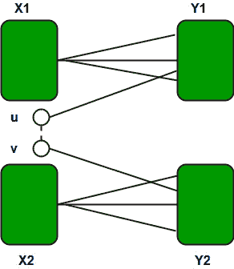
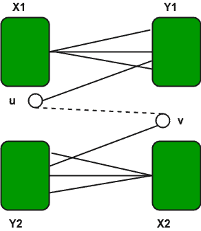

# 检查图形是否有奇数长度的循环

> 原文:[https://www . geesforgeks . org/check-graves-cycle-奇数-length/](https://www.geeksforgeeks.org/check-graphs-cycle-odd-length/)

给定一个图，任务是找出它是否有奇数长度的循环。


这个想法是基于一个重要的事实，即当且仅当一个图是[二部图](https://www.geeksforgeeks.org/bipartite-graph/)时，它不包含奇数长度的循环，即它可以用两种颜色着色。
很明显，如果一个图有一个奇数长度的圈，那么它不可能是二部图。在二部图中，有两组顶点，使得一组中没有一个顶点与同一组中的任何其他顶点相连。对于奇数长度的循环，同一个集合的两个顶点必须是连通的，这与二部定义相矛盾。
让我们理解逆向，如果一个图没有奇循环，那么它一定是二部图。下面是基于归纳的证明，摘自[http://info host . NMT . edu/~ math/教员/赤脚/math 321 pring 98/bipartitegraphsandvencycles . html](http://infohost.nmt.edu/~math/faculty/barefoot/Math321Spring98/BipartiteGraphsAndEvenCycles.html)
假设(X，Y)是 *G* 的二部，让 *C = u <sub>1</sub>* ， *u <sub>2</sub>* ，.。。， *u <sub>k</sub>* 是 *G* 的循环，其中 *u <sub>1</sub>* 处于顶点集 X(缩写为 *u <sub>1</sub>* ∈ X)。如果*u<sub>1∑</sub>T36】X 那么*u<sub>2∑</sub>T40】Y，。。。而且，一般来说，*u<sub>2j+1∑</sub>T44】X 和*u<sub>2i∑</sub>T48】Y .既然 C 是一个循环，*u<sub>k∑</sub>T52】Y，这样 *k* 就= 2 *s* 为一些正整数*s*因此循环 *C
假设图 *G* 没有奇数循环。将会显示这样的图是二分的。证明是关于边数的归纳。对于一个最多只有一条边的图，这个断言显然是正确的。假设每一个没有奇数圈且最多有 *q 条*边的图都是二部图，让 *G* 是一个有 *q 条* + 1 条边且没有奇数圈的图。设 *e = uv* 为 *G* 的边，考虑图*H = G–uv。*通过归纳， *H* 有一个二分性(X，Y)。如果 *e* 一端在 *X* 另一端在 *Y* 那么( *X* ， *Y* )就是 *G* 的二分。因此，假设 *u* 和 *v* 在 *X* 中。如果在 *H* 中的 *u* 和 *v* 之间有一条路径 *P* ，那么 *P* 的长度将是偶数。因此， *P + uv* 将是 *G* 的奇数周期。因此， *u* 和 *v* 必须位于 *H* 的不同“片”或部件中。因此，我们有:****** 



其中 *X = X1 & X2* 和 *Y = Y1 ∪ Y2* 。在这种情况下，很明显( *X1 ∪ Y2，X2 ∪ Y1)* 是*g .*T8】的二分



因此我们得出结论，每个没有奇数圈的图都是二部图。可以构造一个二分图如下:
(1)选择任意一个顶点*X<sub>0</sub>T4【并设置*X<sub>0</sub>T8】= {*X<sub>0</sub>T12】}。
(2)让 *Y <sub>0</sub>* 为与 *x <sub>0</sub>* 相邻的所有顶点的集合，重复步骤 3-4。
(3)让 *X <sub>k</sub>* 成为与 *Y <sub>k-1</sub>* 的顶点相邻的未选择的顶点集。
(4)让 *Y <sub>k</sub>* 成为与 *X <sub>k-1</sub>* 的一个顶点相邻的未选择的顶点集合。
(5)如果 *G* 的所有顶点都已选择，则
*X = X<sub>0</sub>∪X<sub>1</sub>∪X<sub>2</sub>∪。。。*和*Y = Y<sub>0</sub>∪Y<sub>1</sub>∪Y<sub>2</sub>∪。。。*
下面是检查图形是否有奇数周期的代码。代码基本上检查图是否是 Bipartite。*** 

## C++

```
// C++ program to find out whether a given graph is
// Bipartite or not
#include <bits/stdc++.h>
#define V 4
using namespace std;

// This function returns true if graph G[V][V] contains
// odd cycle, else false
bool containsOdd(int G[][V], int src)
{
    // Create a color array to store colors assigned 
    // to all vertices. Vertex number is used as index 
    // in this array. The value '-1' of  colorArr[i] 
    // is used to indicate that no color is assigned to
    // vertex 'i'.  The value 1 is used to indicate first 
    // color is assigned and value 0 indicates second 
    // color is assigned.
    int colorArr[V];
    for (int i = 0; i < V; ++i)
        colorArr[i] = -1;

    // Assign first color to source
    colorArr[src] = 1;

    // Create a queue (FIFO) of vertex numbers and 
    // enqueue source vertex for BFS traversal
    queue <int> q;
    q.push(src);

    // Run while there are vertices in queue (Similar to BFS)
    while (!q.empty())
    {
        // Dequeue a vertex from queue 
        int u = q.front();
        q.pop();

        // Return true if there is a self-loop 
        if (G[u][u] == 1)
           return true;  

        // Find all non-colored adjacent vertices
        for (int v = 0; v < V; ++v)
        {
            // An edge from u to v exists and destination
            // v is not colored
            if (G[u][v] && colorArr[v] == -1)
            {
                // Assign alternate color to this adjacent
                // v of u
                colorArr[v] = 1 - colorArr[u];
                q.push(v);
            }

            // An edge from u to v exists and destination
            // v is colored with same color as u
            else if (G[u][v] && colorArr[v] == colorArr[u])
                return true;
        }
    }

    // If we reach here, then all adjacent 
    // vertices can be colored with alternate
    // color
    return false;
}

// Driver program to test above function
int main()
{
    int G[][V] = {{0, 1, 0, 1},
        {1, 0, 1, 0},
        {0, 1, 0, 1},
        {1, 0, 1, 0}
    };

    containsOdd(G, 0) ? cout << "Yes" : cout << "No";
    return 0;
}
```

## Java 语言(一种计算机语言，尤用于创建网站)

```
// JAVA Code For Check if a graphs has a cycle 
// of odd length
import java.util.*;

class GFG {

    public static int V =4;

    // This function returns true if graph G[V][V] 
    // contains odd cycle, else false
    public static boolean containsOdd(int G[][], int src)
    {
        // Create a color array to store colors assigned 
        // to all vertices. Vertex number is used as 
        // index in this array. The value '-1' of 
        // colorArr[i] is used to indicate that no color
        // is assigned to vertex 'i'.  The value 1 is 
        // used to indicate first color is assigned and
        // value 0 indicates second color is assigned.
        int colorArr[] = new int[V];
        for (int i = 0; i < V; ++i)
            colorArr[i] = -1;

        // Assign first color to source
        colorArr[src] = 1;

        // Create a queue (FIFO) of vertex numbers and 
        // enqueue source vertex for BFS traversal
        LinkedList<Integer> q = new LinkedList<Integer>();
        q.add(src);

        // Run while there are vertices in queue 
        // (Similar to BFS)
        while (!q.isEmpty())
        {
            // Dequeue a vertex from queue 
            int u = q.peek();
            q.pop();

            // Return true if there is a self-loop 
            if (G[u][u] == 1)
               return true;  

            // Find all non-colored adjacent vertices
            for (int v = 0; v < V; ++v)
            {
                // An edge from u to v exists and 
                // destination v is not colored
                if (G[u][v] == 1 && colorArr[v] == -1)
                {
                    // Assign alternate color to this 
                    // adjacent v of u
                    colorArr[v] = 1 - colorArr[u];
                    q.push(v);
                }

                // An edge from u to v exists and 
                // destination v is colored with same 
                // color as u
                else if (G[u][v] == 1 && colorArr[v] ==
                                          colorArr[u])
                    return true;
            }
        }

        // If we reach here, then all adjacent 
        // vertices can be colored with alternate
        // color
        return false;
    }

    /* Driver program to test above function */
    public static void main(String[] args) 
    {

        int G[][] = {{0, 1, 0, 1},
                     {1, 0, 1, 0},
                     {0, 1, 0, 1},
                     {1, 0, 1, 0}};

           if (containsOdd(G, 0))
               System.out.println("Yes") ;
            else
                   System.out.println("No");
    }
}

// This code is contributed by Arnav Kr. Mandal.
```

## 蟒蛇 3

```
# Python3 program to find out whether 
# a given graph is Bipartite or not 
import queue 

# This function returns true if graph 
# G[V][V] contains odd cycle, else false 
def containsOdd(G, src):
    global V

    # Create a color array to store 
    # colors assigned to all vertices.
    # Vertex number is used as index 
    # in this array. The value '-1' of  
    # colorArr[i] is used to indicate  
    # that no color is assigned to vertex
    # 'i'. The value 1 is used to indicate 
    # first color is assigned and value 0 
    # indicates second color is assigned. 
    colorArr = [-1] * V

    # Assign first color to source 
    colorArr[src] = 1

    # Create a queue (FIFO) of vertex 
    # numbers and enqueue source vertex 
    # for BFS traversal 
    q = queue.Queue()
    q.put(src) 

    # Run while there are vertices in
    # queue (Similar to BFS) 
    while (not q.empty()):

        # Dequeue a vertex from queue 
        u = q.get()

        # Return true if there is a self-loop 
        if (G[u][u] == 1): 
            return True

        # Find all non-colored adjacent vertices 
        for v in range(V):

            # An edge from u to v exists and 
            # destination v is not colored 
            if (G[u][v] and colorArr[v] == -1):

                # Assign alternate color to this 
                # adjacent v of u 
                colorArr[v] = 1 - colorArr[u] 
                q.put(v)

            # An edge from u to v exists and  
            # destination v is colored with 
            # same color as u 
            elif (G[u][v] and 
                  colorArr[v] == colorArr[u]): 
                return True

    # If we reach here, then all 
    # adjacent vertices can be 
    # colored with alternate color 
    return False

# Driver Code
V = 4
G = [[0, 1, 0, 1], 
     [1, 0, 1, 0], 
     [0, 1, 0, 1], 
     [1, 0, 1, 0]]

if containsOdd(G, 0):
    print("Yes")
else:
    print("No")

# This code is contributed by PranchalK
```

## C#

```
// C# Code For Check if a graphs has a cycle 
// of odd length 
using System;
using System.Collections.Generic;

class GFG 
{ 

    public static int V = 4; 

    // This function returns true if graph G[V,V] 
    // contains odd cycle, else false 
    public static bool containsOdd(int [,]G, int src) 
    { 
        // Create a color array to store colors assigned 
        // to all vertices. Vertex number is used as 
        // index in this array. The value '-1' of 
        // colorArr[i] is used to indicate that no color 
        // is assigned to vertex 'i'. The value 1 is 
        // used to indicate first color is assigned and 
        // value 0 indicates second color is assigned. 
        int []colorArr = new int[V]; 
        for (int i = 0; i < V; ++i) 
            colorArr[i] = -1; 

        // Assign first color to source 
        colorArr[src] = 1; 

        // Create a queue (FIFO) of vertex numbers and 
        // enqueue source vertex for BFS traversal 
        Queue<int> q = new Queue<int>(); 
        q.Enqueue(src); 

        // Run while there are vertices in queue 
        // (Similar to BFS) 
        while (q.Count != 0) 
        { 
            // Dequeue a vertex from queue 
            int u = q.Peek(); 
            q.Dequeue(); 

            // Return true if there is a self-loop 
            if (G[u, u] == 1) 
            return true; 

            // Find all non-colored adjacent vertices 
            for (int v = 0; v < V; ++v) 
            { 
                // An edge from u to v exists and 
                // destination v is not colored 
                if (G[u, v] == 1 && colorArr[v] == -1) 
                { 
                    // Assign alternate color to this 
                    // adjacent v of u 
                    colorArr[v] = 1 - colorArr[u]; 
                    q.Enqueue(v); 
                } 

                // An edge from u to v exists and 
                // destination v is colored with same 
                // color as u 
                else if (G[u,v] == 1 && colorArr[v] == 
                                        colorArr[u]) 
                    return true; 
            } 
        } 

        // If we reach here, then all adjacent 
        // vertices can be colored with alternate 
        // color 
        return false; 
    } 

    /* Driver code */
    public static void Main() 
    { 

        int [,]G = {{0, 1, 0, 1}, 
                    {1, 0, 1, 0}, 
                    {0, 1, 0, 1}, 
                    {1, 0, 1, 0}}; 

        if (containsOdd(G, 0)) 
            Console.WriteLine("Yes") ; 
            else
                Console.WriteLine("No"); 
    } 
} 

// This code has been contributed by 29AjayKumar
```

## java 描述语言

```
<script>

// JavaScript Code For Check if a graphs has a cycle 
// of odd length 

var V = 4; 

// This function returns true if graph G[V,V] 
// contains odd cycle, else false 
function containsOdd(G, src) 
{ 
    // Create a color array to store colors assigned 
    // to all vertices. Vertex number is used as 
    // index in this array. The value '-1' of 
    // colorArr[i] is used to indicate that no color 
    // is assigned to vertex 'i'. The value 1 is 
    // used to indicate first color is assigned and 
    // value 0 indicates second color is assigned. 
    var colorArr = Array(V).fill(-1); 

    // Assign first color to source 
    colorArr[src] = 1; 

    // Create a queue (FIFO) of vertex numbers and 
    // enqueue source vertex for BFS traversal 
    var q = []; 
    q.push(src); 

    // Run while there are vertices in queue 
    // (Similar to BFS) 
    while (q.length != 0) 
    { 
        // Dequeue a vertex from queue 
        var u = q[0]; 
        q.shift(); 

        // Return true if there is a self-loop 
        if (G[u][u] == 1) 
        return true; 

        // Find all non-colored adjacent vertices 
        for (var v = 0; v < V; ++v) 
        { 
            // An edge from u to v exists and 
            // destination v is not colored 
            if (G[u][v] == 1 && colorArr[v] == -1) 
            { 
                // Assign alternate color to this 
                // adjacent v of u 
                colorArr[v] = 1 - colorArr[u]; 
                q.push(v); 
            } 

            // An edge from u to v exists and 
            // destination v is colored with same 
            // color as u 
            else if (G[u][v] == 1 && colorArr[v] == 
                                    colorArr[u]) 
                return true; 
        } 
    } 

    // If we reach here, then all adjacent 
    // vertices can be colored with alternate 
    // color 
    return false; 
} 

/* Driver code */
var G = [[0, 1, 0, 1], 
            [1, 0, 1, 0], 
            [0, 1, 0, 1], 
            [1, 0, 1, 0]]; 

if (containsOdd(G, 0)) 
    document.write("Yes") ; 
else
    document.write("No"); 

</script>
```

**输出:**

```
No 
```

上述算法仅在图是强连通的情况下有效。我们可以扩展到图不是强连通的情况(详见[这个](https://www.geeksforgeeks.org/bipartite-graph/))。在上面的代码中，我们总是从源 0 开始，并假设从它访问顶点。一个重要的观察是没有边的图也是二部图。注意，二分条件说所有的边应该从一个集合到另一个集合。
本文由**卡尔蒂克**供稿。如果你喜欢 GeeksforGeeks 并想投稿，你也可以使用[write.geeksforgeeks.org](https://write.geeksforgeeks.org)写一篇文章或者把你的文章邮寄到 review-team@geeksforgeeks.org。看到你的文章出现在极客博客主页上，帮助其他极客。
如果发现有不正确的地方，或者想分享更多关于上述话题的信息，请写评论。