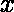

# 检查一个单元格在一个字符串中是否可以被访问多次

> 原文:[https://www . geeksforgeeks . org/check-if-a-cell-can-visit-in-string 多次/](https://www.geeksforgeeks.org/check-if-a-cell-can-be-visited-more-than-once-in-a-string/)

给定由“.”组成的字符串或者任何数字。一个“.”在字符串中表示单元格为空，如果任意单元格中有数字，则表示可以在字符串中向右或向左移动步。
任务是检查字符串中的任何单元格是否可以被多次访问。如果是，打印是，否则打印否
**示例** :

```
Input : str = ".2...2.."
Output: YES
The fourth cell can be visited twice. One way to reach 
the fourth cell is from 2nd cell by moving 2 steps to right
and another way to reach fourth cell is by moving 2 steps 
left from cell 6.

Input : str = ".2...1"
Output: NO
None of the cells in the given string 
can be visited more than once.
```

其思想是取一个数组**访问了【】**来记录字符串的第 I 个单元格可以被访问的次数。现在遍历字符串并检查当前字符是否为“.”或者一个数字。如果当前字符是“.”否则不要做任何事情，如果它是一个数字，则将[i-x，i+x]范围内的访问数组中的访问次数增加 1。
最后，遍历访问过的[]数组，检查是否有任何单元格被访问过不止一次。
以下是上述方法的实施:

## C++

```
// C++ program to check if any cell of the
// string can be visited more than once

#include <bits/stdc++.h>
using namespace std;

// Function to check if any cell can be
// visited more than once
bool checkIfOverlap(string str)
{
    int len = str.length();

    // Array to mark cells
    int visited[len + 1] = { 0 };

    // Traverse the string
    for (int i = 0; i < len; i++) {
        if (str[i] == '.')
            continue;

        // Increase the visit count of the left and right
        // cells within the array which can be visited
        for (int j = max(0, i - str[i]); j <= min(len, i + str[i]); j++)
            visited[j]++;
    }

    for (int i = 0; i < len; i++) {
        // If any cell can be visited more than once
        // Return True
        if (visited[i] > 1) {
            return true;
        }
    }

    return false;
}

// Driver code
int main()
{
    string str = ".2..2.";

    if (checkIfOverlap(str))
        cout << "YES";
    else
        cout << "NO";

    return 0;
}
```

## Java 语言(一种计算机语言，尤用于创建网站)

```
// Java program to check if any cell of the
// string can be visited more than once

import java.io.*;

class GFG {

// Function to check if any cell can be
// visited more than once
static boolean checkIfOverlap(String str)
{
    int len = str.length();

    // Array to mark cells
    int []visited =  new int[len +1];

    // Traverse the string
    for (int i = 0; i < len; i++) {
        if (str.charAt(i)== '.')
            continue;

        // Increase the visit count of the left and right
        // cells within the array which can be visited
        for (int j = Math.max(0, i - str.charAt(i)); j <= Math.min(len, i + str.charAt(i)); j++)
            visited[j]++;
    }

    for (int i = 0; i < len; i++) {
        // If any cell can be visited more than once
        // Return True
        if (visited[i] > 1) {
            return true;
        }
    }

    return false;
}

// Driver code

    public static void main (String[] args) {
        String str = ".2..2.";

    if (checkIfOverlap(str))
        System.out.println("YES");
    else
        System.out.print("NO");
    }
}

// This code is contributed by inder_verma..
```

## 蟒蛇 3

```
# Python3 program to check if
# any cell of the string can
# be visited more than once

# Function to check if any cell
# can be visited more than once
def checkIfOverlap(str) :

    length = len(str)

    # Array to mark cells
    visited = [0] * (length + 1)

    # Traverse the string
    for i in range(length) :
        if str[i] == "." :
            continue

        # Increase the visit count
        # of the left and right cells
        # within the array which can
        # be visited
        for j in range(max(0, i - ord(str[i]),
                       min(length, i +
                       ord(str[i])) + 1)) :
            visited[j] += 1

    # If any cell can be visited
    # more than once, Return True
    for i in range(length) :

        if visited[i] > 1 :
            return True

    return False

# Driver code    
if __name__ == "__main__" :

    str = ".2..2."

    if checkIfOverlap(str) :
        print("YES")

    else :
        print("NO")

# This code is contributed
# by ANKITRAI1
```

## C#

```
// C# program to check if any
// cell of the string can be
// visited more than once
using System;

class GFG
{

// Function to check if any cell
// can be visited more than once
static bool checkIfOverlap(String str)
{
    int len = str.Length;

    // Array to mark cells
    int[] visited = new int[len + 1];

    // Traverse the string
    for (int i = 0; i < len; i++)
    {
        if (str[i]== '.')
            continue;

        // Increase the visit count of
        // the left and right cells
        // within the array which can be visited
        for (int j = Math.Max(0, i - str[i]);
                 j <= Math.Min(len, i + str[i]); j++)
            visited[j]++;
    }

    for (int i = 0; i < len; i++)
    {
        // If any cell can be visited
        // more than once, Return True
        if (visited[i] > 1)
        {
            return true;
        }
    }

    return false;
}

// Driver code
public static void Main ()
{
    String str = ".2..2.";

    if (checkIfOverlap(str))
        Console.Write("YES");
    else
        Console.Write("NO");
}
}

// This code is contributed
// by Akanksha Rai(Abby_akku)
```

## 服务器端编程语言（Professional Hypertext Preprocessor 的缩写）

```
<?php
// PHP program to check if any
// cell of the string can be
// visited more than once

// Function to check if any cell
// can be visited more than once
function checkIfOverlap($str)
{
    $len = strlen($str);

    // Array to mark cells
    $visited = array_fill(0, $len + 1, NULL);

    // Traverse the string
    for ($i = 0; $i < $len; $i++)
    {
        if ($str[$i] == '.')
            continue;

        // Increase the visit count of the
        // left and right cells within the
        // array which can be visited
        for ($j = max(0, $i - $str[$i]);
             $j <= min($len, $i + $str[$i]);
             $j++)
            $visited[$j]++;
    }

    for ($i = 0; $i < $len; $i++)
    {
        // If any cell can be visited
        // more than once, Return True
        if ($visited[$i] > 1)
        {
            return true;
        }
    }

    return false;
}

// Driver code
$str = ".2..2.";

if (checkIfOverlap($str))
    echo "YES";
else
    echo "NO";

// This code is contributed
// by ChitraNayal
?>
```

## java 描述语言

```
<script>

// JavaScript program to check if any cell of the
// string can be visited more than once

    // Function to check if any cell can be
// visited more than once
    function checkIfOverlap(str)
    {
        let len = str.length;

    // Array to mark cells
    let visited =  new Array(len +1);
      for(let i=0;i<visited.length;i++)
    {
        visited[i]=0;
    }

    // Traverse the string
    for (let i = 0; i < len; i++) {
        if (str[i]== '.')
            continue;

        // Increase the visit count of the left and right
        // cells within the array which can be visited
        for (let j = Math.max(0, i - str[i]);
        j <= Math.min(len, i + str[i]); j++)
            visited[j]++;
    }

    for (let i = 0; i < len; i++) {
        // If any cell can be visited more than once
        // Return True
        if (visited[i] > 1) {
            return true;
        }
    }

    return false;
    }

    // Driver code
    let str = ".2..2.";

    if (checkIfOverlap(str))
        document.write("YES");
    else
        document.write("NO");

// This code is contributed by rag2127

</script>
```

**Output:** 

```
YES
```