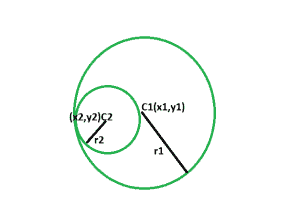
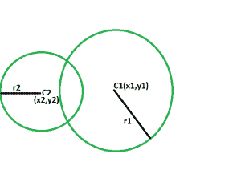

# 检查一个圆是否位于另一个圆内

> 原文:[https://www . geeksforgeeks . org/check-如果一个圆位于另一个圆之内-或者不位于该圆之内/](https://www.geeksforgeeks.org/check-if-a-circle-lies-inside-another-circle-or-not/)

给定两个圆，给定半径和圆心。任务是检查小圆是否位于大圆内。

**示例:**

```
Input: x1 = 10, y1 = 8, x2 = 1, y2 = 2, r1 = 30, r2 = 10 
Output: The smaller circle lies completely inside
 the bigger circle without touching each other
 at a point of circumference. 

Input :x1 = 7, y1 = 8;x2 = 3, y2 = 5;r1 = 30, r2 = 25
Output :The smaller circle lies completely inside
 the bigger circle with touching each other
 at a point of circumference.
```

**接近** :
这里可以来三个病例，


*   较小的圆完全位于较大的圆内，在圆周的某一点上彼此不接触。
    如果出现这种情况，中心与小半径的距离之和小于大半径，那么显然小圆完全位于圆内，不接触圆周。



*   较小的圆完全位于较大的圆内，在圆周的一点上相互接触。如果发生这种情况，中心和较小半径之间的距离之和等于较大半径，那么显然较小的圆完全位于圆内，并接触圆周。



*   较小的不完全位于较大的圆内。如果发生这种情况，那么圆心和小半径之间的距离之和大于大半径，那么显然小圆并不完全位于圆内。

下面是上述方法的实现:

## 卡片打印处理机（Card Print Processor 的缩写）

```
// C++ program to check if one circle
// lies inside another circle or not.

#include <bits/stdc++.h>
using namespace std;

void circle(int x1, int y1, int x2,
            int y2, int r1, int r2)
{
    int distSq = sqrt(((x1 - x2)
                       * (x1 - x2))
                      + ((y1 - y2)
                         * (y1 - y2)));

    if (distSq + r2 == r1)
        cout << "The smaller circle lies completely"
             << " inside the bigger circle with "
             << "touching each other "
             << "at a point of circumference. "
             << endl;
    else if (distSq + r2 < r1)
        cout << "The smaller circle lies completely"
             << " inside the bigger circle without"
             << " touching each other "
             << "at a point of circumference. "
             << endl;
    else
        cout << "The smaller does not lies inside"
             << " the bigger circle completely."
             << endl;
}

// Driver code
int main()
{
    int x1 = 10, y1 = 8;
    int x2 = 1, y2 = 2;
    int r1 = 30, r2 = 10;
    circle(x1, y1, x2, y2, r1, r2);

    return 0;
}
```

## Java 语言(一种计算机语言，尤用于创建网站)

```
// Java program to check if one circle 
// lies inside another circle or not. 
import java.io.*;

class GFG 
{

    static void circle(int x1, int y1, int x2, 
                int y2, int r1, int r2) 
    { 
        int distSq = (int)Math.sqrt(((x1 - x2) 
                                    * (x1 - x2)) 
                                    + ((y1 - y2) 
                                    * (y1 - y2))); 

        if (distSq + r2 == r1) 
        {
            System.out.println("The smaller circle lies completely"
                + " inside the bigger circle with "
                + "touching each other "
                + "at a point of circumference. ") ;
        }

        else if (distSq + r2 < r1) 
        {
            System.out.println("The smaller circle lies completely"
                + " inside the bigger circle without"
                + " touching each other "
                + "at a point of circumference.") ;
        }

        else
        {
            System.out.println("The smaller does not lies inside"
                + " the bigger circle completely.") ;
        }

    } 

    // Driver code 
    public static void main (String[] args) 
    {
        int x1 = 10, y1 = 8; 
        int x2 = 1, y2 = 2; 
        int r1 = 30, r2 = 10; 
        circle(x1, y1, x2, y2, r1, r2); 
    }
}

// This code is contributed by ajit_00023.
```

## 计算机编程语言

```
# Python3 program to check if one circle
# lies inside another circle or not.

def circle(x1, y1, x2,y2, r1, r2):

    distSq = (((x1 - x2)* (x1 - x2))+ ((y1 - y2)* (y1 - y2)))**(.5)

    if (distSq + r2 == r1):
        print("The smaller circle lies completely"
            " inside the bigger circle with "
            "touching each other "
            "at a point of circumference. ")
    elif (distSq + r2 < r1):
        print("The smaller circle lies completely"
            " inside the bigger circle without"
            " touching each other "
            "at a point of circumference. ")
    else:
        print("The smaller does not lies inside"
            " the bigger circle completely.")

# Driver code
x1 ,y1 = 10,8
x2 ,y2 = 1, 2
r1 ,r2 = 30,10
circle(x1, y1, x2, y2, r1, r2)

# This code is contributed by mohit kumar 29
```

## C#

```
// C# program to check if one circle 
// lies inside another circle or not. 
using System;

class GFG
{

    static void circle(int x1, int y1, int x2, 
                int y2, int r1, int r2) 
    { 
        int distSq = (int)Math.Sqrt(((x1 - x2) 
                        * (x1 - x2)) 
                        + ((y1 - y2) 
                            * (y1 - y2))); 

        if (distSq + r2 == r1) 
        {
            Console.WriteLine("The smaller circle lies completely"
                + " inside the bigger circle with "
                + "touching each other "
                + "at a point of circumference. ") ;
        }

        else if (distSq + r2 < r1) 
        {
            Console.WriteLine("The smaller circle lies completely"
                + " inside the bigger circle without"
                + " touching each other "
                + "at a point of circumference.") ;
        }

        else
        {
            Console.WriteLine("The smaller does not lies inside"
                + " the bigger circle completely.") ;
        }

    } 

    // Driver code 
    static public void Main ()
    {
        int x1 = 10, y1 = 8; 
        int x2 = 1, y2 = 2; 
        int r1 = 30, r2 = 10; 
        circle(x1, y1, x2, y2, r1, r2); 
    }
}

// This code is contributed by AnkitRai01
```

服务器端编程语言（Professional Hypertext Preprocessor 的缩写）

```
 <?php
// PHP program to check if one circle
// lies inside another circle or not.

function circle($x1, $y1, $x2,
            $y2, $r1, $r2)
{
    $distSq = sqrt((($x1 - $x2)
                    * ($x1 - $x2))
                    + (($y1 - $y2)
                        * ($y1 - $y2)));

    if ($distSq + $r2 == $r1)
        echo "The smaller circle lies completely ", 
            "inside the bigger circle with ", 
            "touching each other ", 
            "at a point of circumference. \n";

    else if ($distSq + $r2 < $r1)
        echo "The smaller circle lies completely ",
            "inside the bigger circle without ",
            "touching each other ", 
            "at a point of circumference. \n";

    else
        echo "The smaller does not lies inside ",
            "the bigger circle completely. \n";

}

// Driver code

$x1 = 10;
$y1 = 8;
$x2 = 1; 
$y2 = 2;
$r1 = 30; 
$r2 = 10;
circle($x1, $y1, $x2, $y2, $r1, $r2);

// This code is contributed by ihritik
?> 
```

## java 描述语言

```
<script>
// javascript program to check if one circle 
// lies inside another circle or not. 
function circle(x1 , y1 , x2, 
            y2 , r1 , r2) 
{ 
    var distSq = parseInt(Math.sqrt(((x1 - x2) 
                                * (x1 - x2)) 
                                + ((y1 - y2) 
                                * (y1 - y2)))); 

    if (distSq + r2 == r1) 
    {
        document.write("The smaller circle lies completely"
            + " inside the bigger circle with "
            + "touching each other "
            + "at a point of circumference. ") ;
    }

    else if (distSq + r2 < r1) 
    {
        document.write("The smaller circle lies completely"
            + " inside the bigger circle without"
            + " touching each other "
            + "at a point of circumference.") ;
    }

    else
    {
        document.write("The smaller does not lies inside"
            + " the bigger circle completely.") ;
    }

} 

// Driver code 
var x1 = 10, y1 = 8; 
var x2 = 1, y2 = 2; 
var r1 = 30, r2 = 10; 
circle(x1, y1, x2, y2, r1, r2); 

// This code is contributed by Princi Singh 
</script>
```

**Output:** The smaller circle lies completely inside the bigger circle without touching each other at a point of circumference.