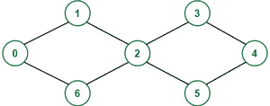
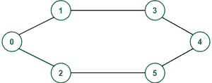

# 检查在只有 S 和 T 重复的无向图中，节点 S 和 T 之间是否存在循环

> 原文:[https://www . geesforgeks . org/check-if-a-cycle-exists-in-nodes-s-t-in-only-s-t-repeating/](https://www.geeksforgeeks.org/check-if-a-cycle-exists-between-nodes-s-and-t-in-an-undirected-graph-with-only-s-and-t-repeating/)

给定一个有 **N** 个节点和两个顶点 **S** & **T** 的无向图，任务是检查这两个顶点之间是否存在循环，使得除了 **S** 和 **T** 之外，没有其他节点在该循环中出现一次以上。如果存在则打印**是**否则打印**否**

**示例:**

> **输入:** N = 7，边[][] = {{0，1}，{1，2}，{2，3}，{3，4}，{4，5}，{5，2}，{2，6}，{6，0}}，S = 0，T = 4
> **输出:** No
> **说明:**
> 
> 
> 
> 节点 2 出现两次，在 0 和 4 之间的唯一循环中
> 
> **输入:** N = 6，边[][] = {{0，1}，{0，2}，{2，5}，{3，1}，{4，5}，{4，3}}，S = 0，T = 3
> T3】输出:是
> T6】说明:
> 
> 
> 
> 0 和 3 之间的循环是:0->1->3->4->5->2->0

**进场:**

如果存在从 T 返回 S 的路径，该路径不具有用于从 S 行进到 T 的路径的任何顶点，则总会有一个循环，使得除了 **S** 和 **T** 之外，没有其他节点出现不止一次。现在，要解决该问题，请执行以下步骤:

1.  制作一个大小为 **n** 的数组**访问**(其中 n 是节点数)，并用 0 初始化。
2.  从 **S** 开始[深度优先搜索](https://www.geeksforgeeks.org/depth-first-search-or-dfs-for-a-graph/)，以 **T** 为目的地。
3.  在访问过的数组中，将当前节点的值 0 更改为 1，以跟踪此路径中访问过的节点。
4.  如果不可能达到 **T** ，那么它们之间就不可能存在简单的循环。所以，打印**号**
5.  如果到达**、**的 **T** ，则将目的地更改为 **S** ，并继续深度优先搜索。现在已经访问的节点除了 **S** 不能再访问了。
6.  如果到达 **S** 则打印**是，**否则**号**

下面是上述方法的实现:

## C++

```
// C++ program for the above approach

#include <bits/stdc++.h>
using namespace std;

// Function to create graph
void createGraph(vector<vector<int> >& graph,
                 vector<vector<int> >& edges)
{
    for (auto x : edges) {

        // As it is an undirected graph
        // so add an edge for both directions
        graph[x[0]].push_back(x[1]);
        graph[x[1]].push_back(x[0]);
    }
}

bool findSimpleCycle(int cur,
                     vector<vector<int> >& graph,
                     int start, int dest,
                     vector<bool>& visited,
                     bool flag)
{

    // After reaching T, change the dest to S
    if (!flag and cur == dest) {
        dest = start;
        flag = 1;
    }

    // If S is reached without touching a
    // node twice except S and T,
    // then return true
    if (flag and cur == dest) {
        return true;
    }

    bool ans = 0;
    visited[cur] = 1;
    for (auto child : graph[cur]) {

        // A node can only be visited if it
        // hasn't been visited or if it
        // is S or t
        if (!visited[child] or child == dest) {
            ans = ans
                  | findSimpleCycle(
                        child, graph, start,
                        dest, visited, flag);
        }
    }

    // Change visited of the current node
    // to 0 while backtracking again so
    // that all the paths can be traversed
    visited[cur] = 0;

    return ans;
}

int main()
{
    int nodes = 7;
    vector<vector<int> > edges
        = { { 0, 1 }, { 1, 2 }, { 2, 3 },
            { 3, 4 }, { 4, 5 }, { 5, 2 },
            { 2, 6 }, { 6, 0 } };
    int S = 0, T = 4;

    // To store the graph
    vector<vector<int> > graph(nodes);

    // To keep track of visited nodes
    vector<bool> visited(nodes);
    createGraph(graph, edges);

    // If there exists a simple
    // cycle between S & T
    if (findSimpleCycle(S, graph,
                        S, T, visited, 0)) {
        cout << "Yes";
    }

    // If no simple cycle exists
    // between S & T
    else {
        cout << "No";
    }
}
```

## 蟒蛇 3

```
# Function to create graph
def createGraph(edges, N):
    graph = list([] for _ in range(N))
    for node1, node2 in edges:

        # As it is an undirected graph,
        # add an edge for both directions
        graph[node1].append(node2)
        graph[node2].append(node1)

    return graph

def findSimpleCycle(cur,
                    graph,
                    start,  dest,
                    visited,
                    flag):

    # After reaching T, change the dest to S
    if ((not flag) and cur == dest):
        dest = start
        flag = True

    # If S is reached without touching a
    # node twice except S and T,
    # then return true
    if (not flag and cur == dest):
        return True

    # first guess is that there is no cycle
    # so ans is False.
    # if we find one cycle, ans will be true
    # and then returned .
    ans = False

    # mark node as visited in this path
    visited[cur] = True

    for child in graph[cur]:

        # A node can only be visited if it
        # hasn't been visited or if it
        # is S or t
        if (not visited[child]) or child == dest:
            ans = ans or findSimpleCycle(
                child, graph, start,
                dest, visited, flag)

    # Change visited of the current node
    # to 0 while backtracking again so
    # that all the paths can be traversed
    visited[cur] = False

    return ans

if __name__ == "__main__":

    N = 7  # number of nodes
    edges = [[0, 1], [1, 2], [2, 3],
             [3, 4], [4, 5], [5, 2],
             [2, 6], [6, 0]]
    S = 0
    T = 4

    # To keep track of visited nodes
    visited_array = list(False for _ in range(N))

    # If there exists a simple
    # cycle between S & T
    if (findSimpleCycle(cur=S, graph=createGraph(edges, N),
                        start=S, dest=T,
                        visited=visited_array,
                        flag=0)):
        print("Yes")

    # If no simple cycle exists
    # between S & T
    else:
        print("No")
```

## java 描述语言

```
<script>
// Javascript program for the above approach

// Function to create graph
function createGraph(graph, edges) {
  for (x of edges) {

    // As it is an undirected graph
    // so add an edge for both directions
    graph[x[0]].push(x[1]);
    graph[x[1]].push(x[0]);
  }
}

function findSimpleCycle(cur, graph, start, dest, visited, flag) {

  // After reaching T, change the dest to S
  if (!flag && cur == dest) {
    dest = start;
    flag = 1;
  }

  // If S is reached without touching a
  // node twice except S and T,
  // then return true
  if (flag && cur == dest) {
    return true;
  }

  let ans = 0;
  visited[cur] = 1;
  for (child of graph[cur]) {

    // A node can only be visited if it
    // hasn't been visited or if it
    // is S or t
    if (!visited[child] || child == dest) {
      ans = ans
        | findSimpleCycle(
          child, graph, start,
          dest, visited, flag);
    }
  }

  // Change visited of the current node
  // to 0 while backtracking again so
  // that all the paths can be traversed
  visited[cur] = 0;

  return ans;
}

let nodes = 7;
let edges = [[0, 1], [1, 2], [2, 3],
[3, 4], [4, 5], [5, 2],
[2, 6], [6, 0]];
let S = 0, T = 4;

// To store the graph
let graph = new Array(nodes).fill(0).map(() => []);

// To keep track of visited nodes
let visited = new Array(nodes);
createGraph(graph, edges);

// If there exists a simple
// cycle between S & T
if (findSimpleCycle(S, graph,
  S, T, visited, 0)) {
  document.write("Yes");
}

// If no simple cycle exists
// between S & T
else {
  document.write("No");
}

// This code is contributed by saurabh_jaiswal.
</script>
```

**Output**

```
No
```

**时间复杂度:** O(N！).正如我们在这个算法中看到的，所有路径都可以遍历，最坏的情况下，我们打算遍历所有路径找到一条可行的，参见本文:https://www . geeksforgeeks . org/count-可能路径-两个顶点/
**辅助空间:** O(N^2)