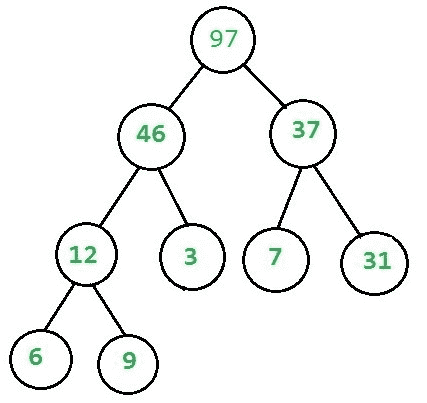
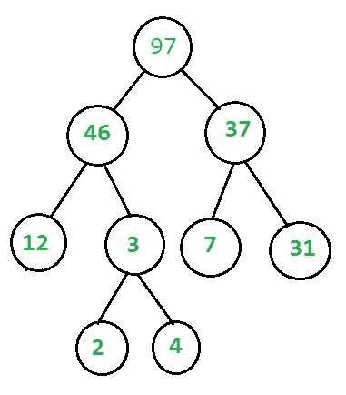

# 检查给定的二叉树是否是堆

> 原文:[https://www . geesforgeks . org/check-if-a-给定-二叉树-is-heap/](https://www.geeksforgeeks.org/check-if-a-given-binary-tree-is-heap/)

给定一棵二叉树，我们需要检查它是否具有堆属性，二叉树需要满足以下两个条件才能成为堆

1.  它应该是一个完整的树(即，除最后一级之外的所有级别都应该是满的)。
2.  每个节点的值都应该大于或等于其子节点(考虑最大堆)。

例如，此树包含堆属性–



虽然这没有–



我们分别检查上面的每一个条件，为了检查完整性，isComplete 和为了检查堆，isHeapUtil 函数被编写。
关于 isComplete 功能的详细信息可以在[这里](https://www.geeksforgeeks.org/check-whether-binary-tree-complete-not-set-2-recursive-solution/)找到。
ishaputil 函数的编写考虑了以下因素–

1.  每个节点可以有 2 个子节点，0 个子节点(最后一级节点)或 1 个子节点(最多只能有一个这样的节点)。
2.  如果节点没有子节点，则它是叶节点，并返回真(基本情况)
3.  如果节点有一个子节点(它必须是左子节点，因为它是一个完整的树)，那么我们只需要将这个节点与其单个子节点进行比较。
4.  如果节点有两个子树，则检查两个子树重复出现的节点处的堆属性。
    完整代码。

下面是上述方法的实现:

## C++

```
/* C++ program to checks if a
binary tree is max heap or not */
#include <bits/stdc++.h>

using namespace std;

/*  Tree node structure */
struct Node
{
    int key;
    struct Node *left;
    struct Node *right;
};

/* Helper function that
allocates a new node */
struct Node *newNode(int k)
{
    struct Node *node = new Node;
    node->key = k;
    node->right = node->left = NULL;
    return node;
}

/* This function counts the
number of nodes in a binary tree */
unsigned int countNodes(struct Node* root)
{
    if (root == NULL)
        return (0);
    return (1 + countNodes(root->left)
            + countNodes(root->right));
}

/* This function checks if the
binary tree is complete or not */
bool isCompleteUtil (struct Node* root,
                     unsigned int index,
                     unsigned int number_nodes)
{
    // An empty tree is complete
    if (root == NULL)
        return (true);

    // If index assigned to
    // current node is more than
    // number of nodes in tree,
    // then tree is not complete
    if (index >= number_nodes)
        return (false);

    // Recur for left and right subtrees
    return (isCompleteUtil(root->left, 2*index + 1,
                           number_nodes) &&
            isCompleteUtil(root->right, 2*index + 2,
                           number_nodes));
}

// This Function checks the
// heap property in the tree.
bool isHeapUtil(struct Node* root)
{
    //  Base case : single
    // node satisfies property
    if (root->left == NULL && root->right == NULL)
        return (true);

    //  node will be in
    // second last level
    if (root->right == NULL)
    {
        //  check heap property at Node
        //  No recursive call ,
        // because no need to check last level
        return (root->key >= root->left->key);
    }
    else
    {
        //  Check heap property at Node and
        //  Recursive check heap
        // property at left and right subtree
        if (root->key >= root->left->key &&
            root->key >= root->right->key)
            return ((isHeapUtil(root->left)) &&
                    (isHeapUtil(root->right)));
        else
            return (false);
    }
}

//  Function to check binary
// tree is a Heap or Not.
bool isHeap(struct Node* root)
{
    // These two are used
    // in isCompleteUtil()
    unsigned int node_count = countNodes(root);
    unsigned int index = 0;

    if (isCompleteUtil(root, index,
                       node_count)
        && isHeapUtil(root))
        return true;
    return false;
}

// Driver code
int main()
{
    struct Node* root = NULL;
    root = newNode(10);
    root->left = newNode(9);
    root->right = newNode(8);
    root->left->left = newNode(7);
    root->left->right = newNode(6);
    root->right->left = newNode(5);
    root->right->right = newNode(4);
    root->left->left->left = newNode(3);
    root->left->left->right = newNode(2);
    root->left->right->left = newNode(1);

    // Function call
    if (isHeap(root))
        cout << "Given binary tree is a Heap\n";
    else
        cout << "Given binary tree is not a Heap\n";

    return 0;
}

// This code is contributed by shubhamsingh10
```

## C

```
/* C program to checks if a binary
   tree is max heap or not
 */
#include <stdbool.h>
#include <stdio.h>
#include <stdlib.h>

/*  Tree node structure */
struct Node {
    int key;
    struct Node* left;
    struct Node* right;
};

/* Helper function
that allocates a new node */
struct Node* newNode(int k)
{
    struct Node* node
        = (struct Node*)malloc(sizeof(struct Node));
    node->key = k;
    node->right = node->left = NULL;
    return node;
}

/* This function counts the number
   of nodes in a binary tree
 */
unsigned int countNodes(struct Node* root)
{
    if (root == NULL)
        return (0);
    return (1 + countNodes(root->left)
            + countNodes(root->right));
}

/* This function checks
   if the binary tree is complete or
 * not */
bool isCompleteUtil(struct Node* root,
                    unsigned int index,
                    unsigned int number_nodes)
{
    // An empty tree is complete
    if (root == NULL)
        return (true);

    // If index assigned to current
    // node is more than
    // number of nodes in tree,
    // then tree is not complete
    if (index >= number_nodes)
        return (false);

    // Recur for left and right subtrees
    return (isCompleteUtil(root->left,
                           2 * index + 1,
                           number_nodes)
            && isCompleteUtil(root->right,
                              2 * index + 2,
                              number_nodes));
}

// This Function checks the
// heap property in the tree.
bool isHeapUtil(struct Node* root)
{
    //  Base case : single
    // node satisfies property
    if (root->left == NULL && root->right == NULL)
        return (true);

    //  node will be in second last level
    if (root->right == NULL) {
        //  check heap property at Node
        //  No recursive call ,
        //  because no need to check last level
        return (root->key >= root->left->key);
    }
    else {
        //  Check heap property at Node and
        //  Recursive check heap property
        //   at left and right subtree
        if (root->key >= root->left->key
            && root->key >= root->right->key)
            return ((isHeapUtil(root->left))
                    && (isHeapUtil(root->right)));
        else
            return (false);
    }
}

//  Function to check binary
// tree is a Heap or Not.
bool isHeap(struct Node* root)
{
    // These two are used in
    // isCompleteUtil()
    unsigned int node_count = countNodes(root);
    unsigned int index = 0;

    if (isCompleteUtil(root, index, node_count)
        && isHeapUtil(root))
        return true;
    return false;
}

// Driver Code
int main()
{
    struct Node* root = NULL;
    root = newNode(10);
    root->left = newNode(9);
    root->right = newNode(8);
    root->left->left = newNode(7);
    root->left->right = newNode(6);
    root->right->left = newNode(5);
    root->right->right = newNode(4);
    root->left->left->left = newNode(3);
    root->left->left->right = newNode(2);
    root->left->right->left = newNode(1);

    if (isHeap(root))
        printf("Given binary tree is a Heap\n");
    else
        printf("Given binary tree is not a Heap\n");

    return 0;
}
```

## Java 语言(一种计算机语言，尤用于创建网站)

```
/* Java program to checks
 * if a binary tree is max heap or not */

// A Binary Tree node
class Node {
    int key;
    Node left, right;

    Node(int k)
    {
        key = k;
        left = right = null;
    }
}

class Is_BinaryTree_MaxHeap
{
    /* This function counts
       the number of nodes in a binary
     * tree */
    int countNodes(Node root)
    {
        if (root == null)
            return 0;
        return (1 + countNodes(root.left)
                + countNodes(root.right));
    }

    /* This function checks
       if the binary tree is complete
     * or not */
    boolean isCompleteUtil(Node root, int index,
                           int number_nodes)
    {
        // An empty tree is complete
        if (root == null)
            return true;

        // If index assigned to current
        //  node is more than number of
        //  nodes in tree,  then tree is
        // not complete
        if (index >= number_nodes)
            return false;

        // Recur for left and right subtrees
        return isCompleteUtil(root.left,
                              2 * index + 1,
                              number_nodes)
            && isCompleteUtil(root.right,
                              2 * index + 2,
                              number_nodes);
    }

    // This Function checks
    // the heap property in the tree.
    boolean isHeapUtil(Node root)
    {
        //  Base case : single
        // node satisfies property
        if (root.left == null && root.right == null)
            return true;

        //  node will be in second last level
        if (root.right == null) {
            //  check heap property at Node
            //  No recursive call ,
            //  because no need to check last level
            return root.key >= root.left.key;
        }
        else {
            //  Check heap property at Node and
            //  Recursive check heap property at left and
            //  right subtree
            if (root.key >= root.left.key
                && root.key >= root.right.key)
                return isHeapUtil(root.left)
                    && isHeapUtil(root.right);
            else
                return false;
        }
    }

    //  Function to check binary
    // tree is a Heap or Not.
    boolean isHeap(Node root)
    {
        if (root == null)
            return true;

        // These two are used
        // in isCompleteUtil()
        int node_count = countNodes(root);

        if (isCompleteUtil(root, 0, node_count) == true
            && isHeapUtil(root) == true)
            return true;
        return false;
    }

    // driver function to
    // test the above functions
    public static void main(String args[])
    {
        Is_BinaryTree_MaxHeap bt
            = new Is_BinaryTree_MaxHeap();

        Node root = new Node(10);
        root.left = new Node(9);
        root.right = new Node(8);
        root.left.left = new Node(7);
        root.left.right = new Node(6);
        root.right.left = new Node(5);
        root.right.right = new Node(4);
        root.left.left.left = new Node(3);
        root.left.left.right = new Node(2);
        root.left.right.left = new Node(1);

        if (bt.isHeap(root) == true)
            System.out.println(
                "Given binary tree is a Heap");
        else
            System.out.println(
                "Given binary tree is not a Heap");
    }
}

// This code has been contributed by Amit Khandelwal
```

## 计算机编程语言

```
# To check if a binary tree
# is a MAX Heap or not

class GFG:
    def __init__(self, value):
        self.key = value
        self.left = None
        self.right = None

    def count_nodes(self, root):
        if root is None:
            return 0
        else:
            return (1 + self.count_nodes(root.left) +
                    self.count_nodes(root.right))

    def heap_propert_util(self, root):

        if (root.left is None and
                root.right is None):
            return True

        if root.right is None:
            return root.key >= root.left.key
        else:
            if (root.key >= root.left.key and
                    root.key >= root.right.key):
                return (self.heap_propert_util(root.left) and
                        self.heap_propert_util(root.right))
            else:
                return False

    def complete_tree_util(self, root,
                           index, node_count):
        if root is None:
            return True
        if index >= node_count:
            return False
        return (self.complete_tree_util(root.left, 2 *
                                        index + 1, node_count) and
                self.complete_tree_util(root.right, 2 *
                                        index + 2, node_count))

    def check_if_heap(self):
        node_count = self.count_nodes(self)
        if (self.complete_tree_util(self, 0, node_count) and
                self.heap_propert_util(self)):
            return True
        else:
            return False

# Driver Code
root = GFG(5)
root.left = GFG(2)
root.right = GFG(3)
root.left.left = GFG(1)

if root.check_if_heap():
    print("Given binary tree is a heap")
else:
    print("Given binary tree is not a Heap")

# This code has been
# contributed by Yash Agrawal
```

## C#

```
/* C# program to checks if a
binary tree is max heap or not
 */
using System;

// A Binary Tree node
public class Node {
    public int key;
    public Node left, right;

    public Node(int k)
    {
        key = k;
        left = right = null;
    }
}

class Is_BinaryTree_MaxHeap
{
    /* This function counts the number
    of nodes in a binary tree */
    int countNodes(Node root)
    {
        if (root == null)
            return 0;
        return (1 + countNodes(root.left)
                + countNodes(root.right));
    }

    /* This function checks if the
    binary tree is complete or not */
    Boolean isCompleteUtil(Node root, int index,
                           int number_nodes)
    {
        // An empty tree is complete
        if (root == null)
            return true;

        // If index assigned to
        // current node is more than
        // number of nodes in tree, then
        // tree is notcomplete
        if (index >= number_nodes)
            return false;

        // Recur for left and right subtrees
        return isCompleteUtil(root.left,
                              2 * index + 1,
                              number_nodes)
            && isCompleteUtil(root.right,
                              2 * index + 2,
                              number_nodes);
    }

    // This Function checks the
    // heap property in the tree.
    Boolean isHeapUtil(Node root)
    {
        // Base case : single
        // node satisfies property
        if (root.left == null
            && root.right == null)
            return true;

        // node will be in second last level
        if (root.right == null)
        {
            // check heap property at Node
            // No recursive call ,
            // because no need to check last level
            return root.key >= root.left.key;
        }
        else
        {
            // Check heap property at Node and
            // Recursive check heap
            // property at left and
            // right subtree
            if (root.key >= root.left.key
                && root.key >= root.right.key)
                return isHeapUtil(root.left)
                    && isHeapUtil(root.right);
            else
                return false;
        }
    }

    // Function to check binary
    // tree is a Heap or Not.
    Boolean isHeap(Node root)
    {
        if (root == null)
            return true;

        // These two are used in isCompleteUtil()
        int node_count = countNodes(root);

        if (isCompleteUtil(root, 0,
                           node_count) == true
            && isHeapUtil(root) == true)
            return true;
        return false;
    }

    // Driver code
    public static void Main(String[] args)
    {
        Is_BinaryTree_MaxHeap bt
            = new Is_BinaryTree_MaxHeap();

        Node root = new Node(10);
        root.left = new Node(9);
        root.right = new Node(8);
        root.left.left = new Node(7);
        root.left.right = new Node(6);
        root.right.left = new Node(5);
        root.right.right = new Node(4);
        root.left.left.left = new Node(3);
        root.left.left.right = new Node(2);
        root.left.right.left = new Node(1);

        if (bt.isHeap(root) == true)
            Console.WriteLine(
                "Given binary tree is a Heap");
        else
            Console.WriteLine(
                "Given binary tree is not a Heap");
    }
}

// This code has been contributed by Arnab Kundu
```

## java 描述语言

```
<script>
/* Javascript program to checks if a
binary tree is max heap or not
 */

// A Binary Tree node
class Node {
  constructor(k)
  {
    this.key = k;
    this.left = null;
    this.right = null;
  }
}

/* This function counts the number
of nodes in a binary tree */
function countNodes(root)
{
    if (root == null)
        return 0;
    return (1 + countNodes(root.left)
            + countNodes(root.right));
}

/* This function checks if the
binary tree is complete or not */
function isCompleteUtil(root, index, number_nodes)
{

    // An empty tree is complete
    if (root == null)
        return true;

    // If index assigned to
    // current node is more than
    // number of nodes in tree, then
    // tree is notcomplete
    if (index >= number_nodes)
        return false;

    // Recur for left and right subtrees
    return isCompleteUtil(root.left,
                          2 * index + 1,
                          number_nodes)
        && isCompleteUtil(root.right,
                          2 * index + 2,
                          number_nodes);
}

// This Function checks the
// heap property in the tree.
function isHeapUtil(root)
{
    // Base case : single
    // node satisfies property
    if (root.left == null
        && root.right == null)
        return true;

    // node will be in second last level
    if (root.right == null)
    {

        // check heap property at Node
        // No recursive call ,
        // because no need to check last level
        return root.key >= root.left.key;
    }
    else
    {

        // Check heap property at Node and
        // Recursive check heap
        // property at left and
        // right subtree
        if (root.key >= root.left.key
            && root.key >= root.right.key)
            return isHeapUtil(root.left)
                && isHeapUtil(root.right);
        else
            return false;
    }
}

// Function to check binary
// tree is a Heap or Not.
function isHeap(root)
{
    if (root == null)
        return true;

    // These two are used in isCompleteUtil()
    var node_count = countNodes(root);
    if (isCompleteUtil(root, 0,
                       node_count) == true
        && isHeapUtil(root) == true)
        return true;
    return false;
}

// Driver code
var root = new Node(10);
root.left = new Node(9);
root.right = new Node(8);
root.left.left = new Node(7);
root.left.right = new Node(6);
root.right.left = new Node(5);
root.right.right = new Node(4);
root.left.left.left = new Node(3);
root.left.left.right = new Node(2);
root.left.right.left = new Node(1);
if (isHeap(root) == true)
    document.write(
        "Given binary tree is a Heap");
else
    document.write(
        "Given binary tree is not a Heap");

// This code is contributed by rrrtnx.
</script>
```

**Output**

```
Given binary tree is a Heap
```

**方法 2:** (使用级别顺序遍历的迭代方法)

## C++

```
// C++ program to checks if a
// binary tree is max heap or not
#include <bits/stdc++.h>

using namespace std;

// Tree node structure
struct Node {
    int data;
    struct Node* left;
    struct Node* right;
};

// To add a new node
struct Node* newNode(int k)
{
    struct Node* node = new Node;
    node->data = k;
    node->right = node->left = NULL;
    return node;
}

bool isHeap(Node* root)
{
    // Your code here
    queue<Node*> q;
    q.push(root);
    bool nullish = false;
    while (!q.empty())
    {
        Node* temp = q.front();
        q.pop();
        if (temp->left)
        {
            if (nullish
                || temp->left->data
                >= temp->data)
            {
                return false;
            }
            q.push(temp->left);
        }
        else {
            nullish = true;
        }
        if (temp->right)
        {
            if (nullish
                || temp->right->data
                >= temp->data)
            {
                return false;
            }
            q.push(temp->right);
        }
        else
        {
            nullish = true;
        }
    }
    return true;
}

// Driver code
int main()
{
    struct Node* root = NULL;
    root = newNode(10);
    root->left = newNode(9);
    root->right = newNode(8);
    root->left->left = newNode(7);
    root->left->right = newNode(6);
    root->right->left = newNode(5);
    root->right->right = newNode(4);
    root->left->left->left = newNode(3);
    root->left->left->right = newNode(2);
    root->left->right->left = newNode(1);

    // Function call
    if (isHeap(root))
        cout << "Given binary tree is a Heap\n";
    else
        cout << "Given binary tree is not a Heap\n";

    return 0;
}
```

## Java 语言(一种计算机语言，尤用于创建网站)

```
// Java program to checks if a
// binary tree is max heap or not
import java.util.*;
class GFG
{

  // Tree node structure
  static class Node
  {
    int data;
    Node left;
    Node right;
  };

  // To add a new node
  static Node newNode(int k)
  {
    Node node = new Node();
    node.data = k;
    node.right = node.left = null;
    return node;
  }

  static boolean isHeap(Node root)
  {
    Queue<Node> q = new LinkedList<>();
    q.add(root);
    boolean nullish = false;
    while (!q.isEmpty())
    {
      Node temp = q.peek();
      q.remove();
      if (temp.left != null)
      {
        if (nullish
            || temp.left.data
            >= temp.data)
        {
          return false;
        }
        q.add(temp.left);
      }
      else {
        nullish = true;
      }
      if (temp.right != null)
      {
        if (nullish
            || temp.right.data
            >= temp.data)
        {
          return false;
        }
        q.add(temp.right);
      }
      else
      {
        nullish = true;
      }
    }
    return true;
  }

  // Driver code
  public static void main(String[] args)
  {
    Node root = null;
    root = newNode(10);
    root.left = newNode(9);
    root.right = newNode(8);
    root.left.left = newNode(7);
    root.left.right = newNode(6);
    root.right.left = newNode(5);
    root.right.right = newNode(4);
    root.left.left.left = newNode(3);
    root.left.left.right = newNode(2);
    root.left.right.left = newNode(1);

    // Function call
    if (isHeap(root))
      System.out.print("Given binary tree is a Heap\n");
    else
      System.out.print("Given binary tree is not a Heap\n");
  }
}

// This code is contributed by Rajput-Ji
```

## C#

```
// C# program to checks if a
// binary tree is max heap or not
using System;
using System.Collections.Generic;
public class GFG
{

  // Tree node structure
 public
   class Node
  {
    public
 int data;
   public
  Node left;
   public
  Node right;
  };

  // To add a new node
  static Node newNode(int k)
  {
    Node node = new Node();
    node.data = k;
    node.right = node.left = null;
    return node;
  }

  static bool isHeap(Node root)
  {
    Queue<Node> q = new Queue<Node>();
    q.Enqueue(root);
    bool nullish = false;
    while (q.Count!=0)
    {
      Node temp = q.Peek();
      q.Dequeue();
      if (temp.left != null)
      {
        if (nullish || temp.left.data
            >= temp.data)
        {
          return false;
        }
        q.Enqueue(temp.left);
      }
      else {
        nullish = true;
      }
      if (temp.right != null)
      {
        if (nullish || temp.right.data
            >= temp.data)
        {
          return false;
        }
        q.Enqueue(temp.right);
      }
      else
      {
        nullish = true;
      }
    }
    return true;
  }

  // Driver code
  public static void Main(String[] args)
  {
    Node root = null;
    root = newNode(10);
    root.left = newNode(9);
    root.right = newNode(8);
    root.left.left = newNode(7);
    root.left.right = newNode(6);
    root.right.left = newNode(5);
    root.right.right = newNode(4);
    root.left.left.left = newNode(3);
    root.left.left.right = newNode(2);
    root.left.right.left = newNode(1);

    // Function call
    if (isHeap(root))
      Console.Write("Given binary tree is a Heap\n");
    else
      Console.Write("Given binary tree is not a Heap\n");
  }
}

// This code is contributed by aashish1995
```

## java 描述语言

```
<script>

    // JavaScript program to checks if a
    // binary tree is max heap or not

    class Node
    {
        constructor(data) {
           this.left = null;
           this.right = null;
           this.data = data;
        }
    }

    // To add a new node
    function newNode(k)
    {
      let node = new Node(k);
      return node;
    }

    function isHeap(root)
    {
      let q = [];
      q.push(root);
      let nullish = false;
      while (q.length > 0)
      {
        let temp = q[0];
        q.shift();
        if (temp.left != null)
        {
          if (nullish
              || temp.left.data
              >= temp.data)
          {
            return false;
          }
          q.push(temp.left);
        }
        else {
          nullish = true;
        }
        if (temp.right != null)
        {
          if (nullish
              || temp.right.data
              >= temp.data)
          {
            return false;
          }
          q.push(temp.right);
        }
        else
        {
          nullish = true;
        }
      }
      return true;
    }

    let root = null;
    root = newNode(10);
    root.left = newNode(9);
    root.right = newNode(8);
    root.left.left = newNode(7);
    root.left.right = newNode(6);
    root.right.left = newNode(5);
    root.right.right = newNode(4);
    root.left.left.left = newNode(3);
    root.left.left.right = newNode(2);
    root.left.right.left = newNode(1);

    // Function call
    if (isHeap(root))
      document.write("Given binary tree is a Heap" + "</br>");
    else
      document.write("Given binary tree is not a Heap" + "</br>");

</script>
```

**Output**

```
Given binary tree is a Heap
```

本文由乌卡什·特里维迪供稿。如果您发现任何不正确的地方，或者您想分享更多关于上面讨论的主题的信息，请写评论