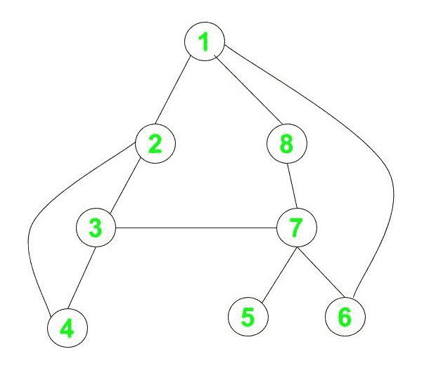

# 检查给定图形是否是 2 边连接的

> 原文： [https://www.geeksforgeeks.org/check-if-a-given-graph-is-2-edge-connected-or-not/](https://www.geeksforgeeks.org/check-if-a-given-graph-is-2-edge-connected-or-not/)

给定无向[图](https://www.geeksforgeeks.org/graph-data-structure-and-algorithms/)`G`，并具有`V`顶点和`E`边，任务是检查图是否为 2 边连接 或不。

> 如果在删除图形的任何边时，图形仍然保持连接状态，即不包含[桥](https://www.geeksforgeeks.org/bridge-in-a-graph/?ref=rp)，则该图形被称为 **2 边连接**。

**示例**：

> **输入**：`V = 8, E = 10`
> 
> 
> 
> **输出**：`Yes`
>
> **说明**：
>
> 给定图中的任何顶点，我们可以到达图中的任何其他顶点。 此外，从图形中删除任何边都不会影响其连接性。 因此，该图被称为 2 边连接。
> 
> **输入**：`V = 8, E = 9`
> 
> 
> 
> **输出**：`No`
>
> **说明**：
>
> 移除顶点 3 和顶点 4 之间的边后，该图不再连接。 因此，该图不是 2 边连接的。

**朴素的方法**：朴素的方法是检查是否除去了任何边`X`，是否连接了其余图`G – X`。 如果在逐个删除每个边时图形仍然保持连接，则它是 2 边连接图形。 要实现上述想法，请移除一条边并从任意顶点执行[深度优先搜索（DFS）](https://www.geeksforgeeks.org/depth-first-search-or-dfs-for-a-graph/)或[广度优先搜索（BFS）](https://www.geeksforgeeks.org/breadth-first-search-or-bfs-for-a-graph/)，然后检查是否覆盖了所有顶点。 对所有`E`边重复此过程。 如果无法遍历所有顶点的任何边，请打印`No`。 否则，打印`Yes`。

**时间复杂度**：`O(E * (V + E))`

**辅助空间**：`O(1)`

**高效方法**：由于给定图是无向的，因此仅通过计算连接到节点的边数即可解决该问题。 如果对于任何节点，连接到它的边数为 1，则表示在删除该边后，该节点将断开连接，并且无法从任何其他节点到达该节点，因此该图不是 2 边连接的。 步骤如下：

1.  创建大小为`V`的数组`noOfEdges[]`，该数组将存储连接到节点的边数。

2.  对于每个边`(u, v)`，增加节点`u`和`v`的边数。

3.  现在，在数组`noOfEdges[]`上进行迭代，并检查是否有任何边仅连接了 1 个边。 如果是，则**图不是 2 边连接的**。

4.  否则，图形是 2 边连接的。

下面是上述方法的实现：

## C++ 14

```

// C++14 program for the above approach

#include <bits/stdc++.h>
using namespace std;

// Definition of a graph
class Graph {

    // No. of vertices
    int V;

    // To create adjacency list
    list<int>* adj;

public:
    // Constructor
    Graph(int V);

    // Function to add an edge to graph
    void addEdge(int v, int w);

    // Function to check 2-edge
    // 2-edge connectivity
    void twoEdge(int v);
};

// Initialize the graph
Graph::Graph(int V)
{
    this->V = V;
    adj = new list<int>[V];
}

// Adding edges to adjacency list
void Graph::addEdge(int v, int w)
{
    adj[v - 1].push_back(w - 1);
    adj[w - 1].push_back(v - 1);
}

// Function to find if the graph is
// 2 edge connected or not
void Graph::twoEdge(int v)
{
    // To store number of edges for
    // each node
    int noOfEdges[v];

    for (int i = 0; i < v; i++) {
        noOfEdges[i] = adj[i].size();
    }

    bool flag = true;

    // Check the number of edges
    // connected to each node
    for (int i = 0; i < v; i++) {

        if (noOfEdges[i] < 2) {
            flag = false;
            break;
        }
    }

    // Print the result
    if (flag)
        cout << "Yes";
    else
        cout << "No";
}

// Driver Code
int main()
{
    // Number of nodes and edges
    int V = 8;
    int E = 10;

    // Given Edges
    int edges[E][2] = { { 1, 2 }, { 1, 8 }, { 1, 6 }, 
                        { 2, 3 }, { 2, 4 }, { 3, 7 }, 
                        { 3, 4 }, { 7, 5 }, { 7, 6 }, 
                        { 7, 8 } };

    // Initialize the graph
    Graph g(V);

    // Adding the edges to graph
    for (int i = 0; i < E; i++) {
        g.addEdge(edges[i][0], edges[i][1]);
    }

    // Function call
    g.twoEdge(V);

    return 0;
}

```

## Java

```java

// Java program for the above approach
import java.util.*;

class Graph{

// No. of vertices     
private int V; 

// Array of lists for Adjacency
// List Representation 
private LinkedList<Integer> adj[]; 

// Constructor 
@SuppressWarnings("unchecked")
Graph(int v) 
{ 
    V = v; 
    adj = new LinkedList[v];

    for(int i = 0; i < v; ++i) 
        adj[i] = new LinkedList(); 
} 

// Function to add an edge into the graph 
void addEdge(int v, int w) 
{ 
    adj[v - 1].add(w - 1); // Add w to v's list. 
    adj[w - 1].add(v - 1);
} 

// Function to find if the graph is
// 2 edge connected or not
void twoEdge(int v)
{

    // To store number of edges for
    // each node
    int[] noOfEdges = new int[v];
    for(int i = 0; i < v; i++) 
    {
        noOfEdges[i] = adj[i].size();
    }

    boolean flag = true;

    // Check the number of edges
    // connected to each node
    for(int i = 0; i < v; i++)
    {
        if (noOfEdges[i] < 2)
        {
            flag = false;
            break;
        }
    }

    // Print the result
    if (flag)
        System.out.print("Yes");
    else
        System.out.print("No");
}

// Driver code
public static void main (String[] args) 
{

    // Number of nodes and edges
    int V = 8;
    int E = 10;

    // Given Edges
    int edges[][] = { { 1, 2 }, { 1, 8 },
                      { 1, 6 }, { 2, 3 },
                      { 2, 4 }, { 3, 7 }, 
                      { 3, 4 }, { 7, 5 }, 
                      { 7, 6 }, { 7, 8 } };

    Graph g = new Graph(V); 

    // Adding the edges to graph
    for(int i = 0; i < E; i++) 
    {
        g.addEdge(edges[i][0], edges[i][1]);
    }

    // Function call
    g.twoEdge(V);
}
}

// This code is contributed by offbeat

```

## Python

```py

# Python3 program for the above approach

# Definition of a graph
class Graph:

    # No. of vertices
    V = 0

    # Array of lists for Adjacency
    # List Representation
    adj = [[]]

    # Constructor
    def __init__(self, v):

        self.V = v
        self.adj = [[] for i in range(v)]

    # Function to add an edge into the graph
    def addEdge(self, v, w):

        self.adj[v - 1].append(w - 1)

        # Add w to v's list.
        self.adj[w - 1].append(v - 1)

    # Function to find if the graph is
    # 2 edge connected or not
    def twoEdge(self, v):

        # To store number of edges for
        # each node
        noOfEdges = [len(self.adj[i]) for i in range(v)]

        flag = True

        # Check the number of edges
        # connected to each node
        for i in range(v):
            if (noOfEdges[i] < 2):
                flag = False
                break

        # Print the result
        if (flag):
            print("Yes")
        else:
            print("No")

# Driver code
if __name__=="__main__":

    # Number of nodes and edges
    V = 8
    E = 10

    # Given Edges
    edges = [ [ 1, 2 ], [ 1, 8 ], 
              [ 1, 6 ], [ 2, 3 ],
              [ 2, 4 ], [ 3, 7 ],
              [ 3, 4 ], [ 7, 5 ],
              [ 7, 6 ], [ 7, 8 ] ]

    g = Graph(V)

    # Adding the edges to graph
    for i in range(E):
        g.addEdge(edges[i][0],
                  edges[i][1])

    # Function call
    g.twoEdge(V)

# This code is contributed by rutvik_56

```

## C#

```cs

// C# program for the above approach
using System;
using System.Collections.Generic;

class Graph{

// No. of vertices     
private int V; 

// Array of lists for Adjacency
// List Representation 
private List<int> []adj; 

// Constructor 
Graph(int v) 
{ 
    V = v; 
    adj = new List<int>[v];

    for(int i = 0; i < v; ++i) 
        adj[i] = new List<int>(); 
} 

// Function to add an edge into the graph 
void addEdge(int v, int w) 
{ 

    // Add w to v's list. 
    adj[v - 1].Add(w - 1); 
    adj[w - 1].Add(v - 1);
} 

// Function to find if the graph is
// 2 edge connected or not
void twoEdge(int v)
{

    // To store number of edges for
    // each node
    int[] noOfEdges = new int[v];
    for(int i = 0; i < v; i++) 
    {
        noOfEdges[i] = adj[i].Count;
    }

    bool flag = true;

    // Check the number of edges
    // connected to each node
    for(int i = 0; i < v; i++)
    {
        if (noOfEdges[i] < 2)
        {
            flag = false;
            break;
        }
    }

    // Print the result
    if (flag)
        Console.Write("Yes");
    else
        Console.Write("No");
}

// Driver code
public static void Main(String[] args) 
{

    // Number of nodes and edges
    int V = 8;
    int E = 10;

    // Given Edges
    int [,]edges = { { 1, 2 }, { 1, 8 },
                     { 1, 6 }, { 2, 3 },
                     { 2, 4 }, { 3, 7 }, 
                     { 3, 4 }, { 7, 5 }, 
                     { 7, 6 }, { 7, 8 } };

    Graph g = new Graph(V); 

    // Adding the edges to graph
    for(int i = 0; i < E; i++) 
    {
        g.addEdge(edges[i, 0], edges[i, 1]);
    }

    // Function call
    g.twoEdge(V);
}
}

// This code is contributed by Amit Katiyar

```

**Output:** 

```
No

```

**时间复杂度**：`O(V + E)`

**辅助空间**：`O(V)`


* * *

* * *

如果您喜欢 GeeksforGeeks 并希望做出贡献，则还可以使用 [tribution.geeksforgeeks.org](https://contribute.geeksforgeeks.org/) 撰写文章，或将您的文章邮寄至 tribution@geeksforgeeks.org。 查看您的文章出现在 GeeksforGeeks 主页上，并帮助其他 Geeks。

如果您发现任何不正确的地方，请单击下面的“改进文章”按钮，以改进本文。