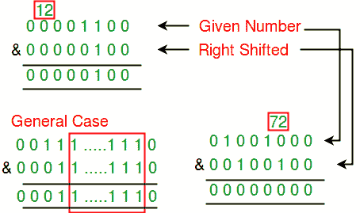

# 检查给定的数字是否稀疏

> 原文:[https://www . geesforgeks . org/check-如果给定的数字是稀疏的或不稀疏的/](https://www.geeksforgeeks.org/check-if-a-given-number-is-sparse-or-not/)

如果一个数的二进制表示中没有设置两个或两个以上的连续位，则称该数为稀疏数。编写一个函数来检查给定的数字是否稀疏。
**例:**

```
Input:  x  = 72
Output: true
Explanation:  Binary representation of 72 is 01001000\. 
There are no two consecutive 1's in binary representation

Input:  x  = 12
Output: false
Explanation:  Binary representation of 12 is 1100\. 
Third and fourth bits (from end) are set.
```

## [我们强烈建议您点击此处进行练习，然后再进入解决方案。](https://practice.geeksforgeeks.org/problems/number-is-sparse-or-not-1587115620/1)

如果我们仔细观察，那么我们可以注意到，如果我们可以使用“给定数”的二进制表示的按位“与”来计算该数是否稀疏。如果数字是稀疏的，“与”运算符的结果将为 0，如果不是稀疏的，则为非零。



以下是上述想法的实现。

## C++

```
// C++ program to check if n is sparse or not
#include<iostream>
using namespace std;

// Return true if n is sparse, else false
bool checkSparse(int n)
{
    // n is not sparse if there is set
    // in AND of n and n/2
    if (n & (n>>1))
        return false;

    return true;
}

// Driver program
int main()
{
    cout << checkSparse(72) << endl;
    cout << checkSparse(12) << endl;
    cout << checkSparse(2) << endl;
    cout << checkSparse(3) << endl;
    return 0;
}
```

## Java 语言(一种计算机语言，尤用于创建网站)

```
// JAVA Code to Check if a
// given number is sparse or not
import java.util.*;

class GFG {

    // Return true if n is
    // sparse,else false
    static int checkSparse(int n)
    {

        // n is not sparse if there
        // is set in AND of n and n/2
        if ((n & (n>>1)) >=1)
            return 0;

        return 1;
    }

    // Driver code
    public static void main(String[] args)
    {
        System.out.println(checkSparse(72)) ;
        System.out.println(checkSparse(12)) ;
        System.out.println(checkSparse(2)) ;
        System.out.println(checkSparse(3)) ;
        }
    }

//This code is contributed by Arnav Kr. Mandal.
```

## 蟒蛇 3

```
# Python program to check
# if n is sparse or not

# Return true if n is
# sparse, else false
def checkSparse(n):

    # n is not sparse if there is set
    # in AND of n and n/2
    if (n & (n>>1)):
        return 0

    return 1

# Driver code
print(checkSparse(72))
print(checkSparse(12))
print(checkSparse(2))
print(checkSparse(30))

# This code is contributed
# by Anant Agarwal.
```

## C#

```
// C# Code to Check if a guven
// number is sparse or not
using System;

class GFG {

    // Return true if n is
    // sparse,else false
    static int checkSparse(int n)
    {

        // n is not sparse if there
        // is set in AND of n and n/2
        if ((n & (n >> 1)) >= 1)
            return 0;

        return 1;
    }

    // Driver code
    public static void Main()
    {
        Console.WriteLine(checkSparse(72));
        Console.WriteLine(checkSparse(12));
        Console.WriteLine(checkSparse(2));
        Console.WriteLine(checkSparse(3));
    }
}

// This code is contributed by Sam007.
```

## 服务器端编程语言（Professional Hypertext Preprocessor 的缩写）

```
<?php
// PHP program to check if
// n is sparse or not
// Return true if n is sparse,
// else false

function checkSparse($n)
{
    // n is not sparse if
    // there is set in AND
    // of n and n/2
    if ($n & ($n >> 1))
        return 0;

    return 1;
}

// Driver Code
echo checkSparse(72), "\n";
echo checkSparse(12), "\n";
echo checkSparse(2), "\n";
echo checkSparse(3), "\n";

// This code is contributed by Ajit.
?>
```

## java 描述语言

```
<script>

    // Javascript program to check if n is sparse or not

    // Return true if n is sparse, else false
    function checkSparse(n)
    {
        // n is not sparse if there is set
        // in AND of n and n/2
        if ((n & (n>>1)) > 0)
            return 0;

        return 1;
    }

    document.write(checkSparse(72) + "</br>");
    document.write(checkSparse(12) + "</br>");
    document.write(checkSparse(2) + "</br>");
    document.write(checkSparse(3) + "</br>");

</script>
```

**输出:**

```
1
0
1
0
```

***时间复杂度:** O(1)*

***辅助空间:** O(1)*

注意:除了右移，我们也可以使用左移，但是在某些情况下，左移可能会导致溢出。
本文由**维姆·维斯特朗**供稿。如果发现有不正确的地方，请写评论，或者想分享更多关于以上讨论话题的信息