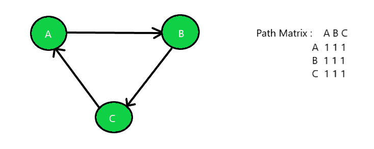

# 检查图是强连通、单边连通还是弱连通

> 原文:[https://www . geeksforgeeks . org/check-a-graph-是-强-单边-还是-弱-连接/](https://www.geeksforgeeks.org/check-if-a-graph-is-strongly-unilaterally-or-weakly-connected/)

给定一个未加权的有向[图](https://www.geeksforgeeks.org/graph-and-its-representations/) **G** 作为路径矩阵，任务是找出该图是[强连通](https://www.geeksforgeeks.org/connectivity-in-a-directed-graph/)还是单侧连通或弱连通。

> **强连通:**如果图中的每对顶点(u，v)都包含彼此之间的路径，则称该图为**强连通**。在未加权有向图 G 中，每对顶点 u 和 v 在它们之间的每个方向上都应该有一条路径，即双向路径。这样一个图的路径矩阵的元素将包含所有的 **1 的**。
> **单侧连通:**如果一个图包含从 u 到 v 的有向路径或每对顶点 u，v 都包含从 v 到 u 的有向路径，则称该图为**单侧连通**，因此，至少对于任何一对顶点，一个顶点应该可以从另一个顶点到达。这样的路径矩阵宁愿有包含 **1 的**的上三角形元素，或者包含 **1 的**的下三角形元素。
> **弱连通:**如果任意两对顶点之间不存在任何路径，则称图为**弱连通**。因此，如果图 G 不包含有向路径(对于每对顶点 u，v，从 u 到 v 或从 v 到 u)，那么它是弱连通的。这个图的路径矩阵的元素是随机的。

**示例:**

> **输入:**下面是给定的带有路径矩阵的图:
> 
> 
> 
> **输出:**强连通图
> **输入:**下面是给定的带路径矩阵的图:
> 
> 
> 
> **输出:**单边连通图
> **输入:**下图是给定的带路径矩阵的图:
> 
> 
> 
> **输出:**弱连通图

**进场:**

1.  对于要成为 [**【强连通】**](https://www.geeksforgeeks.org/strongly-connected-components/) 的图，使用本文中讨论的方法遍历给定的路径矩阵，检查单元格中的所有值是否都是 **1** 。如果是，则打印**“强连通图”**否则检查其他两张图。
2.  对于要进行**单向连接的图**，使用本文[中讨论的方法遍历给定的路径矩阵，并检查以下内容:](https://www.geeksforgeeks.org/traverse-a-given-matrix-using-recursion/)
    *   如果主对角线以上的值都是 **1s** ，除此之外的值都是 **0s** 。
    *   如果主对角线以下的所有值都是 **1s** ，除此之外的所有值都是 **0s** 。
3.  如果上述两个条件中的一个满足，那么给定的图是**单侧连通的**，否则该图是**弱连通图**。

以下是上述方法的实现:

## C++

```
// C++ implementation of the approach

#include <bits/stdc++.h>
using namespace std;
#define V 3

// Function to find the characteristic
// of the given graph
int checkConnected(int graph[][V], int n)
{

    // Check whether the graph is
    // strongly connected or not
    bool strongly = true;

    // Traverse the path matrix
    for (int i = 0; i < n; i++) {

        for (int j = 0; j < n; j++) {

            // If all the elements are
            // not equal then the graph
            // is not strongly connected
            if (graph[i][j] != graph[j][i]) {
                strongly = false;
                break;
            }
        }

        // Break out of the loop if false
        if (!strongly) {
            break;
        }
    }
    // If true then print strongly
    // connected and return
    if (strongly) {
        cout << "Strongly Connected";
        return 0;
    }

    // Check whether the graph is
    // Unilaterally connected by
    // checking Upper Triangle element
    bool uppertri = true;

    // Traverse the path matrix
    for (int i = 0; i < n; i++) {

        for (int j = 0; j < n; j++) {

            // If uppertriangle elements
            // are 0 then break out of the
            // loop and check the elements
            // of lowertriangle matrix
            if (i > j && graph[i][j] == 0) {
                uppertri = false;
                break;
            }
        }

        // Break out of the loop if false
        if (!uppertri) {
            break;
        }
    }

    // If true then print unilaterally
    // connected and return
    if (uppertri) {
        cout << "Unilaterally Connected";
        return 0;
    }

    // Check lowertraingle elements
    bool lowertri = true;

    // Traverse the path matrix
    for (int i = 0; i < n; i++) {

        for (int j = 0; j < n; j++) {

            // If lowertraingle elements
            // are 0 then break cause
            // 1's are expected
            if (i < j && graph[i][j] == 0) {
                lowertri = false;
                break;
            }
        }

        // Break out of the loop if false
        if (!lowertri) {
            break;
        }
    }

    // If true then print unilaterally
    // connected and return
    if (lowertri) {
        cout << "Unilaterally Connected";
        return 0;
    }

    // If elements are in random order
    // unsynchronized then print weakly
    // connected and return
    else {
        cout << "Weakly Connected";
    }

    return 0;
}

// Driver Code
int main()
{
    // Number of nodes
    int n = 3;

    // Given Path Matrix
    int graph[V][V] = {
        { 0, 1, 1 },
        { 0, 0, 1 },
        { 0, 0, 0 },
    };

    // Function Call
    checkConnected(graph, n);
    return 0;
}
```

## Java 语言(一种计算机语言，尤用于创建网站)

```
// Java implementation of the above approach
import java.util.*;

class GFG{

static final int V = 3;

// Function to find the characteristic
// of the given graph
static int checkConnected(int graph[][], int n)
{

    // Check whether the graph is
    // strongly connected or not
    boolean strongly = true;

    // Traverse the path matrix
    for(int i = 0; i < n; i++)
    {
        for(int j = 0; j < n; j++)
        {

            // If all the elements are
            // not equal then the graph
            // is not strongly connected
            if (graph[i][j] != graph[j][i])
            {
                strongly = false;
                break;
            }
        }

        // Break out of the loop if false
        if (!strongly)
        {
            break;
        }
    }

    // If true then print strongly
    // connected and return
    if (strongly)
    {
        System.out.print("Strongly Connected");
        return 0;
    }

    // Check whether the graph is
    // Unilaterally connected by
    // checking Upper Triangle element
    boolean uppertri = true;

    // Traverse the path matrix
    for(int i = 0; i < n; i++)
    {
        for(int j = 0; j < n; j++)
        {

            // If uppertriangle elements
            // are 0 then break out of the
            // loop and check the elements
            // of lowertriangle matrix
            if (i > j && graph[i][j] == 0)
            {
                uppertri = false;
                break;
            }
        }

        // Break out of the loop if false
        if (!uppertri)
        {
            break;
        }
    }

    // If true then print unilaterally
    // connected and return
    if (uppertri)
    {
        System.out.print("Unilaterally Connected");
        return 0;
    }

    // Check lowertraingle elements
    boolean lowertri = true;

    // Traverse the path matrix
    for(int i = 0; i < n; i++)
    {
        for(int j = 0; j < n; j++)
        {

            // If lowertraingle elements
            // are 0 then break cause
            // 1's are expected
            if (i < j && graph[i][j] == 0)
            {
                lowertri = false;
                break;
            }
        }

        // Break out of the loop if false
        if (!lowertri)
        {
            break;
        }
    }

    // If true then print unilaterally
    // connected and return
    if (lowertri)
    {
        System.out.print("Unilaterally Connected");
        return 0;
    }

    // If elements are in random order
    // unsynchronized then print weakly
    // connected and return
    else
    {
        System.out.print("Weakly Connected");
    }
    return 0;
}

// Driver Code
public static void main(String[] args)
{

    // Number of nodes
    int n = 3;

    // Given Path Matrix
    int graph[][] = { { 0, 1, 1 },
                      { 0, 0, 1 },
                      { 0, 0, 0 } };

    // Function call
    checkConnected(graph, n);
}
}

// This code is contributed by 29AjayKumar
```

## 蟒蛇 3

```
# Python3 implementation of
# the above approach
V = 3

# Function to find the
# characteristic of the
# given graph
def checkConnected(graph, n):

    # Check whether the graph is
    # strongly connected or not
    strongly = True;

    # Traverse the path
    # matrix
    for i in range(n):
        for j in range(n):

            # If all the elements are
            # not equal then the graph
            # is not strongly connected
            if (graph[i][j] != graph[j][i]):
                strongly = False;
                break

        # Break out of the
        # loop if false
        if not strongly:
           break;

    # If true then print
    # strongly connected and return
    if (strongly):
        print("Strongly Connected");
        exit()   

    # Check whether the graph is
    # Unilaterally connected by
    # checking Upper Triangle element
    uppertri = True;

    # Traverse the path matrix
    for i in range(n):
        for j in range(n):

            # If uppertriangle elements
            # are 0 then break out of the
            # loop and check the elements
            # of lowertriangle matrix
            if (i > j and graph[i][j] == 0):
                uppertri = False;
                break;            

        # Break out of the
        # loop if false
        if not uppertri:
            break;    

    # If true then print
    # unilaterally connected
    # and return
    if uppertri:
        print("Unilaterally Connected");
        exit()

    # Check lowertraingle elements
    lowertri = True;

    # Traverse the path matrix
    for i in range(n):
        for j in range(n):

            # If lowertraingle elements
            # are 0 then break cause
            # 1's are expected
            if (i < j and graph[i][j] == 0):
                lowertri = False;
                break;

        # Break out of the
        # loop if false
        if not lowertri:
            break;        

    # If true then print
    # unilaterally connected
    # and return
    if lowertri:
        print("Unilaterally Connected")
        exit()

    # If elements are in random order
    # unsynchronized then print weakly
    # connected and return
    else:
        print("Weakly Connected")

    exit()

if __name__ == "__main__":

    # Number of nodes
    n = 3;

    # Given Path Matrix
    graph = [[0, 1, 1],
             [0, 0, 1],
             [0, 0, 0]];

    # Function Call
    checkConnected(graph, n);

 # This code is contributed by rutvik_56
```

## C#

```
// C# implementation of the above approach
using System;

class GFG{

//static readonly int V = 3;

// Function to find the characteristic
// of the given graph
static int checkConnected(int [,]graph, int n)
{

    // Check whether the graph is
    // strongly connected or not
    bool strongly = true;

    // Traverse the path matrix
    for(int i = 0; i < n; i++)
    {
        for(int j = 0; j < n; j++)
        {

            // If all the elements are
            // not equal then the graph
            // is not strongly connected
            if (graph[i, j] != graph[j, i])
            {
                strongly = false;
                break;
            }
        }

        // Break out of the loop if false
        if (!strongly)
        {
            break;
        }
    }

    // If true then print strongly
    // connected and return
    if (strongly)
    {
        Console.Write("Strongly Connected");
        return 0;
    }

    // Check whether the graph is
    // Unilaterally connected by
    // checking Upper Triangle element
    bool uppertri = true;

    // Traverse the path matrix
    for(int i = 0; i < n; i++)
    {
        for(int j = 0; j < n; j++) 
        {

            // If uppertriangle elements
            // are 0 then break out of the
            // loop and check the elements
            // of lowertriangle matrix
            if (i > j && graph[i, j] == 0)
            {
                uppertri = false;
                break;
            }
        }

        // Break out of the loop if false
        if (!uppertri)
        {
            break;
        }
    }

    // If true then print unilaterally
    // connected and return
    if (uppertri)
    {
        Console.Write("Unilaterally Connected");
        return 0;
    }

    // Check lowertraingle elements
    bool lowertri = true;

    // Traverse the path matrix
    for(int i = 0; i < n; i++)
    {
        for(int j = 0; j < n; j++)
        {

            // If lowertraingle elements
            // are 0 then break cause
            // 1's are expected
            if (i < j && graph[i, j] == 0)
            {
                lowertri = false;
                break;
            }
        }

        // Break out of the loop if false
        if (!lowertri)
        {
            break;
        }
    }

    // If true then print unilaterally
    // connected and return
    if (lowertri)
    {
        Console.Write("Unilaterally Connected");
        return 0;
    }

    // If elements are in random order
    // unsynchronized then print weakly
    // connected and return
    else
    {
        Console.Write("Weakly Connected");
    }
    return 0;
}

// Driver Code
public static void Main(String[] args)
{

    // Number of nodes
    int n = 3;

    // Given Path Matrix
    int [,]graph = { { 0, 1, 1 },
                     { 0, 0, 1 },
                     { 0, 0, 0 } };

    // Function call
    checkConnected(graph, n);
}
}

// This code is contributed by 29AjayKumar
```

## java 描述语言

```
<script>
// Javascript implementation of the above approach

let V = 3;

// Function to find the characteristic
// of the given graph
function checkConnected(graph, n)
{

    // Check whether the graph is
    // strongly connected or not
    let strongly = true;

    // Traverse the path matrix
    for(let i = 0; i < n; i++)
    {
        for(let j = 0; j < n; j++)
        {

            // If all the elements are
            // not equal then the graph
            // is not strongly connected
            if (graph[i][j] != graph[j][i])
            {
                strongly = false;
                break;
            }
        }

        // Break out of the loop if false
        if (!strongly)
        {
            break;
        }
    }

    // If true then print strongly
    // connected and return
    if (strongly)
    {
        document.write("Strongly Connected");
        return 0;
    }

    // Check whether the graph is
    // Unilaterally connected by
    // checking Upper Triangle element
    let uppertri = true;

    // Traverse the path matrix
    for(let i = 0; i < n; i++)
    {
        for(let j = 0; j < n; j++)
        {

            // If uppertriangle elements
            // are 0 then break out of the
            // loop and check the elements
            // of lowertriangle matrix
            if (i > j && graph[i][j] == 0)
            {
                uppertri = false;
                break;
            }
        }

        // Break out of the loop if false
        if (!uppertri)
        {
            break;
        }
    }

    // If true then print unilaterally
    // connected and return
    if (uppertri)
    {
        document.write("Unilaterally Connected");
        return 0;
    }

    // Check lowertraingle elements
    let lowertri = true;

    // Traverse the path matrix
    for(let i = 0; i < n; i++)
    {
        for(let j = 0; j < n; j++)
        {

            // If lowertraingle elements
            // are 0 then break cause
            // 1's are expected
            if (i < j && graph[i][j] == 0)
            {
                lowertri = false;
                break;
            }
        }

        // Break out of the loop if false
        if (!lowertri)
        {
            break;
        }
    }

    // If true then print unilaterally
    // connected and return
    if (lowertri)
    {
        document.write("Unilaterally Connected");
        return 0;
    }

    // If elements are in random order
    // unsynchronized then print weakly
    // connected and return
    else
    {
        document.write("Weakly Connected");
    }
    return 0;
}

    // Driver Code

    // Number of nodes
    let n = 3;

    // Given Path Matrix
    let graph = [[ 0, 1, 1 ],
                      [ 0, 0, 1 ],
                      [ 0, 0, 0 ]];

    // Function call
    checkConnected(graph, n);

// This code is contributed by susmitakundugoaldanga.
</script>
```

**Output:** 

```
Unilaterally Connected
```

**时间复杂度:***O(N<sup>2</sup>)*
T7】辅助空间: *O(1)*