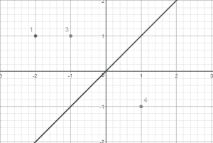

# 检查一条 45 度的线是否能将平面分成两个等重的部分

> 原文:[https://www . geeksforgeeks . org/45 度线检查能否将飞机分成两个重量相等的部件/](https://www.geeksforgeeks.org/check-if-a-line-at-45-degree-can-divide-the-plane-into-two-equal-weight-parts/)

给定一组 **n** 点 **(x <sub>i</sub> ，y <sub>i</sub> )** 在 2D 坐标。每个点都有一些权重 **w <sub>i</sub>** 。任务是检查是否可以画一条 45 度的线，使每一边的点的权重之和相等。
示例:

```
Input : x1 = -1, y1 = 1, w1 = 3
x2 = -2, y2 = 1, w2 = 1
x3 = 1, y3 = -1, w3 = 4

Output : Yes
```



```
Input : x1 = 1, y1 = 1, w1 = 2
x2 = -1, y2 = 1, w2 = 1
x3 = 1, y3 = -1, w3 = 2

Output : No
```

首先，让我们尝试解决垂直线的上述问题，即如果一条线 x = i，我可以将平面分成两部分，使得每一侧的重量总和相等。
观察，多个具有相同 x 坐标的点可以视为一个点，其权重等于所有具有相同 x 坐标的点的权重之和。
现在，遍历从最小 x 坐标到最大 x 坐标的所有 x 坐标。因此，制作一个数组**前缀 _sum[]** ，它将存储权重之和直到点 **x = i** 。
所以，可以有两个选项，答案可以是“是”:

*   前缀 _sum[1，2，…，i-1] =前缀 _sum[i+1，…，n]

*   或者存在一个点 I，使得一条线在
    x = i 和 x = i+1 和 prefix_sum[1，…，i] = prefix_sum[i+1，…，n]，
    之间通过，其中 prefix_sum[i，…，j]是从 I 到 j 的点的权重之和。

```
int is_possible = false;
for (int i = 1; i < prefix_sum.size(); i++)
  if (prefix_sum[i] == total_sum - prefix_sum[i])
    is_possible = true

  if (prefix_sum[i-1] == total_sum - prefix_sum[i])
    is_possible = true
```

现在，为了求解 45 度的直线，我们将每个点旋转 45 度。
参考:[物体的 2D 变换或旋转](https://www.geeksforgeeks.org/2d-transformation-rotation-objects/)
所以，点在(x，y)，旋转 45 度后会变成((x–y)/sqrt(2)，(x + y)/sqrt(2))。
我们可以忽略 sqrt(2)，因为它是比例因子。另外，我们不需要关心旋转后的 y 坐标，因为垂直线无法区分具有相同 x 坐标的点。(x，y <sub>1</sub> )和(x，y <sub>2</sub> )将位于表格 x = k 的右侧、左侧或任意一行上

## C++

```
#include <bits/stdc++.h>
using namespace std;

// Checking if a plane can be divide by a line
// at 45 degrees such that weight sum is equal
void is_partition_possible(int n, int x[],
                            int y[], int w[])
{
    map<int, int> weight_at_x;
    int max_x = -2e3, min_x = 2e3;

    // Rotating each point by 45 degrees and
    // calculating prefix sum.
    // Also, finding maximum and minimum x
    // coordinates
    for (int i = 0; i < n; i++) {
        int new_x = x[i] - y[i];
        max_x = max(max_x, new_x);
        min_x = min(min_x, new_x);

        // storing weight sum upto x - y point
        weight_at_x[new_x] += w[i];
    }

    vector<int> sum_till;
    sum_till.push_back(0);

    // Finding prefix sum
    for (int x = min_x; x <= max_x; x++) {
        sum_till.push_back(sum_till.back() +
                             weight_at_x[x]);
    }

    int total_sum = sum_till.back();

    int partition_possible = false;
    for (int i = 1; i < sum_till.size(); i++) {
        if (sum_till[i] == total_sum - sum_till[i])
            partition_possible = true;

        // Line passes through i, so it neither
        // falls left nor right.
        if (sum_till[i - 1] == total_sum - sum_till[i])
            partition_possible = true;
    }

    printf(partition_possible ? "YES\n" : "NO\n");
}

// Driven Program
int main()
{
    int n = 3;
    int x[] = { -1, -2, 1 };
    int y[] = { 1, 1, -1 };
    int w[] = { 3, 1, 4 };
    is_partition_possible(n, x, y, w);

    return 0;
}
```

## Java 语言(一种计算机语言，尤用于创建网站)

```
import java.util.*;

// Checking if a plane can be divide by a line
// at 45 degrees such that weight sum is equal
class GFG
{

static void is_partition_possible(int n, int x[],
                            int y[], int w[])
{
    Map<Integer, Integer> weight_at_x = new HashMap<Integer, Integer>();
    int max_x = (int) -2e3, min_x = (int) 2e3;

    // Rotating each point by 45 degrees and
    // calculating prefix sum.
    // Also, finding maximum and minimum x
    // coordinates
    for (int i = 0; i < n; i++)
    {
        int new_x = x[i] - y[i];
        max_x = Math.max(max_x, new_x);
        min_x = Math.min(min_x, new_x);

        // storing weight sum upto x - y point
        if(weight_at_x.containsKey(new_x))
        {
             weight_at_x.put(new_x, weight_at_x.get(new_x) + w[i]);
        }
        else
        {
            weight_at_x.put(new_x,w[i]);
        }

        //weight_at_x[new_x] += w[i];
    }

    Vector<Integer> sum_till = new Vector<>();
    sum_till.add(0);

    // Finding prefix sum
    for (int s = min_x; s <= max_x; s++)
    {
        if(weight_at_x.get(s) == null)
            sum_till.add(sum_till.lastElement());
        else
            sum_till.add(sum_till.lastElement() +
                            weight_at_x.get(s));
    }

    int total_sum = sum_till.lastElement();

    int partition_possible = 0;
    for (int i = 1; i < sum_till.size(); i++)
    {
        if (sum_till.get(i) == total_sum - sum_till.get(i))
            partition_possible = 1;

        // Line passes through i, so it neither
        // falls left nor right.
        if (sum_till.get(i-1) == total_sum - sum_till.get(i))
            partition_possible = 1;
    }

    System.out.printf(partition_possible == 1 ? "YES\n" : "NO\n");
}

    // Driven code
    public static void main(String[] args)
    {
        int n = 3;
        int x[] = { -1, -2, 1 };
        int y[] = { 1, 1, -1 };
        int w[] = { 3, 1, 4 };
        is_partition_possible(n, x, y, w);
    }
}

/* This code contributed by PrinciRaj1992 */
```

## 蟒蛇 3

```
from collections import defaultdict

# Checking if a plane can be divide by a line
# at 45 degrees such that weight sum is equal
def is_partition_possible(n, x, y, w):
    weight_at_x = defaultdict(int)
    max_x = -2e3
    min_x = 2e3

    # Rotating each point by 45 degrees and
    # calculating prefix sum.
    # Also, finding maximum and minimum x
    # coordinates
    for i in range(n):
        new_x = x[i] - y[i]
        max_x = max(max_x, new_x)
        min_x = min(min_x, new_x)

        # storing weight sum upto x - y point
        weight_at_x[new_x] += w[i]
    sum_till = []
    sum_till.append(0)

    # Finding prefix sum
    for x in range(min_x, max_x + 1):
        sum_till.append(sum_till[-1] +
                        weight_at_x[x])
    total_sum = sum_till[-1]
    partition_possible = False
    for i in range(1, len(sum_till)):
        if (sum_till[i] == total_sum - sum_till[i]):
            partition_possible = True

        # Line passes through i, so it neither
        # falls left nor right.
        if (sum_till[i - 1] == total_sum - sum_till[i]):
            partition_possible = True
    if partition_possible:
        print("YES")
    else:
        print("NO")

# Driven Program
if __name__ == "__main__":

    n = 3
    x = [-1, -2, 1]
    y = [1, 1, -1]
    w = [3, 1, 4]
    is_partition_possible(n, x, y, w)

    # This code is contributed by chitranayal.
```

## C#

```
// Checking if a plane can be divide by a line
// at 45 degrees such that weight sum is equal
using System;
using System.Collections.Generic;

public class GFG{

    static void is_partition_possible(int n, int[] x, int[] y, int[] w)
    {
        Dictionary<int,int> weight_at_x = new Dictionary<int,int>();
        int max_x = (int) -2e3, min_x = (int) 2e3;

        // Rotating each point by 45 degrees and
        // calculating prefix sum.
        // Also, finding maximum and minimum x
        // coordinates
        for (int i = 0; i < n; i++)
        {
            int new_x = x[i] - y[i];
            max_x = Math.Max(max_x, new_x);
            min_x = Math.Min(min_x, new_x);

            // storing weight sum upto x - y point
            if(weight_at_x.ContainsKey(new_x))
            {
                 weight_at_x[new_x]+=w[i];
            }
            else
            {
                weight_at_x.Add(new_x,w[i]);
            }

            // weight_at_x[new_x] += w[i];

        }
        List<int> sum_till = new List<int>();
        sum_till.Add(0);

        // Finding prefix sum
        for (int s = min_x; s <= max_x; s++)
        {
            if(!weight_at_x.ContainsKey(s))
            {
                sum_till.Add(sum_till[sum_till.Count - 1]);
            }
           else
           {
               sum_till.Add(sum_till[sum_till.Count-1] + weight_at_x[s]);
           }
        }
        int total_sum = sum_till[sum_till.Count-1];
        int partition_possible = 0;
        for (int i = 1; i < sum_till.Count; i++)
        {
            if (sum_till[i] == total_sum - sum_till[i])
                partition_possible = 1;

            // Line passes through i, so it neither
            // falls left nor right.
            if (sum_till[i-1] == total_sum - sum_till[i])
                partition_possible = 1;
        }
        Console.WriteLine(partition_possible == 1 ? "YES" : "NO");
    }

    // Driven code
    static public void Main (){
        int n = 3;
        int[] x = { -1, -2, 1 };
        int[] y = { 1, 1, -1 };
        int[] w = { 3, 1, 4 };
        is_partition_possible(n, x, y, w);
    }
}

// This code is contributed by rag2127
```

## java 描述语言

```
<script>

// Checking if a plane can be divide by a line
// at 45 degrees such that weight sum is equal

    function is_partition_possible(n,x,y,w)
    {
        let weight_at_x = new Map();
    let max_x = -2e3, min_x =  2e3;

    // Rotating each point by 45 degrees and
    // calculating prefix sum.
    // Also, finding maximum and minimum x
    // coordinates
    for (let i = 0; i < n; i++)
    {
        let new_x = x[i] - y[i];
        max_x = Math.max(max_x, new_x);
        min_x = Math.min(min_x, new_x);

        // storing weight sum upto x - y point
        if(weight_at_x.has(new_x))
        {
             weight_at_x.set(new_x, weight_at_x.get(new_x)
             + w[i]);
        }
        else
        {
            weight_at_x.set(new_x,w[i]);
        }

        //weight_at_x[new_x] += w[i];
    }

    let sum_till = [];
    sum_till.push(0);

    // Finding prefix sum
    for (let s = min_x; s <= max_x; s++)
    {
        if(weight_at_x.get(s) == null)
            sum_till.push(sum_till[sum_till.length-1]);
        else
            sum_till.push(sum_till[sum_till.length-1] +
                            weight_at_x.get(s));
    }

    let total_sum = sum_till[sum_till.length-1];

    let partition_possible = 0;
    for (let i = 1; i < sum_till.length; i++)
    {
        if (sum_till[i] == total_sum - sum_till[i])
            partition_possible = 1;

        // Line passes through i, so it neither
        // falls left nor right.
        if (sum_till[i-1] == total_sum - sum_till[i])
            partition_possible = 1;
    }

    document.write(partition_possible == 1 ? "YES\n" : "NO\n");
    }

    // Driven code
    let n = 3;
    let x=[ -1, -2, 1 ];
    let y=[1, 1, -1 ];
    let w=[ 3, 1, 4 ];
    is_partition_possible(n, x, y, w);

// This code is contributed by avanitrachhadiya2155

</script>
```

**输出:**

```
Yes
```