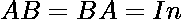
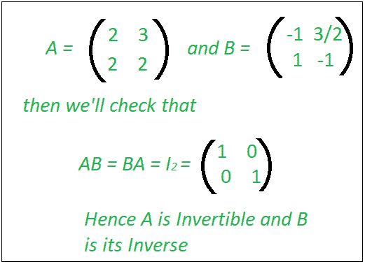

# 检查矩阵是否可逆

> 原文:[https://www . geesforgeks . org/check-if-a-matrix-is-inverted/](https://www.geeksforgeeks.org/check-if-a-matrix-is-invertible/)

在线性代数中，一个 **n 乘 n** 的方阵 **A** 被称为可逆的，如果存在一个 n 乘 n 的方阵 **B** 使得

其中中的**表示 **n 乘 n** 的单位矩阵。矩阵 **B** 称为 **A** 的逆矩阵。
**方阵可逆当且仅当其行列式非零。**** 



示例:

```
Input : {{1, 2, 3}
         {4, 5, 6}
         {7, 8, 9}}
Output : No
The given matrix is NOT Invertible
The value of Determinant is: 0

```

我们找到矩阵的[行列式。然后我们检查行列式值是否为 0。如果值为 0，那么我们输出，不可逆。](https://www.geeksforgeeks.org/determinant-of-a-matrix/) 

## C++

```
// C++ program to find Determinant of a matrix
#include <bits/stdc++.h>
using namespace std;

// Dimension of input square matrix
#define N 4

// Function to get cofactor of mat[p][q] in temp[][]. n is current
// dimension of mat[][]
void getCofactor(int mat[N][N], int temp[N][N], int p, int q, int n)
{
    int i = 0, j = 0;

    // Looping for each element of the matrix
    for (int row = 0; row < n; row++) {
        for (int col = 0; col < n; col++) {
            // Copying into temporary matrix only those element
            // which are not in given row and column
            if (row != p && col != q) {
                temp[i][j++] = mat[row][col];

                // Row is filled, so increase row index and
                // reset col index
                if (j == n - 1) {
                    j = 0;
                    i++;
                }
            }
        }
    }
}

/* Recursive function for finding determinant of matrix.
n is current dimension of mat[][]. */
int determinantOfMatrix(int mat[N][N], int n)
{
    int D = 0; // Initialize result

    // Base case : if matrix contains single element
    if (n == 1)
        return mat[0][0];

    int temp[N][N]; // To store cofactors

    int sign = 1; // To store sign multiplier

    // Iterate for each element of first row
    for (int f = 0; f < n; f++) {
        // Getting Cofactor of mat[0][f]
        getCofactor(mat, temp, 0, f, n);
        D += sign * mat[0][f] * determinantOfMatrix(temp, n - 1);

        // terms are to be added with alternate sign
        sign = -sign;
    }

    return D;
}

bool isInvertible(int mat[N][N], int n)
{
    if (determinantOfMatrix(mat, N) != 0)
        return true;
    else
        return false;
}

// Driver program to test above functions
int main()
{
    /* int mat[N][N] = {{6, 1, 1},
                    {4, -2, 5},
                    {2, 8, 7}}; */

    int mat[N][N] = { { 1, 0, 2, -1 },
                      { 3, 0, 0, 5 },
                      { 2, 1, 4, -3 },
                      { 1, 0, 5, 0 } };
    if (isInvertible(mat, N))
        cout << "Yes";
    else
        cout << "No";
    return 0;
}
```

## Java 语言(一种计算机语言，尤用于创建网站)

```
// Java program to find
// Determinant of a matrix
class GFG
{

    // Dimension of input square matrix
    static int N = 4;

    // Function to get cofactor
    // of mat[p][q] in temp[][].
    // n is current dimension
    // of mat[][]
    static void getCofactor(int [][]mat, int [][]temp,
                            int p, int q, int n)
    {
    int i = 0, j = 0;

    // Looping for each
    // element of the matrix
    for (int row = 0; row < n; row++)
    {
        for (int col = 0; col < n; col++)
        {
            // Copying into temporary matrix
            // only those element which are
            // not in given row and column
            if (row != p && col != q)
            {
                temp[i][j++] = mat[row][col];

                // Row is filled, so increase
                // row index and reset col index
                if (j == n - 1)
                {
                    j = 0;
                    i++;
                }
            }
        }
    }
    }

    /* Recursive function for finding
    determinant of matrix. n is current
    dimension of mat[][]. */
    static int determinantOfMatrix(int [][]mat,
                                   int n)
    {
    int D = 0; // Initialize result

    // Base case : if matrix
    // contains single element
    if (n == 1)
        return mat[0][0];

    // To store cofactors
    int [][]temp = new int[N][N];

    // To store sign multiplier
    int sign = 1;

    // Iterate for each
    // element of first row
    for (int f = 0; f < n; f++)
    {
        // Getting Cofactor of mat[0][f]
        getCofactor(mat, temp, 0, f, n);
        D += sign * mat[0][f] *
             determinantOfMatrix(temp, n - 1);

        // terms are to be added
        // with alternate sign
        sign = -sign;
    }

    return D;
    }

    static boolean isInvertible(int [][]mat, int n)
    {
        if (determinantOfMatrix(mat, N) != 0)
            return true;
        else
            return false;
    }

    // Driver Code
    public static void main(String []args)
    {
        int [][]mat = {{1, 0, 2, -1 },
                       {3, 0, 0, 5 },
                       {2, 1, 4, -3 },
                       {1, 0, 5, 0 }};
        if (isInvertible(mat, N))
            System.out.println("Yes");
        else
            System.out.println("No");
    }
}

// This code is contributed
// by ChitraNayal
```

## 蟒蛇 3

```
# Function to get cofactor of
# mat[p][q] in temp[][]. n is
# current dimension of mat[][]
def getCofactor(mat, temp, p, q, n):
    i = 0
    j = 0

    # Looping for each element
    # of the matrix
    for row in range(n):

        for col in range(n):

            # Copying into temporary matrix
            # only those element which are
            # not in given row and column
            if (row != p and col != q) :

                temp[i][j] = mat[row][col]
                j += 1

                # Row is filled, so increase
                # row index and reset col index
                if (j == n - 1):
                    j = 0
                    i += 1

# Recursive function for
# finding determinant of matrix.
# n is current dimension of mat[][].
def determinantOfMatrix(mat, n):
    D = 0 # Initialize result

    # Base case : if matrix
    # contains single element
    if (n == 1):
        return mat[0][0]

    # To store cofactors
    temp = [[0 for x in range(N)]
               for y in range(N)]

    sign = 1 # To store sign multiplier

    # Iterate for each
    # element of first row
    for f in range(n):

        # Getting Cofactor of mat[0][f]
        getCofactor(mat, temp, 0, f, n)
        D += (sign * mat[0][f] *
              determinantOfMatrix(temp, n - 1))

        # terms are to be added
        # with alternate sign
        sign = -sign
    return D

def isInvertible(mat, n):
    if (determinantOfMatrix(mat, N) != 0):
        return True
    else:
        return False

# Driver Code
mat = [[ 1, 0, 2, -1 ],
       [ 3, 0, 0, 5 ],
       [ 2, 1, 4, -3 ],
       [ 1, 0, 5, 0 ]];

N = 4
if (isInvertible(mat, N)):
    print("Yes")
else:
    print("No")

# This code is contributed
# by ChitraNayal
```

## C#

```
// C# program to find
// Determinant of a matrix
using System;

class GFG
{

// Dimension of input
// square matrix
static int N = 4;

// Function to get cofactor of
// mat[p,q] in temp[,]. n is
// current dimension of mat[,]
static void getCofactor(int[,] mat, int[,] temp,
                        int p, int q, int n)
{
int i = 0, j = 0;

// Looping for each element
// of the matrix
for (int row = 0; row < n; row++)
{
    for (int col = 0; col < n; col++)
    {
        // Copying into temporary matrix
        // only those element which are
        // not in given row and column
        if (row != p && col != q)
        {
            temp[i, j++] = mat[row, col];

            // Row is filled, so
            // increase row index and
            // reset col index
            if (j == n - 1)
            {
                j = 0;
                i++;
            }
        }
    }
}
}

/* Recursive function for finding
determinant of matrix. n is current
dimension of mat[,]. */
static int determinantOfMatrix(int[,]
                               mat, int n)
{
int D = 0; // Initialize result

// Base case : if matrix
// contains single element
if (n == 1)
    return mat[0, 0];

// To store cofactors
int[,] temp = new int[N, N];

int sign = 1; // To store sign multiplier

// Iterate for each
// element of first row
for (int f = 0; f < n; f++)
{
    // Getting Cofactor of mat[0,f]
    getCofactor(mat, temp, 0, f, n);
    D += sign * mat[0, f] *    
         determinantOfMatrix(temp, n - 1);

    // terms are to be added
    // with alternate sign
    sign = -sign;
}
return D;
}

static bool isInvertible(int[,] mat, int n)
{
    if (determinantOfMatrix(mat, N) != 0)
        return true;
    else
        return false;
}

// Driver Code
public static void Main()
{
    int[,] mat = {{ 1, 0, 2, -1 },
                  { 3, 0, 0, 5 },
                  { 2, 1, 4, -3 },
                  { 1, 0, 5, 0 }};
    if (isInvertible(mat, N))
        Console.Write("Yes");
    else
        Console.Write("No");
}
}

// This code is contributed
// by ChitraNayal
```

## 服务器端编程语言（Professional Hypertext Preprocessor 的缩写）

```
<?php
// PHP program to find Determinant
// of a matrix

// Dimension of input
// square matrix
$N = 4;

// Function to get cofactor of
// $mat[$p][$q] in $temp[][].
// $n is current dimension of $mat[][]
function getCofactor(&$mat, &$temp,
                      $p, $q, $n)
{
    $i = 0;
    $j = 0;

    // Looping for each element
    // of the matrix
    for ($row = 0; $row < $n; $row++)
    {
        for ($col = 0; $col < $n; $col++)
        {
            // Copying into temporary matrix
            // only those element which are
            // not in given row and column
            if ($row != $p && $col != $q)
            {
                $temp[$i][$j++] = $mat[$row][$col];

                // Row is filled, so
                // increase row index and
                // reset col index
                if ($j == $n - 1)
                {
                    $j = 0;
                    $i++;
                }
            }
        }
    }
}

/* Recursive function for finding
determinant of matrix. n is current
dimension of $mat[][]. */
function determinantOfMatrix(&$mat, $n)
{
    $D = 0; // Initialize result

    // Base case : if matrix
    // contains single element
    if ($n == 1)
        return $mat[0][0];

    $temp = array(array()); // To store cofactors

    $sign = 1; // To store sign multiplier

    // Iterate for each
    // element of first row
    for ($f = 0; $f < $n; $f++)
    {
        // Getting Cofactor of $mat[0][$f]
        getCofactor($mat, $temp, 0, $f, $n);
        $D += $sign * $mat[0][$f] *
              determinantOfMatrix($temp, $n - 1);

        // terms are to be added
        // with alternate sign
        $sign = -$sign;
    }

    return $D;
}

function isInvertible(&$mat, $n)
{
    global $N;
    if (determinantOfMatrix($mat, $N) != 0)
        return true;
    else
        return false;
}

// Driver Code
$mat = array(array(1, 0, 2, -1 ),
             array(3, 0, 0, 5 ),
             array(2, 1, 4, -3 ),
             array(1, 0, 5, 0 ));
if (isInvertible($mat, $N))
    echo "Yes";
else
    echo "No";

// This code is contributed
// by ChitraNayal
?>
```

## java 描述语言

```
<script>
// Javascript program to find
// Determinant of a matrix

// Function to get cofactor
    // of mat[p][q] in temp[][].
    // n is current dimension
    // of mat[][]   
function getCofactor(mat,temp,p,q,n)
{
    let i = 0, j = 0;

    // Looping for each
    // element of the matrix
    for (let row = 0; row < n; row++)
    {
        for (let col = 0; col < n; col++)
        {
            // Copying into temporary matrix
            // only those element which are
            // not in given row and column
            if (row != p && col != q)
            {
                temp[i][j++] = mat[row][col];

                // Row is filled, so increase
                // row index and reset col index
                if (j == n - 1)
                {
                    j = 0;
                    i++;
                }
            }
        }
    }
}

/* Recursive function for finding
    determinant of matrix. n is current
    dimension of mat[][]. */
function determinantOfMatrix(mat,n)
{
    let D = 0; // Initialize result

    // Base case : if matrix
    // contains single element
    if (n == 1)
        return mat[0][0];

    // To store cofactors
    let temp = new Array(N);
    for(let i=0;i<N;i++)
    {
        temp[i]=new Array(N);
        for(let j=0;j<N;j++)
        {
            temp[i][j]=0;
        }
    }

    // To store sign multiplier
    let sign = 1;

    // Iterate for each
    // element of first row
    for (let f = 0; f < n; f++)
    {
        // Getting Cofactor of mat[0][f]
        getCofactor(mat, temp, 0, f, n);
        D += sign * mat[0][f] *
             determinantOfMatrix(temp, n - 1);

        // terms are to be added
        // with alternate sign
        sign = -sign;
    }

    return D;
}

function isInvertible(mat,n)
{
    if (determinantOfMatrix(mat, N) != 0)
            return true;
        else
            return false;
}

// Driver Code

let mat = [[ 1, 0, 2, -1 ],
       [ 3, 0, 0, 5 ],
       [ 2, 1, 4, -3 ],
       [ 1, 0, 5, 0 ]];

let N = 4
if (isInvertible(mat, N))
    document.write("Yes")
else
    document.write("No")

// This code is contributed by rag2127
</script>
```

**Output:** 

```
Yes
```