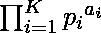
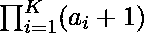

# 检查一个数是否可以表示为正好 K 个质因数的乘积

> 原文:[https://www . geeksforgeeks . org/check-if-a-number-can-expression-as-a-product-of-恰好 k-prime-divisions/](https://www.geeksforgeeks.org/check-if-a-number-can-be-expressed-as-a-product-of-exactly-k-prime-divisors/)

给定一个**整数 N** ，任务是检查它是否可以精确地表示为 **K** 质因数的乘积。
**例:**

```
Input: N = 12, K = 3
Output: Yes
Explanation:
12 can be expressed as product of 2×2×3.

Input: N = 14, K = 3
Output:  No
Explanation:
14 can be only expressed as product of 2×7.
```

**方法:**
为了解决上面提到的问题，我们被赋予了值 N，并且我们将找到**最大数量的值，我们可以将 N 分割成**。我们可以把 **N** 的素因子分解表示为，其中 *p <sub> i </sub>* 是 **N** 的素因子， *a <sub> i </sub>* 是指数。我们知道 **N** 的[除数](https://www.geeksforgeeks.org/total-number-divisors-given-number/)合计为。因此，我们可以观察到，我们必须检查是否有可能将 **N** 表示为 **K** 数字的乘积。如果最大分裂小于 K，那么就不可能用 K 个质因数来表示，否则总是可能的。

## C++

```
// CPP implementation to Check if a
// number can be expressed as a
// product of exactly K prime divisors

#include <bits/stdc++.h>
using namespace std;

// function to find K prime divisors
void KPrimeDivisors(int N, int K)
{
    int maximum_split = 0;

    // count number of 2s that divide N
    while (N % 2 == 0) {
        maximum_split++;
        N /= 2;
    }

    // N must be odd at this point.
    // So we can skip one element
    for (int i = 3; i * i <= N; i = i + 2) {

        while (N % i == 0) {
            // divide the value of N
            N = N / i;

            // increment count
            maximum_split++;
        }
    }

    // Condition to handle the case when n
    // is a prime number greater than 2
    if (N > 2)
        maximum_split++;

    // check if maximum_split is less than K
    // then it not possible
    if (maximum_split < K) {
        printf("No\n");
        return;
    }

    printf("Yes\n");
}

/* Driver code */
int main()
{
    // initialise N and K
    int N = 12;
    int K = 3;

    KPrimeDivisors(N, K);

    return 0;
}
```

## Java 语言(一种计算机语言，尤用于创建网站)

```
// Java implementation to Check if a
// number can be expressed as a
// product of exactly K prime divisors
class GFG {

    // function to find K prime divisors
    static void KPrimeDivisors(int N, int K)
    {
        int maximum_split = 0;

        // count number of 2s that divide N
        while (N % 2 == 0) {
            maximum_split++;
            N /= 2;
        }

        // N must be odd at this point.
        // So we can skip one element
        for (int i = 3; i * i <= N; i = i + 2) {

            while (N % i == 0) {
                // divide the value of N
                N = N / i;

                // increment count
                maximum_split++;
            }
        }

        // Condition to handle the case when n
        // is a prime number greater than 2
        if (N > 2)
            maximum_split++;

        // check if maximum_split is less than K
        // then it not possible
        if (maximum_split < K) {
            System.out.println("No");
            return;
        }

        System.out.println("Yes");
    }

    /* Driver code */
    public static void main (String[] args)
    {
        // initialise N and K
        int N = 12;
        int K = 3;

        KPrimeDivisors(N, K);
    }
}

// This code is contributed by Yash_R
```

## 蟒蛇 3

```
# Python implementation to Check if a
# number can be expressed as a
# product of exactly K prime divisors

import math as mt

# function to find K prime divisors
def KPrimeDivisors(n, k):

    # To count maximum split of N
    maximum_split = 0

    # count number of 2s that divide N
    while n % 2 == 0:
        maximum_split+= 1
        n = n // 2

    # n must be odd at this point
    # so we skip one element
    for i in range(3, mt.ceil(mt.sqrt(n)), 2):
        while n % i == 0:
            n = n / i;
            maximum_split+= 1

    # Condition to handle the case when n
    # is a prime number greater than 2
    if n > 2:
        maximum_split+= 1

    # check if maximum_split is less than K
    # then it not possible
    if maximum_split < k:
        print("No")
        return

    print("Yes")

# Driver code
N = 12
K = 3
KPrimeDivisors(N, K)
```

## C#

```
// C# implementation to Check if a
// number can be expressed as a
// product of exactly K prime divisors
using System;

class GFG {

    // function to find K prime divisors
    static void KPrimeDivisors(int N, int K)
    {
        int maximum_split = 0;

        // count number of 2s that divide N
        while (N % 2 == 0) {
            maximum_split++;
            N /= 2;
        }

        // N must be odd at this point.
        // So we can skip one element
        for (int i = 3; i * i <= N; i = i + 2) {

            while (N % i == 0) {

                // divide the value of N
                N = N / i;

                // increment count
                maximum_split++;
            }
        }

        // Condition to handle the case when n
        // is a prime number greater than 2
        if (N > 2)
            maximum_split++;

        // check if maximum_split is less than K
        // then it not possible
        if (maximum_split < K) {
            Console.WriteLine("No");
            return;
        }

        Console.WriteLine("Yes");
    }

    /* Driver code */
    public static void Main(String[] args)
    {
        // initialise N and K
        int N = 12;
        int K = 3;

        KPrimeDivisors(N, K);
    }
}

// This code is contributed by 29AjayKumar
```

## java 描述语言

```
<script>
// javascript implementation to Check if a
// number can be expressed as a
// product of exactly K prime divisors    

// function to find K prime divisors
    function KPrimeDivisors(N , K)
    {
        var maximum_split = 0;

        // count number of 2s that divide N
        while (N % 2 == 0)
        {
            maximum_split++;
            N /= 2;
        }

        // N must be odd at this point.
        // So we can skip one element
        for (i = 3; i * i <= N; i = i + 2)
        {

            while (N % i == 0)
            {

                // divide the value of N
                N = N / i;

                // increment count
                maximum_split++;
            }
        }

        // Condition to handle the case when n
        // is a prime number greater than 2
        if (N > 2)
            maximum_split++;

        // check if maximum_split is less than K
        // then it not possible
        if (maximum_split < K)
        {
            document.write("No");
            return;
        }

        document.write("Yes");
    }

    /* Driver code */

        // initialise N and K
        var N = 12;
        var K = 3;
        KPrimeDivisors(N, K);

// This code is contributed by gauravrajput1.
</script>
```

**Output:** 

```
Yes
```

**时间复杂度:** O(sqrt(N))

**辅助空间:** O(1)