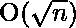

# 检查一个数字是否为异常数字

> 原文:[https://www . geesforgeks . org/check-如果一个数字是一个不寻常的数字或不是/](https://www.geeksforgeeks.org/check-if-a-number-is-an-unusual-number-or-not/)

给定一个正整数 N。任务是检查 N 是否是一个不寻常的数字。如果 M 是一个不寻常的数字，则打印“是”，否则打印“否”。
[**异常数**](https://en.wikipedia.org/wiki/Unusual_number) :在数学中，异常数是一个自然数，其最大质因数严格大于 n 的平方根。
前几个异常数是–

> 2、3、5、6、7、10、11、13、14、15、17、19、20、21、22、23、26、28、29、31、33、34、35、37、38、39、41、42、43、44、46、47、51

**示例**:

```
Input : N = 14
Output : YES
Explanation : 7 is largest prime factor of 14
and 7 is strictly greater than square root of 14

Input : N = 16
Output : NO
Explanation : 2 is largest prime factor of 16
and 2 is less than square root of 16 ( i.e 4 ).
```

**进场:**

1.  求给定数 N 的最大质因数要求 N 的最大质因数[参考此](https://www.geeksforgeeks.org/find-largest-prime-factor-number/)。
2.  检查 N 的最大质因数是否严格大于 N 的平方根
3.  如果“是”，那么 N 是一个不寻常的数字，否则不是。

下面是上述方法的实现:

## C++

```
// C++ Program to check Unusual number
#include <bits/stdc++.h>
using namespace std;

// Utility function to find largest
// prime factor of a number
int largestPrimeFactor(int n)
{
    // Initialize the maximum prime factor
    // variable with the lowest one
    int max = -1;

    // Print the number of 2s that divide n
    while (n % 2 == 0) {
        max = 2;
        n >>= 1; // equivalent to n /= 2
    }

    // n must be odd at this point, thus skip
    // the even numbers and iterate only for
    // odd integers
    for (int i = 3; i <= sqrt(n); i += 2) {
        while (n % i == 0) {
            max = i;
            n = n / i;
        }
    }

    // This condition is to handle the case
    // when n is a prime number greater than 2
    if (n > 2)
        max = n;

    return max;
}

// Function to check Unusual number
bool checkUnusual(int n)
{
    // Get the largest Prime Factor
    // of the number
    int factor = largestPrimeFactor(n);

    // Check if largest prime factor
    // is greater than sqrt(n)
    if (factor > sqrt(n)) {
        return true;
    }
    else {
        return false;
    }
}

// Driver Code
int main()
{
    int n = 14;

    if (checkUnusual(n)) {
        cout << "YES"
             << "\n";
    }
    else {
        cout << "NO"
             << "\n";
    }

    return 0;
}
```

## Java 语言(一种计算机语言，尤用于创建网站)

```
// Java Program to check Unusual number

class GFG {

    // Utility function to find largest
    // prime factor of a number
    static int largestPrimeFactor(int n)
    {
        // Initialize the maximum prime factor
        // variable with the lowest one
        int max = -1;

        // Print the number of 2s that divide n
        while (n % 2 == 0) {
            max = 2;
            n >>= 1; // equivalent to n /= 2
        }

        // n must be odd at this point, thus skip
        // the even numbers and iterate only for
        // odd integers
        for (int i = 3; i <= Math.sqrt(n); i += 2) {
            while (n % i == 0) {
                max = i;
                n = n / i;
            }
        }

        // This condition is to handle the case
        // when n is a prime number greater than 2
        if (n > 2)
            max = n;

        return max;
    }

    // Function to check Unusual number
    static boolean checkUnusual(int n)
    {
        // Get the largest Prime Factor
        // of the number
        int factor = largestPrimeFactor(n);

        // Check if largest prime factor
        // is greater than sqrt(n)
        if (factor > Math.sqrt(n)) {
            return true;
        }
        else {
            return false;
        }
    }

    // Driver Code
    public static void main(String[] args)
    {
        int n = 14;

        if (checkUnusual(n)) {
            System.out.println("YES");
        }
        else {
            System.out.println("NO");
        }
    }
}
```

## 蟒蛇 3

```
# Python Program to check Unusual number
from math import sqrt

# Utility function to find largest
# prime factor of a number
def largestPrimeFactor(n):

    # Initialize the maximum prime factor
    # variable with the lowest one
    max = -1

    # Print the number of 2s that divide n
    while n % 2 == 0:
        max = 2;
        n >>= 1; # equivalent to n /= 2

    # n must be odd at this point, thus skip
    # the even numbers and iterate only for
    # odd integers
    for i in range(3,int(sqrt(n))+1,2):
        while n % i == 0:
            max = i;
            n = n / i;

    # This condition is to handle the case
    # when n is a prime number greater than 2
    if n > 2:
        max = n

    return max

# Function to check Unusual number
def checkUnusual(n):
    # Get the largest Prime Factor
    # of the number
    factor = largestPrimeFactor(n)

    # Check if largest prime factor
    # is greater than sqrt(n)
    if factor > sqrt(n):
        return True
    else :
        return False

# Driver Code
if __name__ == '__main__':

    n = 14

    if checkUnusual(n):
        print("YES")
    else:
        print("NO")

# This code is contributed
# by Harshit Saini
```

## C#

```
// C# Program to check Unusual number

using System;
class GFG {

    // Utility function to find largest
    // prime factor of a number
    static int largestPrimeFactor(int n)
    {
        // Initialize the maximum prime factor
        // variable with the lowest one
        int max = -1;

        // Print the number of 2s that divide n
        while (n % 2 == 0) {
            max = 2;
            n >>= 1; // equivalent to n /= 2
        }

        // n must be odd at this point, thus skip
        // the even numbers and iterate only for
        // odd integers
        for (int i = 3; i <= Math.Sqrt(n); i += 2) {
            while (n % i == 0) {
                max = i;
                n = n / i;
            }
        }

        // This condition is to handle the case
        // when n is a prime number greater than 2
        if (n > 2)
            max = n;

        return max;
    }

    // Function to check Unusual number
    static bool checkUnusual(int n)
    {
        // Get the largest Prime Factor
        // of the number
        int factor = largestPrimeFactor(n);

        // Check if largest prime factor
        // is greater than sqrt(n)
        if (factor > Math.Sqrt(n)) {
            return true;
        }
        else {
            return false;
        }
    }

    // Driver Code
    public static void Main()
    {
        int n = 14;

        if (checkUnusual(n)) {
            Console.WriteLine("YES");
        }
        else {
            Console.WriteLine("NO");
        }
    }
}
```

## 服务器端编程语言（Professional Hypertext Preprocessor 的缩写）

```
<?php
// PHP Program to check Unusual number

// Utility function to find largest
// prime factor of a number
function largestPrimeFactor($n)
{
    // Initialize the maximum prime factor
    // variable with the lowest one
    $max = -1;

    // Print the number of 2s that divide n
    while ($n % 2 == 0) {
        $max = 2;
        $n >>= 1; // equivalent to n /= 2
    }

    // n must be odd at this point, thus skip
    // the even numbers and iterate only for
    // odd integers
    for ($i = 3; $i <= sqrt($n); $i += 2) {
        while ($n % $i == 0) {
            $max = $i;
            $n = $n / $i;
        }
    }

    // This condition is to handle the case
    // when n is a prime number greater than 2
    if ($n > 2)
        $max = $n;

    return $max;
}

// Function to check Unusual number
function checkUnusual($n)
{
    // Get the largest Prime Factor
    // of the number
    $factor = largestPrimeFactor($n);

    // Check if largest prime factor
    // is greater than sqrt(n)
    if ($factor > sqrt($n)) {
        return true;
    }
    else {
        return false;
    }
}

// Driver Code 
$n = 14;

if (checkUnusual($n)) {
    echo "YES"."\n";
}
else {
    echo "NO"."\n";
}
// This code is contributed
// by Harshit Saini
?>
```

## java 描述语言

```
<script>

// javascript Program to check Unusual number

    // Utility function to find largest
    // prime factor of a number

    function largestPrimeFactor( n)
    {
        // Initialize the maximum prime factor
        // variable with the lowest one

        var max = -1;

        // Print the number of 2s that divide n
        while (n % 2 == 0) {
            max = 2;
            n >>= 1; // equivalent to n /= 2
        }

        // n must be odd at this point, thus skip
        // the even numbers and iterate only for
        // odd integers

        for (var i = 3; i <= Math.sqrt(n); i += 2) {
            while (n % i == 0) {
                max = i;
                n = n / i;
            }
        }

        // This condition is to handle the case
        // when n is a prime number greater than 2
        if (n > 2)
            max = n;

        return max;
    }

    // Function to check Unusual number

    function  checkUnusual(n)
    {
        // Get the largest Prime Factor
        // of the number

        var factor = largestPrimeFactor(n);

        // Check if largest prime factor
        // is greater than sqrt(n)

        if (factor > Math.sqrt(n)) {
            return true;
        }
        else {
            return false;
        }
    }

    // Driver Code

        var n = 14;

        if (checkUnusual(n)) {
            document.write("YES");
        }
        else {
            document.write("NO");
        }

 </script>
```

**Output:** 

```
YES
```

时间复杂度:
辅助空间: