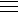

# 检查一个数是否能被 41 整除

> 原文:[https://www . geeksforgeeks . org/check-如果一个数字被 41 整除或不被整除/](https://www.geeksforgeeks.org/check-if-a-number-is-divisible-by-41-or-not/)

给定一个数字，任务是快速检查这个数字是否能被 41 整除。

**示例:**

```
Input : x  = 123
Output : Yes

Input : 104413920565933
Output : YES
```

解决这个问题的方法是提取最后一个数字，从剩余的数字中减去最后一个数字的 4 倍，重复这个过程，直到得到一个两位数。如果得到的两位数能被 41 整除，那么给定的数就能被 41 整除。
**进场:**

*   每次提取数字/截断数字的最后一位数字
*   从截断的数字中减去 4*(前一个数字的最后一位数字)
*   根据需要重复以上三个步骤。

**插图:**

```
Illustration 1:
30873-->3087-4*3=3075-->307-4*5=287-->28-4*7=0
As the remainder is zero, 30873 is divisible by 41

Illustration 2:
104413920565933 --> 10441392056593 - 4*3= 10441392056581
10441392056581 --> 1044139205658 - 4*1 = 1044139205654
1044139205654 --> 104413920565 - 4*4 = 104413920549
104413920549 --> 10441392054 - 4*9 = 10441392018
10441392018 --> 1044139201 - 4*8 = 1044139169
1044139169 --> 104413916 - 4*9 = 104413880
104413880 --> 10441388 - 4*0 = 10441380
10441388 --> 1044138 - 4*8 = 1044106
1044106 --> 104410 - 4*6 = 104386
104386 --> 10438 - 4*6 = 10414
10414 --> 1041 - 4*4 = 1025
1025 --> 102 - 4*5 =82
Now, 82%41 = 0 --> 82 is divisible by 41 and hence, 104413920565933 is divisible by 41
```

> **数学证明:**
> Let
> 
> 
> 
> 可以是任何这样的数字
> 
> 
> 
> = 100 a+10b+c
> 现在假设
> 
> 
> 
> 可被 41 整除。然后
> 
> 
> 
> 0 (mod 41)
> 100a+10b+c
> 
> 
> 
> 0 (mod 41)
> 10(10a+b)+c
> 
> 
> 
> 0(对 41)
> 10
> 
> 
> 
> +c
> 
> 
> 
> 0 (mod 41)
> 既然已经把最后一位数字和数字分开了，就要想办法使用。
> 使系数
> 
> 
> 
> 1.
> 换句话说，我们必须找到一个整数，使得 n 使得 10n
> 
> 
> 
> 1 辆 mod 41。
> 可以观察到满足这个性质的最小 n 是-4 as -40
> 
> 
> 
> 1 辆 mod 41。
> 现在我们可以将原方程 10 相乘
> 
> 
> 
> +c
> 
> 
> 
> 0 (mod 41)
> 乘以-4 并简化为:
> -40
> 
> 
> 
> -4c
> 
> 
> 
> 0(与 41 号相比)
> 
> 
> 
> -4c
> 
> 
> 
> 0 (mod 41)
> 我们发现如果
> 
> 
> 
> 0 (mod 41)然后，
> 
> 
> 
> -4c
> 
> 
> 
> 0 (mod 41)。
> 换句话说，要检查一个 3 位数是否能被 41 整除，
> 我们只需要去掉最后一位数字，乘以 4，
> 然后从剩下的两位数中减去。

下面是上述方法的实现:

## C++

```
// CPP program to validate above logic
#include <bits/stdc++.h>
using namespace std;

// Function to check if the number
// is divisible by 41 or not
bool isDivisible(long long int n)
{
    while (n / 100)
    {
        // Extracting the last digit
        int d = n % 10;

        // Truncating the number
        n /= 10;

        // Subtracting the four times
        // the last digit from the
        // remaining number
        n -= d * 4;
    }

    // return true if number is divisible by 41
    return (n % 41 == 0);
}

int main()
{
    long long int n = 104413920565933;
    if (isDivisible(n))
        cout << "Yes" << endl;
    else
        cout << "No" << endl;
    return 0;
}
```

## Java 语言(一种计算机语言，尤用于创建网站)

```
// Java program to validate above logic

class GFG {

// Function to check if the number
// is divisible by 41 or not
    static boolean isDivisible(long n) {
        while (n / 100 != 0) {
// Extracting the last digit
            int d = (int) (n % 10);

// Truncating the number
            n /= 10;

// Subtracting the four times
// the last digit from the
// remaining number
            n -= d * 4;
        }

// return true if number
// is divisible by 41
        return (n % 41 == 0);
    }

    public static void main(String[] args) {
        long n = 104413920565933L;
        if (isDivisible(n)) {
            System.out.println("Yes");
        } else {
            System.out.println("No");
        }

    }
}
// This code is contributed by RAJPUT-JI
```

## 蟒蛇 3

```
# Python3 Program to validate above logic

# Function to check if the number
# is divisible by 41 or not
def isDivisible(n) :

    while n // 100 :

        # Extracting the last digit
        d = n % 10

        # Truncating the number
        n //= 10

        # Subtracting the four times
        # the last digit from the 
        # remaining number
        n -= d * 4

    # return true if number is divisible by 41
    return n % 41 == 0

# Driver Code
if __name__ == "__main__" :

    n = 104413920565933

    if isDivisible(n) :
        print("Yes")

    else :
        print("No")

# This code is contributed by ANKITRAI1
```

## C#

```
// C# program to validate above logic
using System;

class GFG
{
// Function to check if the number
// is divisible by 41 or not
static bool isDivisible(long n)
{
    while (n / 100 != 0)
    {
        // Extracting the last digit
        int d = (int)(n % 10);

        // Truncating the number
        n /= 10;

        // Subtracting the four times
        // the last digit from the
        // remaining number
        n -= d * 4;
    }

    // return true if number
    // is divisible by 41
    return (n % 41 == 0);
}

// Driver Code
static public void Main ()
{
    long n = 104413920565933;
    if (isDivisible(n))
        Console.Write("Yes");
    else
        Console.Write("No");
}
}

// This code is contributed by Raj
```

## 服务器端编程语言（Professional Hypertext Preprocessor 的缩写）

```
<?php
// PHP program to validate above logic

// Function to check if the number
// is divisible by 41 or not
function isDivisible($n)
{
    while ($n / 100)
    {
        // Extracting the last digit
        $d = $n % 10;

        // Truncating the number
        $n /= 10;

        // Subtracting the four times
        // the last digit from the
        // remaining number
        $n -= $d * 4;
    }

    // return true if number
    // is divisible by 41
    return ($n % 41 == 0);
}

// Driver Code
$n = 104413920565933;
if (isDivisible($n))
    echo "Yes"."\n";
else
    echo "No"."\n";

// This code is contributed
// by ChitraNayal
?>
```

## java 描述语言

```
<script>

// JavaScript program to validate above logic

// Function to check if the number
// is divisible by 41 or not

    function isDivisible(n)
    {
        while (Math.floor(n / 100) != 0) {
// Extracting the last digit
            let d =  (n % 10);

// Truncating the number
            n = Math.floor(n/10);

// Subtracting the four times
// the last digit from the
// remaining number
            n -= d * 4;
        }

// return true if number
// is divisible by 41
        return (n % 41 == 0);
    }

    let n = 104413920565933;
        if (isDivisible(n)) {
            document.write("Yes");
        } else {
            document.write("No");
        }

// This code is contributed by avanitrachhadiya2155

</script>
```

**Output:** 

```
Yes
```

请注意，上面的程序可能没有多大意义，因为可以简单地做 n % 41 来检查可分性。这个程序的想法是验证这个概念。此外，如果输入数字很大并且以字符串形式给出，这可能是一种有效的方法。