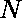

# 检查一个数字是否仅由 1、14 或 144 串联而成

> 原文:[https://www . geesforgeks . org/check-如果一个数字是由 1-14 或-144-only 串联而成的/](https://www.geeksforgeeks.org/check-if-a-number-is-formed-by-concatenation-of-1-14-or-144-only/)

给定一个数字。任务是检查数字是否是由数字 1、14 和 144 以任意顺序串联起来的。
如有可能，打印 YES 否则打印 NO.
**例:**

```
Input: N = 141411
Output: YES 

Input: N = 14134
Output: NO
```

这个想法是从末尾提取一位数、两位数和三位数，并检查它们中是否有任何一个分别与 1、14 和 144 匹配。如果其中任何一个匹配，用那个数除，重复上述步骤，直到这个数大于零。
以下是使用上述方法的实现:

## C++

```
// C++ program to check if a number is formed
// by Concatenation of 1, 14 or 144 only

#include <iostream>
using namespace std;

// Function to check if a number is formed
// by Concatenation of 1, 14 or 144 only
string checkNumber(int N)
{
    int temp = N;

    while (temp > 0) {
        // check for each possible digit
        // if given number consist other then
        // 1, 14, 144 print NO else print YES
        if (temp % 1000 == 144)
            temp /= 1000;
        else if (temp % 100 == 14)
            temp /= 100;
        else if (temp % 10 == 1)
            temp /= 10;
        else {
            return "NO";
        }
    }

    return "YES";
}

// Driver Code
int main()
{
    int N = 1414;

    cout << checkNumber(N);

    return 0;
}
```

## Java 语言(一种计算机语言，尤用于创建网站)

```
// Java program to check if a number is formed
// by Concatenation of 1, 14 or 144 only

import java.io.*;

class GFG {

// Function to check if a number is formed
// by Concatenation of 1, 14 or 144 only
static String checkNumber(int N)
{
    int temp = N;

    while (temp > 0) {
        // check for each possible digit
        // if given number consist other then
        // 1, 14, 144 print NO else print YES
        if (temp % 1000 == 144)
            temp /= 1000;
        else if (temp % 100 == 14)
            temp /= 100;
        else if (temp % 10 == 1)
            temp /= 10;
        else {
            return "NO";
        }
    }

    return "YES";
}

// Driver Code

    public static void main (String[] args) {
        int N = 1414;

    System.out.println(checkNumber(N));
    }
}
// This code is contributed by anuj_67..
```

## 蟒蛇 3

```
# Python 3 program to check if a
# number is formed by Concatenation
# of 1, 14 or 144 only

# Function to check if a number is formed
# by Concatenation of 1, 14 or 144 only
def checkNumber(N):
    temp = N

    while (temp > 0):

        # check for each possible digit
        # if given number consist other then
        # 1, 14, 144 print NO else print YES
        if (temp % 1000 == 144):
            temp /= 1000
        elif (temp % 100 == 14):
            temp /= 100
        elif (temp % 10 == 1):
            temp /= 10
        else:
            return "YES"

    return "NO"

# Driver Code
N = 1414;

print(checkNumber(N));

# This code is contributed
# by Akanksha Rai
```

## C#

```
// C# program to check if a number is formed
// by Concatenation of 1, 14 or 144 only

using System;

class GFG {

// Function to check if a number is formed
// by Concatenation of 1, 14 or 144 only
static String checkNumber(int N)
{
    int temp = N;

    while (temp > 0) {
        // check for each possible digit
        // if given number consist other then
        // 1, 14, 144 print NO else print YES
        if (temp % 1000 == 144)
            temp /= 1000;
        else if (temp % 100 == 14)
            temp /= 100;
        else if (temp % 10 == 1)
            temp /= 10;
        else {
            return "NO";
        }
    }

    return "YES";
}

// Driver Code

    public static void Main () {
        int N = 1414;

    Console.WriteLine(checkNumber(N));
    }
}
// This code is contributed by anuj_67..
```

## 服务器端编程语言（Professional Hypertext Preprocessor 的缩写）

```
<?php
// PHP program to check if a number
// is formed by Concatenation of
// 1, 14 or 144 only

// Function to check if a number is formed
// by Concatenation of 1, 14 or 144 only
function checkNumber($N)
{
    $temp = $N;

    while ($temp > 0)
    {
        // check for each possible digit
        // if given number consist other then
        // 1, 14, 144 print NO else print YES
        if ($temp % 1000 == 144)
            $temp /= 1000;
        else if ($temp % 100 == 14)
            $temp /= 100;
        else if ($temp % 10 == 1)
            $temp /= 10;
        else
        {
            return "YES";
        }
    }

    return "NO";
}

// Driver Code
$N = 1414;
echo checkNumber($N);

// This code is contributed by Tushil
?>
```

## java 描述语言

```
<script>
    // Javascript program to check if a number is formed
    // by Concatenation of 1, 14 or 144 only

    // Function to check if a number is formed
    // by Concatenation of 1, 14 or 144 only
    function checkNumber(N)
    {
        let temp = N;

        while (temp > 0) {
            // check for each possible digit
            // if given number consist other then
            // 1, 14, 144 print NO else print YES
            if (temp % 1000 == 144)
                temp = parseInt(temp / 1000, 10);
            else if (temp % 100 == 14)
                temp = parseInt(temp / 100, 10);
            else if (temp % 10 == 1)
                temp = parseInt(temp / 10, 10);
            else {
                return "NO";
            }
        }

        return "YES";
    }

    let N = 1414;

    document.write(checkNumber(N));

</script>
```

**Output:** 

```
YES
```

**时间复杂度:** O(N/10)

**辅助空间:** O(1)