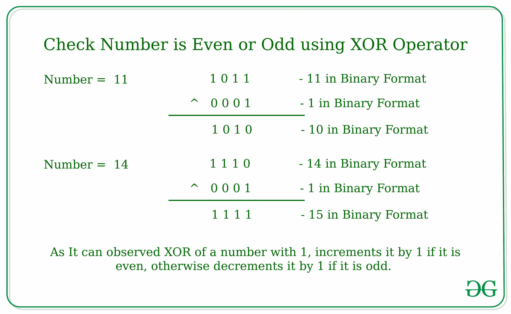
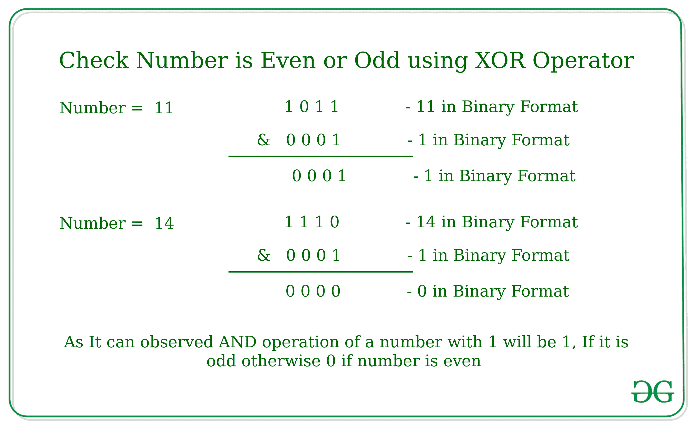
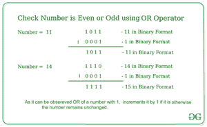

# 使用按位运算符检查数字是奇数还是偶数

> 原文:[https://www . geeksforgeeks . org/使用按位运算符检查数字是奇数还是偶数/](https://www.geeksforgeeks.org/check-if-a-number-is-odd-or-even-using-bitwise-operators/)

给定一个数字 **N** ，任务是使用[逐位运算符](https://www.geeksforgeeks.org/bitwise-operators-in-c-cpp/)检查该数字是偶数还是奇数。
**例:**

> **输入:** N = 11
> **输出:**奇数
> **输入:** N = 10
> **输出:**偶数

以下按位运算符可用于检查数字是奇数还是偶数:

**1。使用** [**按位异或运算符**](https://www.geeksforgeeks.org/tag/xor/) **:**
的思想是检查数字的最后一位是否设置。如果最后一位被置位，则该数字为奇数，否则为偶数。
如我们所知，如果数字为偶数，则按位异或运算将数字的值增加 1；否则，如果数字为奇数，则按位异或运算将数字的值减少 1。



以下是上述方法的实现:

## C++

```
// C++ program to check for even or odd
// using Bitwise XOR operator

#include <iostream>
using namespace std;

// Returns true if n is even, else odd
bool isEven(int n)
{

    // n^1 is n+1, then even, else odd
    if (n ^ 1 == n + 1)
        return true;
    else
        return false;
}

// Driver code
int main()
{
    int n = 100;
    isEven(n)
? cout << "Even"
: cout << "Odd";

    return 0;
}
```

## Java 语言(一种计算机语言，尤用于创建网站)

```
// Java program to check for even or odd
// using Bitwise XOR operator
class GFG
{

    // Returns true if n is even, else odd
    static boolean isEven(int n)
    {

        // n^1 is n+1, then even, else odd
        if ((n ^ 1) == n + 1)
            return true;
        else
            return false;
    }

    // Driver code
    public static void main(String[] args)
    {
        int n = 100;
        System.out.print(isEven(n) == true ? "Even" : "Odd");
    }
}

// This code is contributed by Rajput-Ji
```

## 蟒蛇 3

```
# Python3 program to check for even or odd
# using Bitwise XOR operator

# Returns true if n is even, else odd
def isEven( n) :

    # n^1 is n+1, then even, else odd
    if (n ^ 1 == n + 1) :
        return True;
    else :
        return False;

# Driver code
if __name__ == "__main__" :
    n = 100;
    print("Even") if isEven(n) else print( "Odd");

# This code is contributed by AnkitRai01
```

## C#

```
// C# program to check for even or odd
// using Bitwise XOR operator
using System;

class GFG
{

    // Returns true if n is even, else odd
    static bool isEven(int n)
    {

        // n^1 is n+1, then even, else odd
        if ((n ^ 1) == n + 1)
            return true;
        else
            return false;
    }

    // Driver code
    public static void Main(String[] args)
    {
        int n = 100;
        Console.Write(isEven(n) == true ? "Even" : "Odd");
    }
}

// This code is contributed by Rajput-Ji
```

## java 描述语言

```
<script>

// JavaScript program to check for even or odd
// using Bitwise XOR operator

// Returns true if n is even, else odd
function isEven(n)
{

    // n^1 is n+1, then even, else odd
    if (n ^ 1 == n + 1)
        return true;
    else
        return false;
}

// Driver code

    let n = 100;
    isEven(n)
? document.write("Even")
: document.write("Odd");

// This code is contributed by Surbhi Tyagi.

</script>
```

**Output**

```
Even
```

**2。使用按位与运算符:**
其思想是检查数字的最后一位是否被设置。如果最后一位被置位，则该数字为奇数，否则为偶数。
如我们所知，数字 1 的按位与运算将是 1，如果是奇数，因为最后一位已经被设置。否则它将给出 0 作为输出。



以下是上述方法的实现:

## C++

```
// C++ program to check for even or odd
// using Bitwise AND operator
#include <iostream>
using namespace std;

// Returns true if n is even, else odd
bool isEven(int n)
{
    // n&1 is 1, then odd, else even
    return (!(n & 1));
}

// Driver code
int main()
{
    int n = 101;
    isEven(n)
    ? cout << "Even"
    : cout << "Odd";
    return 0;
}
```

## Java 语言(一种计算机语言，尤用于创建网站)

```
// Java program to check for even or odd
// using Bitwise AND operator
class GFG
{

// Returns true if n is even, else odd
static boolean isEven(int n)
{
    // n&1 is 1, then odd, else even
    return ((n & 1)!=1);
}

// Driver code
public static void main(String[] args)
{
    int n = 101;
    System.out.print(isEven(n) == true ? "Even" : "Odd");
}
}

// This code is contributed by PrinciRaj1992
```

## 蟒蛇 3

```
# Python3 program to check for even or odd
# using Bitwise AND operator

# Returns true if n is even, else odd
def isEven(n) :

    # n&1 is 1, then odd, else even
    return (not(n & 1));

# Driver code
if __name__ == "__main__" :

    n = 101;
    if isEven(n) :
        print("Even")
    else:
        print("Odd");

# This code is contributed by AnkitRai01
```

## C#

```
// C# program to check for even or odd
// using Bitwise AND operator
using System;

class GFG
{

    // Returns true if n is even, else odd
    static bool isEven(int n)
    {
        // n&1 is 1, then odd, else even
        return ((n & 1) != 1);
    }

    // Driver code
    public static void Main()
    {
        int n = 101;
        Console.Write(isEven(n) == true ? "Even" : "Odd");
    }
}

// This code is contributed by AnkitRai01
```

## java 描述语言

```
<script>
// javascript program to check for even or odd
// using Bitwise AND operator

// Returns true if n is even, else odd
function isEven(n)
{
    // n&1 is 1, then odd, else even
    return ((n & 1)!=1);
}

// Driver code
var n = 101;
document.write(isEven(n) == true ? "Even" : "Odd");

// This code is contributed by Princi Singh
</script>
```

**Output**

```
Odd
```

**3。使用按位或运算符:**其思想是检查数字的最后一位是否设置。如果最后一位被置位，则该数字为奇数，否则为偶数。正如我们所知，如果数字为偶数，则按位“或”运算将数字的值增加 1，否则它将保持不变。所以，如果对 1 进行或运算后得到的结果大于这个数，那么它是偶数，我们将返回真，否则它是奇数，我们将返回假。



下面是上述方法的实现:

## C++

```
// C++ program to check for even or odd
// using Bitwise OR operator

#include <iostream>
using namespace std;

// Returns true if n is even, else odd
bool isEven(int n)
{

    // n|1 is greater than n, then even, else odd
    if ((n | 1) > n)
        return true;
    else
        return false;
}

// Driver code
int main()
{
    int n = 100;
    isEven(n)
    ? cout << "Even"
    : cout << "Odd";

    return 0;
}
```

## Java 语言(一种计算机语言，尤用于创建网站)

```
// Java program to check for even or odd
// using Bitwise OR operator
class GFG
{
    // Returns true if n is even, else odd
    static boolean isEven(int n)
    {

        // n|1 is greater than n, then even, else odd
        if ((n | 1) > n)
            return true;
        else
            return false;
    }

    // Driver code
    public static void main(String[] args)
    {
        int n = 100;
        System.out.print(isEven(n) == true ? "Even" : "Odd");
    }
}
```

## 蟒蛇 3

```
# Python3 program to check for even or odd
# using Bitwise OR operator

# Returns true if n is even, else odd
def isEven( n) :

    # n|1 is greater then n, then even, else odd
    if (n | 1 > n) :
        return True;
    else :
        return False;

# Driver code
if __name__ == "__main__" :
    n = 100;
    print("Even") if isEven(n) else print( "Odd");
```

## C#

```
// C# program to check for even or odd
// using Bitwise XOR operator
using System;

class GFG
{

    // Returns true if n is even, else odd
    static bool isEven(int n)
    {

        // n|1 is greater then n, then even, else odd
        if ((n | 1) > n)
            return true;
        else
            return false;
    }

    // Driver code
    public static void Main(String[] args)
    {
        int n = 100;
        Console.Write(isEven(n) == true ? "Even" : "Odd");
    }
}

// This code is contributed by Rajput-Ji
```

## java 描述语言

```
<script>
// javascript program to check for even or odd
// using Bitwise OR operator

// Returns true if n is even, else odd
function isEven(n)
{

    // n|1 is greater than n, then even, else odd
    if ((n | 1) > n)
        return true;
    else
        return false;
}

// Driver code
var n = 100;
document.write(isEven(n) == true ? "Even" : "Odd");

// This code is contributed by Amit Katiyar.
</script>
```

**Output**

```
Even
```

**时间复杂度:** O(1)