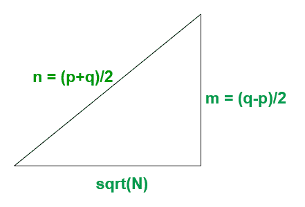
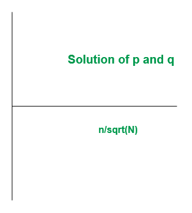

# 对于非常大的数字，检查一个数字是质数、半质数还是合成数

> 原文:[https://www . geeksforgeeks . org/check-如果一个数是质数-半质数-或-composite-表示非常大的数/](https://www.geeksforgeeks.org/check-if-a-number-is-prime-semi-prime-or-composite-for-very-large-numbers/)

给定一个非常大的数 **N** ( > 150)，任务是检查这个数是质数、半质数还是合成数。
T3】例:

> **输入:**N = 90000000
> T3】输出:不是素数
> **解释:**
> 我们有(N-1)%6 = 89999999%6 = 1 和
> (N+1)%6 = 90000001%6 = 5
> 由于 N-1 和 N+1 不能被 6 整除
> 因此 N = 90000000 不是素数【T10

**进场:**

*   可以观察到，如果 n 是一个[素数](https://www.geeksforgeeks.org/prime-numbers/)，那么 n+1 或 n-1 可以被 6 整除
*   如果一个数 n 的存在使得 n+1 和 n-1 都不能被 6 整除，那么 n 就不是素数
*   如果一个数 n 的存在使得 n+1 或 n-1 可被 6 整除，那么 n 要么是素数，要么是半素数
*   为了区分质数和半质数，使用了以下方法:
    *   如果 N 是半素数，

```
N = p*q  ....................(1)
where p & q are primes.
```

*   那么从 [**哥德巴赫猜想**](https://www.geeksforgeeks.org/program-for-goldbachs-conjecture-two-primes-with-given-sum/) 开始:

```
p + q must be even
i.e, p + q = 2*n for any positive integer n
```

*   因此，求解 p & q 将给出

```
p = n - sqrt(n2 - N)
q = n + sqrt(n2 - N)
```

*   让 N<sup>2</sup>–N 是完美的正方形，然后

```
n2 - N = m2, .................(2)
for any positive integer m 
```

*   解方程(1)和(2)我们得到

```
m = (q-p)/2
n = (p+q)/2
```

*   如果等式(1)和(2)在某个点相遇，那么存在一对(p，q)，使得 N 是半素的，否则 N 是素数。
*   等式(2)形成毕达哥拉斯三元组



*   图表上预期的解决方案各不相同



**伪码:**

*   输入一个数字 N，如果**N–1**和 **N + 1** 不能被 6 整除，那么数字 N 就是**不是质数**。否则它是质数或半质数
*   如果 n-1 或 n+1 可被 6 整除，则在**范围内迭代(sqrt(N) + 1，N)** 并找到一对(p，q)，使得 **p*q = N** 通过以下公式:

```
p = i - sqrt(i*i - N)
q = n/p
where i = index in range(sqrt(N) + 1, N)
```

*   如果 p*q = N，那么数 N 是半素数，否则它是素数

以下是上述方法的实现:

## Java 语言(一种计算机语言，尤用于创建网站)

```
import static java.lang.Math.sqrt;

public class Primmefunc {

    public static void prime(long n)
    {
        int flag = 0;

        // checking divisibility by 6
        if ((n + 1) % 6 != 0 && (n - 1) % 6 != 0) {
            System.out.println("Not Prime");
        }
        else {

            // breakout if number is perfect square
            double s = sqrt(n);
            if ((s * s) == n) {
                System.out.println("Semi-Prime");
            }
            else {
                long f = (long)s;
                long l = (long)((f * f));

                // Iterating over to get the
                // closest average value
                for (long i = f + 1; i < l; i++) {

                    // 1st Factor
                    long p = i - (long)(sqrt((i * i) - (n)));

                    // 2nd Factor
                    long q = n / p;

                    // To avoid Convergence
                    if (p < 2 || q < 2) {
                        break;
                    }

                    // checking semi-prime condition
                    if ((p * q) == n) {
                        flag = 1;
                        break;
                    }

                    // If convergence found
                    // then number is semi-prime
                    else {

                        // convergence not found
                        // then number is prime
                        flag = 2;
                    }
                }

                if (flag == 1) {
                    System.out.println("Semi-Prime");
                }
                else if (flag == 2) {

                    System.out.println("Prime");
                }
            }
        }
    }

    public static void main(String[] args)
    {
        // Driver code
        // Entered number should be greater
        // than 300 to avoid Convergence of
        // second factor to 1
        prime(8179);
        prime(7894561);
        prime(90000000);
        prime(841);
        prime(22553);
        prime(1187);
    }
//written by Rushil Jhaveri
}
```

## 卡片打印处理机（Card Print Processor 的缩写）

```
#include<bits/stdc++.h>
using namespace std ;

void prime(long n)
{
    int flag = 0;

    // checking divisibility by 6
    if ((n + 1) % 6 != 0 && (n - 1) % 6 != 0)
    {
        cout << ("Not Prime") << endl;
    }
    else
    {

        // breakout if number is perfect square
        double s = sqrt(n);
        if ((s * s) == n)
        {
            cout<<("Semi-Prime")<<endl;
        }
        else
        {
            long f = (long)s;
            long l = (long)((f * f));

            // Iterating over to get the
            // closest average value
            for (long i = f + 1; i < l; i++)
            {

                // 1st Factor
                long p = i - (long)(sqrt((i * i) - (n)));

                // 2nd Factor
                long q = n / p;

                // To avoid Convergence
                if (p < 2 || q < 2)
                {
                    break;
                }

                // checking semi-prime condition
                if ((p * q) == n)
                {
                    flag = 1;
                    break;
                }

                // If convergence found
                // then number is semi-prime
                else
                {

                    // convergence not found
                    // then number is prime
                    flag = 2;
                }
            }

            if (flag == 1)
            {
                cout<<("Semi-Prime")<<endl;
            }
            else if (flag == 2)
            {

                cout<<("Prime")<<endl;
            }
        }
    }
}

// Driver code
int main()
{

    // Entered number should be greater
    // than 300 to avoid Convergence of
    // second factor to 1
    prime(8179);
    prime(7894561);
    prime(90000000);
    prime(841);
    prime(22553);
    prime(1187);
}

// This code is contributed by Rajput-Ji
```

## 蟒蛇 3

```
def prime(n):
    flag = 0;

    # checking divisibility by 6
    if ((n + 1) % 6 != 0 and (n - 1) % 6 != 0):
        print("Not Prime");
    else:

        # breakout if number is perfect square
        s = pow(n, 1/2);
        if ((s * s) == n):
            print("Semi-Prime");
        else:
            f = int(s);
            l = int(f * f);

            # Iterating over to get the
            # closest average value
            for i in range(f + 1, l):

                # 1st Factor
                p = i - (pow(((i * i) - (n)), 1/2));

                # 2nd Factor
                q = n // p;

                # To avoid Convergence
                if (p < 2 or q < 2):
                    break;

                # checking semi-prime condition
                if ((p * q) == n):
                    flag = 1;
                    break;

                # If convergence found
                # then number is semi-prime
                else:

                    # convergence not found
                    # then number is prime
                    flag = 2;

            if (flag == 1):
                print("Semi-Prime");
            elif(flag == 2):

                print("Prime");

# Driver code
if __name__ == '__main__':

    # Entered number should be greater
    # than 300 to avoid Convergence of
    # second factor to 1
    prime(8179);
    prime(7894561);
    prime(90000000);
    prime(841);
    prime(22553);
    prime(1187);

# This code is contributed by 29AjayKumar
```

## C#

```
using System;
public class Primmefunc
{

    public static void prime(long n)
    {
        int flag = 0;

        // checking divisibility by 6
        if ((n + 1) % 6 != 0 && (n - 1) % 6 != 0)
        {
            Console.WriteLine("Not Prime");
        }
        else
        {

            // breakout if number is perfect square
            double s = Math.Sqrt(n);
            if ((s * s) == n)
            {
                Console.WriteLine("Semi-Prime");
            }
            else
            {
                long f = (long)s;
                long l = (long)((f * f));

                // Iterating over to get the
                // closest average value
                for (long i = f + 1; i < l; i++)
                {

                    // 1st Factor
                    long p = i - (long)(Math.Sqrt((i * i) - (n)));

                    // 2nd Factor
                    long q = n / p;

                    // To avoid Convergence
                    if (p < 2 || q < 2)
                    {
                        break;
                    }

                    // checking semi-prime condition
                    if ((p * q) == n)
                    {
                        flag = 1;
                        break;
                    }

                    // If convergence found
                    // then number is semi-prime
                    else
                    {

                        // convergence not found
                        // then number is prime
                        flag = 2;
                    }
                }

                if (flag == 1)
                {
                    Console.WriteLine("Semi-Prime");
                }
                else if (flag == 2)
                {
                    Console.WriteLine("Prime");
                }
            }
        }
    }

    // Driver code
    public static void Main(String[] args)
    {
        // Entered number should be greater
        // than 300 to avoid Convergence of
        // second factor to 1
        prime(8179);
        prime(7894561);
        prime(90000000);
        prime(841);
        prime(22553);
        prime(1187);
    }
}

// This code is contributed by 29AjayKumar
```

## java 描述语言

```
<script>

    function prime(n)
    {
        var flag = 0;

        // checking divisibility by 6
        if ((n + 1) % 6 != 0 && (n - 1) % 6 != 0) {
            document.write("Not Prime<br>");
        }
        else {

            // breakout if number is perfect square
            var s = parseInt(Math.sqrt(n));
            if ((s * s) == n) {
                document.write("Semi-Prime<br>");
            }
            else {
                var f = s;
                var l = ((f * f));

                // Iterating over to get the
                // closest average value
                for (var i = f + 1; i < l; i++) {

                    // 1st Factor
                    var p = i - parseInt(Math.sqrt((i * i) - (n)));

                    // 2nd Factor
                    var q = parseInt(n / p);

                    // To avoid Convergence
                    if (p < 2 || q < 2) {
                        break;
                    }

                    // checking semi-prime condition
                    if ((p * q) == n) {
                        flag = 1;
                        break;
                    }

                    // If convergence found
                    // then number is semi-prime
                    else {

                        // convergence not found
                        // then number is prime
                        flag = 2;
                    }
                }

                if (flag == 1) {
                    document.write("Semi-Prime<br>");
                }
                else if (flag == 2) {

                    document.write("Prime<br>");
                }
            }
        }
    }

// Driver code
        // Entered number should be greater
        // than 300 to avoid Convergence of
        // second factor to 1
        prime(8179);
        prime(7894561);
        prime(90000000);
        prime(841);
        prime(22553);
        prime(1187);

// This code is contributed by 29AjayKumar
</script>
```

**Output:** 

```
Prime
Semi-Prime
Not Prime
Semi-Prime
Semi-Prime
Prime
```

**时间复杂度:** O(N)