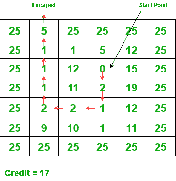

# 检查从给定单元到矩阵的任何边界元素的路径是否存在，元素之和不超过 K

> 原文:[https://www . geeksforgeeks . org/check-if-a-path-exists-from-a-a-给定单元到任何边界元素-矩阵的元素总和-不超过-k/](https://www.geeksforgeeks.org/check-if-a-path-exists-from-a-given-cell-to-any-boundary-element-of-the-matrix-with-sum-of-elements-not-exceeding-k/)

给定尺寸为 **M * N** 、三个整数 **X、Y** 和 **K** 的[矩阵](https://www.geeksforgeeks.org/matrix/) **网格[][]** ，任务是检查是否存在从单元 **(X，Y)** 到矩阵的任何[边界单元的任何路径，使得路径中存在的矩阵元素之和至多为**K**。如果没有这样的路径，打印**“否”**。否则，打印**“是”**。任何细胞的可能移动是**向上**、**向下**、**向左**或**向右**。](https://www.geeksforgeeks.org/boundary-elements-matrix/)

**示例:**

> **输入:**网格[][] = {{25，5，25，25，25，25}，{25，1，1，5，12，25}，{25，1，12，0，15，25}，{22，1，11，2，19，15}，{25，2，2，1，12，15}，{25，9，10，1，11，25}，{25，25
> 
> 
> 
> 相关路径是(2，3) -> (3，3) -> (4，3) -> (4，2) -> (4，1) -> (3，1) -> (2，1) -> (1，1)。
> 路径成本= 0+2+1+2+2+1+1+1+1+0 = 15(<K)。
> 
> **输入:**网格[][] = {{1，2，3}，{1，2，3}，{3，4，5}}，X = 1，Y = 1，K = 0
> **输出:** -1

**方法:**给定的问题可以通过使用[回溯](https://www.geeksforgeeks.org/backtracking-algorithms/)来解决，以考虑从给定的起始单元开始的所有可能路径，并且检查是否存在到给定矩阵的边界单元的任何路径，该给定矩阵的组成元素之和等于 **K** 。

按照以下步骤解决问题:

*   定义一个[递归](https://www.geeksforgeeks.org/recursion/) [函数](https://www.geeksforgeeks.org/functions-in-c/)，比如 **findPath(X，Y，K，board)** ，检查是否存在从起始单元格 **(X，Y)** 到任何边界元素的路径。
    *   **基本情况:**如果达到 **X < 0** 或 **Y < 0** 或 **X > = M** 或 **Y > = N** ，则返回**真**。
    *   现在，检查**网格【X】【Y】>= K**是否存在。如果发现为真，则标记当前访问的单元格。将 **K** 减**网格【X】【Y】**的值，然后访问未访问的相邻单元格，即递归调用 **findPath(X + 1，Y，K)、findPath(X，Y + 1，K)、find path(X–1，Y，K)、**和 **findPath(X，Y–1，K)** 。
        *   如果以上任何递归调用返回**真**，则从当前递归调用返回**真**。
        *   否则，将当前单元格标记为未访问。
    *   如果以上条件都不满足，则从当前递归调用返回 **false** 。
*   现在，如果函数 **findPath(X，Y，K)** 返回 **true，**则打印**“是”**。否则，打印**“否”**。

下面是上述方法的实现:

## C++

```
// C++ program for the above approach
#include <bits/stdc++.h>
using namespace std;

// Function to check if it is valid
// to move to the given index or not
bool isValid(vector<vector<int> >& board,
             int i, int j, int K)
{
    if (board[i][j] <= K) {
        return true;
    }

    // Otherwise return false
    return false;
}

// Function to check if there exists a
// path from the cell (X, Y) of the
// matrix to any boundary cell with
// sum of elements at most K or not
bool findPath(vector<vector<int> >& board,
              int X, int Y,
              int M, int N, int K)
{

    // Base Case
    if (X < 0 || X == M
        || Y < 0 || Y == N) {
        return true;
    }

    // If K >= board[X][Y]
    if (isValid(board, X, Y, K)) {

        // Stores the current element
        int board_XY = board[X][Y];

        // Mark the current cell as visited
        board[X][Y] = INT_MAX;

        // Visit all the adjacent cells
        if (findPath(board, X + 1, Y, M,
                     N, K - board_XY)
            || findPath(board, X - 1, Y, M,
                        N, K - board_XY)
            || findPath(board, X, Y + 1, M,
                        N, K - board_XY)
            || findPath(board, X, Y - 1, M,
                        N, K - board_XY)) {
            return true;
        }

        // Mark the cell unvisited
        board[X][Y] = board_XY;
    }

    // Return false
    return false;
}

// Driver Code
int main()
{
    vector<vector<int> > grid = {
        { 25, 5, 25, 25, 25, 25 },
        { 25, 1, 1, 5, 12, 25 },
        { 25, 1, 12, 0, 15, 25 },
        { 22, 1, 11, 2, 19, 15 },
        { 25, 2, 2, 1, 12, 15 },
        { 25, 9, 10, 1, 11, 25 },
        { 25, 25, 25, 25, 25, 25 }
    };

    int K = 17;
    int M = grid.size();
    int N = grid[0].size();
    int X = 2, Y = 3;

    if (findPath(grid, X, Y, M, N, K))
        cout << "Yes";
    else
        cout << "No";

    return 0;
}
```

## Java 语言(一种计算机语言，尤用于创建网站)

```
// Java program for the above approach
import java.util.*;

class GFG{

// Function to check if it is valid
// to move to the given index or not
static boolean isValid(int[][] board, int i,
                       int j, int K)
{
    if (board[i][j] <= K)
    {
        return true;
    }

    // Otherwise return false
    return false;
}

// Function to check if there exists a
// path from the cell (X, Y) of the
// matrix to any boundary cell with
// sum of elements at most K or not
static boolean findPath(int[][] board, int X, int Y,
                        int M, int N, int K)
{

    // Base Case
    if (X < 0 || X == M || Y < 0 || Y == N)
    {
        return true;
    }

    // If K >= board[X][Y]
    if (isValid(board, X, Y, K))
    {

        // Stores the current element
        int board_XY = board[X][Y];

        // Mark the current cell as visited
        board[X][Y] = Integer.MAX_VALUE;

        // Visit all the adjacent cells
        if (findPath(board, X + 1, Y, M, N,
                            K - board_XY) ||
            findPath(board, X - 1, Y, M, N,
                            K - board_XY) ||
            findPath(board, X, Y + 1, M, N,
                               K - board_XY) ||
            findPath(board, X, Y - 1, M, N,
                               K - board_XY))
        {
            return true;
        }

        // Mark the cell unvisited
        board[X][Y] = board_XY;
    }

    // Return false
    return false;
}

// Driver Code
public static void main(String[] args)
{
    int[][] grid = { { 25, 5, 25, 25, 25, 25 },
                     { 25, 1, 1, 5, 12, 25 },
                     { 25, 1, 12, 0, 15, 25 },
                     { 22, 1, 11, 2, 19, 15 },
                     { 25, 2, 2, 1, 12, 15 },
                     { 25, 9, 10, 1, 11, 25 },
                     { 25, 25, 25, 25, 25, 25 } };

    int K = 17;
    int M = grid.length;
    int N = grid[0].length;
    int X = 2, Y = 3;

    if (findPath(grid, X, Y, M, N, K))
        System.out.println("Yes");
    else
        System.out.println("No");
}
}

// This code is contributed by ukasp
```

## 蟒蛇 3

```
# Python3 program for the above approach
import sys

INT_MAX = sys.maxsize

# Function to check if it is valid
# to move to the given index or not
def isValid(board, i, j, K):

    if (board[i][j] <= K):
        return True

    # Otherwise return false
    return False

# Function to check if there exists a
# path from the cell (X, Y) of the
# matrix to any boundary cell with
# sum of elements at most K or not
def findPath(board, X, Y, M, N, K):

    # Base Case
    if (X < 0 or X == M or
        Y < 0 or Y == N):
        return True

    # If K >= board[X][Y]
    if (isValid(board, X, Y, K)):

        # Stores the current element
        board_XY = board[X][Y]

        # Mark the current cell as visited
        board[X][Y] = INT_MAX

        # Visit all the adjacent cells
        if (findPath(board, X + 1, Y, M,
                     N, K - board_XY) or
            findPath(board, X - 1, Y, M,
                     N, K - board_XY) or
            findPath(board, X, Y + 1, M,
                     N, K - board_XY) or
            findPath(board, X, Y - 1, M,
                     N, K - board_XY)):
            return True;

        # Mark the cell unvisited
        board[X][Y] = board_XY

    # Return false
    return False

# Driver Code
if __name__ ==  "__main__":

    grid = [
        [ 25, 5, 25, 25, 25, 25 ],
        [ 25, 1, 1, 5, 12, 25 ],
        [ 25, 1, 12, 0, 15, 25 ],
        [ 22, 1, 11, 2, 19, 15 ],
        [ 25, 2, 2, 1, 12, 15 ],
        [ 25, 9, 10, 1, 11, 25 ],
        [ 25, 25, 25, 25, 25, 25 ] ]

    K = 17
    M = len(grid)
    N = len(grid[0])
    X = 2
    Y = 3

    if (findPath(grid, X, Y, M, N, K)):
        print("Yes")
    else:
        print("No")

# This code is contributed by AnkThon
```

## C#

```
// C# program for the above approach
using System;

class GFG{

// Function to check if it is valid
// to move to the given index or not
static bool isValid(int[,] board, int i,
                    int j, int K)
{
    if (board[i, j] <= K)
    {
        return true;
    }

    // Otherwise return false
    return false;
}

// Function to check if there exists a
// path from the cell (X, Y) of the
// matrix to any boundary cell with
// sum of elements at most K or not
static bool findPath(int[,] board, int X, int Y,
                     int M, int N, int K)
{

    // Base Case
    if (X < 0 || X == M ||
        Y < 0 || Y == N)
    {
        return true;
    }

    // If K >= board[X][Y]
    if (isValid(board, X, Y, K))
    {

        // Stores the current element
        int board_XY = board[X, Y];

        // Mark the current cell as visited
        board[X, Y] = int.MaxValue;

        // Visit all the adjacent cells
        if (findPath(board, X + 1, Y, M, N,
                            K - board_XY) ||
            findPath(board, X - 1, Y, M, N,
                            K - board_XY) ||
            findPath(board, X, Y + 1, M, N,
                               K - board_XY) ||
            findPath(board, X, Y - 1, M, N,
                               K - board_XY))
        {
            return true;
        }

        // Mark the cell unvisited
        board[X, Y] = board_XY;
    }

    // Return false
    return false;
}

// Driver Code
public static void Main(string[] args)
{
    int[,] grid = { { 25, 5, 25, 25, 25, 25 },
                    { 25, 1, 1, 5, 12, 25 },
                    { 25, 1, 12, 0, 15, 25 },
                    { 22, 1, 11, 2, 19, 15 },
                    { 25, 2, 2, 1, 12, 15 },
                    { 25, 9, 10, 1, 11, 25 },
                    { 25, 25, 25, 25, 25, 25 } };

    int K = 17;
    int M = grid.Length;
    int N = grid.GetLength(0);
    int X = 2, Y = 3;

    if (findPath(grid, X, Y, M, N, K))
        Console.WriteLine("Yes");
    else
        Console.WriteLine("No");
}
}

// This code is contributed by AnkThon
```

## java 描述语言

```
<script>

// JavaScript program to implement
// the above approach

// Function to check if it is valid
// to move to the given index or not
function isValid(board, i, j, K)
{
    if (board[i][j] <= K)
    {
        return true;
    }

    // Otherwise return false
    return false;
}

// Function to check if there exists a
// path from the cell (X, Y) of the
// matrix to any boundary cell with
// sum of elements at most K or not
function findPath(board, X, Y,
                        M, N, K)
{

    // Base Case
    if (X < 0 || X == M || Y < 0 || Y == N)
    {
        return true;
    }

    // If K >= board[X][Y]
    if (isValid(board, X, Y, K))
    {

        // Stores the current element
        let board_XY = board[X][Y];

        // Mark the current cell as visited
        board[X][Y] = Number.MAX_VALUE;

        // Visit all the adjacent cells
        if (findPath(board, X + 1, Y, M, N,
                            K - board_XY) ||
            findPath(board, X - 1, Y, M, N,
                            K - board_XY) ||
            findPath(board, X, Y + 1, M, N,
                               K - board_XY) ||
            findPath(board, X, Y - 1, M, N,
                               K - board_XY))
        {
            return true;
        }

        // Mark the cell unvisited
        board[X][Y] = board_XY;
    }

    // Return false
    return false;
}

// Driver code
     let grid = [[ 25, 5, 25, 25, 25, 25 ],
                     [ 25, 1, 1, 5, 12, 25 ],
                     [ 25, 1, 12, 0, 15, 25 ],
                     [ 22, 1, 11, 2, 19, 15 ],
                     [ 25, 2, 2, 1, 12, 15 ],
                     [ 25, 9, 10, 1, 11, 25 ],
                     [ 25, 25, 25, 25, 25, 25 ]];

    let K = 17;
    let M = grid.length;
    let N = grid[0].length;
    let X = 2, Y = 3;

    if (findPath(grid, X, Y, M, N, K))
        document.write("Yes");
    else
        document.write("No");

// This code is contributed by susmitakundugoaldanga.
</script>
```

**Output:** 

```
Yes
```

***时间复杂度:**O(3<sup>N * M</sup>)*
***辅助空间:** O(N * M)*