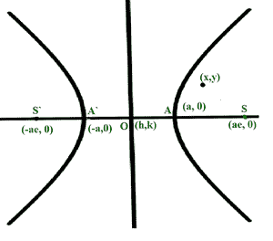
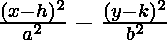

# 检查一个点是在双曲线内、外还是在双曲线上

> 原文:[https://www . geesforgeks . org/check-a-point-if-in-out-or-on-a-双曲线/](https://www.geeksforgeeks.org/check-if-a-point-is-inside-outside-or-on-a-hyperbola/)

给定一条以 **(h，k)** 为中心的[双曲线，其中](https://www.geeksforgeeks.org/hyperbolic-functions/)[半长轴](https://www.geeksforgeeks.org/program-to-find-the-area-of-an-ellipse/) **a** 、[半短轴](https://www.geeksforgeeks.org/program-to-find-the-area-of-an-ellipse/) **b** ，两者都与[笛卡尔平面](https://www.geeksforgeeks.org/cartesian-plane/)对齐，任务是确定点 **(x，y)** 是否位于双曲线所界定的区域内。

[](https://media.geeksforgeeks.org/wp-content/uploads/20210322034627/hyperb-300x264.png)

**示例:**

> **输入:** h = 0，k = 0，x = 2，y = 1，a = 4，b = 5
> T3】输出:内部
> 
> **输入:** h = 1，k = 2，x = 200，y = 100，a = 6，b = 5
> T3】输出:外

**逼近:**对于给定点 **(x，y)** ，可以通过求解下面提到的双曲线的[方程来求解给定问题:](https://www.geeksforgeeks.org/class-11-ncert-solutions-chapter-11-conic-section-exercise-11-4/)

> 

基于上述等式的评估值，程序的输出如下:

*   **小于 1:** 点位于[双曲线](https://www.geeksforgeeks.org/hyperbolic-functions/)内**。**
*   **等于 1:** 点位于双曲线的上
*   ****大于 1:** 点位于双曲线外**。****

**下面是上述方法的实现:**

## **C++**

```
// C++ program for the
// above approach
#include <bits/stdc++.h>
using namespace std;

// Function to check if the point
// (x, y) lies inside, on or
// outside the given hyperbola
void checkpoint(int h, int k, int x,
                int y, int a, int b)
{

    // Stores the value of the equation
    int p = (pow((x - h), 2) / pow(a, 2))
            - (pow((y - k), 2) / pow(b, 2));

    // Generate output based on value of p
    if (p > 1) {
        cout << "Outside";
    }
    else if (p == 1) {
        cout << "On the Hyperbola";
    }
    else {
        cout << "Inside";
    }
}

// Driver Code
int main()
{
    int h = 0, k = 0, x = 2;
    int y = 1, a = 4, b = 5;

    checkpoint(h, k, x, y, a, b);

    return 0;
}
```

## **Java 语言(一种计算机语言，尤用于创建网站)**

```
// Java program for the above approach
import java.io.*;
import java.lang.*;
import java.util.*;

class GFG{

// Function to check if the point
// (x, y) lies inside, on or
// outside the given hyperbola
static void checkpoint(int h, int k, int x,
                       int y, int a, int b)
{

    // Stores the value of the equation
    int p = (int)(Math.pow((x - h), 2) / Math.pow(a, 2)) -
            (int)(Math.pow((y - k), 2) / Math.pow(b, 2));

    // Generate output based on value of p
    if (p > 1)
    {
        System.out.println("Outside");
    }
    else if (p == 1)
    {
        System.out.println("On the Hyperbola");
    }
    else
    {
        System.out.println("Inside");
    }
}

// Driver Code
public static void main(String[] args)
{
    int h = 0, k = 0, x = 2;
    int y = 1, a = 4, b = 5;

    checkpoint(h, k, x, y, a, b);
}
}

// This code is contributed by Kingash
```

## **蟒蛇 3**

```
# Python3 program for the above approach
from math import pow

# Function to check if the point
# (x, y) lies inside, on or
# outside the given hyperbola
def checkpoint(h, k, x, y, a, b):

    # Stores the value of the equation
    p = ((pow((x - h), 2) // pow(a, 2)) -
         (pow((y - k), 2) // pow(b, 2)))

    # Generate output based on value of p
    if (p > 1):
        print("Outside")

    elif (p == 1):
        print("On the Hyperbola");

    else:
        print("Inside")

# Driver Code
if __name__ == "__main__":

    h = 0
    k = 0
    x = 2
    y = 1
    a = 4
    b = 5

    checkpoint(h, k, x, y, a, b)

# This code is contributed by AnkThon
```

## **C#**

```
// C# program for the above approach
using System;

class GFG{

// Function to check if the point
// (x, y) lies inside, on or
// outside the given hyperbola
static void checkpoint(int h, int k, int x,
                       int y, int a, int b)
{

    // Stores the value of the equation
    int p = (int)(Math.Pow((x - h), 2) / Math.Pow(a, 2)) -
            (int)(Math.Pow((y - k), 2) / Math.Pow(b, 2));

    // Generate output based on value of p
    if (p > 1)
    {
        Console.WriteLine("Outside");
    }
    else if (p == 1)
    {
        Console.WriteLine("On the Hyperbola");
    }
    else
    {
        Console.WriteLine("Inside");
    }
}

// Driver Code
public static void Main(string[] args)
{
    int h = 0, k = 0, x = 2;
    int y = 1, a = 4, b = 5;

    checkpoint(h, k, x, y, a, b);
}
}

// This code is contributed by ukasp
```

## **java 描述语言**

```
<script>

// JavaScript program for the above approach

// Function to check if the point
// (x, y) lies inside, on or
// outside the given hyperbola
function checkpoint(h, k, x, y, a, b)
{

    // Stores the value of the equation
    p = ((Math.pow((x - h), 2) / Math.pow(a, 2)) -
         (Math.pow((y - k), 2) / Math.pow(b, 2)))

    // Generate output based on value of p
    if (p > 1)
        console.log("Outside");

    else if (p == 1)
        console.log("On the Hyperbola");

    else
        console.log("Inside");
}

// Driver Code
function main()
{
    var h = 0;
    var k = 0;
    var x = 2;
    var y = 1;
    var a = 4;
    var b = 5;

    checkpoint(h, k, x, y, a, b);
}

// main function call
main()

// This code is contributed by AnkThon

</script>
```

****Output:** 

```
Inside
```** 

*****时间复杂度:**O(1)*
T5**辅助空间:** O(1)**