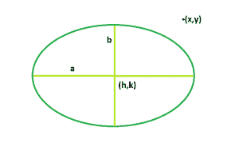

# 检查点是在椭圆内、外还是在椭圆上

> 原文:[https://www . geeksforgeeks . org/check-如果一个点在椭圆的内部或外部/](https://www.geeksforgeeks.org/check-if-a-point-is-inside-outside-or-on-the-ellipse/)

给定一个以 **(h，k)** 为中心的椭圆，其半长轴 **a** ，半短轴 **b** ，都与笛卡尔平面对齐。任务是确定点 **(x，y)** 是否在椭圆限定的区域内。
**举例:**

```
Input: h = 0, k = 0, x = 2, y = 1, a = 4, b = 5 
Output: Inside

Input: h = 1, k = 2, x = 200, y = 100, a = 6, b = 5
Output: Outside
```



**逼近**:我们要求解给定点 **(x，y)** 、
的椭圆方程

> **(x-h)^2/a^2+(y-k)^2/b^2<= 1**

如果在不等式中，结果来了**小于 1** 那么点位于内**，否则如果来了**正好 1** 那么点**位于椭圆**上，如果不等式不满足**那么点**位于椭圆**外。
**以下是上述方法的实施** :**** 

## C++

```
// C++ Program to check if the point
// lies within the ellipse or not
#include <bits/stdc++.h>
using namespace std;

// Function to check the point
int checkpoint(int h, int k, int x, int y, int a, int b)
{

    // checking the equation of
    // ellipse with the given point
    int p = (pow((x - h), 2) / pow(a, 2))
            + (pow((y - k), 2) / pow(b, 2));

    return p;
}

// Driver code
int main()
{
    int h = 0, k = 0, x = 2, y = 1, a = 4, b = 5;

    if (checkpoint(h, k, x, y, a, b) > 1)
        cout << "Outside" << endl;

    else if (checkpoint(h, k, x, y, a, b) == 1)
        cout << "On the ellipse" << endl;

    else
        cout << "Inside" << endl;

    return 0;
}
```

## Java 语言(一种计算机语言，尤用于创建网站)

```
// Java Program to check if the point
// lies within the ellipse or not
import java.util.*;

class solution
{

// Function to check the point
static int checkpoint(int h, int k, int x, int y, int a, int b)
{

    // checking the equation of
    // ellipse with the given point
    int p = ((int)Math.pow((x - h), 2) / (int)Math.pow(a, 2))
            + ((int)Math.pow((y - k), 2) / (int)Math.pow(b, 2));

    return p;
}

//Driver code
public static void main(String arr[])
{

    int h = 0, k = 0, x = 2, y = 1, a = 4, b = 5;

    if (checkpoint(h, k, x, y, a, b) > 1)
       System.out.println("Outside");

    else if (checkpoint(h, k, x, y, a, b) == 1)
        System.out.println("On the ellipse");

    else
       System.out.println("Inside");

}
}

//This code is contributed by Surendra_Gangwar
```

## 蟒蛇 3

```
# Python 3 Program to check if
# the point lies within the
# ellipse or not
import math

# Function to check the point
def checkpoint( h, k, x, y, a, b):

    # checking the equation of
    # ellipse with the given point
    p = ((math.pow((x - h), 2) // math.pow(a, 2)) +
         (math.pow((y - k), 2) // math.pow(b, 2)))

    return p

# Driver code
if __name__ == "__main__":

    h = 0
    k = 0
    x = 2
    y = 1
    a = 4
    b = 5

    if (checkpoint(h, k, x, y, a, b) > 1):
        print ("Outside")

    elif (checkpoint(h, k, x, y, a, b) == 1):
        print("On the ellipse")

    else:
        print("Inside")

# This code is contributed
# by ChitraNayal
```

## C#

```
// C# Program to check if the point
// lies within the ellipse or not
using System;

class GFG
{

// Function to check the point
static int checkpoint(int h, int k, int x,
                      int y, int a, int b)
{

    // checking the equation of
    // ellipse with the given point
    int p = ((int)Math.Pow((x - h), 2) /
             (int)Math.Pow(a, 2)) +
            ((int)Math.Pow((y - k), 2) /
             (int)Math.Pow(b, 2));

    return p;
}

// Driver code
public static void Main()
{
    int h = 0, k = 0, x = 2,
        y = 1, a = 4, b = 5;

    if (checkpoint(h, k, x, y, a, b) > 1)
    Console.WriteLine("Outside");

    else if (checkpoint(h, k, x, y, a, b) == 1)
        Console.WriteLine("On the ellipse");

    else
    Console.WriteLine("Inside");
}
}

// This code is contributed by inder_verma
```

## 服务器端编程语言（Professional Hypertext Preprocessor 的缩写）

```
<?php
// PHP Program to check if the point
// lies within the ellipse or not

// Function to check the point
function checkpoint($h, $k, $x,
                    $y, $a, $b)
{

    // checking the equation of
    // ellipse with the given point
    $p = (pow(($x - $h), 2) / pow($a, 2)) +
         (pow(($y - $k), 2) / pow($b, 2));

    return $p;
}

// Driver code
$h = 0;
$k = 0;
$x = 2;
$y = 1;
$a = 4;
$b = 5;

if (checkpoint($h, $k, $x, $y, $a, $b) > 1)
    echo ("Outside");

else if (checkpoint($h, $k, $x, $y, $a, $b) == 1)
    echo("On the ellipse" );

else
    echo ("Inside") ;

// This code is contributed by Shivi_Aggarwal
?>
```

## java 描述语言

```
<script>

// javascript Program to check if the point
// lies within the ellipse or not

// Function to check the point
function checkpoint(h , k , x , y , a , b)
{

    // checking the equation of
    // ellipse with the given point
    var p = (parseInt(Math.pow((x - h), 2)) / parseInt(Math.pow(a, 2)))
            + (parseInt(Math.pow((y - k), 2)) / parseInt(Math.pow(b, 2)));

    return p;
}

// Driver code

    var h = 0, k = 0, x = 2, y = 1, a = 4, b = 5;

    if (checkpoint(h, k, x, y, a, b) > 1)
       document.write("Outside");

    else if (checkpoint(h, k, x, y, a, b) == 1)
        document.write("On the ellipse");

    else
       document.write("Inside");

// This code is contributed by 29AjayKumar

</script>
```

**Output:** 

```
Inside
```