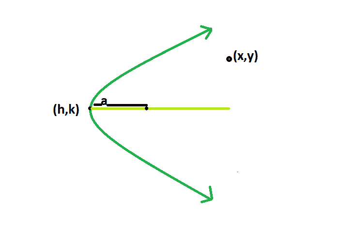

# 检查一个点是在抛物线内、外还是在抛物线上

> 原文:[https://www . geeksforgeeks . org/check-a-point 是在抛物线内侧还是外侧/](https://www.geeksforgeeks.org/check-if-a-point-is-inside-outside-or-on-the-parabola/)

给定一个带有顶点 **(h，k)** 和的抛物线，焦点和顶点之间的距离。任务是确定点 **(x，y)** 是在抛物线内、外还是在抛物线上。
**示例** :

```
Input: h = 100, k = 500, x = 20, y = 10, a = 4 
Output: Outside

Input: h = 0, k = 0, x = 2, y = 1, a = 4
Output: Inside
```



**逼近**:很简单，我们只要解点 **(x，y):**
的方程就可以了

> **(y-k)^2 = 4a(x-h)**
> 或，**(y-k)^2–4a(x-h)= 0**

求解后，如果结果为**小于 0** ，则**点位于**内，否则如果结果为**精确为 0** ，则点**位于抛物线**上，如果结果为**大于 0** 未满足，则点**位于抛物线**外。
这里我们取一个对称轴为 **y = k** 的抛物线，虽然该方法适用于任何抛物线。
以下是上述方法的实施:

## C++

```
// C++ Program to check if the point
// lies within the parabola or not
#include <bits/stdc++.h>
using namespace std;

// Function to check the point
int checkpoint(int h, int k, int x, int y, int a)
{

    // checking the equation of
    // parabola with the given point
    int p = pow((y - k), 2) - 4 * a * (x - h);

    return p;
}

// Driver code
int main()
{
    int h = 0, k = 0, x = 2, y = 1, a = 4;

    if (checkpoint(h, k, x, y, a) > 0)
        cout << "Outside" << endl;

    else if (checkpoint(h, k, x, y, a) == 0)
        cout << "On the parabola" << endl;

    else
        cout << "Inside" << endl;

    return 0;
}
```

## Java 语言(一种计算机语言，尤用于创建网站)

```
// Java Program to check if the point
// lies within the parabola or not

class solution
{

// Function to check the point
static int checkpoint(int h, int k, int x, int y, int a)
{
    // checking the equation of
    // parabola with the given point
    int p =(int) Math.pow((y - k), 2) - 4 * a * (x - h);

    return p;
}

//driver code
public static void main(String arr[])
{

    int h = 0, k = 0, x = 2, y = 1, a = 4;

    if (checkpoint(h, k, x, y, a) > 0)
    System.out.println("Outside");

    else if (checkpoint(h, k, x, y, a) == 0)
    System.out.println("On the parabola");

    else
    System.out.println("Inside");

}
}
```

## 蟒蛇 3

```
# Python3 Program to check if the point
# lies within the parabola or not

#  Function to check the point
def checkpoint(h, k, x, y, a):

    # checking the equation of
    # parabola with the given point
    p = pow((y - k), 2) - 4 * a * (x - h)

    return p

# Driver code
if __name__ == "__main__" :

    h = 0
    k = 0
    x = 2
    y = 1
    a = 4

    if checkpoint(h, k, x, y, a) > 0:
        print ("Outside\n")

    elif checkpoint(h, k, x, y, a) == 0:
        print ("On the parabola\n")

    else:
        print ("Inside\n");

# This code is contributed by
# Surendra_Gangwar
```

## C#

```
// C# Program to check if the point
// lies within the parabola or not
using System;

class GFG
{

// Function to check the point
public static int checkpoint(int h, int k,
                             int x, int y,
                             int a)
{
    // checking the equation of
    // parabola with the given point
    int p = (int) Math.Pow((y - k), 2) -
                            4 * a * (x - h);

    return p;
}

// Driver code
public static void Main(string[] arr)
{
    int h = 0, k = 0,
        x = 2, y = 1, a = 4;

    if (checkpoint(h, k, x, y, a) > 0)
    {
        Console.WriteLine("Outside");
    }

    else if (checkpoint(h, k, x, y, a) == 0)
    {
        Console.WriteLine("On the parabola");
    }

    else
    {
        Console.WriteLine("Inside");
    }
}
}

// This code is contributed
// by Shrikant13
```

## 服务器端编程语言（Professional Hypertext Preprocessor 的缩写）

```
<?php
// PHP Program to check if
// the point lies within
// the parabola or not

// Function to check the point
function checkpoint($h, $k, $x,
                        $y, $a)
{

    // checking the equation of
    // parabola with the given point
    $p = pow(($y - $k), 2) - 4 *
              $a * ($x - $h);

    return $p;
}

// Driver code
$h = 0; $k = 0; $x = 2;
$y = 1; $a = 4;

if (checkpoint($h, $k, $x,
               $y, $a) > 0)
    echo "Outside";
else if (checkpoint($h, $k, $x,
                    $y, $a) == 0)
    echo "On the parabola";
else
    echo "Inside";

// This code is contributed
// by inder_verma
?>
```

## java 描述语言

```
<script>

// javascript Program to check if the point
// lies within the parabola or not

// Function to check the point
function checkpoint(h , k , x , y , a)
{
    // checking the equation of
    // parabola with the given point
    var p =parseInt(Math.pow((y - k), 2) - 4 * a * (x - h));

    return p;
}

//driver code
var h = 0, k = 0, x = 2, y = 1, a = 4;

if (checkpoint(h, k, x, y, a) > 0)
    document.write("Outside");

else if (checkpoint(h, k, x, y, a) == 0)
    document.write("On the parabola");

else
    document.write("Inside");

// This code is contributed by 29AjayKumar

</script>
```

**Output:** 

```
Inside
```