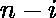

# 检查一个素数是否可以表示为两个素数之和

> 原文:[https://www . geesforgeks . org/check-if-a-质数-可以表示为两个质数之和/](https://www.geeksforgeeks.org/check-if-a-prime-number-can-be-expressed-as-sum-of-two-prime-numbers/)

给定一个质数。任务是检查是否可以将表示为两个独立质数的和。
**注【than 的范围小于 10 <sup>8</sup> 。**

**示例:**

```
Input : N = 13
Output : Yes
Explanation : The number 13 can be written as 11 + 2, 
here 11 and 2 are both prime.

Input : N = 11
Output : No
```

**简单解法**:一个简单的解法就是创建一个筛子来存储所有小于 N 的素数，然后运行一个从 1 到 N 的循环，检查和是否都是素数。如果是，则打印是，否则打印否

**高效解**:除了 2，所有质数都是奇数。所以不可能把一个质数(是奇数)写成两个奇质数的和，所以我们确定两个质数中的一个应该是 2。所以我们要检查 n-2 是否是素数。如果成立，我们就打印是，否则就打印否
例如，如果数字是 19，那么我们就必须检查 19-2 = 17 是否是质数。如果 17 是质数，则打印是，否则打印否。

下面是上述方法的实现:

## C++

```
// C++ program to check if a prime number
// can be expressed as sum of
// two Prime Numbers
#include <bits/stdc++.h>
using namespace std;

// Function to check whether a number
// is prime or not
bool isPrime(int n)
{
    if (n <= 1)
        return false;

    for (int i = 2; i <= sqrt(n); i++) {
        if (n % i == 0)
            return false;
    }

    return true;
}

// Function to check if a prime number
// can be expressed as sum of
// two Prime Numbers
bool isPossible(int N)
{
    // if the number is prime,
    // and number-2 is also prime
    if (isPrime(N) && isPrime(N - 2))
        return true;
    else
        return false;
}

// Driver code
int main()
{
    int n = 13;

    if (isPossible(n))
        cout << "Yes";
    else
        cout << "No";

    return 0;
}
```

## Java 语言(一种计算机语言，尤用于创建网站)

```
// Java program to check if a prime number
// can be expressed as sum of
// two Prime Numbers

public class GFG{

    // Function to check whether a number
    // is prime or not
    static boolean isPrime(int n)
    {
        if (n <= 1)
            return false;

        for (int i = 2; i <= Math.sqrt(n); i++) {
            if (n % i == 0)
                return false;
        }

        return true;
    }

    // Function to check if a prime number
    // can be expressed as sum of
    // two Prime Numbers
    static boolean isPossible(int N)
    {
        // if the number is prime,
        // and number-2 is also prime
        if (isPrime(N) && isPrime(N - 2))
            return true;
        else
            return false;
    }

     // Driver code
     public static void main(String []args){

        int n = 13;

        if (isPossible(n) == true)
            System.out.println("Yes");
        else
            System.out.println("No");
     }
     // This code is contributed by ANKITRAI1
}
```

## 蟒蛇 3

```
# Python3 program to check if a prime
# number can be expressed as sum of
# two Prime Numbers
import math

# Function to check whether a number
# is prime or not
def isPrime(n):
    if n <= 1:
        return False

    if n == 2:
        return True

    if n%2 == 0:
        return False

    for i in range(3, int(math.sqrt(n))+1, 2):
        if n%i == 0:
            return False
    return True

# Function to check if a prime number
# can be expressed as sum of
# two Prime Numbers
def isPossible(n):

    # if the number is prime,
    # and number-2 is also prime
    if isPrime(n) and isPrime(n - 2):
        return True
    else:
        return False

# Driver code
n = 13
if isPossible(n) == True:
    print("Yes")
else:
    print("No")

# This code is contributed by Shrikant13
```

## C#

```
// C# program to check if a prime
// number can be expressed as sum
// of two Prime Numbers
using System;

class GFG
{

// Function to check whether a
// number is prime or not
static bool isPrime(int n)
{
    if (n <= 1)
        return false;

    for (int i = 2;
             i <= Math.Sqrt(n); i++)
    {
        if (n % i == 0)
            return false;
    }

    return true;
}

// Function to check if a prime
// number can be expressed as sum
// of two Prime Numbers
static bool isPossible(int N)
{
    // if the number is prime,
    // and number-2 is also prime
    if (isPrime(N) && isPrime(N - 2))
        return true;
    else
        return false;
}

// Driver code
public static void Main()
{
    int n = 13;

    if (isPossible(n) == true)
        Console.Write("Yes");
    else
        Console.Write("No");
}
}

// This code is contributed
// by ChitraNayal
```

## 服务器端编程语言（Professional Hypertext Preprocessor 的缩写）

```
<?php
// PHP program to check if a prime
// number can be expressed as sum
// of two Prime Numbers

// Function to check whether a
// number is prime or not
function isPrime($n)
{
    if ($n <= 1)
        return false;

    for ($i = 2; $i <= sqrt($n); $i++)
    {
        if ($n % $i == 0)
            return false;
    }

    return true;
}

// Function to check if a prime
// number can be expressed as sum
// of two Prime Numbers
function isPossible($N)
{
    // if the number is prime,
    // and number-2 is also prime
    if (isPrime($N) && isPrime($N - 2))
        return true;
    else
        return false;
}

// Driver code
$n = 13;

if (isPossible($n))
    echo ("Yes");
else
    echo("No");

// This code is contributed
// by Shivi_Aggarwal
?>
```

## java 描述语言

```
<script>

// Javascript program to check if a
// prime number can be expressed as
// sum of two Prime Numbers

// Function to check whether a number
// is prime or not
function isPrime(n)
{
    if (n <= 1)
        return false;

    for(var i = 2; i <= parseInt(Math.sqrt(n)); i++)
    {
        if (n % i == 0)
            return false;
    }

    return true;
}

// Function to check if a prime number
// can be expressed as sum of
// two Prime Numbers
function isPossible(N)
{

    // If the number is prime,
    // and number-2 is also prime
    if (isPrime(N) && isPrime(N - 2))
        return true;
    else
        return false;
}

// Driver code
var n = 13;
if (isPossible(n))
    document.write("Yes");
else
    document.write("No");

// This code is contributed by noob2000

</script>
```

**Output:** 

```
Yes
```