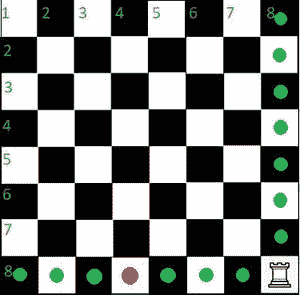
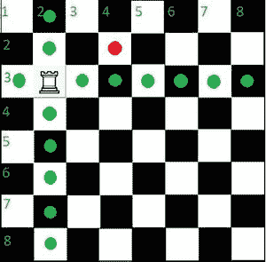
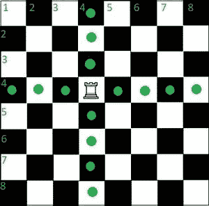

# 检查一辆车是否能在一次移动中到达指定的目的地

> 原文:[https://www . geesforgeks . org/check-if-a-rook-can-reach-给定目的地-in-one-move/](https://www.geeksforgeeks.org/check-if-a-rook-can-reach-the-given-destination-in-a-single-move/)

给定整数 **current_row** 和 **current_col** ，代表一个车在 **8 × 8** 棋盘上的当前位置，再给定两个整数 **destination_row** 和 **destination_col** ，代表一个车要到达的位置。任务是检查一辆车是否有可能从当前位置一次性到达给定的目的地。如果发现是真的，打印**“可能”**。否则，打印**“不可能”**。

**示例:**

> **输入:** current_row=8，current_col=8，destination_row=8，destination_col=4
> **输出:**可能
> **解释:**
> 
> [](https://media.geeksforgeeks.org/wp-content/uploads/20200828142418/IMG20200828WA0005-300x295.jpg)
> 
> 可能的
> 
> **输入:** current_row=3，current_col=2，destination_row=2，destination_col=4
> **输出:**不可能
> **解释:**
> 
> [](https://media.geeksforgeeks.org/wp-content/uploads/20200828143415/IMG20200828WA0005-300x295.jpg)
> 
> 不可能

**方法:**给定的问题可以通过以下观察来解决:

> 在棋盘上，一个车可以在一次移动中水平和垂直移动尽可能多的方块。因此，它可以移动到与其初始位置相同的行或列中的任何位置。
> 
> [](https://media.geeksforgeeks.org/wp-content/uploads/20200828123950/IMG20200828WA0004-300x296.jpg)

因此，问题简化为简单地检查以下两个条件:

*   如果目标行和当前行相等或不相等。
*   否则，检查 destination_col 是否等于 current_col。
*   如果满足以上两个条件中的任何一个，打印“**可能**”。否则，打印**“不可能”**。

下面是上述方法的实现:

## C++14

```
// C++ program to implement
// for the above approach
#include <bits/stdc++.h>
using namespace std;

// Function to check if it is
// possible to reach destination
// in a single move by a rook
string check(int current_row, int current_col,
             int destination_row, int destination_col)
{

    if(current_row == destination_row)
        return "POSSIBLE";
    else if(current_col == destination_col)
        return "POSSIBLE";
    else
        return "NOT POSSIBLE";
}

// Driver Code
int main()
{

  // Given arrays
  int current_row = 8;
  int current_col = 8;
  int destination_row = 8;
  int destination_col = 4;
  string output = check(current_row, current_col,
                        destination_row, destination_col);
  cout << output;
  return 0;
}

// This code is contributed by mohit kumar 29.
```

## Java 语言(一种计算机语言，尤用于创建网站)

```
// Java program for the above approach
import java.util.*;
import java.lang.*;

class GFG{

// Function to check if it is
// possible to reach destination
// in a single move by a rook
static String check(int current_row, int current_col,
             int destination_row, int destination_col)
{

    if(current_row == destination_row)
        return "POSSIBLE";
    else if(current_col == destination_col)
        return "POSSIBLE";
    else
        return "NOT POSSIBLE";
}

// Driver code
public static void main(String[] args)
{
    // Given arrays
  int current_row = 8;
  int current_col = 8;
  int destination_row = 8;
  int destination_col = 4;
  String output = check(current_row, current_col,
                        destination_row, destination_col);
  System.out.println(output);
}
}

// This code is contributed by code_hunt.
```

## 蟒蛇 3

```
# Python program to implement
# for the above approach

# Function to check if it is
# possible to reach destination
# in a single move by a rook
def check(current_row, current_col,
           destination_row, destination_col):

    if(current_row == destination_row):
        return("POSSIBLE")
    elif(current_col == destination_col):
        return("POSSIBLE")
    else:
        return("NOT POSSIBLE")

# Driver Code
current_row = 8
current_col = 8
destination_row = 8
destination_col = 4

output = check(current_row, current_col,
               destination_row, destination_col)
print(output)
```

## C#

```
// C# program to implement
// the above approach
using System;

class GFG
{

  // Function to check if it is
  // possible to reach destination
  // in a single move by a rook
  static string check(int current_row, int current_col,
                      int destination_row, int destination_col)
  {

    if(current_row == destination_row)
      return "POSSIBLE";
    else if(current_col == destination_col)
      return "POSSIBLE";
    else
      return "NOT POSSIBLE";
  }

  // Driver Code
  public static void  Main()
  {
    // Given arrays
    int current_row = 8;
    int current_col = 8;
    int destination_row = 8;
    int destination_col = 4;
    string output = check(current_row, current_col,
                          destination_row, destination_col);
    Console.WriteLine(output);
  }
}

// This code is contributed by susmitakundugoaldanga.
```

## java 描述语言

```
<script>
// javascript program of the above approach

// Function to check if it is
// possible to reach destination
// in a single move by a rook
function check(current_row, current_col,
             destination_row, destination_col)
{

    if(current_row == destination_row)
        return "POSSIBLE";
    else if(current_col == destination_col)
        return "POSSIBLE";
    else
        return "NOT POSSIBLE";
}

    // Driver Code

   // Given arrays
  let current_row = 8;
  let current_col = 8;
  let destination_row = 8;
  let destination_col = 4;
  let output = check(current_row, current_col,
                        destination_row, destination_col);
  document.write(output);

</script>
```

**Output:** 

```
POSSIBLE
```

***时间复杂度:**O(1)*
T5**空间复杂度** : O(1)