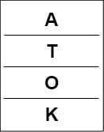
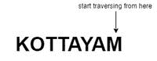
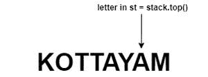
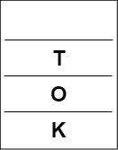
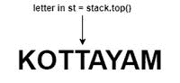
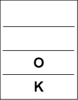
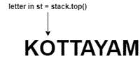
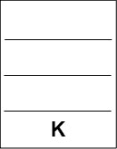
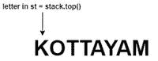
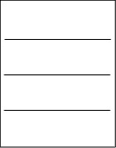

# 检查一个字符串是否是另一个字符串的子序列(使用 Stacks )

> 原文:[https://www . geeksforgeeks . org/check-if-a-string-is-of-other-string-use-stacks/](https://www.geeksforgeeks.org/check-if-a-string-is-a-subsequence-of-another-string-using-stacks/)

给定一个[字符串](https://www.geeksforgeeks.org/category/data-structures/c-strings/) **S，**任务是使用[堆栈](https://www.geeksforgeeks.org/sort-a-stack-using-recursion/)检查字符串**目标**是否是字符串 **S** 的[子序列](https://www.geeksforgeeks.org/subarraysubstring-vs-subsequence-and-programs-to-generate-them/)。

**示例:**

> **输入:**S =“KOTTAYAM”，target =“KOTA”
> **输出:**是
> **说明:**“KOTA”是“KOTTAYAM”的子序列。
> 
> **输入:** S = "GEEKSFORGEEKS "，target = " FORFOR "
> T3】输出:否

**方法:**按照步骤解决问题:

*   初始化一个[栈](https://www.geeksforgeeks.org/stack-data-structure/)T2。
*   [迭代字符串](https://www.geeksforgeeks.org/iterate-over-characters-of-a-string-in-c/) **目标**的字符。



**目标**推入堆栈

*   [在反方向](https://www.geeksforgeeks.org/how-to-traverse-a-c-set-in-reverse-direction/)上穿过弦 **S** 。
*   如果字符串 S 的当前字符与堆栈顶部的字符相同，[弹出堆栈的顶部元素。](https://www.geeksforgeeks.org/stack-pop-method-in-java/)



穿越 **S**



穿越 **S**



从堆栈中弹出



穿越南方



从堆栈中弹出



穿越 st



从堆栈中弹出



穿越南方



堆栈变空

*   如果在任何时候[栈变空](https://www.geeksforgeeks.org/stack-empty-and-stack-size-in-c-stl/)，可以断定**目标**是 **S** 的[子序列](https://www.geeksforgeeks.org/subarraysubstring-vs-subsequence-and-programs-to-generate-them/)。
*   否则，**目标**不是 **S** 的[子序列](https://www.geeksforgeeks.org/subarraysubstring-vs-subsequence-and-programs-to-generate-them/)。

下面是上述方法的实现:

## C++

```
// C++ Program for the above approach

#include <bits/stdc++.h>
using namespace std;

// Function to check if target
// is a subsequence of string S
void checkforSubsequence(string S,
                         string target)
{

    // Declare a stack
    stack<char> s;

    // Push the characters of
    // target into the stack
    for (int i = 0; i < target.size(); i++) {
        s.push(target[i]);
    }

    // Traverse the string S in reverse
    for (int i = (int)S.size() - 1; i >= 0; i--) {

        // If the stack is empty
        if (s.empty()) {

            cout << "Yes" << endl;
            return;
        }

        // if S[i] is same as the
        // top of the stack
        if (S[i] == s.top()) {

            // Pop the top of stack
            s.pop();
        }
    }

    // Stack s is empty
    if (s.empty())
        cout << "Yes" << endl;
    else
        cout << "No" << endl;
}

// Driver Code
int main()
{
    string S = "KOTTAYAM";
    string target = "KOTA";

    checkforSubsequence(S, target);

    return 0;
}
```

## Java 语言(一种计算机语言，尤用于创建网站)

```
// Java approach for the above approach
import java.util.Stack;

public class GFG {

    // Function to check if target
    // is a subsequence of string S
    static void checkforSubsequence(String S, String target)
    {

        // Declare a stack
        Stack<Character> s = new Stack<>();

        // Push the characters of
        // target into the stack
        for (int i = 0; i < target.length(); i++) {
            s.push(target.charAt(i));
        }

        // Traverse the string S in reverse
        for (int i = (int)S.length() - 1; i >= 0; i--) {

            // If the stack is empty
            if (s.empty()) {

                System.out.println("Yes");
                return;
            }

            // if S[i] is same as the
            // top of the stack
            if (S.charAt(i) == s.peek()) {

                // Pop the top of stack
                s.pop();
            }
        }

        // Stack s is empty
        if (s.empty())
            System.out.println("Yes");
        else
            System.out.println("No");
    }

    // Driver Code
    public static void main(String[] args)
    {
        String S = "KOTTAYAM";
        String target = "KOTA";

        checkforSubsequence(S, target);
    }
}

// This code is contributed by abhinavjain194
```

## 蟒蛇 3

```
# Python3 program for the above approach

# Function to check if target
# is a subsequence of string S
def checkforSubsequence(S, target):

    # Declare a stack
    s = []

    # Push the characters of
    # target into the stack
    for i in range(len(target)):
        s.append(target[i])

    # Traverse the string S in reverse
    for i in range(len(S) - 1, -1, -1):

        # If the stack is empty
        if (len(s) == 0):
            print("Yes")
            return

        # If S[i] is same as the
        # top of the stack
        if (S[i] == s[-1]):

            # Pop the top of stack
            s.pop()

    # Stack s is empty
    if (len(s) == 0):
        print("Yes")
    else:
        print("No")

# Driver Code
if __name__ == "__main__":

    S = "KOTTAYAM"
    target = "KOTA"

    checkforSubsequence(S, target)

# This code is contributed by ukasp
```

## C#

```
// C# approach for the above approach
using System;
using System.Collections.Generic;

class GFG{

// Function to check if target
// is a subsequence of string S
static void checkforSubsequence(String S,
                                String target)
{

    // Declare a stack
    Stack<char> s = new Stack<char>();

    // Push the characters of
    // target into the stack
    for(int i = 0; i < target.Length; i++)
    {
        s.Push(target[i]);
    }

    // Traverse the string S in reverse
    for(int i = (int)S.Length - 1; i >= 0; i--)
    {

        // If the stack is empty
        if (s.Count == 0)
        {
            Console.WriteLine("Yes");
            return;
        }

        // If S[i] is same as the
        // top of the stack
        if (S[i] == s.Peek())
        {

            // Pop the top of stack
            s.Pop();
        }
    }

    // Stack s is empty
    if (s.Count == 0)
        Console.WriteLine("Yes");
    else
        Console.WriteLine("No");
}

// Driver Code
public static void Main(String[] args)
{
    String S = "KOTTAYAM";
    String target = "KOTA";

    checkforSubsequence(S, target);
}
}

// This code is contributed by shikhasingrajput
```

## java 描述语言

```
<script>

// JavaScript Program for the above approach

// Function to check if target
// is a subsequence of string S
function checkforSubsequence(S, target)
{

    // Declare a stack
    var s = [];

    // Push the characters of
    // target into the stack
    for (var i = 0; i < target.length; i++) {
        s.push(target[i]);
    }

    // Traverse the string S in reverse
    for (var i = S.length - 1; i >= 0; i--) {

        // If the stack is empty
        if (s.length==0) {

            document.write( "Yes");
            return;
        }

        // if S[i] is same as the
        // top of the stack
        if (S[i] == s[s.length-1]) {

            // Pop the top of stack
            s.pop();
        }
    }

    // Stack s is empty
    if (s.length==0)
        document.write( "Yes" );
    else
        document.write( "No" );
}

// Driver Code

var S = "KOTTAYAM";
var target = "KOTA";
checkforSubsequence(S, target);

</script>
```

**Output:** 

```
Yes
```

***时间复杂度:**O(N)*
T5**辅助空间:** O(N)