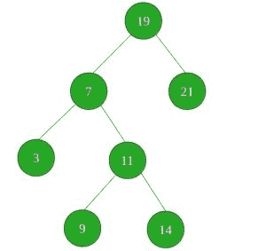

# 检查 BST 中是否存在给定和的三元组

> 原文:[https://www . geeksforgeeks . org/check-if-a-three-with-given-sum-in-BST/](https://www.geeksforgeeks.org/check-if-a-triplet-with-given-sum-exists-in-bst/)

给定一个二叉查找树和一个求和。任务是用给定的 SUM 检查给定的 BST 中是否存在任何三元组(3 个元素的组)。



**例:**

```
Input : SUM = 21
Output : YES
There exists a triplet (7, 3, 11) in the 
above given BST with sum 21.

Input : SUM = 101
Output : NO
```

众所周知，BST 的[有序遍历中的元素是按递增顺序排序的。因此，我们的想法是在给定的 BST 上按顺序遍历，并将元素存储在向量或数组中。现在任务简化为](https://www.geeksforgeeks.org/tree-traversals-inorder-preorder-and-postorder/)[在排序的数组](https://www.geeksforgeeks.org/find-a-triplet-that-sum-to-a-given-value/)中检查给定总和的三元组。
现在要做的是，开始遍历数组，对于每个元素 A[i]，检查剩余排序数组中的 SUM(SUM–A[I])对。

```
To do this:
1) Initialize two index variables to find the candidate 
   elements in the sorted array.
       (a) Initialize first to the leftmost index: l = 0
       (b) Initialize second  the rightmost index:  r = ar_size-1
2) Loop while l < r.
       (a) If (A[l] + A[r] == sum)  then return 1
       (b) Else if( A[l] + A[r] <  sum )  then l++
       (c) Else r--    
3) If no such candidates are found in the whole array, 
   return 0
```

以下是上述方法的实现:

## C++

```
// C++ program to check if a triplet with
// given SUM exists in the BST or not

#include <bits/stdc++.h>
using namespace std;

struct Node {
    int key;
    struct Node *left, *right;
};

// A utility function to create a new BST node
struct Node* newNode(int item)
{
    Node* temp = new Node;
    temp->key = item;
    temp->left = temp->right = NULL;
    return temp;
}

// A utility function to do inorder traversal
// of the BST and store values in a vector
void inorder(Node* root, vector<int>& vec)
{
    if (root != NULL) {
        inorder(root->left, vec);
        vec.push_back(root->key);
        inorder(root->right, vec);
    }
}

// A utility function to insert a new node
// with given key in BST
struct Node* insert(Node* node, int key)
{
    /* If the tree is empty, return a new node */
    if (node == NULL)
        return newNode(key);

    /* Otherwise, recur down the tree */
    if (key < node->key)
        node->left = insert(node->left, key);
    else if (key > node->key)
        node->right = insert(node->right, key);

    /* return the (unchanged) node pointer */
    return node;
}

// Function to check if a triplet with given SUM
// exists in the BST or not
bool checkForTriplet(Node* root, int sum)
{
    // Vector to store the inorder traversal
    // of the BST
    vector<int> vec;

    // Call inorder() to do the inorder
    // on the BST and store it in vec
    inorder(root, vec);

    // Now, check if any triplet with given sum
    // exists in the BST or not
    int l, r;

    // Now fix the first element one by one and find the
    // other two elements
    for (int i = 0; i < vec.size() - 2; i++) {

        // To find the other two elements, start two index
        // variables from two corners of the array and move
        // them toward each other
        l = i + 1; // index of the first element in the
        // remaining elements

        // index of the last element
        r = vec.size() - 1;
        while (l < r) {
            if (vec[i] + vec[l] + vec[r] == sum) {

                return true;
            }
            else if (vec[i] + vec[l] + vec[r] < sum)
                l++;
            else // vec[i] + vec[l] + vec[r] > sum
                r--;
        }
    }

    // If we reach here, then no triplet was found
    return false;
}

// Driver Code
int main()
{
    /* Let us create following BST
          50
        /     \
       30     70
       / \   / \
      20 40 60 80 */
    struct Node* root = NULL;
    root = insert(root, 50);
    insert(root, 30);
    insert(root, 20);
    insert(root, 40);
    insert(root, 70);
    insert(root, 60);
    insert(root, 80);

    int sum = 120;

    if (checkForTriplet(root, sum))
        cout << "YES";
    else
        cout << "NO";

    return 0;
}
```

## Java 语言(一种计算机语言，尤用于创建网站)

```
// Java program to check if a triplet with
// given SUM exists in the BST or not
import java.util.*;

class GFG
{
static class Node
{
    int key;
    Node left, right;
};

// A utility function to
// create a new BST node
static Node newNode(int item)
{
    Node temp = new Node();
    temp.key = item;
    temp.left = temp.right = null;
    return temp;
}

// A utility function to do inorder traversal
// of the BST and store values in a vector
static void inorder(Node root,
                    Vector<Integer> vec)
{
    if (root != null)
    {
        inorder(root.left, vec);
        vec.add(root.key);
        inorder(root.right, vec);
    }
}

// A utility function to insert a new node
// with given key in BST
static Node insert(Node node, int key)
{
    /* If the tree is empty,
    return a new node */
    if (node == null)
        return newNode(key);

    /* Otherwise, recur down the tree */
    if (key < node.key)
        node.left = insert(node.left, key);
    else if (key > node.key)
        node.right = insert(node.right, key);

    /* return the (unchanged) node pointer */
    return node;
}

// Function to check if a triplet with
// given SUM exists in the BST or not
static boolean checkForTriplet(Node root, int sum)
{
    // Vector to store the inorder traversal
    // of the BST
    Vector<Integer> vec = new Vector<Integer>();

    // Call inorder() to do the inorder
    // on the BST and store it in vec
    inorder(root, vec);

    // Now, check if any triplet with given sum
    // exists in the BST or not
    int l, r;

    // Now fix the first element one by one
    // and find the other two elements
    for (int i = 0; i < vec.size() - 2; i++)
    {

        // To find the other two elements,
        // start two index variables from two corners
        // of the array and move them toward each other
        l = i + 1; // index of the first element in the
                   // remaining elements

        // index of the last element
        r = vec.size() - 1;
        while (l < r)
        {
            if (vec.get(i) +
                vec.get(l) + vec.get(r) == sum)
            {
                return true;
            }
            else if (vec.get(i) +
                     vec.get(l) + vec.get(r) < sum)
                l++;
            else // vec[i] + vec[l] + vec[r] > sum
                r--;
        }
    }

    // If we reach here,
    // then no triplet was found
    return false;
}

// Driver Code
public static void main(String[] args)
{
    /* Let us create following BST
        50
        /     \
    30     70
    / \ / \
    20 40 60 80 */
    Node root = null;
    root = insert(root, 50);
    insert(root, 30);
    insert(root, 20);
    insert(root, 40);
    insert(root, 70);
    insert(root, 60);
    insert(root, 80);

    int sum = 120;

    if (checkForTriplet(root, sum))
        System.out.print("YES");
    else
        System.out.print("NO");
}
}

// This code is contributed by 29AjayKumar
```

## 蟒蛇 3

```
# Python3 program to check if a triplet with
# given SUM exists in the BST or not
class Node:
    def __init__(self, data):

        self.data = data
        self.right = self.left = None

# A utility function to insert a
# new node with given key in BST
def insert(root, x):

    if root is None:
        root = Node(x)

    else:
        if root.data < x:
            if root.right is None:
                root.right = Node(x)
            else:
                insert(root.right, x)

        else:
            if root.left is None:
                root.left = Node(x)
            else:
                insert(root.left, x)

# A utility function to do inorder
# traversal of the BST and store
# values in an array
def inorder(root, ior):

    if root is None:
        return

    inorder(root.left, ior)
    ior.append(root.data)
    inorder(root.right, ior)

# Function to check if a triplet with
# given SUM exists in the BST or not
def checkForTriplet(root, sum):

    # Initialize an empty array
    vec = [0]

    # Call to function inorder to
    # store values in array
    inorder(root, vec)

    # Traverse the array and find
    # triplet with sum
    for i in range(0, len(vec) - 2, 1):
        l = i + 1

        # Index of the last element
        r = len(vec) - 1

        while(l < r):
            if vec[i] + vec[l] + vec[r] == sum:
                return True
            elif vec[i] + vec[l] + vec[r] < sum:
                l += 1
            else: # vec[i] + vec[l] + vec[r] > sum
                r -= 1

    # If we reach here, then
    # no triplet was found            
    return False

# Driver code
if __name__ == '__main__':

    """ Let us create following BST 
          50 
        /     \ 
       30     70 
       / \   / \ 
      20 40 60 80
    """
    root = Node(50)
    insert(root, 30)
    insert(root, 20)
    insert(root, 40)
    insert(root, 70)
    insert(root, 60)
    insert(root, 80)

    sum = 120

    if (checkForTriplet(root, sum)):
        print("YES")
    else:
        print("NO")

# This code is contributed by MRINALWALIA
```

## C#

```
// C# program to check if a triplet with
// given SUM exists in the BST or not
using System;
using System.Collections.Generic;

class GFG
{
class Node
{
    public int key;
    public Node left, right;
};

// A utility function to
// create a new BST node
static Node newNode(int item)
{
    Node temp = new Node();
    temp.key = item;
    temp.left = temp.right = null;
    return temp;
}

// A utility function to do inorder traversal
// of the BST and store values in a vector
static void inorder(Node root,
                    List<int> vec)
{
    if (root != null)
    {
        inorder(root.left, vec);
        vec.Add(root.key);
        inorder(root.right, vec);
    }
}

// A utility function to insert a new node
// with given key in BST
static Node insert(Node node, int key)
{
    /* If the tree is empty,
    return a new node */
    if (node == null)
        return newNode(key);

    /* Otherwise, recur down the tree */
    if (key < node.key)
        node.left = insert(node.left, key);
    else if (key > node.key)
        node.right = insert(node.right, key);

    /* return the (unchanged) node pointer */
    return node;
}

// Function to check if a triplet with
// given SUM exists in the BST or not
static bool checkForTriplet(Node root, int sum)
{
    // List to store the inorder traversal
    // of the BST
    List<int> vec = new List<int>();

    // Call inorder() to do the inorder
    // on the BST and store it in vec
    inorder(root, vec);

    // Now, check if any triplet with given sum
    // exists in the BST or not
    int l, r;

    // Now fix the first element one by one
    // and find the other two elements
    for (int i = 0; i < vec.Count - 2; i++)
    {

        // To find the other two elements,
        // start two index variables from two corners
        // of the array and move them toward each other
        l = i + 1; // index of the first element in the
                   // remaining elements

        // index of the last element
        r = vec.Count - 1;
        while (l < r)
        {
            if (vec[i] +
                vec[l] + vec[r] == sum)
            {
                return true;
            }
            else if (vec[i] +
                     vec[l] + vec[r] < sum)
                l++;
            else // vec[i] + vec[l] + vec[r] > sum
                r--;
        }
    }

    // If we reach here,
    // then no triplet was found
    return false;
}

// Driver Code
public static void Main(String[] args)
{
    /* Let us create following BST
        50
        /     \
    30     70
    / \ / \
    20 40 60 80 */
    Node root = null;
    root = insert(root, 50);
    insert(root, 30);
    insert(root, 20);
    insert(root, 40);
    insert(root, 70);
    insert(root, 60);
    insert(root, 80);

    int sum = 120;

    if (checkForTriplet(root, sum))
        Console.Write("YES");
    else
        Console.Write("NO");
}
}
```

## java 描述语言

```
<script>

// Javascript program to check if a triplet with
// given SUM exists in the BST or not

class Node
{
    constructor()
    {
        this.key = 0;
        this.left = null;
        this.right = null;
    }
};

// A utility function to
// create a new BST node
function newNode(item)
{
    var temp = new Node();
    temp.key = item;
    temp.left = temp.right = null;
    return temp;
}

// A utility function to do inorder traversal
// of the BST and store values in a vector
function inorder(root, vec)
{
    if (root != null)
    {
        inorder(root.left, vec);
        vec.push(root.key);
        inorder(root.right, vec);
    }
}

// A utility function to insert a new node
// with given key in BST
function insert(node, key)
{
    /* If the tree is empty,
    return a new node */
    if (node == null)
        return newNode(key);

    /* Otherwise, recur down the tree */
    if (key < node.key)
        node.left = insert(node.left, key);
    else if (key > node.key)
        node.right = insert(node.right, key);

    /* return the (unchanged) node pointer */
    return node;
}

// Function to check if a triplet with
// given SUM exists in the BST or not
function checkForTriplet(root, sum)
{
    // List to store the inorder traversal
    // of the BST
    var vec = [];

    // Call inorder() to do the inorder
    // on the BST and store it in vec
    inorder(root, vec);

    // Now, check if any triplet with given sum
    // exists in the BST or not
    var l, r;

    // Now fix the first element one by one
    // and find the other two elements
    for (var i = 0; i < vec.length - 2; i++)
    {

        // To find the other two elements,
        // start two index variables from two corners
        // of the array and move them toward each other
        l = i + 1; // index of the first element in the
                   // remaining elements

        // index of the last element
        r = vec.length - 1;
        while (l < r)
        {
            if (vec[i] +
                vec[l] + vec[r] == sum)
            {
                return true;
            }
            else if (vec[i] +
                     vec[l] + vec[r] < sum)
                l++;
            else // vec[i] + vec[l] + vec[r] > sum
                r--;
        }
    }

    // If we reach here,
    // then no triplet was found
    return false;
}

// Driver Code
/* Let us create following BST
    50
    /     \
30     70
/ \ / \
20 40 60 80 */
var root = null;
root = insert(root, 50);
insert(root, 30);
insert(root, 20);
insert(root, 40);
insert(root, 70);
insert(root, 60);
insert(root, 80);
var sum = 120;
if (checkForTriplet(root, sum))
    document.write("YES");
else
    document.write("NO");

// This code is contributed by itsok.

</script>
```

**Output:** 

```
YES
```

**时间复杂度** : O(N <sup>2</sup> )
**辅助空间** : O(N)，其中 N 为给定 BST 中的节点数。