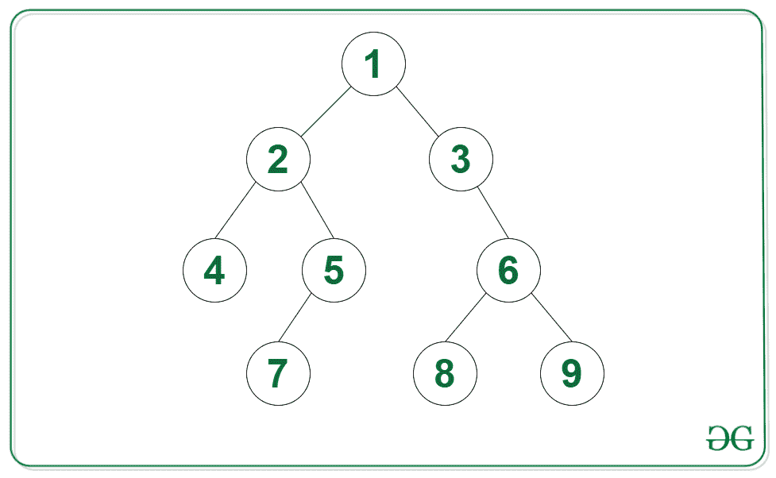

# 检查给定链表的所有元素是否对应于给定二叉树中任何节点的向下路径

> 原文:[https://www . geesforgeks . org/check-如果给定链表的所有元素对应于给定二叉树中任何节点的向下路径/](https://www.geeksforgeeks.org/check-if-all-elements-of-given-linked-list-corresponds-to-a-downward-path-from-any-node-in-given-binary-tree/)

给定[二叉树](https://www.geeksforgeeks.org/binary-tree-data-structure/)的根和[链表](https://www.geeksforgeeks.org/data-structures/linked-list/)的头，任务是检查链表的所有元素是否对应于给定二叉树中任何节点的向下路径。

**示例:**

> **输入:**下图中的树，列表= {3，6，8}
> 
> [](https://media.geeksforgeeks.org/wp-content/uploads/20211007070716/BSTdrawio.png)
> 
> **输出:**是
> **说明:**在给定的二叉树中存在一条向下的路径，链表的所有元素都以相同的顺序排列。
> 
> **输入:**下图中的树，列表= {1，2，5，7}
> 
> 
> 
> **输出:**是

**方法:**借助[二叉树](https://www.geeksforgeeks.org/binary-tree-data-structure/)的 [DFS 遍历](https://www.geeksforgeeks.org/dfs-traversal-of-a-tree-using-recursion/)可以解决给定的问题。在 DFS 遍历过程中，如果二叉树的任意节点等于[链表](https://www.geeksforgeeks.org/data-structures/linked-list/)的头部，则可以调用[递归函数](https://www.geeksforgeeks.org/recursive-functions/)**ispathtell()**递归检查链表的其他元素是否也作为从该节点开始的路径存在。如果已经遍历了完整的链表，则存在有效的所需路径，因此返回 **true** 。否则，返回**假**。按照以下步骤解决给定的问题:

*   声明一个函数，说**发出【根，头】**，在这个[函数](https://www.geeksforgeeks.org/functions-in-c/)中执行以下步骤:
    *   如果**根**为**空**，则返回**假**。
    *   如果头部为空，则返回真。
    *   如果当前根节点的值与 LL 的当前头的值相同，则[递归调用](https://www.geeksforgeeks.org/recursion/)为 **isSubPathUtil(根- >左，头- >下)**和 **isSubPathUtil(根- >右，头- >下)**如果这些递归调用之一返回的值为真，则返回真。否则，返回**假**。
*   声明一个函数，说 **isSubPath(根，头)**，在这个函数中执行以下步骤:
    *   如果**根**为**空**，则返回**假**。
    *   如果**头**为**空**，则返回真。
    *   如果当前根节点的值与 LL 的当前头的值相同，则递归调用 **isSubPath(根- >左，头- >下)**和 **isSubPath(根- >右，头- >下)**，如果这些递归调用之一返回的值为真，则返回真。否则，递归调用 **isSubPath(根- >左，头)**和 **isSubPath(根- >右，头)**的返回值。
*   完成上述步骤后，如果函数**返回的值为**真**，则打印**是**。否则，打印**否**。**

下面是上述方法的实现:

## C++

```
// C++ program for the above approach

#include "bits/stdc++.h"
using namespace std;

// Node of the Linked list
struct listNode {
    int val;
    struct listNode* next;

    // Constructor
    listNode(int data)
    {
        this->val = data;
        next = NULL;
    }
};

// Node of the Binary Search tree
struct treeNode {
    int val;
    treeNode* right;
    treeNode* left;

    // Constructor
    treeNode(int data)
    {
        this->val = data;
        this->left = NULL;
        this->right = NULL;
    }
};

// Recursive function to check if there
// exist a path from the node curTree
// having the LL from the node curList
bool isPathUtil(listNode* curList,
                treeNode* curTree)
{
    // If the complete linked list
    // is traversed
    if (curList == NULL)
        return true;

    // If the tree node doesnot exist
    if (curTree == NULL)
        return false;

    if (curList->val == curTree->val) {

        // Recursively calling for the
        // next element
        return isPathUtil(curList->next,
                          curTree->left)
               || isPathUtil(curList->next,
                             curTree->right);
    }
    else {

        // If not found, return false
        return false;
    }
}

// Function to check if the linked list
// exist as a downward path in Binary tree
// using the DFS Traversal of the Tree
bool isPath(listNode* head, treeNode* root)
{

    // If the current node of the
    // tree is Null
    if (root == NULL)
        return false;

    // If the complete linked list
    // has been found
    if (head == NULL)
        return true;

    // Stores if there exist the
    // required path
    bool isPossible = false;

    if (root->val == head->val) {

        // Recursively calling to
        // check the next node of
        // the linked list
        isPossible = isPathUtil(
                         head->next, root->left)
                     || isPathUtil(
                            head->next, root->right);
    }

    // Recursive calling for the next
    // elements of of the binary tree
    return isPossible || isPath(head, root->left)
           || isPath(head, root->right);
}

// Driver Code
int main()
{
    treeNode* root = new treeNode(1);
    root->left = new treeNode(2);
    root->right = new treeNode(3);
    root->left->left = new treeNode(4);
    root->left->right = new treeNode(5);
    root->left->right->left = new treeNode(7);
    root->right->right = new treeNode(6);
    root->right->right->left = new treeNode(8);
    root->right->right->right = new treeNode(9);

    listNode* head = new listNode(3);
    head->next = new listNode(6);
    head->next->next = new listNode(8);

    // Function Call
    cout << (isPath(head, root) ? "Yes" : "No");

    return 0;
}
```

## Java 语言(一种计算机语言，尤用于创建网站)

```
// Java program for the above approach

//include "bits/stdJava.h"
import java.util.*;

class GFG{

// Node of the Linked list
static class listNode {
    int val;
    listNode next;

    // Constructor
    listNode(int data)
    {
        this.val = data;
        next = null;
    }
};

// Node of the Binary Search tree
static class treeNode {
    int val;
    treeNode right;
    treeNode left;

    // Constructor
    treeNode(int data)
    {
        this.val = data;
        this.left = null;
        this.right = null;
    }
};

// Recursive function to check if there
// exist a path from the node curTree
// having the LL from the node curList
static boolean isPathUtil(listNode curList,
                treeNode curTree)
{
    // If the complete linked list
    // is traversed
    if (curList == null)
        return true;

    // If the tree node doesnot exist
    if (curTree == null)
        return false;

    if (curList.val == curTree.val) {

        // Recursively calling for the
        // next element
        return isPathUtil(curList.next,
                          curTree.left)
               || isPathUtil(curList.next,
                             curTree.right);
    }
    else {

        // If not found, return false
        return false;
    }
}

// Function to check if the linked list
// exist as a downward path in Binary tree
// using the DFS Traversal of the Tree
static boolean isPath(listNode head, treeNode root)
{

    // If the current node of the
    // tree is Null
    if (root == null)
        return false;

    // If the complete linked list
    // has been found
    if (head == null)
        return true;

    // Stores if there exist the
    // required path
    boolean isPossible = false;

    if (root.val == head.val) {

        // Recursively calling to
        // check the next node of
        // the linked list
        isPossible = isPathUtil(
                         head.next, root.left)
                     || isPathUtil(
                            head.next, root.right);
    }

    // Recursive calling for the next
    // elements of of the binary tree
    return isPossible || isPath(head, root.left)
           || isPath(head, root.right);
}

// Driver Code
public static void main(String[] args)
{
    treeNode root = new treeNode(1);
    root.left = new treeNode(2);
    root.right = new treeNode(3);
    root.left.left = new treeNode(4);
    root.left.right = new treeNode(5);
    root.left.right.left = new treeNode(7);
    root.right.right = new treeNode(6);
    root.right.right.left = new treeNode(8);
    root.right.right.right = new treeNode(9);

    listNode head = new listNode(3);
    head.next = new listNode(6);
    head.next.next = new listNode(8);

    // Function Call
    System.out.print((isPath(head, root) ? "Yes" : "No"));

}
}

// This code is contributed by 29AjayKumar
```

## 蟒蛇 3

```
# Python program for the above approach

# Node of the Linked list
class listNode:

  # Constructor
  def __init__ (self, data):
    self.val = data;
    self.next = None;

# Node of the Binary Search tree
class treeNode:

  # Constructor
  def __init__ (self, data):
    self.val = data;
    self.left = None;
    self.right = None;

# Recursive function to check if there
# exist a path from the node curTree
# having the LL from the node curList
def isPathUtil(curList, curTree):

  # If the complete linked list
  # is traversed
  if (curList == None): return True;

  # If the tree node doesnot exist
  if (curTree == None): return False;

  if (curList.val == curTree.val):

    # Recursively calling for the
    # next element
    return (
      isPathUtil(curList.next, curTree.left) or
      isPathUtil(curList.next, curTree.right)
    );

  else:

    # If not found, return false
    return False;

# Function to check if the linked list
# exist as a downward path in Binary tree
# using the DFS Traversal of the Tree
def isPath(head, root):

  # If the current node of the
  # tree is None
  if (root == None): return False;

  # If the complete linked list
  # has been found
  if (head == None): return True;

  # Stores if there exist the
  # required path
  isPossible = False;

  if (root.val == head.val):
    # Recursively calling to
    # check the next node of
    # the linked list
    isPossible = isPathUtil(head.next, root.left) or isPathUtil(head.next, root.right);

  # Recursive calling for the next
  # elements of of the binary tree
  return isPossible or isPath(head, root.left) or isPath(head, root.right);

# Driver Code

root = treeNode(1);
root.left = treeNode(2);
root.right = treeNode(3);
root.left.left = treeNode(4);
root.left.right = treeNode(5);
root.left.right.left = treeNode(7);
root.right.right = treeNode(6);
root.right.right.left = treeNode(8);
root.right.right.right = treeNode(9);

head = listNode(3);
head.next = listNode(6);
head.next.next = listNode(8);

# Function Call
print( "Yes" if isPath(head, root) else "No");

# This code is contributed by saurabh_jaiswal.
```

## C#

```
// C# program for the above approach

//include "bits/stdJava.h"
using System;

public class GFG{

// Node of the Linked list
class listNode {
    public int val;
    public listNode next;

    // Constructor
    public listNode(int data)
    {
        this.val = data;
        next = null;
    }
};

// Node of the Binary Search tree
class treeNode {
    public int val;
    public treeNode right;
    public treeNode left;

    // Constructor
    public treeNode(int data)
    {
        this.val = data;
        this.left = null;
        this.right = null;
    }
};

// Recursive function to check if there
// exist a path from the node curTree
// having the LL from the node curList
static bool isPathUtil(listNode curList,
                treeNode curTree)
{
    // If the complete linked list
    // is traversed
    if (curList == null)
        return true;

    // If the tree node doesnot exist
    if (curTree == null)
        return false;

    if (curList.val == curTree.val) {

        // Recursively calling for the
        // next element
        return isPathUtil(curList.next,
                          curTree.left)
               || isPathUtil(curList.next,
                             curTree.right);
    }
    else {

        // If not found, return false
        return false;
    }
}

// Function to check if the linked list
// exist as a downward path in Binary tree
// using the DFS Traversal of the Tree
static bool isPath(listNode head, treeNode root)
{

    // If the current node of the
    // tree is Null
    if (root == null)
        return false;

    // If the complete linked list
    // has been found
    if (head == null)
        return true;

    // Stores if there exist the
    // required path
    bool isPossible = false;

    if (root.val == head.val) {

        // Recursively calling to
        // check the next node of
        // the linked list
        isPossible = isPathUtil(
                         head.next, root.left)
                     || isPathUtil(
                            head.next, root.right);
    }

    // Recursive calling for the next
    // elements of of the binary tree
    return isPossible || isPath(head, root.left)
           || isPath(head, root.right);
}

// Driver Code
public static void Main(String[] args)
{
    treeNode root = new treeNode(1);
    root.left = new treeNode(2);
    root.right = new treeNode(3);
    root.left.left = new treeNode(4);
    root.left.right = new treeNode(5);
    root.left.right.left = new treeNode(7);
    root.right.right = new treeNode(6);
    root.right.right.left = new treeNode(8);
    root.right.right.right = new treeNode(9);

    listNode head = new listNode(3);
    head.next = new listNode(6);
    head.next.next = new listNode(8);

    // Function Call
    Console.Write((isPath(head, root) ? "Yes" : "No"));

}
}

// This code is contributed by 29AjayKumar
```

## java 描述语言

```
<script>
// Javascript program for the above approach

// Node of the Linked list
class listNode
{

  // Constructor
  constructor(data) {
    this.val = data;
    this.next = null;
  }
}

// Node of the Binary Search tree
class treeNode
{

  // Constructor
  constructor(data) {
    this.val = data;
    this.left = null;
    this.right = null;
  }
}

// Recursive function to check if there
// exist a path from the node curTree
// having the LL from the node curList
function isPathUtil(curList, curTree)
{

  // If the complete linked list
  // is traversed
  if (curList == null) return true;

  // If the tree node doesnot exist
  if (curTree == null) return false;

  if (curList.val == curTree.val)
  {

    // Recursively calling for the
    // next element
    return (
      isPathUtil(curList.next, curTree.left) ||
      isPathUtil(curList.next, curTree.right)
    );
  }
  else
  {

    // If not found, return false
    return false;
  }
}

// Function to check if the linked list
// exist as a downward path in Binary tree
// using the DFS Traversal of the Tree
function isPath(head, root)
{

  // If the current node of the
  // tree is null
  if (root == null) return false;

  // If the complete linked list
  // has been found
  if (head == null) return true;

  // Stores if there exist the
  // required path
  let isPossible = false;

  if (root.val == head.val) {
    // Recursively calling to
    // check the next node of
    // the linked list
    isPossible =
      isPathUtil(head.next, root.left) || isPathUtil(head.next, root.right);
  }

  // Recursive calling for the next
  // elements of of the binary tree
  return isPossible || isPath(head, root.left) || isPath(head, root.right);
}

// Driver Code

let root = new treeNode(1);
root.left = new treeNode(2);
root.right = new treeNode(3);
root.left.left = new treeNode(4);
root.left.right = new treeNode(5);
root.left.right.left = new treeNode(7);
root.right.right = new treeNode(6);
root.right.right.left = new treeNode(8);
root.right.right.right = new treeNode(9);

let head = new listNode(3);
head.next = new listNode(6);
head.next.next = new listNode(8);

// Function Call
document.write(isPath(head, root) ? "Yes" : "No");

// This code is contributed by saurabh_jaiswal.
</script>
```

**Output:** 

```
Yes
```

***时间复杂度:** O(N * M)，其中 N =二叉树中的节点数，M =链表中的节点数。*
***辅助空间:** O(1)*