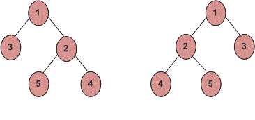

# 检查两棵树的所有层次是否都是字谜

> 原文:[https://www . geeksforgeeks . org/check-如果两个树的所有级别都是字谜，或者不是/](https://www.geeksforgeeks.org/check-if-all-levels-of-two-trees-are-anagrams-or-not/)

给定两个二叉树，我们必须检查它们的每个级别是否是彼此的字谜。
**例:**



```
Tree 1:
Level 0 : 1
Level 1 : 3, 2
Level 2 : 5, 4

Tree 2:
Level 0 : 1
Level 1 : 2, 3
Level 2 : 4, 5
```

正如我们可以清楚地看到，以上两个二叉树的所有级别都是彼此的字谜，因此返回真。

**天真方法:**下面是做这件事的天真方法的逐步解释:

1.  编写一个递归程序，用于树的层次顺序遍历。
2.  逐一遍历两棵树的每一层，并将遍历结果存储在两个不同的向量中，每棵树一个向量。
3.  对两个向量进行排序，并对每个级别进行迭代比较，如果它们对每个级别都相同，则返回 true，否则返回 false。

**时间复杂度:** O(n^2)，其中 n 为节点数。
**高效进场:**
思路基于下面的文章。
[逐行打印层级顺序遍历|集合 1](https://www.geeksforgeeks.org/print-level-order-traversal-line-line/)
我们逐级同时遍历两棵树。我们将每一层的两棵树都存储在向量(或数组)中。为了检查两个向量是否是字谜，我们对它们进行排序，然后进行比较。
**时间复杂度:** **O(nlogn)** ，其中 n 为节点数。

## C++

```
/* Iterative program to check if two trees are level
   by level anagram. */
#include <bits/stdc++.h>
using namespace std;

// A Binary Tree Node
struct Node
{
    struct Node *left, *right;
    int data;
};

// Returns true if trees with root1 and root2
// are level by level anagram, else returns false.
bool areAnagrams(Node *root1, Node *root2)
{
    // Base Cases
    if (root1 == NULL && root2 == NULL)
        return true;
    if (root1 == NULL || root2 == NULL)
        return false;

    // start level order traversal of two trees
    // using two queues.
    queue<Node *> q1, q2;
    q1.push(root1);
    q2.push(root2);

    while (1)
    {
        // n1 (queue size) indicates number of Nodes
        // at current level in first tree and n2 indicates
        // number of nodes in current level of second tree.
        int n1 = q1.size(), n2 = q2.size();

        // If n1 and n2 are different
        if (n1 != n2)
            return false;

        // If level order traversal is over 
        if (n1 == 0)
            break;

        // Dequeue all Nodes of current level and
        // Enqueue all Nodes of next level
        vector<int> curr_level1, curr_level2;
        while (n1 > 0)
        {
            Node *node1 = q1.front();
            q1.pop();
            if (node1->left != NULL)
                q1.push(node1->left);
            if (node1->right != NULL)
                q1.push(node1->right);
            n1--;

            Node *node2 = q2.front();
            q2.pop();
            if (node2->left != NULL)
                q2.push(node2->left);
            if (node2->right != NULL)
                q2.push(node2->right);

            curr_level1.push_back(node1->data);
            curr_level2.push_back(node2->data);
        }

        // Check if nodes of current levels are
        // anagrams or not.
        sort(curr_level1.begin(), curr_level1.end());
        sort(curr_level2.begin(), curr_level2.end());
        if (curr_level1 != curr_level2)
            return false;
    }

    return true;
}

// Utility function to create a new tree Node
Node* newNode(int data)
{
    Node *temp = new Node;
    temp->data = data;
    temp->left = temp->right = NULL;
    return temp;
}

// Driver program to test above functions
int main()
{
    // Constructing both the trees.
    struct Node* root1 = newNode(1);
    root1->left = newNode(3);
    root1->right = newNode(2);
    root1->right->left = newNode(5);
    root1->right->right = newNode(4);

    struct Node* root2 = newNode(1);
    root2->left = newNode(2);
    root2->right = newNode(3);
    root2->left->left = newNode(4);
    root2->left->right = newNode(5);

    areAnagrams(root1, root2)? cout << "Yes" : cout << "No";
    return 0;
}
```

## Java 语言(一种计算机语言，尤用于创建网站)

```
/* Iterative program to check if two trees
are level by level anagram. */
import java.util.ArrayList;
import java.util.Collections;
import java.util.LinkedList;
import java.util.Queue;

public class GFG
{                                
    // A Binary Tree Node
    static class Node
    {
        Node left, right;
        int data;
        Node(int data){
            this.data = data;
            left = null;
            right = null;
        }
    }

    // Returns true if trees with root1 and root2
    // are level by level anagram, else returns false.
    static boolean areAnagrams(Node root1, Node root2)
    {
        // Base Cases
        if (root1 == null && root2 == null)
            return true;
        if (root1 == null || root2 == null)
            return false;

        // start level order traversal of two trees
        // using two queues.
        Queue<Node> q1 = new LinkedList<Node>();
        Queue<Node> q2 = new LinkedList<Node>();
        q1.add(root1);
        q2.add(root2);

        while (true)
        {
            // n1 (queue size) indicates number of
            // Nodes at current level in first tree
            // and n2 indicates number of nodes in
            // current level of second tree.
            int n1 = q1.size(), n2 = q2.size();

            // If n1 and n2 are different
            if (n1 != n2)
                return false;

            // If level order traversal is over 
            if (n1 == 0)
                break;

            // Dequeue all Nodes of current level and
            // Enqueue all Nodes of next level
            ArrayList<Integer> curr_level1 = new
                                          ArrayList<>();
            ArrayList<Integer> curr_level2 = new
                                          ArrayList<>();
            while (n1 > 0)
            {
                Node node1 = q1.peek();
                q1.remove();
                if (node1.left != null)
                    q1.add(node1.left);
                if (node1.right != null)
                    q1.add(node1.right);
                n1--;

                Node node2 = q2.peek();
                q2.remove();
                if (node2.left != null)
                    q2.add(node2.left);
                if (node2.right != null)
                    q2.add(node2.right);

                curr_level1.add(node1.data);
                curr_level2.add(node2.data);
            }

            // Check if nodes of current levels are
            // anagrams or not.
            Collections.sort(curr_level1);
            Collections.sort(curr_level2);

            if (!curr_level1.equals(curr_level2))
                return false;
        }

        return true;
    }

    // Driver program to test above functions
    public static void main(String args[])
    {
        // Constructing both the trees.
        Node root1 = new Node(1);
        root1.left = new Node(3);
        root1.right = new Node(2);
        root1.right.left = new Node(5);
        root1.right.right = new Node(4);

        Node root2 = new Node(1);
        root2.left = new Node(2);
        root2.right = new Node(3);
        root2.left.left = new Node(4);
        root2.left.right = new Node(5);

        System.out.println(areAnagrams(root1, root2)?
                             "Yes" : "No");
    }
}
// This code is contributed by Sumit Ghosh
```

## 蟒蛇 3

```
# Iterative program to check if two
# trees are level by level anagram

# A Binary Tree Node
# Utility function to create a
# new tree Node
class newNode:
    def __init__(self, data):
        self.data = data
        self.left = self.right = None

# Returns true if trees with root1
# and root2 are level by level
# anagram, else returns false.
def areAnagrams(root1, root2) :

    # Base Cases
    if (root1 == None and root2 == None) :
        return True
    if (root1 == None or root2 == None) :
        return False

    # start level order traversal of
    # two trees using two queues.
    q1 = []
    q2 = []
    q1.append(root1)
    q2.append(root2)

    while (1) :

        # n1 (queue size) indicates number
        # of Nodes at current level in first
        # tree and n2 indicates number of nodes
        # in current level of second tree.
        n1 = len(q1)
        n2 = len(q2)

        # If n1 and n2 are different
        if (n1 != n2):
            return False

        # If level order traversal is over
        if (n1 == 0):
            break

        # Dequeue all Nodes of current level
        # and Enqueue all Nodes of next level
        curr_level1 = []
        curr_level2 = []
        while (n1 > 0):
            node1 = q1[0]
            q1.pop(0)
            if (node1.left != None) :
                q1.append(node1.left)
            if (node1.right != None) :
                q1.append(node1.right)
            n1 -= 1

            node2 = q2[0]
            q2.pop(0)
            if (node2.left != None) :
                q2.append(node2.left)
            if (node2.right != None) :
                q2.append(node2.right)

            curr_level1.append(node1.data)
            curr_level2.append(node2.data)

        # Check if nodes of current levels
        # are anagrams or not.
        curr_level1.sort()
        curr_level2.sort()
        if (curr_level1 != curr_level2) :
            return False

    return True

# Driver Code
if __name__ == '__main__':

    # Constructing both the trees.
    root1 = newNode(1)
    root1.left = newNode(3)
    root1.right = newNode(2)
    root1.right.left = newNode(5)
    root1.right.right = newNode(4)

    root2 = newNode(1)
    root2.left = newNode(2)
    root2.right = newNode(3)
    root2.left.left = newNode(4)
    root2.left.right = newNode(5)
    if areAnagrams(root1, root2):
        print("Yes") 
    else:
        print("No")

# This code is contributed
# by SHUBHAMSINGH10
```

## C#

```
/* Iterative program to check if two trees
are level by level anagram. */
using System;
using System.Collections.Generic;

class GFG
{                            
    // A Binary Tree Node
    public class Node
    {
        public Node left, right;
        public int data;
        public Node(int data)
        {
            this.data = data;
            left = null;
            right = null;
        }
    }

    // Returns true if trees with root1
    // and root2 are level by level anagram,
    // else returns false.
    static Boolean areAnagrams(Node root1,
                               Node root2)
    {
        // Base Cases
        if (root1 == null && root2 == null)
            return true;
        if (root1 == null || root2 == null)
            return false;

        // start level order traversal of two trees
        // using two queues.
        Queue<Node> q1 = new Queue<Node>();
        Queue<Node> q2 = new Queue<Node>();
        q1.Enqueue(root1);
        q2.Enqueue(root2);

        while (true)
        {
            // n1 (queue size) indicates number of
            // Nodes at current level in first tree
            // and n2 indicates number of nodes in
            // current level of second tree.
            int n1 = q1.Count, n2 = q2.Count;

            // If n1 and n2 are different
            if (n1 != n2)
                return false;

            // If level order traversal is over
            if (n1 == 0)
                break;

            // Dequeue all Nodes of current level and
            // Enqueue all Nodes of next level
            List<int> curr_level1 = new List<int>();
            List<int> curr_level2 = new List<int>();
            while (n1 > 0)
            {
                Node node1 = q1.Peek();
                q1.Dequeue();
                if (node1.left != null)
                    q1.Enqueue(node1.left);
                if (node1.right != null)
                    q1.Enqueue(node1.right);
                n1--;

                Node node2 = q2.Peek();
                q2.Dequeue();
                if (node2.left != null)
                    q2.Enqueue(node2.left);
                if (node2.right != null)
                    q2.Enqueue(node2.right);

                curr_level1.Add(node1.data);
                curr_level2.Add(node2.data);
            }

            // Check if nodes of current levels are
            // anagrams or not.
            curr_level1.Sort();
            curr_level2.Sort();

            for(int i = 0;
                    i < curr_level1.Count; i++)
            if(curr_level1[i] != curr_level2[i])
                return false;
        }
        return true;
    }

    // Driver Code
    public static void Main(String []args)
    {
        // Constructing both the trees.
        Node root1 = new Node(1);
        root1.left = new Node(3);
        root1.right = new Node(2);
        root1.right.left = new Node(5);
        root1.right.right = new Node(4);

        Node root2 = new Node(1);
        root2.left = new Node(2);
        root2.right = new Node(3);
        root2.left.left = new Node(4);
        root2.left.right = new Node(5);

        Console.WriteLine(areAnagrams(root1,
                                      root2) ?
                                       "Yes" : "No");
    }
}

// This code is contributed by Arnab Kundu
```

**输出:**

```
Yes
```

**注意:**在上面的程序中，我们直接使用不等于函数来比较存储树的每一级的向量！= '首先根据向量的大小进行比较，然后根据其内容进行比较，从而节省了我们迭代比较向量的工作。

本文由 [**阿迪蒂亚·古普塔**](https://www.linkedin.com/in/aditya-gupta-437504a7?trk=hp-identity-name) 供稿。如果你喜欢 GeeksforGeeks 并想投稿，你也可以使用[write.geeksforgeeks.org](https://write.geeksforgeeks.org)写一篇文章或者把你的文章邮寄到 review-team@geeksforgeeks.org。看到你的文章出现在极客博客主页上，帮助其他极客。
如果发现有不正确的地方，或者想分享更多关于上述话题的信息，请写评论。