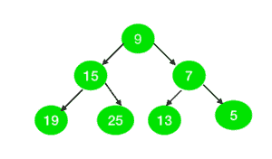
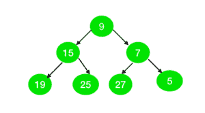

# 检查二叉树的所有节点是否可以表示为两个素数之和

> 原文:[https://www . geesforgeks . org/check-如果二叉树的所有节点都可以表示为两个素数之和/](https://www.geeksforgeeks.org/check-if-all-nodes-of-the-binary-tree-can-be-represented-as-sum-of-two-primes/)

给定一个奇数节点的二叉树。任务是检查树的所有节点是否可以表示为两个[素数](https://www.geeksforgeeks.org/prime-numbers/)的和。

**示例:**

> **输入:**
> 
> 
> 
> **输出:**是
> **说明:**
> 树中的所有节点可以表示为两个质数之和为:
> 9 = 2+7
> 15 = 2+13
> 7 = 2+5
> 19 = 2+17
> 25 = 2+23
> 13 = 11+2
> 5 = 2+3
> 
> **输入:**
> 
> 
> 
> **输出:**否
> **说明:**
> 值为 27 的节点不能表示为两个素数之和。

**进场:**

1.  这个想法是用[哥德巴赫的弱猜想](https://www.geeksforgeeks.org/goldbachs-weak-conjecture-for-odd-numbers/)说明每一个大于 5 的奇数都可以表示为三个素数之和。
2.  将奇数(比如 **N** )表示为两个素数之和，将一个素数固定为 **2** ，如果**(N–2)**也是素数，那么 **N** 可以表示为两个素数之和。
3.  检查树中所有节点的上述条件。如果有节点不符合以上条件，则打印“否”，否则打印“是”。

## C++

```
// C++ program for the above approach
#include <iostream>
using namespace std;

// Function to create array to mark
// whether element are prime or not
void spf_array(int arr[], int N)
{
    int i = 0;

    // Initially we set same value in
    // array as a index of array.
    for (i = 1; i <= N; i++) {
        arr[i] = i;
    }

    // Mark all even elements as 2
    for (i = 2; i <= N; i = i + 2) {
        arr[i] = 2;
    }

    // Mark all the multiple of prime
    // numbers as a non-prime
    for (i = 3; i * i <= N; i++) {
        if (arr[i] == i) {

            int j = 0;

            for (j = i * i; j <= N;
                 j = j + i) {

                if (arr[j] == j) {
                    arr[j] = i;
                }
            }
        }
    }
}

// Tree Node
struct node {
    int val;
    node* left;
    node* right;
};

// Function to create node of tree
node* newnode(int i)
{
    node* temp = NULL;
    temp = new node();
    temp->val = i;
    temp->left = NULL;
    temp->right = NULL;
    return temp;
}

// Function to check whether the
// tree is prime or not
int prime_tree(node* root, int arr[])
{
    int a = -1;
    if (root != NULL) {

        // If element is not the sum of
        // two prime then return 0
        if (root->val <= 3
            || arr[root->val - 2]
                   != root->val - 2) {

            return 0;
        }
    }

    if (root->left != NULL) {
        a = prime_tree(root->left, arr);

        // If a is 0 then we don't need
        // to check further
        if (a == 0) {
            return 0;
        }
    }

    if (root->right != NULL) {

        a = prime_tree(root->right, arr);

        // If a is 0 then we don't need
        // to check further
        if (a == 0) {
            return 0;
        }
    }

    return 1;
}

// Driver Code
int main()
{

    // Given Tree
    node* root = newnode(9);
    root->right = newnode(7);
    root->right->right = newnode(5);
    root->right->left = newnode(13);
    root->left = newnode(15);
    root->left->left = newnode(19);
    root->left->right = newnode(25);

    // Number of nodes in the tree
    int n = 50;

    // Declare spf[] to store
    // prime numbers
    int brr[n + 1];
    int i = 0;

    // Find prime numbers in spf[]
    spf_array(brr, n + 1);

    // Function Call
    if (prime_tree(root, brr)) {
        cout << "Yes" << endl;
    }
    else {
        cout << "No" << endl;
    }
}
```

## Java 语言(一种计算机语言，尤用于创建网站)

```
// Java program for the above approach
import java.util.*;

class GFG{

// Function to create array to mark
// whether element are prime or not
static void spf_array(int arr[], int N)
{
    int i = 0;

    // Initially we set same value in
    // array as a index of array.
    for(i = 1; i <= N; i++)
    {
        arr[i] = i;
    }

    // Mark all even elements as 2
    for(i = 2; i <= N; i = i + 2)
    {
        arr[i] = 2;
    }

    // Mark all the multiple of prime
    // numbers as a non-prime
    for(i = 3; i * i <= N; i++)
    {
        if (arr[i] == i)
        {
            int j = 0;
            for(j = i * i; j <= N;
                j = j + i)
            {
                if (arr[j] == j)
                {
                    arr[j] = i;
                }
            }
        }
    }
}

// Tree Node
static class node
{
    int val;
    node left;
    node right;
};

// Function to create node of tree
static node newnode(int i)
{
    node temp = null;
    temp = new node();
    temp.val = i;
    temp.left = null;
    temp.right = null;
    return temp;
}

// Function to check whether
// the tree is prime or not
static int prime_tree(node root, int arr[])
{
    int a = -1;
    if (root != null)
    {

        // If element is not the sum
        // of two prime then return 0
        if (root.val <= 3 ||
         arr[root.val - 2] !=
             root.val - 2)
        {
            return 0;
        }
    }

    if (root.left != null)
    {
        a = prime_tree(root.left, arr);

        // If a is 0 then we don't
        // need to check further
        if (a == 0)
        {
            return 0;
        }
    }

    if (root.right != null)
    {
        a = prime_tree(root.right, arr);

        // If a is 0 then we don't
        // need to check further
        if (a == 0)
        {
            return 0;
        }
    }
    return 1;
}

// Driver Code
public static void main(String[] args)
{

    // Given Tree
    node root = newnode(9);
    root.right = newnode(7);
    root.right.right = newnode(5);
    root.right.left = newnode(13);
    root.left = newnode(15);
    root.left.left = newnode(19);
    root.left.right = newnode(25);

    // Number of nodes in the tree
    int n = 50;

    // Declare spf[] to store
    // prime numbers
    int []brr = new int[n + 1];
    int i = 0;

    // Find prime numbers in spf[]
    spf_array(brr, n);

    // Function Call
    if (prime_tree(root, brr) == 1)
    {
        System.out.print("Yes" + "\n");
    }
    else
    {
        System.out.print("No" + "\n");
    }
}
}

// This code is contributed by Rohit_ranjan
```

## 蟒蛇 3

```
# Python3 program for the above approach
class Node:

    def __init__(self, key):

        self.val = key
        self.left = None
        self.right = None

# Function to create array to mark
# whether element are prime or not
def spf_array(arr, N):

    # Initially we set same value in
    # array as a index of array.
    for i in range(1, N + 1):
        arr[i] = i

    # Mark all even elements as 2
    for i in range(2, N + 1, 2):
        arr[i] = 2

    # Mark all the multiple of prime
    # numbers as a non-prime
    for i in range(3, N + 1):
        if i * i > N:
            break

        if (arr[i] == i):
            for j in range(2 * i, N, i):
                if arr[j] == j:
                    arr[j] = i

    return arr

# Function to check whether the
# tree is prime or not
def prime_tree(root, arr):

    a = -1

    if (root != None):

        # If element is not the sum of
        # two prime then return 0
        if (root.val <= 3 or 
        arr[root.val - 2] != root.val - 2):
            return 0

    if (root.left != None):
        a = prime_tree(root.left, arr)

        # If a is 0 then we don't need
        # to check furthe
        if (a == 0):
            return 0

    if (root.right != None):
        a = prime_tree(root.right, arr)

        # If a is 0 then we don't need
        # to check further
        if (a == 0):
            return 0

    return 1

# Driver Code
if __name__ == '__main__':

    # Given Tree
    root = Node(9);
    root.right = Node(7);
    root.right.right = Node(5);
    root.right.left = Node(13);
    root.left = Node(15);
    root.left.left = Node(19);
    root.left.right = Node(25);

    # Number of nodes in the tree
    n = 50

    # Declare spf[] to store
    # prime numbers
    arr = [0] * (n + 2)

    # Find prime numbers in spf[]
    brr = spf_array(arr, n + 1);

    # Function Call
    if (prime_tree(root, brr)):
        print("Yes")
    else:
        print("No")

# This code is contributed by mohit kumar 29
```

## C#

```
// C# program for the above approach
using System;

class GFG{

// Function to create array to mark
// whether element are prime or not
static void spf_array(int []arr, int N)
{
    int i = 0;

    // Initially we set same value in
    // array as a index of array.
    for(i = 1; i <= N; i++)
    {
        arr[i] = i;
    }

    // Mark all even elements as 2
    for(i = 2; i <= N; i = i + 2)
    {
        arr[i] = 2;
    }

    // Mark all the multiple of prime
    // numbers as a non-prime
    for(i = 3; i * i <= N; i++)
    {
        if (arr[i] == i)
        {
            int j = 0;
            for(j = i * i; j <= N;
                j = j + i)
            {
                if (arr[j] == j)
                {
                    arr[j] = i;
                }
            }
        }
    }
}

// Tree Node
class node
{
    public int val;
    public node left;
    public node right;
};

// Function to create node of tree
static node newnode(int i)
{
    node temp = null;
    temp = new node();
    temp.val = i;
    temp.left = null;
    temp.right = null;
    return temp;
}

// Function to check whether
// the tree is prime or not
static int prime_tree(node root, int []arr)
{
    int a = -1;
    if (root != null)
    {

        // If element is not the sum
        // of two prime then return 0
        if (root.val <= 3 ||
        arr[root.val - 2] !=
            root.val - 2)
        {
            return 0;
        }
    }

    if (root.left != null)
    {
        a = prime_tree(root.left, arr);

        // If a is 0 then we don't
        // need to check further
        if (a == 0)
        {
            return 0;
        }
    }

    if (root.right != null)
    {
        a = prime_tree(root.right, arr);

        // If a is 0 then we don't
        // need to check further
        if (a == 0)
        {
            return 0;
        }
    }
    return 1;
}

// Driver Code
public static void Main(String[] args)
{

    // Given Tree
    node root = newnode(9);
    root.right = newnode(7);
    root.right.right = newnode(5);
    root.right.left = newnode(13);
    root.left = newnode(15);
    root.left.left = newnode(19);
    root.left.right = newnode(25);

    // Number of nodes in the tree
    int n = 50;

    // Declare spf[] to store
    // prime numbers
    int []brr = new int[n + 1];

    // Find prime numbers in spf[]
    spf_array(brr, n);

    // Function Call
    if (prime_tree(root, brr) == 1)
    {
        Console.Write("Yes" + "\n");
    }
    else
    {
        Console.Write("No" + "\n");
    }
}
}

// This code is contributed by amal kumar choubey
```

## java 描述语言

```
<script>
    // javascript program for the above approach

    // Function to create array to mark
    // whether element are prime or not
    function spf_array(arr , N) {
        var i = 0;

        // Initially we set same value in
        // array as a index of array.
        for (i = 1; i <= N; i++) {
            arr[i] = i;
        }

        // Mark all even elements as 2
        for (i = 2; i <= N; i = i + 2) {
            arr[i] = 2;
        }

        // Mark all the multiple of prime
        // numbers as a non-prime
        for (i = 3; i * i <= N; i++) {
            if (arr[i] == i) {
                var j = 0;
                for (j = i * i; j <= N; j = j + i) {
                    if (arr[j] == j) {
                        arr[j] = i;
                    }
                }
            }
        }
    }

    // Tree Node
    class node {
        constructor(val) {
            this.data = val;
            this.left = null;
            this.right = null;
        }
    }

    // Function to create node of tree
    function newnode(i) {
        var temp = null;
        temp = new node();
        temp.val = i;
        temp.left = null;
        temp.right = null;
        return temp;
    }

    // Function to check whether
    // the tree is prime or not
    function prime_tree( root , arr) {
        var a = -1;
        if (root != null) {

            // If element is not the sum
            // of two prime then return 0
            if (root.val <= 3 || arr[root.val - 2] != root.val - 2) {
                return 0;
            }
        }

        if (root.left != null) {
            a = prime_tree(root.left, arr);

            // If a is 0 then we don't
            // need to check further
            if (a == 0) {
                return 0;
            }
        }

        if (root.right != null) {
            a = prime_tree(root.right, arr);

            // If a is 0 then we don't
            // need to check further
            if (a == 0) {
                return 0;
            }
        }
        return 1;
    }

    // Driver Code

    // Given Tree
    root = newnode(9);
    root.right = newnode(7);
    root.right.right = newnode(5);
    root.right.left = newnode(13);
    root.left = newnode(15);
    root.left.left = newnode(19);
    root.left.right = newnode(25);

    // Number of nodes in the tree
    var n = 50;

    // Declare spf to store
    // prime numbers
    var brr = Array(n + 1).fill(0);
    var i = 0;

    // Find prime numbers in spf
    spf_array(brr, n);

    // Function Call
    if (prime_tree(root, brr) == 1) {
        document.write("Yes" + "\n");
    }
      else {
        document.write("No" + "\n");
    }

// This code contributed by gauravrajput1
</script>
```

**Output:** 

```
Yes
```

***时间复杂度:**O(N * log(log N))*
***辅助空间:** O(N)*