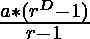
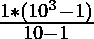
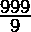

# 检查给定号码的所有数字是否相同

> 原文:[https://www . geesforgeks . org/check-如果给定号码的所有数字都相同/](https://www.geeksforgeeks.org/check-if-all-the-digits-of-the-given-number-are-same/)

给定一个正整数 **N** ，任务是检查给定整数 **N** 的所有数字是否相同。如果发现**为真**，则打印**是**。否则，打印**否**。

**示例:**

> **输入:**N = 222
> T3】输出:是
> 
> **输入:**N = 232
> T3】输出:否

**天真方法:**解决给定问题最简单的方法是迭代给定数字 **N** 的所有数字，如果存在任何不同的数字，则打印**是**。否则，打印**否**。

下面是上述方法的实现:

## C++

```
// C++ Program to implement
// the above approach
#include <bits/stdc++.h>
using namespace std;

// Function to check if all the digits
// in the number N is the same or not
string checkSameDigits(int N)
{

    // Find the last digit
    int digit = N % 10;

    while (N != 0)
    {

        // Find the current last digit
        int current_digit = N % 10;

        // Update the value of N
        N = N / 10;

        // If there exists any distinct
        // digit, then return No
        if (current_digit != digit)
        {
            return "No";
        }
    }

    // Otherwise, return Yes
    return "Yes";
}

// Driver Code
int main()
{
    int N = 222;
    cout << (checkSameDigits(N));
    return 0;
}

// This code is contributed by Potta Lokesh
```

## Java 语言(一种计算机语言，尤用于创建网站)

```
// Java program for the above approach

import java.io.*;

class GFG {

    // Function to check if all the digits
    // in the number N is the same or not
    public static String checkSameDigits(int N)
    {
        // Find the last digit
        int digit = N % 10;

        while (N != 0) {

            // Find the current last digit
            int current_digit = N % 10;

            // Update the value of N
            N = N / 10;

            // If there exists any distinct
            // digit, then return No
            if (current_digit != digit) {
                return "No";
            }
        }

        // Otherwise, return Yes
        return "Yes";
    }

    // Driver Code
    public static void main(String args[])
        throws IOException
    {
        int N = 222;
        System.out.println(
            checkSameDigits(N));
    }
}
```

## 蟒蛇 3

```
# Python Program to implement
# the above approach

# Function to check if all the digits
# in the number N is the same or not
def checkSameDigits(N) :

    # Find the last digit
    digit = N % 10;

    while (N != 0) :

        # Find the current last digit
        current_digit = N % 10;

        # Update the value of N
        N = N // 10;

        # If there exists any distinct
        # digit, then return No
        if (current_digit != digit) :
            return "No";

    # Otherwise, return Yes
    return "Yes";

# Driver Code
if __name__ == "__main__" :

    N = 222;
    print(checkSameDigits(N));

    # This code is contributed by AnkThon
```

## C#

```
// C# Program to implement
// the above approach
using System;
class GFG {

    // Function to check if all the digits
    // in the number N is the same or not
    static string checkSameDigits(int N)
    {

        // Find the last digit
        int digit = N % 10;

        while (N != 0) {

            // Find the current last digit
            int current_digit = N % 10;

            // Update the value of N
            N = N / 10;

            // If there exists any distinct
            // digit, then return No
            if (current_digit != digit) {
                return "No";
            }
        }

        // Otherwise, return Yes
        return "Yes";
    }

    // Driver Code
    public static void Main()
    {
        int N = 222;
        Console.Write(checkSameDigits(N));
    }
}

// This code is contributed by divyesh972019.
```

## java 描述语言

```
<script>

// javascript Program to implement
// the above approach

// Function to check if all the digits
// in the number N is the same or not
function checkSameDigits(N)
{

    // Find the last digit
    var digit = N % 10;

    while (N != 0)
    {

        // Find the current last digit
        var current_digit = N % 10;

        // Update the value of N
        N = parseInt(N / 10);

        // If there exists any distinct
        // digit, then return No
        if (current_digit != digit)
        {
            return "No";
        }
    }

    // Otherwise, return Yes
    return "Yes";
}

// Driver Code
    var N = 222;
    document.write(checkSameDigits(N));

    // This code is contributed by ipg2016107.
</script>
```

**Output:** 

```
Yes
```

***时间复杂度:**O(log<sub>10</sub>N)*
***辅助空间:** O(1)*

**高效方法:**上述方法也可以通过形成另一个数字来优化，比如给定数字 **N** 的相同长度的 **M** 与 **N** 的最右边的数字假设 N 具有所有相同的数字，然后将其与 N 进行比较。)，其中 **K** 为 **N** 的任意数字。

现在要创建由唯一的 **1s** 组成的数字 **M** ，可以使用一个[几何级数](https://www.geeksforgeeks.org/geometric-progression/)的和，如图所示[位数](https://www.geeksforgeeks.org/program-count-digits-integer-3-different-methods/)为 3:

> 考虑第一项(假设 a)为 1，公比(假设 r)为 10。现在，对于数字的数值计数(比如 D)为 3，几何级数的[和由下式给出:](https://www.geeksforgeeks.org/program-sum-geometric-series/)
> 
> = >总和= 
> 
> = >总和= 
> 
> = >总和= 
> 
> ->总和= 111

根据以上观察，生成数字 **M** 并检查 **K*M** 是否与 **N** 相同。如果发现**为真**，则打印**是**。否则，打印**否**。

下面是上述方法的实现:

## C++

```
#include <iostream>
using namespace std;

// Function to check if all the digits
// in the number N is the same or not
string checkSameDigits(int N)
{

    // Get the length of N
    int length = (N) + 1;

    // Form the number M of the type
    // K*111... where K is the
    // rightmost digit of N
    int M = ((10, length) - 1) / (10 - 1);
    M *= N % 10;

    // Check if the numbers are equal
    if (M = N)
        return "Yes";

    // Otherwise
    return "No";
}

// Driver Code
int main()

{
    int N = 222;
    cout << checkSameDigits(N);
}

// This code is contributed by shivanisinghss2110
```

## Java 语言(一种计算机语言，尤用于创建网站)

```
// Java program for the above approach

import java.io.*;

class GFG {

    // Function to check if all the digits
    // in the number N is the same or not
    public static String checkSameDigits(int N)
    {
        // Get the length of N
        int length = ((int)Math.log10(N)) + 1;

        // Form the number M of the type
        // K*111... where K is the
        // rightmost digit of N
        int M = ((int)Math.pow(10, length) - 1)
                / (10 - 1);
        M *= N % 10;

        // Check if the numbers are equal
        if (M == N)
            return "Yes";

        // Otherwise
        return "No";
    }

    // Driver Code
    public static void main(String args[])
        throws IOException
    {
        int N = 222;
        System.out.println(
            checkSameDigits(N));
    }
}
```

## 蟒蛇 3

```
# Python3 program for the above approach
import math

# Function to check if all the digits
# in the number N is the same or not
def checkSameDigits(N) :

    # Get the length of N
    length = int(math.log10(N)) + 1;

    # Form the number M of the type
    # K*111... where K is the
    # rightmost digit of N
    M = (int(math.pow(10, length)) - 1)// (10 - 1);
    M *= N % 10;

    # Check if the numbers are equal
    if (M == N) :
        return "Yes";

    # Otherwise
    return "No";

    # Driver Code
if __name__ == "__main__" :

    N = 222;
    print(checkSameDigits(N));

    # This code is contributed by AnkThon
```

## C#

```
// C# program for the above approach

using System;

class GFG {

    // Function to check if all the digits
    // in the number N is the same or not
    public static String checkSameDigits(int N)
    {
        // Get the length of N
        int length = ((int)Math.Log10(N)) + 1;

        // Form the number M of the type
        // K*111... where K is the
        // rightmost digit of N
        int M = ((int)Math.Pow(10, length) - 1) / (10 - 1);
        M *= N % 10;

        // Check if the numbers are equal
        if (M == N)
            return "Yes";

        // Otherwise
        return "No";
    }

    // Driver Code
    public static void Main()
    {
        int N = 222;
        Console.WriteLine(checkSameDigits(N));
    }
}

// This code is contributed by subhammahato348.
```

## java 描述语言

```
<script>

// JavaScript program for the above approach
// Function to check if all the digits
// in the number N is the same or not
function checkSameDigits(N)
    {

        // Get the length of N
        var length = (Math.log10(N)) + 1;

        // Form the number M of the type
        // K*111... where K is the
        // rightmost digit of N
        var M = (Math.pow(10, length) - 1)
                / (10 - 1);
        M *= N % 10;

        // Check if the numbers are equal
        if (M = N)
            return "Yes";

        // Otherwise
        return "No";
    }

// Driver Code
var N = 222;
document.write(checkSameDigits(N));

// This code is contributed by shivanisinghss2110
</script>
```

**Output:** 

```
Yes
```

***时间复杂度:**O(1)*
T5**辅助空间:** O(1)