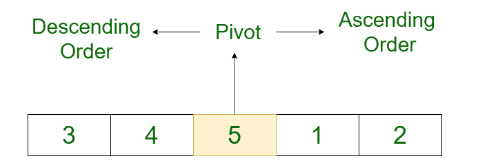

# 使用二分搜索法

检查数组是否被排序和旋转

> 原文:[https://www . geesforgeks . org/check-if-a-array-sorted-and-rotated-use-binary-search/](https://www.geeksforgeeks.org/check-if-an-array-is-sorted-and-rotated-using-binary-search/)

**先决条件:** [使用线性搜索](https://www.geeksforgeeks.org/check-if-an-array-is-sorted-and-rotated/)
检查数组是否已排序和旋转给定一个由 N 个不同整数组成的数组 **arr[]** ，任务是检查该数组逆时针旋转时是否已排序。已排序的数组不被认为是已排序和已旋转的，即至少应该有一次旋转。

**示例:**

> **输入:** arr[] = { 3，4，5，1，2 }
> **输出:**真
> **解释:**
> 排序数组:{1，2，3，4，5}。
> 顺时针旋转这个排序的数组
> 3 个位置，我们得到:{ 3，4，5，1，2}
> 
> **输入:** arr[] = {7，9，11，12，5 }
> T3】输出:真
> 
> **输入:** arr[] = {1，2，3 }
> T3】输出:假

**方法:**使用[线性搜索](https://www.geeksforgeeks.org/linear-search/)解决这个问题的一种方法已经在[这篇文章](https://www.geeksforgeeks.org/check-if-an-array-is-sorted-and-rotated/)中讨论过了。
在本文中，提到了一种使用[二分搜索法](https://www.geeksforgeeks.org/binary-search/)概念的方法。

*   要应用一个[二分搜索法](https://www.geeksforgeeks.org/binary-search/)，数组需要遵循**的某种顺序**，通过这种顺序，在每次迭代中，可以消除数组的一半。
*   因此，排序并旋转数组后的顺序是，轴左侧(数组旋转的点)的所有元素都是降序，轴右侧的所有元素都是升序。
    这可以从下图中可视化:



*   因此，使用[二分搜索法](https://www.geeksforgeeks.org/binary-search/)和[递归](https://www.geeksforgeeks.org/recursion/)可以通过以下方式找到枢轴:
    *   **基本情况:**基本情况将是找到枢轴时，或者在给定数组中找不到枢轴时。当右索引小于左索引时，找不到透视。在这些情况下，返回-1。当高和低指向同一个元素时，低的元素是枢轴，该元素被返回。

```
if (high < low)
     return -1;
if (high == low)
     return low;
```

*   除此之外，另一个基本情况是当 mid((low + high) / 2)是枢轴时。当位于中间的元素小于下一个元素或大于前一个元素时，将考虑该元素。

```
if (mid < high && arr[mid + 1] < arr[mid])
    return mid;
if (mid > low && arr[mid] < arr[mid - 1])
    return mid - 1;
```

*   **递归事例:**当没有一个基本事例满足时，则必须决定是忽略前半部分还是后半部分。通过检查第一个索引(低)处的元素是否大于中间索引处的元素来做出这个决定。如果是的话，那么支点肯定在前半部分。否则，关键在于后半部分。

```
if (arr[low] > arr[mid]) 
    return findPivot(arr, low, mid - 1);    
else 
    return findPivot(arr, mid + 1, high);
```

*   找到透视后，从透视开始遍历数组的左边，检查所有元素是否按降序排列，或者遍历数组的右边，检查所有元素是否按升序排列。

下面是上述方法的实现:

## C++

```
#include <bits/stdc++.h>

using namespace std;

// Function to return the
// index of the pivot
int findPivot(int arr[], int low, int high)
{
    // Base cases
    if (high < low)
        return -1;
    if (high == low)
        return low;

    int mid = (low + high) / 2;
    if (mid < high && arr[mid + 1] < arr[mid])
    {
        return mid;
    }

    // Check if element at (mid - 1) is pivot
    // Consider the cases like {4, 5, 1, 2, 3}
    if (mid > low && arr[mid] < arr[mid - 1])
    {
        return mid - 1;
    }

    // Decide whether we need to go to
    // the left half or the right half
    if (arr[low] > arr[mid])
    {
        return findPivot(arr, low, mid - 1);
    }
    else
    {
        return findPivot(arr, mid + 1, high);
    }
}

// Function to check if a given array
// is sorted rotated or not
bool isRotated(int arr[], int n)
{
    int l = 0;
    int r = n - 1;
    int pivot = -1;
    if (arr[l] > arr[r])
    {
        pivot = findPivot(arr, l, r);
        int temp=pivot;
        // To check if the elements to the left
        // of the pivot are in descending or not
        if (l < pivot)
        {
            while (pivot > l)
            {
                if (arr[pivot] < arr[pivot - 1])
                {
                    return false;
                }
                pivot--;
            }
        }

        // To check if the elements to the right
        // of the pivot are in ascending or not
        pivot=temp;
        if(pivot < r) {
            pivot++;
            while (pivot < r) {
                if (arr[pivot] > arr[pivot + 1]) {
                    return false;
                }
                pivot++;
            }
        }

        // If both of the above if is true
        // Then the array is sorted rotated
        return true;
    }

    // Else the array is not sorted rotated
    else {
        return false;
    }
}

// Driver code
int main()
{
    int arr[] = { 4, 5, 1, 3, 2 };
    if (isRotated(arr, 5)) cout<<"true";
    else
    cout<<"false";
    return 0;
}

// This code is contributed by mohit kumar 29
```

## Java 语言(一种计算机语言，尤用于创建网站)

```
// Java implementation of the above approach

class GFG {

    // Function to return the
    // index of the pivot
    static int findPivot(int arr[], int low, int high)
    {
        // Base cases
        if (high < low)
            return -1;
        if (high == low)
            return low;

        int mid = (low + high) / 2;
        if (mid < high && arr[mid + 1] < arr[mid]) {
            return mid;
        }

        // Check if element at (mid - 1) is pivot
        // Consider the cases like {4, 5, 1, 2, 3}
        if (mid > low && arr[mid] < arr[mid - 1]) {
            return mid - 1;
        }

        // Decide whether we need to go to
        // the left half or the right half
        if (arr[low] > arr[mid]) {
            return findPivot(arr, low, mid - 1);
        }
        else {
            return findPivot(arr, mid + 1, high);
        }
    }

    // Function to check if a given array
    // is sorted rotated or not
    public static boolean isRotated(int arr[], int n)
    {
        int l = 0;
        int r = n - 1;
        int pivot = -1;
        if (arr[l] > arr[r]) {
            pivot = findPivot(arr, l, r);
            int temp=pivot;
            // To check if the elements to the left
            // of the pivot are in descending or not
            if (l < pivot) {
                while (pivot > l) {
                    if (arr[pivot] < arr[pivot - 1]) {
                        return false;
                    }
                    pivot--;
                }
            }

            // To check if the elements to the right
            // of the pivot are in ascending or not

            pivot=temp;
            else {
                pivot++;
                while (pivot < r) {
                    if (arr[pivot] > arr[pivot + 1]) {
                        return false;
                    }
                    pivot++;
                }
            }

            // If any of the above if or else is true
            // Then the array is sorted rotated
            return true;
        }

        // Else the array is not sorted rotated
        else {
            return false;
        }
    }

    // Driver code
    public static void main(String[] args)
    {
        int arr[] = {  4, 5, 1, 3, 2 };
        System.out.println(isRotated(arr, 5));
    }
}
```

## 蟒蛇 3

```
# Python3 implementation of the above approach

# Function to return the
# index of the pivot
def findPivot(arr, low, high) :

    # Base cases
    if (high < low) :
        return -1;

    if (high == low) :
        return low;

    mid = (low + high) // 2;
    if (mid < high and arr[mid + 1] < arr[mid]) :

        return mid;

    # Check if element at (mid - 1) is pivot
    # Consider the cases like {4, 5, 1, 2, 3}
    if (mid > low and arr[mid] < arr[mid - 1]) :

        return mid - 1;

    # Decide whether we need to go to
    # the left half or the right half
    if (arr[low] > arr[mid]) :

        return findPivot(arr, low, mid - 1);

    else :

        return findPivot(arr, mid + 1, high);

# Function to check if a given array
# is sorted rotated or not
def isRotated(arr, n) :

    l = 0;
    r = n - 1;
    pivot = -1;
    if (arr[l] > arr[r]) :

        pivot = findPivot(arr, l, r);
        temp = pivot
        # To check if the elements to the left
        # of the pivot are in descending or not

        if (l < pivot) :

            while (pivot > l) :

                if (arr[pivot] < arr[pivot - 1]) :

                    return False;

                pivot -= 1;

        # To check if the elements to the right
        # of the pivot are in ascending or not

        else :
            pivot=temp
            pivot += 1;
            while (pivot < r) :
                if (arr[pivot] > arr[pivot + 1]) :
                    return False;

                pivot ++ 1;

        # If any of the above if or else is true
        # Then the array is sorted rotated
        return True;

    # Else the array is not sorted rotated
    else :
        return False;

# Driver code
if __name__ == "__main__" :

    arr = [ 3, 4, 5, 1, 2 ];
    if (isRotated(arr, 5)) :
        print("True");
    else :
        print("False");

# This code is contributed by Yash_R
```

## C#

```
// C# implementation of the above approach
using System;

class GFG {

    // Function to return the
    // index of the pivot
    static int findPivot(int []arr, int low, int high)
    {
        // Base cases
        if (high < low)
            return -1;
        if (high == low)
            return low;

        int mid = (low + high) / 2;
        if (mid < high && arr[mid + 1] < arr[mid]) {
            return mid;
        }

        // Check if element at (mid - 1) is pivot
        // Consider the cases like {4, 5, 1, 2, 3}
        if (mid > low && arr[mid] < arr[mid - 1]) {
            return mid - 1;
        }

        // Decide whether we need to go to
        // the left half or the right half
        if (arr[low] > arr[mid]) {
            return findPivot(arr, low, mid - 1);
        }
        else {
            return findPivot(arr, mid + 1, high);
        }
    }

    // Function to check if a given array
    // is sorted rotated or not
    public static bool isRotated(int []arr, int n)
    {
        int l = 0;
        int r = n - 1;
        int pivot = -1;
        if (arr[l] > arr[r]) {
            pivot = findPivot(arr, l, r);
            int temp = pivot;
            // To check if the elements to the left
            // of the pivot are in descending or not
            if (l < pivot) {
                while (pivot > l) {
                    if (arr[pivot] < arr[pivot - 1]) {
                        return false;
                    }
                    pivot--;
                }
            }

            // To check if the elements to the right
            // of the pivot are in ascending or not
            pivot=temp;
            else {
                pivot++;
                while (pivot < r) {
                    if (arr[pivot] > arr[pivot + 1]) {
                        return false;
                    }
                    pivot++;
                }
            }

            // If any of the above if or else is true
            // Then the array is sorted rotated
            return true;
        }

        // Else the array is not sorted rotated
        else {
            return false;
        }
    }

    // Driver code
    public static void Main(String[] args)
    {
        int []arr = { 3, 4, 5, 1, 2 };
        Console.WriteLine(isRotated(arr, 5));
    }
}

// This code contributed by Rajput-Ji
```

## java 描述语言

```
<script>

// Function to return the
// index of the pivot
function findPivot(arr, low, high)
{
    // Base cases
    if (high < low)
        return -1;
    if (high == low)
        return low;

    var mid = parseInt((low + high) / 2);
    if (mid < high && arr[mid + 1] < arr[mid])
    {
        return mid;
    }

    // Check if element at (mid - 1) is pivot
    // Consider the cases like {4, 5, 1, 2, 3}
    if (mid > low && arr[mid] < arr[mid - 1])
    {
        return mid - 1;
    }

    // Decide whether we need to go to
    // the left half or the right half
    if (arr[low] > arr[mid])
    {
        return findPivot(arr, low, mid - 1);
    }
    else
    {
        return findPivot(arr, mid + 1, high);
    }
}

// Function to check if a given array
// is sorted rotated or not
function isRotated(arr, n)
{
    var l = 0;
    var r = n - 1;
    var pivot = -1;
    if (arr[l] > arr[r])
    {
        pivot = findPivot(arr, l, r);
        var temp=pivot;
        // To check if the elements to the left
        // of the pivot are in descending or not
        if (l < pivot)
        {
            while (pivot > l)
            {
                if (arr[pivot] < arr[pivot - 1])
                {
                    return false;
                }
                pivot--;
            }
        }

        // To check if the elements to the right
        // of the pivot are in ascending or not

        else
        {
            pivot=temp;
            pivot++;
            while (pivot < r) {
                if (arr[pivot] > arr[pivot + 1]) {
                    return false;
                }
                pivot++;
            }
        }

        // If both of the above if is true
        // Then the array is sorted rotated
        return true;
    }

    // Else the array is not sorted rotated
    else {
        return false;
    }
}

// Driver code
var arr = [4, 5, 1, 3, 2];
if (isRotated(arr, 5))
    document.write("true");
else
    document.write("false");

</script>
```

**Output:** 

```
true
```

**时间复杂度:** **O(N)** 为:

*   使用二分搜索法在**0(对数 N)** 中找到枢轴元素
*   但是为了检查左半部分或右半部分是按降序还是按升序，在最坏的情况下需要 **O(N)** 时间。
*   因此整体时间复杂度为 **O(N)**