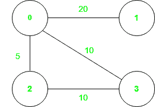
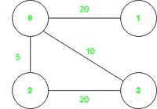

# 检查边是否是任何最小生成树的一部分

> 原文:[https://www . geeksforgeeks . org/check-如果边是任意最小生成树的一部分/](https://www.geeksforgeeks.org/check-if-an-edge-is-a-part-of-any-minimum-spanning-tree/)

给定一个连接的**无向加权图**，其形式为 **2D 数组**，其中每一行都是描述一条边的类型**【开始节点，结束节点，权重】**，以及两个整数 **(A，B)** 。如果(A，B)之间形成的边是图的任何[最小生成树](https://www.geeksforgeeks.org/properties-of-minimum-spanning-tree-mst/) (MST)的一部分，则返回。

> **[【最小生成树】](https://www.geeksforgeeks.org/properties-of-minimum-spanning-tree-mst/) (MST):** 这是图的一个特殊的子图，这样每个顶点都是连通的，并且这个子图的边的权重的总和尽可能的小。一个图可以有多个最小生成树。

**示例:**

> **输入:**图形= [[0，1，20]，[0，2，5]，[0，3，10 ]，[ 2，3，10]]，A = 2，B = 3
> **输出**:真
> **解释**:可以生成 2 个最小生成树，权重为 35。树的连接是
> 第 1:[(0，1)，(0，3)，(0，2)] = > 20 + 10 + 5 = 35
> 第 2:[(0，1)，(0，2)，(2，3) ] = > 20 + 5 + 10 = 35
> 可以看出，边(2，3)存在于第二个 MST 中。
> 
> 该图显示在图中:
> 
> 
> 
> **输入** : graph = [[0，1，20]，[0，2，5]，[0，3，10 ]，[ 2，3，20]]，A = 2，B = 3
> **输出** : False
> **解释**:只能生成 1 棵权值为 35 的最小生成树，
> 但不包含边(2，3)。
> [(0，1)，(0，3)，(0，2)] = > 20 + 10 + 5 = 35
> 
> 图像中给出了图表
> 
> 

**逼近** : [克鲁斯卡尔算法](https://www.geeksforgeeks.org/kruskals-minimum-spanning-tree-algorithm-greedy-algo-2/)和[普里姆算法](https://www.geeksforgeeks.org/prims-minimum-spanning-tree-mst-greedy-algo-5/)是两个最常用的算法，可以用来寻找任何图的 MST。在本文中，解决方案基于 Kruskal 算法。按照下面提到的步骤使用这种方法解决问题:

1.  使用 **Kruskal 算法**，求整个图的最小生成树代价。
2.  由于正在检查 MST 中的**边(A，B)** 的包含情况，**首先将该边**包含在最小生成树中，然后包含其他边。
3.  最后检查包括**边(A，B)** 的生成树和计算出的最小二乘权重的成本是否相同。
4.  如果**成本相同**，那么**边(A，B)** 是图的某个 MST 的一部分，否则不是。

下面是上述方法的实现:

## 蟒蛇 3

```
# Python program to implement above approach

# Class to implement disjoint set union
class dsu:
    def __init__(self):
        self.parent = {}
        self.rank = {}

    # Function to find parent of a node
    def find(self, x):
        if (x not in self.parent):
            self.rank[x] = 1
            self.parent[x] = x
        if (self.parent[x] != x):
            self.parent[x] = \
                self.find(self.parent[x])
        return (self.parent[x])

    # Function to perform union
    def union(self, u, v):
        p1 = self.find(u)
        p2 = self.find(v)

        # If do not belong to same set
        if (p1 != p2):
            if (self.rank[p1]
                    < self.rank[p2]):
                self.parent[p1] = p2

            elif(self.rank[p1]
                 > self.rank[p1]):
                self.parent[p2] = p1
            else:
                self.parent[p2] = p1
                self.rank[p1] += 1
            return (True)

        # Belong to same set
        else:
            return False

class Solution:

    # Find the MST weight
    def kruskal(self, include, edges, a, b):
        obj = dsu()
        total = 0

        # If include is True , then include
        # edge (a,b) first
        if (include):
            for (u, v, wt) in edges:

                # As graph is undirected so
                # (a,b) or (b,a) is same
                # If found break the for loop
                if (u, v) == (a, b) or \
                        (b, a) == (u, v):
                    val = obj.union(a, b)
                    total += wt
                    break

        # Go on adding edge to the disjoint set
        for (u, v, wt) in edges:

            # Nodes (u,v) not belong to
            # same set include it
            if (obj.union(u, v)):
                total += wt

        # Finally return total weight of MST
        return (total)

    # Function to find if edge (a, b)
    # is part of any MST
    def solve(self, edges, a, b):

        # Sort edges according to weight
        # in ascending order
        edges.sort(key=lambda it: it[2])

        # Not included edge (a,b)
        overall = self.kruskal(False,
                               edges, a, b)

        # Find mst with edge (a,b) included
        inc = self.kruskal(True,
                           edges, a, b)

        # Finally return True if same
        # else False
        if (inc == overall):
            return (True)
        else:
            return (False)

# Driver code
if __name__ == "__main__":
    obj = Solution()
    graph = [[0, 1, 20], [0, 2, 5],
             [0, 3, 10], [2, 3, 10]]
    A, B = 2, 3
    val = obj.solve(graph, A, B)
    if (val):
        print("True")
    else:
        print("False")
```

**Output**

```
True

```

***时间复杂度*** : O(E * logV)。其中 E 是边的数量，V 是顶点的数量。
***辅助空间*** **:** O(V)