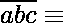
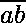

# 检查任意一个大数是否能被 19 整除

> 原文:[https://www . geesforgeks . org/check-if-any-大数是否可被 19 整除/](https://www.geeksforgeeks.org/check-if-any-large-number-is-divisible-by-19-or-not/)

给定一个数字，任务是快速检查这个数字是否能被 19 整除。
**例:**

```
Input : x = 38
Output : Yes

Input : x = 47
Output : No
```

解决这个问题的方法是提取最后一个数字，将最后一个数字的 2 倍加到剩余的数字上，重复这个过程，直到得到一个两位数。如果得到的两位数能被 19 整除，那么给定的数就能被 19 整除。
**进场:**

*   每次提取数字/截断数字的最后一位数字
*   将 2*(前一个数字的最后一位数字)加到截断的数字上
*   根据需要重复以上三个步骤。

**插图:**

```
101156-->10115+2*6 = 10127-->1012+2*7=1026-->102+2*6=114 and 114=6*19,
So 101156 is divisible by 19.
```

> **数学证明:**
> 设为任意数，使得= 100 a+10b+c。
> 现在假设可被 19 整除。然后
> 0(mod 19)
> 100 a+10b+c0(mod 19)
> 10(10a+b)+c0(mod 19)
> 10+c0(mod 19)
> 既然已经把最后一位数字和数字分开了，那就要想办法使用了。
> 使的系数为 1。
> 换句话说，我们要找到一个整数，这样 n 这样 10n  1 mod 19。
> 可以观察到满足这个性质的最小 n 是 2 as 20  1 mod 19。
> 现在我们可以将原来的方程 10  +c  0 (mod 19)
> 乘以 2 并简化:
> 20+2c0(mod 19)
> +2c0(mod 19)
> 我们发现如果 0 (mod 19)那么，
>  +2c  0 (mod 19)。
> 换句话说，要检查一个 3 位数是否能被 19 整除，
> 我们只需去掉最后一位数字，乘以 2，
> 再加到剩下的两位数上即可。

## C++

```
// CPP Program to validate the above logic
#include <bits/stdc++.h>
using namespace std;

// Function to check if the number
// is divisible by 19 or not
bool isDivisible(long long int n)
{

    while (n / 100) //
    {
        // Extracting the last digit
        int d = n % 10;

        // Truncating the number
        n /= 10;

        // Adding twice the last digit
        // to the remaining number
        n += d * 2;
    }

    // return true if number is divisible by 19
    return (n % 19 == 0);
}

// Driver code
int main()
{
    long long int n = 101156;
    if (isDivisible(n))
        cout << "Yes" << endl;
    else
        cout << "No" << endl;
    return 0;
}
```

## Java 语言(一种计算机语言，尤用于创建网站)

```
// Java Program to validate the above logic
import java.io.*;

class GFG {

// Function to check if the
// number is divisible by 19 or not
static boolean isDivisible(long n)
{

    while (n / 100>0)
    {
        // Extracting the last digit
        long d = n % 10;

        // Truncating the number
        n /= 10;

        // Subtracting the five times the
        // last digit from the remaining number
        n += d * 2;
    }

    // Return n is divisible by 19
    return (n % 19 == 0);
}

// Driver code

    public static void main (String[] args) {
    long n = 101156;
    if (isDivisible(n))
        System.out.println( "Yes");
    else
        System.out.println( "No");
    }
}
// This code is contributed by Raj.
```

<gfg-tab role="tab" slot="tab" id="gfg-tab-2">巨蟒 3</gfg-tab><gfg-panel role="tabpanel" slot="panel" id="gfg-panel-2" data-code-lang="Python3"></gfg-panel>

```
 # Python 3 Program to check 
# if the number is divisible
# by 19 or not 

# Function to check if the number 
# is divisible by 19 or not 
def isDivisible(n) :

    while (n // 100) :

        # Extracting the last digit 
        d = n % 10

        # Truncating the number 
        n //= 10

        # Adding twice the last digit 
        # to the remaining number 
        n += d * 2

    # return true if number 
    # is divisible by 19 
    return (n % 19 == 0) 

# Driver Code
if __name__ == "__main__" :

    n = 101156

    if (isDivisible(n)) : 
        print("Yes" )

    else :
        print("No") 

# This code is contributed 
# by ANKITRAI1 
```

## C#

```
// C# Program to validate the
// above logic
using System;

class GFG
{

// Function to check if the
// number is divisible by 19 or not
static bool isDivisible(long n)
{

    while (n / 100 > 0)
    {
        // Extracting the last digit
        long d = n % 10;

        // Truncating the number
        n /= 10;

        // Subtracting the five times
        // the last digit from the
        // remaining number
        n += d * 2;
    }

    // Return n is divisible by 19
    return (n % 19 == 0);
}

// Driver code
public static void Main()
{
    long n = 101156;

    if (isDivisible(n))
        Console.WriteLine( "Yes");
    else
        Console.WriteLine( "No");
}
}

// This code is contributed by ajit
```

## 服务器端编程语言（Professional Hypertext Preprocessor 的缩写）

```
<?php
// PHP Program to validate
// the above logic

// Function to check if the number
// is divisible by 19 or not
function isDivisible( $n)
{

    while (1)
    {
        // Extracting the last digit
        $d = $n % 10;

        // Truncating the number
        $n = $n / 10;

        // Adding twice the last digit
        // to the remaining number
        $n = $n + $d * 2;
        if($n < 100)
            break;
    }

    // return true if number is
    // divisible by 19
    return ($n % 19 == 0);
}

// Driver code
$n = 38;

if (isDivisible($n))
    echo "Yes" ;
else
    echo "No" ;

// This code is contributed by ash264
?>
```

## java 描述语言

```
<script>

// javascript Program to validate the above logic

// Function to check if the
// number is divisible by 19 or not
function isDivisible(n)
{

    while (parseInt(n / 100)>0)
    {
        // Extracting the last digit
        var d = n % 10;

        // Truncating the number
        n = parseInt(n/ 10);

        // Subtracting the five times the
        // last digit from the remaining number
        n += d * 2;
    }

    // Return n is divisible by 19
    return (n % 19 == 0);
}

// Driver code
var n = 101156;
if (isDivisible(n))
    document.write( "Yes");
else
    document.write( "No");

// This code is contributed by 29AjayKumar

</script>
```

**Output:** 

```
Yes
```

请注意，上面的程序可能没有多大意义，因为可以简单地做 n % 19 来检查可分性。这个程序的想法是验证这个概念。此外，如果输入数字很大并且以字符串形式给出，这可能是一种有效的方法。