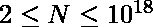
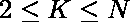

# 检查 N 的任何排列是否等于 K 的任何幂

> 原文:[https://www . geesforgeks . org/check-if-any-置换-n-等于-k 的任意次方/](https://www.geeksforgeeks.org/check-if-any-permutation-of-n-equals-any-power-of-k/)

给定正整数 N 和 K，其中



和



。任务是检查 **N** 的任何数字排列是否等于 **K** 的任何幂。如有可能，返回“**真**”否则返回“**假**”。
**示例:**

```
Input: N = 96889010407, K = 7
Output: True
Explanation: 96889010407 = 713

Input : N = 123456789, K = 4
Output : False
```

**方法:****天真的方法**是生成 **N** 的数字的所有**排列**，然后逐一检查它们中是否有任何一个可以被 **K** 的任何幂整除。
**有效途径:**我们知道 **K** 的所有幂的总数不会超过**log<sub>K</sub>(10<sup>18</sup>)**，例如:如果 **K = 2** ，那么 **K** 的幂最多有 64 个。我们产生 **K** 的所有能量，并将其存储在一个数组中。
现在我们迭代数组中的所有数字，并检查其中是否包含 N 的所有数字。
**以下是上述方法的实施:**

## C++

```
// CPP implementation of above approach
#include <bits/stdc++.h>
using namespace std;

// function to check if N and K are anagrams
bool isValid(long long int N, long long int K)
{
    multiset<int> m1, m2;

    while (N > 0) {
        m1.insert(N % 10);
        N /= 10;
    }

    while (K > 0) {
        m2.insert(K % 10);
        K /= 10;
    }

    if (m1 == m2)
        return true;
    return false;
}

// Function to check if any permutation of N exist
// such that it is some power of K
string anyPermutation(long long int N, long long int K)
{
    long long int powK[100], Limit = pow(10, 18);

    // generate all power of K under 10^18
    powK[0] = K;

    int i = 1;
    while (powK[i - 1] * K < Limit) {
        powK[i] = powK[i - 1] * K;
        i++;
    }

    // check if any power of K is valid
    for (int j = 0; j < i; j++)
        if (isValid(N, powK[j])) {
            return "True";
        }

    return "False";
}

// Driver program
int main()
{
    long long int N = 96889010407, K = 7;

    // function call to print required answer
    cout << anyPermutation(N, K);

    return 0;
}

// This code is written by Sanjit_Prasad
```

## Java 语言(一种计算机语言，尤用于创建网站)

```
// Java implementation of above approach.
import java.util.*;

class GfG
{

    // function to check if N and K are anagrams
    static boolean isValid(int N, int K)
    {
        HashSet<Integer> m1 = new HashSet<Integer>();
        HashSet<Integer> m2 = new HashSet<Integer>();
        while (N > 0)
        {
            m1.add(N % 10);
            N /= 10;
        }

        while (K > 0)
        {
            m2.add(K % 10);
            K /= 10;
        }

        if (m1.equals(m2))
        {
            return true;
        }
        return false;
    }

    // Function to check if any
    // permutation of N exist
    // such that it is some power of K
    static String anyPermutation(int N, int K)
    {
        int powK[] = new int[100 + 1], Limit = (int) Math.pow(10, 18);

        // generate all power of K under 10^18
        powK[0] = K;

        int i = 1;
        while (powK[i - 1] * K < Limit && i<100)
        {
            powK[i] = powK[i - 1] * K;
            i++;
        }

        // check if any power of K is valid
        for (int j = 0; j < i; j++)
        {
            if (isValid(N, powK[j]))
            {
                return "True";
            }
        }

        return "False";
    }

    // Driver code
    public static void main(String[] args)
    {
        int N = (int) 96889010407L, K = 7;

        // function call to print required answer
        System.out.println(anyPermutation(N, K));
    }
}

// This code contributed by Rajput-Ji
```

## 蟒蛇 3

```
# Python 3 implementation of above approach

# function to check if N
# and K are anagrams
def isValid(N, K):

    m1 = []
    m2 = []

    while (N > 0) :
        m1.append(N % 10)
        N //= 10

    while (K > 0) :
        m2.append(K % 10)
        K //= 10

    if (m1 == m2):
        return True
    return False

# Function to check if any permutation
# of N exist such that it is some power of K
def anyPermutation(N, K):

    powK = [0] * 100
    Limit = pow(10, 18)

    # generate all power of
    # K under 10^18
    powK[0] = K

    i = 1
    while (powK[i - 1] * K < Limit) :
        powK[i] = powK[i - 1] * K
        i += 1

    # check if any power of K is valid
    for j in range(i):
        if (isValid(N, powK[j])) :
            return "True"

    return "False"

# Driver Code
if __name__ == "__main__":

    N = 96889010407
    K = 7

    # function call to print
    # required answer
    print(anyPermutation(N, K))

# This code is contributed
# by ChitraNayal
```

## C#

```
// C# implementation of above approach.
using System;
using System.Collections.Generic;
class GfG{

// Function to check if N and K are anagrams
static bool isValid(long N, int K)
{
  HashSet<long> m1 = new HashSet<long>();
  HashSet<int> m2 = new HashSet<int>();
  while (N > 0)
  {
    m1.Add(N % 10);
    N /= 10;
  }

  while (K > 0)
  {
    m2.Add(K % 10);
    K /= 10;
  }

  if (m1.Equals(m2))
  {
    return true;
  }
  return false;
}

// Function to check if any
// permutation of N exist
// such that it is some power of K
static String anyPermutation(long N,
                             int K)
{
  int []powK = new int[100 + 1];
  int Limit = (int) Math.Pow(10, 18);

  // Generate all power
  // of K under 10^18
  powK[0] = K;

  int i = 1;
  while (powK[i - 1] * K < Limit && i < 100)
  {
    powK[i] = powK[i - 1] * K;
    i++;
  }

  // Check if any power of K is valid
  for (int j = 0; j < i; j++)
  {
    if (!isValid(N, powK[j]))
    {
      return "True";
    }
  }

  return "False";
}

// Driver code
public static void Main(String[] args)
{
  long N = 96889010407;
  int K = 7;

  // Function call to print required answer
  Console.WriteLine(anyPermutation(N, K));
}
}

// This code is contributed by gauravrajput1
```

## java 描述语言

```
<script>
// Javascript implementation of above approach.

// function to check if N and K are anagrams
function isValid(N,K)
{
        let m1 = new Set();
        let m2 = new Set();
        while (N > 0)
        {
            m1.add(N % 10);
            N = Math.floor(N/10);
        }

        while (K > 0)
        {
            m2.add(K % 10);
            K = Math.floor(K/10);
        }

        // To check both set are equal or not
        let s = new Set([...m1, ...m2])
        return s.size == m1.size && s.size == m2.size
}

// Function to check if any
    // permutation of N exist
    // such that it is some power of K
function anyPermutation(N,K)
{
    let powK = new Array(100 + 1), Limit = (Math.pow(10, 18));
         for(let i=0;i<101;i++)
            powK[i]=0;
        // generate all power of K under 10^18
        powK[0] = K;

        let i = 1;
        while (powK[i - 1] * K < Limit )
        {
            powK[i] = powK[i - 1] * K;

            i++;
        }

        // check if any power of K is valid
        for (let j = 0; j < i; j++)
        {

            if (isValid(N, powK[j]))
            {
                return "True";
            }
        }

        return "False";
}

// Driver code
let N =  96889010407, K = 7;

// function call to print required answer
document.write(anyPermutation(N, K));

// This code is contributed by patel2127
</script>
```

**Output:** 

```
True
```

**时间复杂度:**O(log<sub>K</sub>(10<sup>18</sup>)<sup>2</sup>