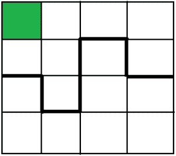

# 检查任何正方形(带有一个彩色单元格)是否可以分成两个相等的部分

> 原文:[https://www . geeksforgeeks . org/check-if-any-square-with-one-color-cell-可分为两等份/](https://www.geeksforgeeks.org/check-if-any-square-with-one-colored-cell-can-be-divided-into-two-equal-parts/)

给定大小为 **n** 的正方形。每个 1 单位大小的正方形 **n** 内有**n<sup>2</sup>T5】个小正方形，其中任何一个正方形都是彩色的。我们的任务是把正方形 **n** 切成两等份。切割线不应与彩色单元有任何公共点，并且产生的两个部分应等于旋转。如果有可能在这样的条件下切割正方形，则打印“是”，否则打印“否”。
**注:****n**的值应始终为偶数正数。**

**示例:**

```
Input : n = 4, x = 1, y = 1
Output : YES
// n = 4 and 1 1 is the coordinate of the colored square

Input :  n = 2, x = 1, y = 1 
Output : NO 
```



在第一个示例中，绘制的正方形的坐标是 1 x 1。因此，我们必须将较大的正方形分成两部分，这样就不会与彩色单元格有任何共同点。上图中的粗线将正方形切割成两个相等的部分。
下面是解决这个问题的分步算法:
1。初始化正方形的大小和绘制正方形的位置。
2。将一个正方形分成两个相等的部分只有当切割线穿过我们更大的正方形的中心时才有可能。
3。因此，如果画出的正方形与较大正方形的中心相连，那么就不可能将较大正方形切割成两个相等的部分。
4。因此，为了检查，将较大正方形的大小分成两半，并检查是否有任何尺寸的彩绘正方形与之相关联。

下面是上述方法的实现:

## C++

```
// C++ program to illustrate
// the above problem

#include <bits/stdc++.h>
using namespace std;

// function to check if it's possible to
// divide the square in two equal parts
void halfsquare(int n, int x, int y)
{
    int half = n / 2;

    // if the painted square is linked anyway
    // to the center of the square
    // then it's not possible
    if ((half == x || half == x - 1) &&
        (half == y || half == y - 1))
        cout << "NO" << endl;

    // else yes it's possible
    else
        cout << "YES" << endl;
}

// Driver code
int main()
{
    // initialize the size of the square
    int n = 100;

    // initialize the dimension of the painted square
    int x = 51, y = 100;

    halfsquare(n, x, y);
    return 0;
}
```

## Java 语言(一种计算机语言，尤用于创建网站)

```
// Java program to illustrate
// the above problem

import java.io.*;

class GFG {

// function to check if it's possible to
// divide the square in two equal parts
static void halfsquare(int n, int x, int y)
{
    int half = n / 2;

    // if the painted square is linked anyway
    // to the center of the square
    // then it's not possible
    if ((half == x || half == x - 1) &&
        (half == y || half == y - 1))
        System.out.println( "NO");

    // else yes it's possible
    else
        System.out.println( "YES");
}

// Driver code

    public static void main (String[] args) {
            // initialize the size of the square
    int n = 100;

    // initialize the dimension of the painted square
    int x = 51, y = 100;

    halfsquare(n, x, y);
    }
}
// This code is contributed
// by inder_verma..
```

## 蟒蛇 3

```
# Python 3 program to illustrate
# the above problem

# function to check if it's possible to
# divide the square in two equal parts
def halfsquare(n, x, y) :
    half = n // 2

    # if the painted square is
    # linked anyway to the center
    # of the square then it's
    # not possible
    if ((half == x or half == x - 1) and
        (half == y or half == y - 1)) :
        print("NO")

    # else yes it's possible
    else :
        print("YES")

# Driver code    
if __name__ == "__main__" :

    # initialize the size of the square
    n = 100

    # initialize the dimension
    # of the painted square
    x, y = 51, 100

    halfsquare(n, x, y)

# This code is contributed by ANKITRAI1
```

## C#

```
// C# program to illustrate
// the above problem
using System;

class GFG {

// function to check if it's possible to
// divide the square in two equal parts
static void halfsquare(int n, int x, int y)
{
    int half = n / 2;

    // if the painted square is linked anyway
    // to the center of the square
    // then it's not possible
    if ((half == x || half == x - 1) &&
        (half == y || half == y - 1))
        Console.WriteLine( "NO");

    // else yes it's possible
    else
        Console.WriteLine( "YES");
}

// Driver code

    public static void Main () {
            // initialize the size of the square
    int n = 100;

    // initialize the dimension of the painted square
    int x = 51, y = 100;

    halfsquare(n, x, y);
    }
}
// This code is contributed
// by  anuj_67..
```

## 服务器端编程语言（Professional Hypertext Preprocessor 的缩写）

```
<?php
// PHP program to illustrate
// the above problem

// function to check if it's
// possible to divide the
// square in two equal parts
function halfsquare($n, $x, $y)
{
    $half = $n / 2;

    // if the painted square is
    // linked anyway to the center
    // of the square then it's
    // not possible
    if (($half == $x || $half == $x - 1) &&
        ($half == $y || $half == $y - 1))
        echo "NO" ;

    // else yes it's possible
    else
        echo "YES" ;
}

// Driver code

// initialize the size
// of the square
$n = 100;

// initialize the dimension
// of the painted square
$x = 51; $y = 100;

halfsquare($n, $x, $y);

// This code is contributed
// by anuj_67
?>
```

## java 描述语言

```
<script>
// Java script program to illustrate
// the above problem

// function to check if it's possible to
// divide the square in two equal parts
function halfsquare(n,x,y)
{
    let half = n / 2;

    // if the painted square is linked anyway
    // to the center of the square
    // then it's not possible
    if ((half == x || half == x - 1) &&
        (half == y || half == y - 1))
        document.write( "NO");

    // else yes it's possible
    else
        document.write( "YES");
}

// Driver code

    // initialize the size of the square
    let n = 100;

    // initialize the dimension of the painted square
    let x = 51, y = 100;

    halfsquare(n, x, y);

// This code is contributed by sravan kumar Gottumukkala
</script>
```

**输出:**

```
YES
```