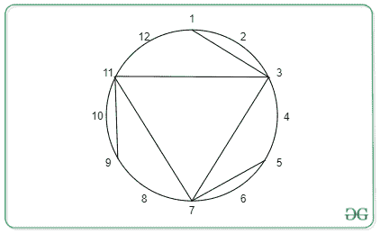
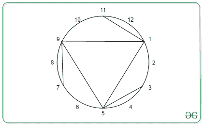
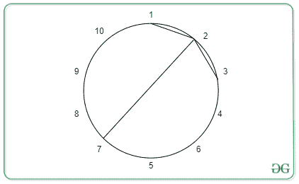

# 旋转一圈后检查圆的弦是否对称

> 原文:[https://www . geesforgeks . org/check-如果圆的弦在旋转一段时间后是对称的/](https://www.geeksforgeeks.org/check-if-chords-of-a-circle-are-symmetric-after-some-rotation/)

给定两个整数 **N** 和 **M** ， **N** 表示圆周上的等距点， **M** 表示由这些点形成的弦的数量。还给出了包含和弦位置的成对 **C** 的[向量](https://www.geeksforgeeks.org/vector-in-cpp-stl/)。任务是将圆旋转任意角度，比如 X，其中 0<X<360°，检查的弦是否仍与原圆对称。

**示例:**

> **输入:** N = 12，M = 6，C = {{1，3}，{3，7}，{5，7}，{7，11}，{9，11}，{11，3 } }；
> **输出:**是
> 
> 
> 
> 原创
> 
> 
> 
> 旋转后
> 
> **输入:** N = 10，M = 3，C = {{1，2}，{3，2}，{7，2 } }
> T3】输出:否
> 
> 
> 
> 不可能有旋转对称

**简单方法:**旋转范围【1、 **N** 内的每一个距离 **K** ，检查每一个点【a、b】旋转的点【a + **K** 、b + **K** 是否存在。
如果有 k，则打印是，否则打印否
**时间复杂度** : O(N*M)

**有效途径:**检查 N 的[因子就够了。
让我们假设如果我们将图像旋转 **K** 个单位，那么整个图像将被分成 **N/K** 个块。那么如果 **K** 不是 **N** 的除数，就会出现长度小于 **K** 的非对称块，图像永远不会与原图对称。
因此](https://www.geeksforgeeks.org/find-divisors-natural-number-set-1/)[计算 **N** 的所有除数](https://www.geeksforgeeks.org/find-all-divisors-of-a-natural-number-set-2/)，并检查每个和弦是否存在旋转和弦。

下面是上述方法的实现:

## C++

```
// C++ Program to for the above approach

#include <bits/stdc++.h>
using namespace std;

// Utility function to calculate
// divisors of a number in O(sqrt(N))
vector<int> calculateDivisors(int N)
{
    vector<int> div;
    for (int i = 1; i * i <= N; i++) {
        if (N % i == 0) {
            div.push_back(i);
            if (N / i != i && i != 1) {
                div.push_back(N / i);
            }
        }
    }
    return div;
}
int checkRotationallySymmetric(
    vector<pair<int, int> > A,
    int N, int M)
{
    // Maintain a set to check quickly
    // the presence of a chord
    set<pair<int, int> > st;
    for (int i = 0; i < M; i++) {
        --A[i].first, --A[i].second;
        if (A[i].first > A[i].second) {
            swap(A[i].first, A[i].second);
        }
        st.insert(A[i]);
    }

    // Calculate the divisors of N.
    vector<int> div = calculateDivisors(N);

    // Iterate through the divisors
    for (auto x : div) {
        bool exist = 1;
        for (int i = 0; i < M; i++) {
            int dx = (A[i].first + x) % N;
            int dy = (A[i].second + x) % N;
            if (dx > dy) {
                swap(dx, dy);
            }
            if (st.find({ dx, dy }) != st.end()) {

                // There exists a valid
                // chord after rotation
            }
            else {

                // There is no valid chord after rotation
                exist = false;
                break;
            }
        }

        // if there exist another chord after
        // rotation for every other chord print
        // YES and exit the function
        if (exist) {
            cout << "YES";
            return 0;
        }
    }
    cout << "NO";
    return 0;
}

// Driver Code
int main()
{
    int N = 12, M = 6;
    vector<pair<int, int> > C
        = { { 1, 3 }, { 3, 7 }, { 5, 7 },
             { 7, 11 }, { 9, 11 }, { 11, 3 } };
    checkRotationallySymmetric(C, N, M);
    return 0;
}
```

**Output**

```
YES
```

**时间复杂度:**O(M * sqrt(N)* log M)
T3】空间复杂度: O(M)