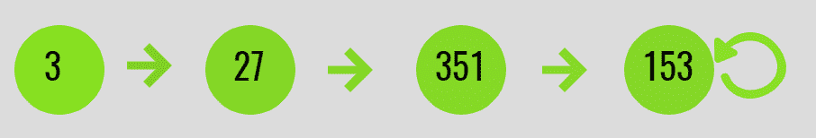
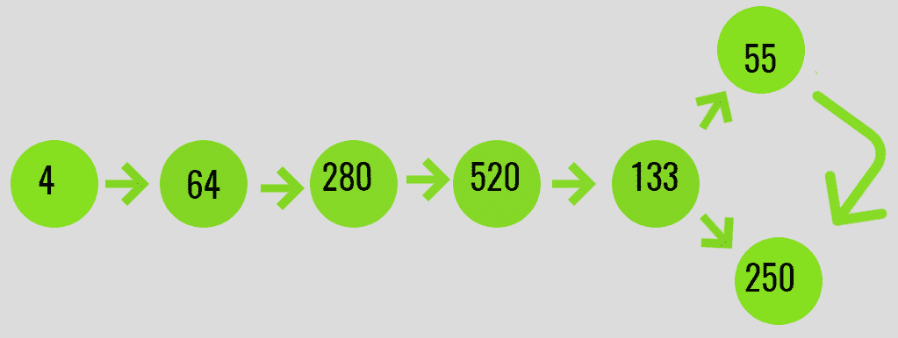

# 检查一个整数的数字立方极限是否到达定点或极限循环

> 原文:[https://www . geeksforgeeks . org/check-if-digital-cube-一个整数的极限到达定点或极限周期/](https://www.geeksforgeeks.org/check-if-digit-cube-limit-of-an-integer-arrives-at-fixed-point-or-a-limit-cycle/)

给定一个整数 **N** ，任务是检查一个整数的**数字立方极限**是否到达一个固定点或在一个极限循环中。

> 一个**数字立方极限**是一个数字，如果它的值被计算为它的数字的立方之和，则它重复到达一个点，即它们具有以下性质:
> 
> *   如果是[阿姆斯特朗号](https://www.geeksforgeeks.org/program-for-armstrong-numbers/)，到达一个固定点。
> *   如果循环重复，则到达极限循环。

**示例:**

> **输入:** N = 3
> **输出:**到达固定点 153
> **解释:**T8】F(3)= 3 * 3 * 3 * 3 = 27
> F(27)= 2 * 2 * 2+7 * 7 * 7 = 351
> F(351)= 3 * 3 * 3+5 * 5+1 * 1 * 1 = 153
> F(153)= 1 * 1 * 1 下图:
> 
> 
> 
> **输入:** N = 4
> **输出:**到达周期
> **解释:**
> F(4)= 4 * 4 * 4 = 64
> F(64)= 6 * 6 * 6+4 * 4 * 4 = 280
> F(280)= 2 * 2 * 2+8 * 8 * 8+0 * 0 * 0 = 520
> F(520)= 5 * 5+2 * 2 2+0 * 0 * 0 = 133
> F(133)= 1 * 1 * 1+3 * 3 * 3+3 * 3 * 3 = 55
> F(55)= 5 * 5 * 5+5 * 5 * 5 = 250
> F(250)= 5 * 5 * 5+2 * 2+0 * 0 * 0 = 133
> 一个介于
> 133->55->223 之间的循环
> 下面是同样的说明:
> 
> [](https://media.geeksforgeeks.org/wp-content/uploads/20200828103439/LoopPixTellerdfgdf.png)

**方法:**按照以下步骤解决问题:

*   创建一个 [hashMap](https://www.geeksforgeeks.org/hashing-data-structure/) 来存储迭代时数字的立方之和。
*   迭代一个数字的数字立方和的下一个值，并检查数字立方的下一个和是否已经存在于哈希映射中。
    *   如果该号码已经在哈希映射中，则检查该号码是否为[阿姆斯特朗号码](https://www.geeksforgeeks.org/program-for-armstrong-numbers/)。如果发现是真的，那么这个数字就达到了一个固定点。
    *   否则，如果该号码不是阿姆斯特朗号码，则继续。

下面是上述方法的实现:

## C++

```
// C++ program for the above approach

#include <algorithm>
#include <bits/stdc++.h>

// Define the limit
#define limit 1000000000

using namespace std;

// Function to get the sum of cube
// of digits of a number
long long F(long long N)
{
    // Convert to string to get sum
    // of the cubes of its digits
    string str = to_string(N);
    long long sum = 0;

    for (long long i = 0;
         i < str.size(); i++) {
        long long val
            = int(str[i] - '0');
        sum += val * val * val;
    }

    // return sum
    return sum;
}

// Function to check if the number
// arrives at a fixed point or a cycle
long long findDestination(long long N)
{
    // Stores the values obtained
    set<long long> s;

    long long prev = N, next;

    // Insert N to set s
    s.insert(N);

    while (N <= limit) {

        // Get the next number using F(N)
        next = F(N);

        // Check if the next number is
        // repeated or not
        auto it = s.find(next);
        if (it != s.end()) {
            return next;
        }

        prev = next;
        s.insert(prev);
        N = next;
    }
    return next;
}

// Function to check if digit cube
// limit of an integer arrives at
// fixed point or in a limit cycle
void digitCubeLimit(long long N)
{

    // N is a non negative integer
    if (N < 0)
        cout << "N cannot be negative\n";

    else {

        // Function Call
        long long ans
            = findDestination(N);

        // If the value received is
        // greater than limit
        if (ans > limit)
            cout << "Limit exceeded\n";

        // If the value received is
        // an Armstrong number
        else if (ans == F(ans)) {
            cout << N;
            cout << " reaches to a"
                 << " fixed point: ";
            cout << ans;
        }

        else {
            cout << N;
            cout << " reaches to a"
                 << " limit cycle: ";
            cout << ans;
        }
    }
}

// Driver Code
int main()
{
    long long N = 3;

    // Function Call
    digitCubeLimit(N);

    return 0;
}
```

## Java 语言(一种计算机语言，尤用于创建网站)

```
// Java program for the
// above approach
import java.util.*;
class GFG{

// Define the limit
static final int limit = 1000000000;

// Function to get the sum of cube
// of digits of a number
static int F(int N)
{
  // Convert to String to get sum
  // of the cubes of its digits
  String str = String.valueOf(N);
  int sum = 0;

  for (int i = 0;
           i < str.length(); i++)
  {
    int val = (int)(str.charAt(i) - '0');
    sum += val * val * val;
  }

  // return sum
  return sum;
}

// Function to check if the number
// arrives at a fixed point or a cycle
static int findDestination(int N)
{
  // Stores the values obtained
  HashSet<Integer> s = new HashSet<>();

  int prev = N, next =0;

  // Insert N to set s
  s.add(N);

  while (N <= limit)
  {
    // Get the next number
    // using F(N)
    next = F(N);

    // Check if the next number is
    // repeated or not
    if (s.contains(next))
    {
      return next;
    }

    prev = next;
    s.add(prev);
    N = next;
  }
  return next;
}

// Function to check if digit cube
// limit of an integer arrives at
// fixed point or in a limit cycle
static void digitCubeLimit(int N)
{
  // N is a non negative integer
  if (N < 0)
    System.out.print("N cannot be negative\n");
  else
  {
    // Function Call
    int ans = findDestination(N);

    // If the value received is
    // greater than limit
    if (ans > limit)
      System.out.print("Limit exceeded\n");

    // If the value received is
    // an Armstrong number
    else if (ans == F(ans))
    {
      System.out.print(N);
      System.out.print(" reaches to a" +
                       " fixed point: ");
      System.out.print(ans);
    }

    else
    {
      System.out.print(N);
      System.out.print(" reaches to a" +
                       " limit cycle: ");
      System.out.print(ans);
    }
  }
}

// Driver Code
public static void main(String[] args)
{
  int N = 3;

  // Function Call
  digitCubeLimit(N);
}
}

// This code is contributed by Rajput-Ji
```

## 蟒蛇 3

```
# Python3 program for the above approach

# Define the limit
LIMIT = 1000000000

# Function to get the sum of cube
# of digits of a number
def F(N: int) -> int:

    # Convert to string to get sum
    # of the cubes of its digits
    string = str(N)
    sum = 0

    for i in range(len(string)):
        val = int(ord(string[i]) - ord('0'))
        sum += val * val * val

    # Return sum
    return sum

# Function to check if the number
# arrives at a fixed point or a cycle
def findDestination(N: int) -> int:

    # Stores the values obtained
    s = set()

    prev = N
    next = 0

    # Insert N to set s
    s.add(N)

    while (N <= LIMIT):

        # Get the next number using F(N)
        next = F(N)

        # Check if the next number is
        # repeated or not
        if next in s:
            return next

        prev = next
        s.add(prev)
        N = next

    return next

# Function to check if digit cube
# limit of an integer arrives at
# fixed point or in a limit cycle
def digitCubeLimit(N: int) -> int:

    # N is a non negative integer
    if (N < 0):
        print("N cannot be negative")

    else:

        # Function Call
        ans = findDestination(N)

        # If the value received is
        # greater than limit
        if (ans > LIMIT):
            print("Limit exceeded")

        # If the value received is
        # an Armstrong number
        elif (ans == F(ans)):
            print("{} reaches to a fixed point: {}".format(
                N, ans))
        else:
            print("{} reaches to a limit cycle: {}".format(
                N, ans))

# Driver Code
if __name__ == "__main__":

    N = 3

    # Function Call
    digitCubeLimit(N)

# This code is contributed by sanjeev2552
```

## C#

```
// C# program for the
// above approach
using System;
using System.Collections.Generic;
class GFG{

// Define the limit
static readonly int limit =
       1000000000;

// Function to get the sum
// of cube of digits of a
// number
static int F(int N)
{
  // Convert to String to get sum
  // of the cubes of its digits
  String str = String.Join("", N);
  int sum = 0;

  for (int i = 0;
           i < str.Length; i++)
  {
    int val = (int)(str[i] - '0');
    sum += val * val * val;
  }

  // return sum
  return sum;
}

// Function to check if the
// number arrives at a fixed
// point or a cycle
static int findDestination(int N)
{
  // Stores the values
  // obtained
  HashSet<int> s =
          new HashSet<int>();

  int prev = N, next = 0;

  // Insert N to set s
  s.Add(N);

  while (N <= limit)
  {
    // Get the next number
    // using F(N)
    next = F(N);

    // Check if the next
    // number is repeated
    // or not
    if (s.Contains(next))
    {
      return next;
    }

    prev = next;
    s.Add(prev);
    N = next;
  }
  return next;
}

// Function to check if digit cube
// limit of an integer arrives at
// fixed point or in a limit cycle
static void digitCubeLimit(int N)
{
  // N is a non negative integer
  if (N < 0)
    Console.Write("N cannot be negative\n");
  else
  {
    // Function Call
    int ans = findDestination(N);

    // If the value received is
    // greater than limit
    if (ans > limit)
      Console.Write("Limit exceeded\n");

    // If the value received is
    // an Armstrong number
    else if (ans == F(ans))
    {
      Console.Write(N);
      Console.Write(" reaches to a" +
                    " fixed point: ");
      Console.Write(ans);
    }

    else
    {
      Console.Write(N);
      Console.Write(" reaches to a" +
                    " limit cycle: ");
      Console.Write(ans);
    }
  }
}

// Driver Code
public static void Main(String[] args)
{
  int N = 3;

  // Function Call
  digitCubeLimit(N);
}
}

// This code is contributed by gauravrajput1
```

## java 描述语言

```
<script>

// JavaScript program for the
// above approach

// Define the limit
let limit = 1000000000;

// Function to get the sum of cube
// of digits of a number
function F(N)
{
    // Convert to String to get sum
  // of the cubes of its digits
  let str = (N).toString();
  let sum = 0;

  for (let i = 0;
           i < str.length; i++)
  {
    let val = (str[i].charCodeAt(0) - '0'.charCodeAt(0));
    sum += val * val * val;
  }

  // return sum
  return sum;
}

// Function to check if the number
// arrives at a fixed point or a cycle
function findDestination(N)
{
    // Stores the values obtained
  let s = new Set();

  let prev = N, next =0;

  // Insert N to set s
  s.add(N);

  while (N <= limit)
  {
    // Get the next number
    // using F(N)
    next = F(N);

    // Check if the next number is
    // repeated or not
    if (s.has(next))
    {
      return next;
    }

    prev = next;
    s.add(prev);
    N = next;
  }
  return next;
}

// Function to check if digit cube
// limit of an integer arrives at
// fixed point or in a limit cycle
function digitCubeLimit(N)
{
    // N is a non negative integer
  if (N < 0)
    document.write("N cannot be negative\n");
  else
  {
    // Function Call
    let ans = findDestination(N);

    // If the value received is
    // greater than limit
    if (ans > limit)
      document.write("Limit exceeded\n");

    // If the value received is
    // an Armstrong number
    else if (ans == F(ans))
    {
      document.write(N);
      document.write(" reaches to a" +
                       " fixed point: ");
      document.write(ans);
    }

    else
    {
      document.write(N);
      document.write(" reaches to a" +
                       " limit cycle: ");
      document.write(ans);
    }
  }
}

// Driver Code
let N = 3;

// Function Call
digitCubeLimit(N);

// This code is contributed by unknown2108

</script>
```

**Output:** 

```
3 reaches to a fixed point: 153
```

***时间复杂度:**O(N)*
T5**辅助空间:** O(N)